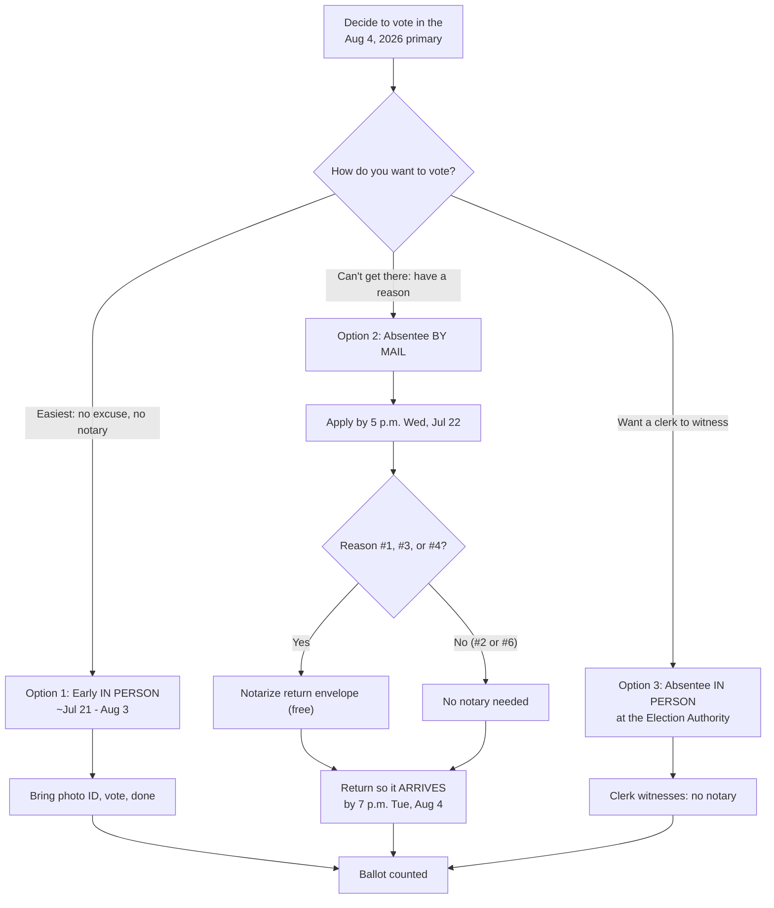

# Vote Absentee for the August 4, 2026 Primary
### Your complete, step-by-step guide — Matt Grant for Congress (MO-02)

You don't have to wait for Election Day. Missouri makes it easy to vote
early — and the easiest way to make sure your voice is heard is to make a
plan now. This guide walks you through every option, every deadline, and
every step so your ballot **counts**.

> **STALENESS WARNING:** Dates, deadlines, notary requirements, and early-voting
> sites below reflect Missouri law (RSMo Ch. 115) and the St. Louis County and
> St. Charles County election authorities as understood for the August 4, 2026
> primary. Election rules and site lists change — **always confirm current
> deadlines, hours, and locations with your election authority** (contacts at the
> bottom of this guide) or the Missouri Secretary of State at https://www.sos.mo.gov
> before you rely on a date.

> **EDUCATIONAL DISCLAIMER:** This is educational voting information, not legal
> advice. The voting process applies to all voters regardless of candidate
> preference. Consult your election authority for guidance specific to your
> situation.

> **To vote in the Republican primary, request the Republican ballot.**
> Missouri's August primary is partisan — you choose one party's ballot
> for this election only. It does not change your registration.

---

## 🗳️ Pick your path

---

## ⏱️ The dates that matter (don't miss these)

| What | Deadline |
|---|---|
| Register to vote | **Wed, July 8, 2026** |
| Excuse-based absentee opens | ~June 23, 2026 (open now) |
| **By-mail application must be RECEIVED** | **5:00 p.m. Wed, July 22, 2026** |
| No-excuse early in-person voting | ~**July 21 – Aug 3, 2026** |
| **Voted ballot must be RECEIVED** | **7:00 p.m. Tue, Aug 4, 2026** |
| Election Day (polls 6 a.m.–7 p.m.) | **Tue, Aug 4, 2026** |

⚠️ Mailed ballots count by **receipt, not postmark**. Mail it ~1 week
early or hand-deliver it. **Missouri does not allow ballot drop boxes.**

---

## 🗳️ Pick the option that fits you

### ✅ OPTION 1 — Vote EARLY, in person (easiest — no reason, no notary)
The simplest path for most people.
- **When:** ~July 21 – Aug 3, 2026 (ends 5 p.m. Mon, Aug 3)
- **What you need:** a valid photo ID. That's it.
- **No application. No excuse. No notary.** Walk in, vote, done.

**Sample St. Louis County early-voting sites** (confirm hours at stlouiscountymovotes.gov):
- Board of Elections — 725 Northwest Plaza Dr, St. Ann
- North County Rec Complex — Black Jack
- UMSL Millennium Student Center — Normandy
- Daniel Boone Library — Ellisville
- Grand Glaize Library — Manchester
- Mid-County Library — Clayton
- St. Johns UCC — Mehlville

**St. Charles County early voting** (confirm at sccmo.org):
- St. Charles County Election Authority — 397 Turner Blvd, St. Peters
- Element St. Charles — 1450 Wall St, St. Charles (Mon–Fri, 9 a.m.–3 p.m.)

---

### 📬 OPTION 2 — Vote absentee BY MAIL (needs a reason)
You qualify if **one** of these is true on Election Day:
1. You'll be **absent** from your county
2. **Illness or disability** — yours, or someone you care for at your address
3. **Religious** belief or practice
4. **Election work, first responder, health care worker, or law enforcement**
5. **Incarceration** (with voting rights retained)
6. Certified **Safe at Home** (address confidentiality) participant

**Steps:**
1. **Apply** online or by mail/email/fax — must be **received by 5 p.m.
   Wed, July 22, 2026**.
2. If you registered by mail/online and have **never voted in person**,
   include a **copy of your photo ID** with the application.
3. **Your ballot arrives by mail.** Mark it in secret.
4. **NOTARY CHECK:** For reasons **#1, #3, and #4**, your ballot return
   envelope **must be notarized** (it's **free** — banks, libraries, and
   credit unions often do it). Reasons **#2 and #6 are notary-exempt.**
   👉 **Do not sign the envelope until you're in front of the notary.**
5. **Return it** so it **arrives by 7 p.m. on Aug 4.** Mail early or
   hand-deliver to your election authority. **No drop boxes.**

---

### 🏛️ OPTION 3 — Vote absentee IN PERSON at the Election Authority
Same six reasons as Option 2 — but you vote in person at the Board of
Elections, so **a clerk witnesses it and no notary is needed.** Open from
about six weeks before the election through the day before.

---

## 📝 Filling out the online application (3 quick pages)

**Page 1 — Address.** Type your house number and street, then pick the
matching auto-complete result. The form fills your city, ZIP, and
**precinct** automatically. Add a unit number only if needed.

**Page 2 — Voter Info.** Name, date of birth (tap the year at the top of
the date picker to change it), last 4 of SSN, phone, and email. **Select
the Republican ballot.** Choose your **reason**. Set "mail to a different
address?" and your relationship to the voter (usually "Self").

**Page 3 — Review & Sign.** Check the summary, **sign clearly** in the box
(a faint or cut-off signature causes delays), and **Submit**.

**You'll see a "Your application has been submitted. Thank you!" screen.**
✅ That confirms your **request** — keep reading for what's next.

---

## 📦 After you submit — don't stop here!
Submitting the application is **not** the same as voting. Here's the full arc:
1. The election authority **mails your ballot.**
2. You **mark** it.
3. You **notarize** the return envelope **if your reason requires it** (see above).
4. You **return** it so it **arrives by 7 p.m. on Aug 4.**

> 💡 If you'd rather skip the notary entirely, vote **no-excuse in person
> (July 21–Aug 3)** instead — but if you do, **do not also return a mailed
> ballot.** Vote once, one way.

---

## 🪪 Acceptable photo ID
- Non-expired **Missouri driver's or non-driver license**
- **U.S. passport**
- **Military or veteran ID**
- Other **U.S. or Missouri government photo ID** (not expired, or expired
  after 11/5/2024)
- **No ID? Get a FREE non-driver ID** — call **573-526-8683**.

---

## ☎️ Your election authority

**St. Louis County Board of Elections**
725 Northwest Plaza Dr, St. Ann, MO 63074
📞 314.615.1833 / RelayMO 711 · ✉️ boecabsentee@stlouiscountymo.gov
🌐 stlouiscountymovotes.gov

**St. Charles County Election Authority**
397 Turner Blvd, St. Peters, MO 63376
🌐 sccmo.org (search "Absentee Voting")

Not sure which county you're in? Check your registration and find your
local election authority at **sos.mo.gov**.

---

## 🤝 Make your plan to vote
1. **Confirm you're registered** (deadline July 8).
2. **Pick your option** — early in person is fastest.
3. **Put it on your calendar** and **bring a friend or family member.**
4. **Tell three people** how easy this is.

Every vote for **Matt Grant** starts with a plan. Make yours today.

---

*This is educational voting information based on Missouri law and the
St. Louis County and St. Charles County election authorities. Rules can
change — always confirm with your election authority. The voting process
applies to all voters regardless of candidate preference.*

*Paid for by Matt Grant for Congress. [Confirm exact FEC disclaimer with
your committee/treasurer before distribution.]*
