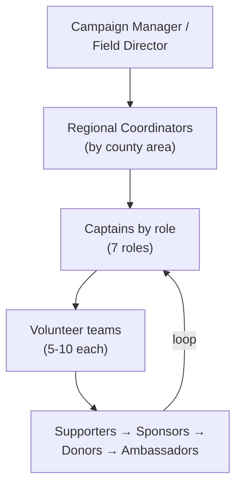

# Captain Field Plan for MO-02 — August 4, 2026

How **Matt Grant's campaign for the U.S. House, Missouri — District 2 (MO-02)** turns the skill's captain framework into a real field organization for the **August 4, 2026 primary**, operated by the **Matt Grant for Congress Committee**. It applies the six [captain archetypes](../tactics/captain-archetypes.md) and the [pairing workflow](../workflows/team-pairing.md) to MO-02's actual geography and message, and it stores assignments in the [captain roster](../tools/captain-roster.md). It complements — does not repeat — the field framework in [strategic-plan.md §5](strategic-plan.md) and the geography in [data-and-map-plan.md](data-and-map-plan.md).

> **PLANNING-FRAMEWORK NOTICE — read first.** The **geography, primary date, message, and roles** below are documented facts. Every **quantitative figure** (captain counts, volunteer counts, team sizes, door and pipeline targets) is an **illustrative planning placeholder**, not a prediction or real data. Replace each with verified figures from the voter file, county election authorities, and the campaign's own recruitment before relying on it. Captain *names* are illustrative; build the real slate from the volunteers you have. Do not invent new policy, endorsements, or poll numbers.

---

## 1. Field Structure for MO-02

MO-02 under the **new 2025 map in effect for August 4, 2026** spans five distinct areas (verified June 2026; see [data-and-map-plan.md §0](data-and-map-plan.md)):

| Region | What it is | Field reality |
|---|---|---|
| **St. Louis County (western/central)** | Chesterfield, Wildwood, Ballwin, Maryland Heights, Kirkwood, Town & Country | The population core and richest precinct/turnout data (Aug 2024 primary joined by precinct) |
| **Jefferson County** | Suburban-to-exurban south | ArcGIS precinct polygons exist; no precinct-level turnout feed |
| **Washington County** | Rural | Census VTD boundaries + SOS county-level data only |
| **Crawford County** | Rural | Census VTD boundaries + SOS county-level data only |
| **Gasconade County** | Rural | Census VTD boundaries + SOS county-level data only |

> St. Charles, Warren, and Franklin counties are **not** in MO-02 under this map. The race is a **small, high-information summer primary** — a few intense precincts decide it ([strategic-plan.md §1](strategic-plan.md)), so captain coverage is weighted to where the [win number](strategic-plan.md#2-target-vote-math-illustrative-planning-framework) actually lives, not spread evenly.

**Coverage principle (counts illustrative):** assign at least one **Regional Coordinator** per area, then staff captains by role beneath them. Weight the densest captain coverage to St. Louis County (western/central) where turnout data is strongest, with dedicated rural-county captains so the added counties are not neglected.

---

## 2. Captain Slate by Role — ILLUSTRATIVE

Staff the [seven captain roles](../tactics/captain-archetypes.md#captain-roles-vs-captain-archetypes) across the regions. Counts are **placeholders** — set real targets from your recruitment and the door math in [strategic-plan.md §5](strategic-plan.md#5-volunteer--field-plan).

| Captain role | Illustrative coverage | Phase emphasis |
|---|---|---|
| **Canvass / Field** | 1+ per region; most in St. Louis Co. (PLACEHOLDER) | Heaviest in Persuasion |
| **Phone & Text Bank** | 1-2 district-wide (PLACEHOLDER) | All phases; ID early |
| **Events / Host** | 1 per region (PLACEHOLDER) | Building → Persuasion |
| **Data / Office** | 1-2 district-wide (PLACEHOLDER) | All phases |
| **Digital / Social** | 1 district-wide (PLACEHOLDER) | All phases; rapid response |
| **Fundraising / Finance** | 1-2 district-wide (PLACEHOLDER) | Front-loaded (Building) |
| **GOTV / Ballot-Chase** | 1+ per region (PLACEHOLDER) | Final 30 days |

Store the real slate in [tools/captain-roster.md](../tools/captain-roster.md); keep each captain's span at **5-10 volunteers**.

---

## 3. Archetype Deployment

Match archetypes to roles with the [Part A matrix](../workflows/team-pairing.md#part-a-match-archetype--captain-role), tuned to MO-02's terrain and message:

- **Organizers** → Canvass/Field and GOTV/Ballot-Chase in **St. Louis County (western/central)**, where tight turf-cutting against real precinct turnout pays off most.
- **Connectors** → Events/Host and recruiting in the **rural counties** (Washington, Crawford, Gasconade), where relationships and trusted local faces matter more than data density, and into **faith and family communities** aligned with the children-first message ([coalition-family-court-targets.md](coalition-family-court-targets.md)).
- **Strategists** → Data/Office and targeting, owning the **chase universe** and the households-with-children layer ([data-and-map-plan.md §3](data-and-map-plan.md)).
- **Closers** → Fundraising/Finance and the **final GOTV push**.
- **Mentors** → onboarding/volunteer-care across all regions to hold **retention** through a long summer.
- **Workhorses** → high-volume Phone/Data teams.

Every captain gets a **complementary co-captain** from the [Strong pairings](../workflows/team-pairing.md#complementary-co-captain-pairing). Tie each team's pitch to the documented [messaging pillars](strategic-plan.md#6-messaging-pillars) — the family-court / CHILD Protection Act signature cause first, then term limits, smaller government, and lower taxes. Keep all messaging within documented positions ([platform.md](platform.md)); invent nothing.

---

## 4. Volunteer → Supporter Pipeline Targets — ILLUSTRATIVE

Apply the [volunteer → support ladder](../workflows/team-pairing.md#the-volunteer--support-ladder) per region. Targets are **placeholders** — set them from real team sizes.

| Region | Illustrative pipeline goal (per team) |
|---|---|
| St. Louis County (western/central) | 2 → yard signs/supporters; 1 → house-party host (sponsor); 1 → small donor (PLACEHOLDER) |
| Jefferson | 1 → sponsor (venue/host); 1-2 → small donor (PLACEHOLDER) |
| Washington / Crawford / Gasconade | 1 → local supporter/peer surrogate; 1 → host where feasible (PLACEHOLDER) |

Route every **donation** through [donation-intake.md](../workflows/donation-intake.md) and capacity-check with [donor-limit-checker.md](../tools/donor-limit-checker.md); log every **in-kind/sponsor** gift at fair-market value. Online gifts flow through WinRed: <https://secure.winred.com/matt-grant-for-congress/donate-today>.

---

## 5. Cadence & GOTV Tie-In

Map captains onto the documented [phased timeline](strategic-plan.md#3-phased-timeline--working-backward-from-august-4-2026) and [weekly cadence](strategic-plan.md#7-weekly-cadence):

- **Foundation / Building:** recruit and tag captains (Connectors lead); stand up the roster; Fundraising captains front-load ([fundraising-plan.md](../workflows/fundraising-plan.md)).
- **Persuasion:** Canvass and Phone captains run the contact universe against the four priorities ([voter-targeting.md](../workflows/voter-targeting.md)).
- **GOTV / final 30 days:** GOTV/Ballot-Chase captains lead — Day -30 to -14 absentee/early-vote chase, Day -14 to -2 door/phone/text blitz, Day -1 deployment, **August 4 primary-day** operations ([gotv-plan.md](../workflows/gotv-plan.md), [ballot-chase-program.md](../tactics/ballot-chase-program.md)).
- **Weekly:** captains report team metrics (contacts, new volunteers, pipeline motion) into the weekly all-hands.

---

## Compliance & Guardrails

> **EDUCATIONAL DISCLAIMER:** This is educational information, not legal advice. Consult a campaign finance attorney or your filing agency (the FEC for this federal race; the Missouri Secretary of State for ballot access) for guidance specific to your situation. All quantitative figures here are illustrative planning placeholders, not predictions or real data.

- **Federal race — FEC rules** govern money and in-kind support ([federal/contribution-limits.md](../federal/contribution-limits.md), [federal/prohibited-contributions.md](../federal/prohibited-contributions.md)). Volunteer time is exempt; sponsor/in-kind gifts are reportable contributions.
- **No coerced giving; no straw donors.** Bundling is legal, reimbursement is not ([references/ethics-and-guardrails.md](../references/ethics-and-guardrails.md)).
- **No illegal coordination** with outside groups ([workflows/coordination-rules.md](../workflows/coordination-rules.md)).
- **Secure handling** of the roster — no SSNs, bank numbers, or passwords; access-controlled storage.
- **Faithful representation:** executes Matt's stated platform; does not editorialize or invent positions, endorsements, or data.

---

*Built on [tactics/captain-archetypes.md](../tactics/captain-archetypes.md), [workflows/team-pairing.md](../workflows/team-pairing.md), and [tools/captain-roster.md](../tools/captain-roster.md). Grounded in [candidate/strategic-plan.md](strategic-plan.md) and [candidate/data-and-map-plan.md](data-and-map-plan.md). Paid for by the Matt Grant for Congress Committee.*
