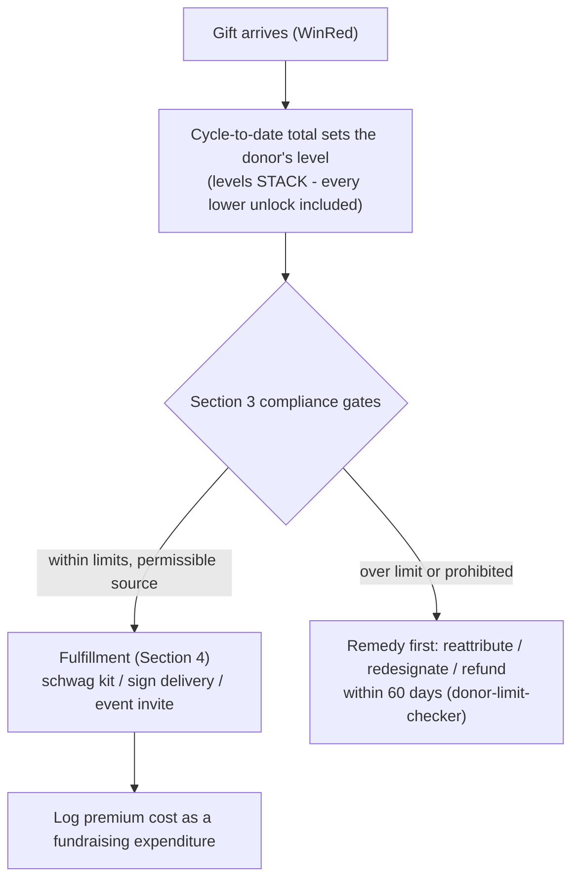

# Donor Value Ladder — Recognition Tiers for Matt Grant for Congress

A creative, FEC-aligned recognition ladder that tells every donor what their gift level *means*:
each WinRed amount ($25 → $7,000) unlocks a named supporter level with guaranteed, committee-paid
thank-yous — schwag, signage, and time with Matt — that **stack** as a donor's cycle total grows.
This is a *recognition and fulfillment* plan, not a price list: the full contribution always counts
against federal limits, premiums are ordinary committee fundraising expenses, and §3 gates every
public use of this ladder. Companion to [`../messaging/email-fundraising.md`](../messaging/email-fundraising.md)
(the Ask Ladder this aligns with) and [`../tools/donor-limit-checker.md`](../tools/donor-limit-checker.md)
(limits math and over-limit remedies).

- **Campaign:** Matt Grant for Congress (FEC C00945394) · **Race:** U.S. House, MO-02 · primary Aug 4, 2026
- **Donate:** WinRed — https://secure.winred.com/matt-grant-for-congress/donate-today
- **Owner:** _[finance director]_ · **Last updated:** July 10, 2026 · **Status:** Draft v0.1

> **Educational information, not legal advice.** Contribution limits and premium/expenditure rules
> below were verified **July 10, 2026** against FEC.gov (limits cross-checked with
> [`../federal/contribution-limits.md`](../federal/contribution-limits.md), re-verified 2026-07-03).
> Rules change — consult a campaign finance attorney or the FEC for guidance specific to your situation.

---

## 1. How the ladder works

- **Levels key on the donor's cycle-to-date total**, not a single gift — a $50 donor who gives $50
  more is a $100-level donor. (The web app already tracks cumulative totals per donor.)
- **Everything is guaranteed, never chance-based.** No raffles, drawings, or sweepstakes — chance
  mechanics trigger state gambling law and add nothing the ladder doesn't already deliver.
- **Time-with-Matt perks are honest commitments:** receptions, coffees, and roundtables are
  scheduled and announced by the committee. Never promise a specific date, venue, or guest until
  the committee has locked it.

## 2. The ladder

| Gift (cycle total) | Level | What the committee provides as a thank-you (stacks with all lower levels) |
|---|---|---|
| **$25** | **Front Porch Friend** | Sticker pack + printable window sign |
| **$50** | **Yard Sign Crew** | Official yard sign, delivered by your area captain |
| **$100** | **Grant Team Tee** | Campaign T-shirt (+ the yard sign) |
| **$250** | **Precinct Partner** | Full schwag kit — tee, hat, stickers, yard sign — plus the insider field-briefing email |
| **$500** | **Captain's Circle** | Invitation to a supporter reception with Matt |
| **$1,000** | **MO-02 Founders Club** | Founding-supporter listing (with your written permission) + small-group coffee with Matt |
| **$3,500** | **Primary Champion** *(per-election max)* | Seat at a private roundtable dinner with Matt + framed, signed MO-02 map |
| **$7,000** | **Full-Cycle Champion** *($3,500 primary + $3,500 general)* | Election-night host-committee listing + a second roundtable seat |

**Naming rationale:** every name is field-flavored and factual — porches, yards, precincts,
captains, and MO-02 are the campaign's real machinery (see `captain-field-plan.md`,
`sign-placement-plan.md`). No name implies an endorsement, office, or official access.

**Solicitation copy pattern (use this framing everywhere):**
> *"As a thank-you, Matt Grant for Congress provides [level] supporters with [items/invitation]."*

Never "buy," "purchase," "price," or "in exchange for" — the gift is a contribution; the premium
is the committee's thank-you.

## 3. FEC compliance — read before publishing any tier copy

> **Educational information, not legal advice.** Consult a campaign finance attorney or the FEC
> for guidance specific to your situation.

1. **The FULL contribution counts against the limit — premiums are never netted.** A $100 donor
   who receives a T-shirt has contributed $100, not $100-minus-shirt. Limits for 2025–2026
   (verified 2026-07-03/2026-07-10, FEC.gov): **$3,500 per election** from an individual;
   primary and general are separate elections, so **$7,000 is the cycle max** per individual.
2. **$7,000 requires designation.** $3,500 of a $7,000 gift must be designated to the **general**
   election. General-designated funds may not be spent on the primary; if Matt does not
   participate in the general (e.g., the primary is lost), general-designated contributions must
   be **refunded (or redesignated/reattributed with written authorization) within 60 days** — the
   workflow is in [`../tools/donor-limit-checker.md`](../tools/donor-limit-checker.md) §remedies.
   WinRed's max-out flow handles designation; the treasurer verifies on the report.
3. **Premiums are ordinary committee fundraising expenditures.** Branded campaign paraphernalia
   (shirts, hats, stickers, signs) used in the campaign is an explicitly permissible use of
   campaign funds; buying it to thank and activate donors is a bona fide campaign purpose, not
   "personal use" (the personal-use ban restricts converting funds to the candidate's/family's
   personal benefit). Pay vendors at fair market from committee funds and log every premium
   purchase in the expenditure tracker (`../workflows/expenditure-tracking.md`).
4. **Guaranteed, never chance.** No raffles/drawings — chance-for-consideration is regulated as
   gambling under state law. Every level's thank-you is automatic at that giving level.
5. **Access, never action.** Time with Matt is candidate access at a fundraising event — standard
   and lawful. **Never** tie any gift to an official act, vote, or government outcome, and never
   suggest donors are buying influence. Matt holds no office; if that changes, officeholder
   gift/ethics rules get re-reviewed before this ladder is reused.
6. **Prohibited sources still prohibited.** No corporate, labor-union, federal-contractor, or
   foreign-national money — premiums change nothing. WinRed's attestations plus intake screening
   (`../workflows/donation-intake.md`) apply to every tier including $25.
7. **Best efforts + reporting unchanged.** Collect name/address/occupation/employer over $200
   (WinRed collects); itemization thresholds are unaffected by premiums.
8. **Disclaimer on everything.** Every public use of this ladder — WinRed page, mailer, email,
   social graphic — carries **"Paid for by Matt Grant for Congress."** and (for email/print
   solicitations) the not-tax-deductible line.
9. **Recognition needs permission.** Founders-Club and host-committee listings are published only
   with the donor's written OK (their contribution is already public record over $200; the
   *listing* is a courtesy they opt into).

> **Compliance staleness:** limits verified 2026-07-10 (FEC.gov contribution-limits pages;
> $3,500/election, $44,300/yr national party). Premium/personal-use framing per FEC
> making-disbursements/personal-use guidance, same date. Re-verify before reprinting materials.

## 4. Fulfillment operations

| Step | Owner | How |
|---|---|---|
| Inventory & unit costs | Finance/ops | The live budget **Items catalog** (Airtable; powers the site's "what your $ funds") is the source for shirts/hats/stickers/signs and their real unit costs — budget premiums as a fundraising expense line before publishing the ladder |
| Tier assignment | Automatic | The web app tracks each donor's cycle total; the donate page shows the ladder and the thank-you email names the level reached |
| Schwag & sign delivery | Area captains | Fold premium delivery into existing captain turf runs (`sign-placement-plan.md` field ops) — a delivered thank-you is also a volunteer-recruitment door knock |
| Event tiers ($500+) | Finance director | Maintain the invite list from the donor roster; schedule receptions/coffees/roundtables; every invite carries the disclaimer |
| Expenditure logging | Treasurer | Every premium purchase → expenditure tracker with purpose "donor thank-you / fundraising" |
| Over-limit handling | Treasurer | Ladder never overrides limits math — `donor-limit-checker.md` remedies (reattribute / redesignate / refund, 60 days) run FIRST, recognition second |

## 5. Ready copy blocks

**WinRed page blurb (fits under the amount buttons):**
> Every level unlocks a thank-you from the campaign — stickers at $25, an official yard sign at
> $50, the Grant Team tee at $100, the full kit + insider field briefing at $250, a supporter
> reception with Matt at $500, the MO-02 Founders Club at $1,000, and a private roundtable dinner
> with Matt at the $3,500 max ($7,000 covers both the primary and the general). Paid for by Matt
> Grant for Congress. Contributions are not tax-deductible.

**Thank-you email insert (per level):**
> Your support makes you part of the **[Level]** — as a thank-you, the campaign will get your
> [items] to you, and [event line if $500+]. Reply to this email with sizing or delivery notes.

**Social/graphic rule:** any tier graphic carries the disclaimer and never shows "buy/price" framing.

**Source-code map (WinRed reports → surface).** Every tier link stamps a WinRed source code
(`sc` URL parameter) so the treasurer can see which surface drove each gift — attribution labels
only, never donor data:

| Code | Surface |
|---|---|
| `web-ladder` | /donate supporter-levels comparison cards |
| `web-impact` | /donate "choose an amount" impact picker |
| `letter-supporter-levels` | The on-letterhead supporter-levels letter's QR code |
| `email-next-level` | The thank-you email's "give $Δ to reach [next level]" button |
| `winred-directory` | The default (any link without a specific code) |

The thank-you email's next-level ask preselects **exactly the difference** to the donor's next
rung — and is **suppressed entirely at the $7,000 cycle max** (never solicit past the limit).

## 6. See also

- [`../federal/contribution-limits.md`](../federal/contribution-limits.md) — the limits this ladder tops out at (verified 2026-07-03)
- [`../tools/donor-limit-checker.md`](../tools/donor-limit-checker.md) — cumulative math + 60-day remedies
- [`../workflows/donation-intake.md`](../workflows/donation-intake.md) — screening every gift, every tier
- [`../workflows/expenditure-tracking.md`](../workflows/expenditure-tracking.md) — logging premium costs
- [`../messaging/email-fundraising.md`](../messaging/email-fundraising.md) — the Ask Ladder these tiers reinforce
- [`sign-placement-plan.md`](./sign-placement-plan.md) / [`captain-field-plan.md`](./captain-field-plan.md) — the captain network that delivers the schwag
