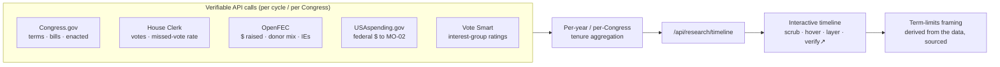

# Plan — Interactive Incumbent Tenure Timeline (Verifiable-Data "Public Trust Engine")

An interactive, **API-sourced** timeline that shows the *reality* of the incumbent's time in the
seat — every data point backed by a live, citable public-record API call — and lets the term-limits
argument make itself from the facts. No assertions; only sourced data with a "verify ↗" link on
every point. Extends the field/alignment engine (`/dashboard/research`) into a tenure-visualization
surface.

> **Guardrails (non-negotiable; from `CLAUDE.md` + `candidate/contrast-positioning.md`).** Every
> number carries a `source_url` to the originating API/record. **No causal claims** — we never assert
> the incumbent *caused* a district economic outcome; correlation/context is labeled as context.
> Tenure length, fundraising totals, vote counts, and bill counts are neutral public facts presented
> without editorializing. For any **public-facing** use, contrast stays name-free where required and
> election counsel signs off on framing + disclaimers before publish. This is a data instrument, not
> an attack.

---

## 1. Why this works as a trust engine

The persuasive force is *verifiability*, not rhetoric. Each point on the timeline is a number a
skeptic can re-pull from the same public API. The term-limits case emerges structurally:

- **Tenure:** 7 consecutive terms, 113th–119th Congress, 2013–present (Congress.gov member terms).
- **Fundraising arc:** $2.7M (2012) → $5.65M peak (2020) → ~$4–5M/cycle (FEC by-cycle totals) — the
  compounding incumbent money advantage term limits are meant to interrupt.
- **Seniority/entrenchment:** committee assignments accreting over 13 years.

## 2. Timeline data model

A normalized series keyed by Congress (and election cycle), one record per period:

| Field | Source API | Verifiable? |
|---|---|---|
| `congress`, `startYear`, `endYear`, `termIndex` (1–7) | Congress.gov `/member/{id}` terms | ✅ |
| `billsSponsored`, `billsCosponsored`, `billsEnacted` | Congress.gov sponsored/cosponsored + bill status | ✅ |
| `votesCast`, `missedVotes`, `missedVotePct` | House Clerk roll-call XML (position = "Not Voting") | ✅ |
| `committees[]` / leadership | Congress.gov member committee assignments | ✅ |
| `raised`, `spent`, `cashOnHand` (per cycle) | OpenFEC `/candidate/{id}/totals` by cycle | ✅ |
| `pctOutOfState`, `pctPac`, `topIndustries[]` (per cycle) | OpenFEC Schedule A aggregates (already built) | ✅ |
| `independentExpenditures` for/against (per cycle) | OpenFEC `/schedules/schedule_e` | ✅ |
| `federalAwardsToDistrict` (per year, **context only**) | USAspending.gov `/search/spending_by_geography` | ✅ |
| `interestGroupRatings[]` (per year) | Vote Smart `Rating.getCandidateRating` | ✅ (key) |

Every record stores the exact `source_url` used, so the UI can render "verify ↗" per metric.

## 3. New data sources to add (the "super engine")

Already have: Congress.gov, House Clerk, OpenFEC (incl. donor profiles), Census ACS, Open States.
**Add, all public + API-accessible:**

- **OpenFEC Schedule E (independent expenditures)** — outside money spent *for/against* her each
  cycle. Same key; no new credential. High-trust signal of how contested/safe the seat is.
- **USAspending.gov API** (no key) — federal dollars awarded into MO-02 by year. *Context only* —
  shown as "federal spending in the district during this period," never "she delivered/failed."
- **Vote Smart API** (free key) — interest-group ratings per year (Chamber, NRA, NFIB, etc.),
  showing special-interest alignment across tenure. Sourced, third-party.
- **GovTrack** (bulk/data) — corroborating missed-vote and ideology/leadership stats per session;
  cross-check for the Clerk-derived numbers.
- **GovInfo API** (free key) — committee/seniority history and full bill text for milestone votes.

Deferred / cautious: Census ACS time-series and BLS county economics can layer as *district context*
during her tenure, but only with an explicit "context, not attribution" label to stay within the
no-causal-claim guardrail.

## 4. Surfaces

- **API:** `GET /api/research/timeline?candidate=ann-wagner` → the normalized per-Congress/per-cycle
  series with `source_url` on every metric. Read-only, public-data, cacheable.
- **Ingest:** a tenure aggregator (extends `runFieldIngest`) that walks all 7 Congresses/cycles and
  persists the series (DynamoDB `TIMELINE#<slug>`). Backfill is one-time-ish; refresh on the daily cron.
- **Interactive visualization** (the centerpiece):
  - A horizontal time axis 2013→present with the **7 term blocks** marked.
  - Layered, toggleable series: fundraising (line), bills sponsored vs **enacted** (bars — the
    output-vs-activity gap), missed-vote rate, out-of-state-money %, independent expenditures.
  - **Scrub/hover** any year → a card with that period's sourced figures + "verify ↗" deep links.
  - A persistent **"why term limits"** rail that updates from the data as you scrub (e.g., "Term 4 of
    7 · $5.65M raised this cycle · N bills enacted") — framing derived from facts, not asserted.

## 5. Term-limits framing (factual, sourced)

The rail/annotations state only what the data shows, e.g.:
- "Seven consecutive terms — 13 years — in one seat." (Congress.gov)
- "Per-cycle fundraising rose from $2.7M to a $5.65M peak." (FEC)
- "Of N bills sponsored across 13 years, M became law." (Congress.gov bill status)

The conclusion (that entrenchment compounds and term limits interrupt it) is left to the viewer —
consistent with the "be the answer, not the attack" doctrine in `contrast-positioning.md`.

## 6. Build phases

1. **Aggregator + API** — per-Congress/cycle timeline builder over the existing clients + Schedule E;
   `/api/research/timeline`; persist `TIMELINE#<slug>`. (No new keys; verifiable immediately.)
2. **Visualization** — interactive component on the dashboard drilldown (internal first), every point
   with a verify link.
3. **Enrichment** — add Vote Smart ratings + USAspending context layers (new keys / no-key).
4. **Public surface** — a name-free public `/transparency`-style page, **after election-counsel
   review** of framing and disclaimers.

## 7. Open decision

- **Internal dashboard tool** vs **public voter-facing page.** Recommendation: build phase 1–2 as an
  internal `/dashboard/research/[slug]` tab first (full data, no framing constraints), then adapt a
  name-free public version (phase 4) once counsel approves. Public use triggers the
  `contrast-positioning.md` name-free rules + disclaimer review.

> **EDUCATIONAL / NONPARTISAN DISCLAIMER:** Describes campaign data-tooling using public primary
> sources for informational purposes. Not legal advice. All figures are drawn from cited public APIs;
> nothing here authorizes fabricated or uncited claims, or causal attribution of district outcomes.
> Consult election counsel before any public-facing comparison.
