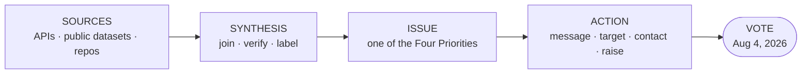
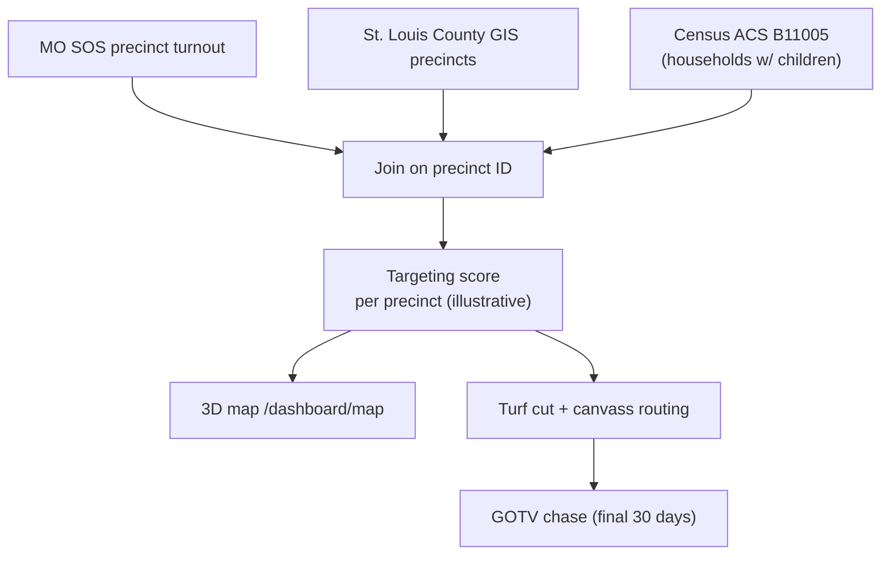

# Issues → Action: Data & Repository Synthesis Plan

How to turn Matt Grant's four priorities into a sequenced, data-backed action program for the
**August 4, 2026 MO-02 primary** — by tying together the campaign app's live data APIs, the public
datasets in `candidate/data-and-map-plan.md`, and the open-source justice-tech repositories in this
GitHub account. The goal is a single pipeline: **a public data source or repo → a synthesized signal
→ one of Matt's issues → a concrete campaign action → a vote.**

> **PLANNING / EDUCATIONAL NOTICE — read first.** This is a planning document, not a forecast. Every
> count, turnout figure, dollar amount, and "expected output" here is an **illustrative placeholder**
> demonstrating *how* the pipeline runs, never a prediction or real data. The justice-tech repositories
> are general-purpose, nonpartisan infrastructure; nothing here represents that any of them has produced
> findings about a specific Missouri court, case, or person. Any datum surfaced by any tool must be
> independently verified before public use, and **no policy position, statute, statistic, endorsement, or
> legal claim beyond `candidate/platform.md` may be created.** See "Compliance & Guardrails."

---

## 1. The asset inventory — what we already have

Three asset classes already exist in this account. The synthesis is connecting them, not building
from scratch.

### 1a. Live & planned data APIs (the campaign app)

From `candidate/integrations-connection-plan.md` and `candidate/data-and-map-plan.md`:

| Source | Status | What it yields for the campaign |
|---|---|---|
| **Congress.gov** ingest (cron) | ✅ live — 1,743 bills + 60 votes stored | Bill/vote record for issue research and contrast on the four priorities |
| **St. Louis County GIS** (ArcGIS) | ✅ live — polling, precinct turnout, VTDs | The 3D field map; precinct turnout for targeting |
| **DynamoDB / S3 / CloudFront** | ✅ live | Donors, finance, volunteers, tasks, assets |
| **Clerk auth + webhook** | ✅ live (dev) | Member-area roles for staff/volunteers |
| **WinRed** donation webhook | 🟡 built, secret pending | Donation → branded thank-you receipt |
| **AWS SES** | ⏳ verify pending | Receipts, invites, broadcast email |
| **Anthropic** | 🔌 not connected | AI press-topic / content generation |
| **Census ACS 2024 5-yr** | planned (`data-and-map-plan.md` §3) | Households-with-children (B11005), age, income → children-first targeting |
| **MO SOS** results/registration/candidates | planned | Win-number math, turnout trend, field of candidates |
| **FEC bulk data** | planned | Receipts / cash-on-hand / opponent money trend |

### 1b. The justice-tech repositories (issue infrastructure)

These open-source repos in this account map almost one-to-one onto Matt's **#1 priority — eliminating
family-court corruption** and the **CHILD Protection Act (Corruption Hiding Inside Legal Dockets)**.
They are nonpartisan tools; here they are read as *infrastructure that can organize and present
already-public information* behind the reform argument.

| Repository | What it is (per its GitHub description) | Role in the family-court work |
|---|---|---|
| `justice-analytics` | Bias-detection engine + case-outcome analytics, disparity dashboards | Turn **public** court-system data into disparity visuals that illustrate *why* reform is needed |
| `justice-score-engine` | Access-to-justice scoring / measurement | A repeatable "how fair is the system" metric to frame the problem |
| `justice-knowledge-graph` | Connects laws, cases, people, processes (open legal data) | Link the CHILD Act's Title IV-D lever to the statutes/processes it touches |
| `evidence-timeline` | Turns notes into court-neutral chronologies | Constituent-story intake that is structured and court-neutral |
| `vetted-legal-ai` / `vetted-legal-ai-engine` | RAG with citation validation + audit logs | Keep every public claim **cited and verifiable** — directly serves our "no invented facts" rule |
| `court-doc-engine` / `pro-se-toolkit` / `justice-navigator` | Guided forms, self-rep toolkits, journey maps | "Help while we work for reform" — constituent-service value, not a policy claim |
| `legal-resource-discovery` | Geo-based legal-aid resource finder | A genuinely useful constituent resource to offer MO-02 families |
| `get-elected` | The upstream nonpartisan campaign skill (this repo) | The operating system for everything in `messaging/`, `tactics/`, `workflows/` |

> **Important framing.** These tools *organize and present public information and provide constituent
> services*. They do **not** generate accusations about real courts, judges, or cases, and nothing
> from them may be published as fact without independent verification. The lawsuit/press material
> stays framed as **pending / alleged** exactly as in `candidate/platform.md`.

---

## 2. The synthesis model — issue ↔ data ↔ repo ↔ action

One row per priority. Read left-to-right: this is the whole plan in one table.

| Matt's priority | Best data sources | Repo / tool | Synthesized signal | Campaign action |
|---|---|---|---|---|
| **1. Family-court corruption** (CHILD Act) | Congress.gov (Title IV-D, related bills) · public court-system data | `justice-analytics`, `justice-knowledge-graph`, `vetted-legal-ai`, `evidence-timeline` | A cited problem statement + disparity visuals + a constituent-story intake | Issue page, coalition kit, earned media, testimony, constituent service |
| **2. Term limits** (grandfather clause) | Congress.gov (member tenure, term-limit bills) | `justice-knowledge-graph` for bill linkage | "How long has Washington served itself?" contrast graphic | Contrast content, social cards, debate prep |
| **3. Smaller government** (hiring freeze, early retirement) | Congress.gov · FEC (where opponents raise) | App research store | Spending/headcount contrast, framed faithfully | Paid + earned media, mailers |
| **4. Lower taxes** (cut waste first) | Congress.gov · Census ACS (district affordability) | App research store | "Cut waste, not services" affordability map | Targeted message to cost-sensitive precincts |
| **Field engine (all four)** | MO SOS turnout · St. Louis County GIS · Census ACS B11005 | 3D map (`/dashboard/map`), `data-and-map-plan.md` | Precinct turnout × households-with-children → a targeting score | Turf cut, canvass routing, GOTV chase |

---

## 3. Issue-by-issue action pipelines

### 3.1 Family courts — the flagship pipeline (deepest)

This is where the repos earn their place. The pipeline:

1. **Ingest (live).** Congress.gov cron already stores bills/votes; filter for **Title IV-D** and
   family-court-related items to anchor the CHILD Act's stated mechanism (faithful to `platform.md`).
2. **Organize.** Use `justice-knowledge-graph` to connect the Title IV-D grant lever to the statutes
   and processes the platform references — a citation map, not a new legal claim.
3. **Illustrate the problem.** Use `justice-analytics` / `justice-score-engine` on **public** court
   data to produce disparity/fairness visuals. Label every figure with source and vintage; if a number
   can't be sourced, it doesn't ship.
4. **Verify.** Route every public-facing claim through `vetted-legal-ai`'s citation-validation pattern
   — this *operationalizes* the repo's own "no invented facts" rule.
5. **Listen.** `evidence-timeline` + `legal-resource-discovery` give MO-02 families a structured,
   court-neutral way to share a story and find help — building the coalition (`candidate/coalition-family-court-targets.md`).
6. **Act.** Feed all of the above into the `/issues/family-courts` page (`candidate/issues-ia-plan.md`),
   the coalition kit, earned media, and the surrogate/testimony program.

### 3.2 Term limits

Congress.gov member-tenure + term-limit bill data → a single honest contrast graphic ("careerism")
tied faithfully to the platform's grandfather-clause position. Output: social cards (`messaging/social-media-strategy.md`), debate prep.

### 3.3 Smaller government

Congress.gov spending/headcount record + FEC opponent-money trend → contrast content for the
hiring-freeze / early-retirement position. No new policy specifics beyond `platform.md`.

### 3.4 Lower taxes

Census ACS district affordability (income, cost burden) → an affordability map layer (`data-and-map-plan.md` §2)
that pairs the "cut waste first" message with the precincts where cost-of-living pressure is highest.

### 3.5 The shared field engine (powers turnout for all four)

This is exactly the join described in `data-and-map-plan.md` §3 — it makes the map's columns real
instead of illustrative, and it's the same universe math as `candidate/strategic-plan.md` §2 (all
counts there remain placeholders until the voter file and SOS data replace them).

---

## 4. The data → action engine inside the app

Each synthesized signal lands in a surface voters or staff actually touch:

| Synthesis output | App surface | Backing source |
|---|---|---|
| Cited issue arguments + visuals | `/issues/<slug>` pages | `issues-ia-plan.md`, `platform.md` |
| Precinct targeting score | `/dashboard/map` 3D columns | `data-and-map-plan.md`, GIS + ACS + SOS |
| Constituent story / resource intake | member area | `evidence-timeline`, `legal-resource-discovery` |
| Donation → receipt | WinRed webhook → SES | `integrations-connection-plan.md` |
| Daily issue research | research store (cron) | Congress.gov ingest |
| Press topics / drafts | content tools | Anthropic (once keyed) + `messaging/` |

---

## 5. Timeline — working backward from August 4, 2026

Mapped onto the four phases in `candidate/strategic-plan.md` §3. "Today" = mid-June 2026, so the
window is compressed — Foundation/Building work runs in parallel and ships fast.

| Phase (vs. Aug 4) | Data / repo work to ship | Resulting campaign action |
|---|---|---|
| **Now → 6 wks out** (Foundation, in progress) | Finish integrations: **SES verify**, **WinRed secret**, **Anthropic key** (`integrations-connection-plan.md` order); confirm Congress.gov cron healthy | Live receipts, thank-yous, AI-assisted content; daily issue research flowing |
| **6 → 4 wks out** (Building) | Wire **ACS B11005** + **MO SOS turnout** joins into the map; stand up the **family-court synthesis** (Congress.gov filter + `justice-knowledge-graph` citation map, all vetted) | Real precinct targeting; `/issues/family-courts` page rich with cited material; coalition outreach begins |
| **4 → 2 wks out** (Persuasion) | Ship the other three issue pages + contrast graphics from the research store; finalize turf cut from the targeting score | Door/phone/paid contact weighted by cost-per-vote (`tactics/low-cost-high-impact.md`) |
| **Final 14 days** (GOTV) | Turn on the **early-vote / absentee pace** view (time-slider in `data-and-map-plan.md` §2); daily "who hasn't voted" pulls | Ballot-chase program (`tactics/ballot-chase-program.md`) against identified supporters |
| **Aug 4** (Primary) | Live SOS Election Night Reporting on the map | Poll monitoring, ride-to-polls, last-call to un-voted supporters |

> Every date above must be checked against `states/missouri/ballot-access.md` and the MO SOS before
> it drives a decision; the campaign timeline is fixed to Aug 4, 2026 but filing/early-vote dates
> must be verified, not assumed.

---

## 6. Compliance & Guardrails

- **FEC coordination / in-kind (flag for counsel).** The justice-tech repos and `get-elected` are
  separate open-source projects. Using third-party software or assets to benefit the campaign can
  raise **in-kind contribution and coordination** questions. Before any of these repos is deployed in
  service of the campaign, confirm the arrangement with a campaign-finance attorney and reflect any
  value as required (`federal/contribution-limits.md`, `federal/prohibited-contributions.md`,
  `workflows/coordination-rules.md`). Public, free, government datasets (Census, SOS, GIS, Congress.gov,
  FEC) are not contributions.
- **No invented facts or law.** Nothing surfaced by any tool may be published without an independent,
  cited source. The `vetted-legal-ai` citation-validation pattern is adopted precisely to enforce this.
  No new policy positions, statutes, contribution limits, deadlines, poll numbers, or endorsements
  beyond `candidate/platform.md`.
- **Pending/alleged framing preserved.** The RICO filing and press material stay framed as pending /
  alleged exactly as in `platform.md` and `issues-ia-plan.md`. The justice tools describe **behavior
  and public data**, never characterize a specific judge, court, or party.
- **Privacy.** Constituent stories and any legal-intake data are sensitive. No SSNs, bank numbers, or
  passwords; handle intake and donor lists securely (CLAUDE.md privacy rule; `evidence-vault` patterns
  if storage is needed).
- **Nonpartisan tooling, faithful representation.** The underlying skill and repos are neutral; they
  execute Matt's stated platform faithfully without editorializing.
- **Search-first + staleness.** Verify every contribution limit, deadline, and dataset vintage against
  the official agency before relying on it, and label the verification date.

---

> **EDUCATIONAL DISCLAIMER:** This is educational planning information, not legal advice. Consult a
> campaign-finance attorney or your filing agency (the FEC for this federal race; the Missouri
> Secretary of State for ballot access) for guidance specific to your situation. All quantitative
> figures in this plan are illustrative planning placeholders, not predictions or real data.

_Paid for by the Matt Grant for Congress Committee._
