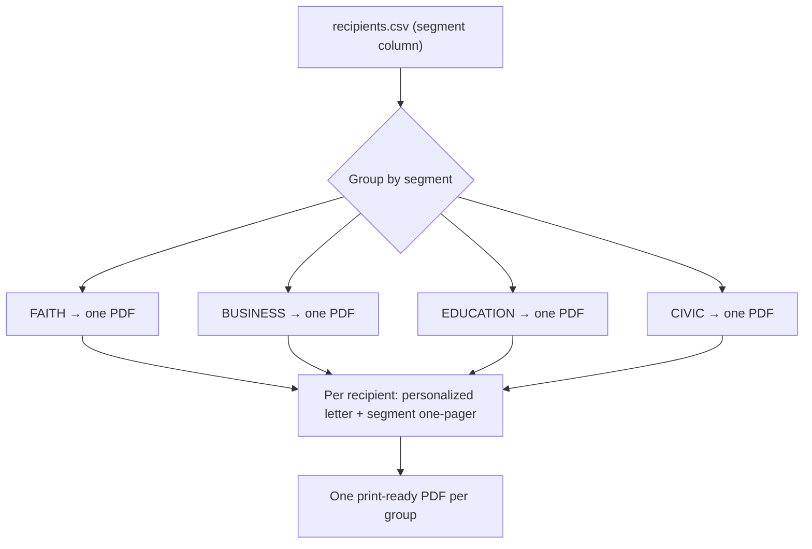

# Community-Leader Mailing — Universe, Logic & Production

The system for mass-producing **personalized** letters to influential community leaders across Missouri's 2nd Congressional District (MO-02) — done in bulk, **one print-ready PDF per mailing group**. Each recipient gets a letter customized by their title, organization, and segment alignment with Matt Grant's documented priorities, followed by a segment-tailored issue one-pager, asking them to join the effort to **restore public trust**.

- **Generator:** `tools/pdf-letterhead/community_mailing.py` (renders via `brand_letter.build_many`)
- **Recipient data:** the campaign supplies a CSV with the schema below. A runnable sample lives at [`community-targets.sample.csv`](community-targets.sample.csv) (rows tagged `[SAMPLE]` — placeholders, not real people).
- **Output (build artifacts, git-ignored):** `candidate/letters/output/Matt-Grant-<Group>-Mailing.pdf` — one file per group.



---

## Step 1 — Size the universe (the "how many" worksheet)

MO-02 (2025 enacted map) covers **part of St. Louis County plus Jefferson, Washington, Crawford, and Gasconade counties** — St. Charles, Franklin, and Warren are NOT in the district. The counts below are **illustrative planning placeholders — not real data**. Replace each with a verified count as the campaign sources the list (the generator reports the exact number actually loaded from your CSV).

| Group (`segment`) | Who | Where to source real names | Illustrative count | Default ask tier |
|---|---|---|---|---|
| Faith & community (`FAITH`) | Lead clergy, congregational & denominational leaders, faith-nonprofit directors | Clergy/denominational directories, ministerial alliances | ~120–200 | B |
| Business & Chamber (`BUSINESS`) | Chamber boards, business owners, economic-development figures | Chamber rosters, business registries, EDC boards | ~80–150 | B |
| Education (`EDUCATION`) | School-board members, superintendents, PTA council leaders | District websites, DESE directory, PTA councils | ~60–100 | B |
| Local elected & civic (`CIVIC`) | City/county council, mayors, school board, township/precinct & party officers | County clerks, municipal sites, mo-gov House roster (MO-02 area) | ~150–250 | A/B |
| **Total (illustrative)** | | | **~410–700** | |

> The mailing universe is whatever you load. To get a real "how many," populate the CSV and run the generator — it prints the recipient count per group.

## Step 2 — The customization logic

Each letter is personalized from **verifiable attributes only** (title, organization, area, segment, ask tier) and maps the recipient's segment to Matt's documented priorities.

### Segment → "Where We Align" message
| Segment | Section heading | Lead message (→ Matt priority) |
|---|---|---|
| **FAITH** | Where Our Values Meet | Missouri's children come first; clean up the family courts (Priority 1); moral-authority framing |
| **BUSINESS** | Where We Align on Opportunity | Leaner government + lower taxes by cutting waste (Priorities 3 & 4); trust/accountability; children-first through-line |
| **EDUCATION** | Putting Children First | Reaches families with school-age kids; family-court reform protects children (Priority 1) |
| **CIVIC** | Serving the Same Neighbors | Restore public trust; accountable government; term limits / end careerism (Priority 2); family-court reform (Priority 1) |

Every letter then carries the **CHILD Protection Act** paragraph (Title IV-D lever), an **"Explore the Data Together"** offer (collaboration on evidence — *no fabricated figures*), an **"Invitation"** (ask by tier, framed as joining the effort to restore public trust), and a single **"Learn More" QR** to `/issues`.

### Ask tier → the invitation
- **A — lead with endorsement** (top-influence leaders).
- **B — endorsement or issue-ally** (default for most).
- **C — introduce + ally/amplify** (relationship-building).

Letters within each group's PDF are ordered by `ask_tier` (A → C), then last name.

### Segment-tailored enclosure (one-pager after each letter)
| Segment | Enclosure |
|---|---|
| FAITH, EDUCATION | The CHILD Protection Act of 2027 (children-first) |
| BUSINESS | Leaner Government, Lower Taxes (Priorities 3 & 4 + accountability) |
| CIVIC | Restoring Public Trust (family-court reform, term limits, accountable government) |

## Step 3 — Mass-produce (one PDF per group)

```bash
cd tools/pdf-letterhead
python3 community_mailing.py                      # uses community-targets.sample.csv
python3 community_mailing.py ../../path/to/real-list.csv
# -> candidate/letters/output/Matt-Grant-<Group>-Mailing.pdf  (one per group)
```

### Recipients CSV schema
`segment, honorific, first_name, last_name, salutation, title, organization, address_line_1, address_line_2, city, state, zip, area_focus, ask_tier`

| Column | Notes |
|---|---|
| `segment` | `FAITH` \| `BUSINESS` \| `EDUCATION` \| `CIVIC` — drives alignment, enclosure, and output file |
| `honorific` | Address-block prefix ("Rev.", "Dr.", "Hon.", "Ms.") |
| `salutation` | How they're addressed: "Dear **Pastor** Mercer:" |
| `title`, `organization` | Role + affiliation, used in the alignment paragraph |
| `address_line_1/2`, `city`, `state`, `zip` | Mailing address (`address_line_2` may be blank) |
| `area_focus` | Short phrase for the closing ("families across west county") |
| `ask_tier` | `A` \| `B` \| `C` |

To adjust the logic, edit the segment paragraphs/asks in `tools/pdf-letterhead/community_mailing.py`. No engine changes are needed — it reuses `brand_letter.build_many`.

---

## Real batch loaded — Local & Civic (MO House + St. Charles County)

The canonical **real** CIVIC list is [`civic-targets.csv`](civic-targets.csv): **37 officials** = 26 state House members + 8 St. Charles County officials + 3 St. Louis County council members. Generate the real Local & Civic PDF with:

```bash
cd tools/pdf-letterhead
python3 community_mailing.py ../../candidate/letters/civic-targets.csv
# -> candidate/letters/output/Matt-Grant-Local-Civic-Mailing.pdf  (34 letters + briefs)
```

**Component 1 — MO House (26)** — districts **86–113** (mo-gov `mo-house-roster.md`; approximate St. Louis County ~86–99 + St. Charles ~100–113). Also kept standalone at [`civic-house-targets.csv`](civic-house-targets.csv). Excludes vacant District **95** (O'Donnell, res. Jan 2025) and **110** (Sparks, res. Nov 2025). Addressed at the Capitol (201 W. Capitol Ave., Jefferson City). All `ask_tier=B`.

**Component 2 — St. Charles County (8)** — County Executive **Steve Ehlmann** + the seven County Council members (D1 Matt Swanson, D2 Joe Brazil, D3 Mike Elam, D4 Dave Hammond, D5 Terry Hollander, D6 Patti York, D7 Timothy Baker), sourced from the official `sccmo.org` member pages and council journal. Addressed at the County Administration Building, 201 N. Second Street, St. Charles, MO 63301. Executive + Council Chair (Elam)/Vice-Chair (Swanson) set to `ask_tier=A`.

**Component 3 — St. Louis County council (3)** — the west/south council members whose districts overlap MO-02: **D7 Mark Harder** (West County — Chesterfield/Ballwin/Wildwood), **D3 Dennis Hancock** (Southwest — Fenton/Eureka/Valley Park), **D6 Michael Archer** (South County). Addressed at the St. Louis County Government Building, 41 S. Central Ave., Clayton, MO 63105. All `ask_tier=B`. **County Executive Sam Page is excluded** (lame duck — not seeking re-election — and under indictment as of 2026); add only if the campaign chooses. North-county council seats (D1 Days, D2 Bangert, D4 Webb) are in **MO-01** and excluded.

**Component 4 — Municipal mayors — DEFERRED.** Mayors of the largest cities in and around the district are **not yet included**. Note the map split: **Chesterfield, Wildwood, and Ballwin** are West St. Louis County and **in MO-02**; **O'Fallon, St. Peters, St. Charles, and Wentzville** are St. Charles County, which is **NOT in MO-02** under the 2025 enacted map (see Component 2 note) — treat those as adjacent-county outreach, not in-district. They are deferred regardless because: the **April 7, 2026 municipal elections** just occurred and several seats changed (e.g., Chesterfield's Bob Nation stepped down), so current names could not be confirmed without risking errors. Source these from each City Hall / Ballotpedia and add them with `salutation=Mayor`, `title=Mayor`, `organization=City of <Name>, Missouri` before mailing.

> **VERIFY BEFORE MAILING:** (1) **MO-02 overlap** — mo-gov's House county ranges and the STL County council districts are approximate; confirm against the enacted congressional map (some House districts may fall in **MO-01**). **St. Charles County is NOT in MO-02** under the 2025 enacted map (it moved to MO-03) — the St. Charles targets in Component 2 are an adjacent-county outreach choice, not in-district leaders, so confirm the campaign still wants them before mailing. (2) **Add House room numbers** from house.mo.gov/MemberRoster.aspx. (3) **Re-confirm the St. Charles roster, leadership roles, and the County Administration Building address** on sccmo.org — and note **2026 is an election year** for the County Executive, so re-verify after November. (4) **Re-confirm the St. Louis County council members and the Clayton address** on stlouiscountymo.gov. (5) Re-check for new House vacancies. (6) Source and add the deferred municipal mayors (Component 4). (7) Optionally promote House committee chairs (D94 Murphy, D96 Christ, D97 Casteel, D101 Keathley, D103 Hinman) to `ask_tier=A`.

---

> **VERIFICATION — read before printing/mailing.** The included sample CSV is a **SAMPLE** with fictional `[SAMPLE]` rows so the pipeline runs end-to-end; it is **not** a real recipient list. Before any mail drop: source real names/titles/addresses, confirm each leader is correctly placed in a segment and ask tier, and verify mailing addresses. Counts in the sizing worksheet are illustrative placeholders, not real data.

> **EDUCATIONAL / NONPARTISAN NOTE.** This is campaign outreach material presented faithfully to Matt Grant's documented positions (`candidate/platform.md`). Personalization uses provided, verifiable attributes of each recipient; it invents no positions, numbers, or data. _Paid for by Matt Grant for Congress._
