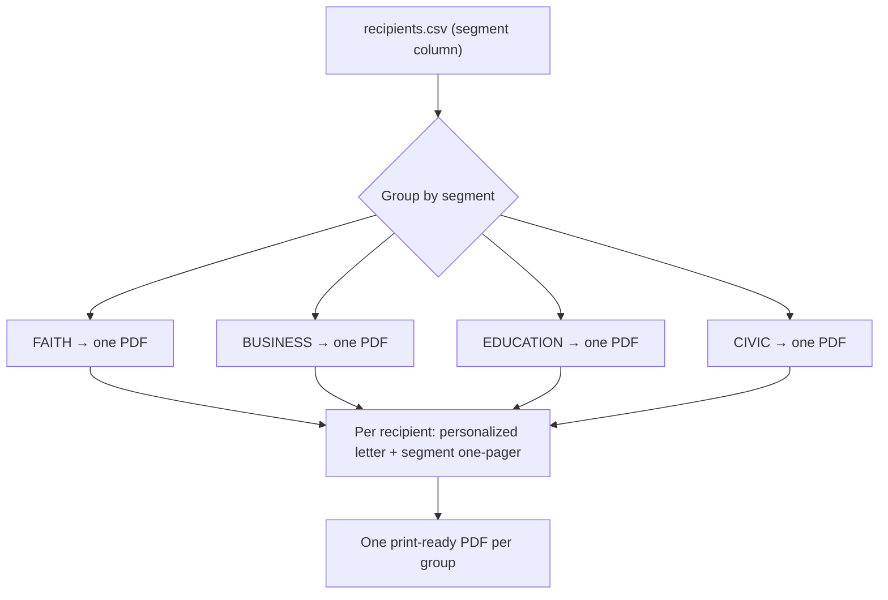

# Community-Leader Mailing — Universe, Logic & Production

The system for mass-producing **personalized** letters to influential community leaders across Missouri's 2nd Congressional District (MO-02) — done in bulk, **one print-ready PDF per mailing group**. Each recipient gets a letter customized by their title, organization, and segment alignment with Matt Grant's documented priorities, followed by a segment-tailored issue one-pager, asking them to join the effort to **restore public trust**.

- **Generator:** `tools/pdf-letterhead/community_mailing.py` (renders via `brand_letter.build_many`)
- **Recipient data:** the campaign supplies a CSV with the schema below. A runnable sample lives at [`community-targets.sample.csv`](community-targets.sample.csv) (rows tagged `[SAMPLE]` — placeholders, not real people).
- **Output (build artifacts, git-ignored):** `candidate/letters/output/Matt-Grant-<Group>-Mailing.pdf` — one file per group.



---

## Step 1 — Size the universe (the "how many" worksheet)

MO-02 spans **western St. Louis County, St. Charles County, and parts of Jefferson, Franklin, and Warren counties**. The counts below are **illustrative planning placeholders — not real data**. Replace each with a verified count as the campaign sources the list (the generator reports the exact number actually loaded from your CSV).

| Group (`segment`) | Who | Where to source real names | Illustrative count | Default ask tier |
|---|---|---|---|---|
| Faith & community (`FAITH`) | Lead clergy, congregational & denominational leaders, faith-nonprofit directors | Clergy/denominational directories, ministerial alliances | ~120–200 | B |
| Business & Chamber (`BUSINESS`) | Chamber boards, business owners, economic-development figures | Chamber rosters, business registries, EDC boards | ~80–150 | B |
| Education (`EDUCATION`) | School-board members, superintendents, PTA council leaders | District websites, DESE directory, PTA councils | ~60–100 | B |
| Local elected & civic (`CIVIC`) | City/county council, mayors, school board, township/precinct & party officers | County clerks, municipal sites, mo-gov House roster (MO-02 area) | ~150–250 | A/B |
| **Total (illustrative)** | | | **~410–700** | |

> The mailing universe is whatever you load. To get a real "how many," populate the CSV and run the generator — it prints the recipient count per group.

## Step 2 — The customization logic

Each letter is personalized from **verifiable attributes only** (title, organization, area, segment, ask tier) and maps the recipient's segment to Matt's documented priorities.

### Segment → "Where We Align" message
| Segment | Section heading | Lead message (→ Matt priority) |
|---|---|---|
| **FAITH** | Where Our Values Meet | Missouri's children come first; clean up the family courts (Priority 1); moral-authority framing |
| **BUSINESS** | Where We Align on Opportunity | Leaner government + lower taxes by cutting waste (Priorities 3 & 4); trust/accountability; children-first through-line |
| **EDUCATION** | Putting Children First | Reaches families with school-age kids; family-court reform protects children (Priority 1) |
| **CIVIC** | Serving the Same Neighbors | Restore public trust; accountable government; term limits / end careerism (Priority 2); family-court reform (Priority 1) |

Every letter then carries the **CHILD Protection Act** paragraph (Title IV-D lever), an **"Explore the Data Together"** offer (collaboration on evidence — *no fabricated figures*), an **"Invitation"** (ask by tier, framed as joining the effort to restore public trust), and a single **"Learn More" QR** to `/issues`.

### Ask tier → the invitation
- **A — lead with endorsement** (top-influence leaders).
- **B — endorsement or issue-ally** (default for most).
- **C — introduce + ally/amplify** (relationship-building).

Letters within each group's PDF are ordered by `ask_tier` (A → C), then last name.

### Segment-tailored enclosure (one-pager after each letter)
| Segment | Enclosure |
|---|---|
| FAITH, EDUCATION | The CHILD Protection Act of 2027 (children-first) |
| BUSINESS | Leaner Government, Lower Taxes (Priorities 3 & 4 + accountability) |
| CIVIC | Restoring Public Trust (family-court reform, term limits, accountable government) |

## Step 3 — Mass-produce (one PDF per group)

```bash
cd tools/pdf-letterhead
python3 community_mailing.py                      # uses community-targets.sample.csv
python3 community_mailing.py ../../path/to/real-list.csv
# -> candidate/letters/output/Matt-Grant-<Group>-Mailing.pdf  (one per group)
```

### Recipients CSV schema
`segment, honorific, first_name, last_name, salutation, title, organization, address_line_1, address_line_2, city, state, zip, area_focus, ask_tier`

| Column | Notes |
|---|---|
| `segment` | `FAITH` \| `BUSINESS` \| `EDUCATION` \| `CIVIC` — drives alignment, enclosure, and output file |
| `honorific` | Address-block prefix ("Rev.", "Dr.", "Hon.", "Ms.") |
| `salutation` | How they're addressed: "Dear **Pastor** Mercer:" |
| `title`, `organization` | Role + affiliation, used in the alignment paragraph |
| `address_line_1/2`, `city`, `state`, `zip` | Mailing address (`address_line_2` may be blank) |
| `area_focus` | Short phrase for the closing ("families across west county") |
| `ask_tier` | `A` \| `B` \| `C` |

To adjust the logic, edit the segment paragraphs/asks in `tools/pdf-letterhead/community_mailing.py`. No engine changes are needed — it reuses `brand_letter.build_many`.

---

> **VERIFICATION — read before printing/mailing.** The included CSV is a **SAMPLE** with fictional `[SAMPLE]` rows so the pipeline runs end-to-end; it is **not** a real recipient list. Before any mail drop: source real names/titles/addresses, confirm each leader is correctly placed in a segment and ask tier, and verify mailing addresses. Counts in the sizing worksheet are illustrative placeholders, not real data.

> **EDUCATIONAL / NONPARTISAN NOTE.** This is campaign outreach material presented faithfully to Matt Grant's documented positions (`candidate/platform.md`). Personalization uses provided, verifiable attributes of each recipient; it invents no positions, numbers, or data. _Paid for by the Matt Grant for Congress Committee._
