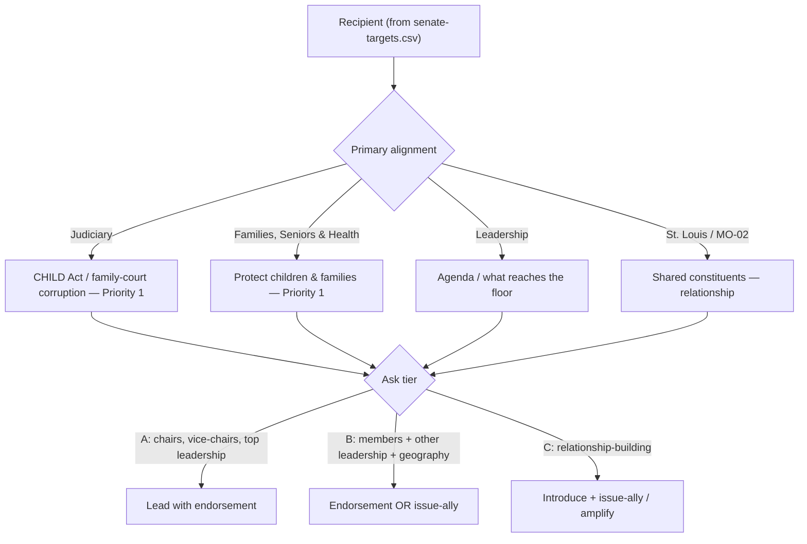

# Senate Legislator Mailing — Roster & Personalization Logic

The compiled mailing list and the documented logic behind each personalized letter in the Missouri State Senate outreach run. Each recipient receives a tailored letter — customized by their **title, committee/jurisdiction (their professional interests), and alignment with Matt Grant's documented priorities** — followed by the one-page CHILD Protection Act brief, all compiled into a single print-ready PDF. The ask: join the effort to **restore public trust**, starting with cleaning up Missouri's family courts.

- **Generator:** `tools/pdf-letterhead/legislator_mailing.py` (renders via `tools/pdf-letterhead/brand_letter.py` → `build_many`)
- **Recipient data:** [`senate-targets.csv`](senate-targets.csv)
- **Enclosure:** [`child-protection-act-brief.md`](child-protection-act-brief.md)
- **Output (build artifact, git-ignored):** `candidate/letters/output/Matt-Grant-Legislator-Mailing.pdf` — 21 recipients × 3 pages (2-page letter + 1-page brief) = 63 pages.

> **DATA STALENESS / VERIFICATION — read before printing.** Recipient data is sourced from the `dougdevitre/mo-gov` dataset (`senate-mail-merge.csv`, `senate-committees.md`), captured June 24, 2026. That dataset's own tiers/hooks were written for a different (non-campaign) tool; the Matt-specific alignment here is **re-derived**. Before mailing, verify every recipient against the official directory at **senate.mo.gov/Senators/Directory**, specifically: (1) **room numbers** — the source shows likely duplicates (e.g., Gregory D-15 and Brattin D-31 both "Rm. 331"; Coleman D-22 "Rm. 331A"); (2) **party** labels (the source lists several that should be double-checked); (3) **committee rosters** for the 103rd GA; (4) Sen. **Fitzwater (D-10)** "may be departing" per the source (not in this list). This document and the letters contain no invented statutes, numbers, or claims.

---

## How each letter is customized



### Inputs (all verifiable; nothing invented)
Title/salutation, leadership role, committee membership + role, district, and geography — drawn from the source roster. "Interests" are a recipient's **committee jurisdiction**, never assumed personal facts.

### Segment → letter body
The "Where We Align" section is chosen by primary committee/role:

| Segment | Trigger | Lead message (→ Matt priority) |
|---|---|---|
| **JUDICIARY** | Judiciary & Civil/Criminal Jurisprudence | Clean up family courts; the CHILD Protection Act (Priority 1) |
| **FAMILIES** | Families, Seniors and Health | Protect Missouri's children and families (Priority 1) |
| **LEADERSHIP** | Pres. Pro Tem, Floor Leaders, Caucus officers | The agenda you shape; trust begins with what leaders take up |
| **GEOGRAPHY** | St. Louis City/County, St. Charles, MO-02 area | Shared constituents and a stake in courts they can trust |
| *Appropriations add-on* | "Appropriations" in committees | One extra paragraph: leaner government + lower taxes by cutting waste (Priorities 3 & 4) + the Title IV-D federal-grant lever |

Every letter then carries the same **CHILD Protection Act** paragraph (Title IV-D lever), an **"Explore the Data Together"** offer (framed as collaboration on evidence — *no fabricated figures*), and the **Take Action** QR band (Vote / Take Action / Donate).

### Ask tier → the invitation
- **A — lead with endorsement:** committee chairs & vice-chairs; President Pro Tem; Majority Floor Leader.
- **B — endorsement or issue-ally:** committee members; other leadership; MO-02-area senators.
- **C — introduce + issue-ally/amplify:** relationship-building.

Letters are ordered in the PDF by ask tier (A → C), then district, for easy envelope-stuffing.

---

## Roster (21 recipients, in mailing order)

### Tier A — lead with endorsement (6)
| Dist. | Senator | Title / Role | Segment | Personalized angle |
|---|---|---|---|---|
| 2 | Nick Schroer | Chair, Judiciary | JUDICIARY | Chairs the committee where custody/family-court questions land |
| 11 | Joe Nicola | Vice-Chair, Families/Seniors/Health | FAMILIES | Carries the chamber's child & family well-being work |
| 15 | David Gregory | Vice-Chair, Judiciary | JUDICIARY | Family-court reform sits in his committee |
| 18 | Cindy O'Laughlin | President Pro Tem | LEADERSHIP | Shapes which priorities move |
| 32 | Jill Carter | Chair, Families/Seniors/Health | FAMILIES | Leads the children & families committee |
| 34 | Tony Luetkemeyer | Majority Floor Leader | LEADERSHIP | Controls the floor calendar |

### Tier B — endorsement or issue-ally (12)
| Dist. | Senator | Title / Role | Segment | Personalized angle |
|---|---|---|---|---|
| 4 | Karla May | Judiciary member; Appropriations | JUDICIARY | St. Louis City constituents + family-court reform (+ fiscal note) |
| 5 | Steven Roberts | Judiciary + Families member | JUDICIARY | Dual-committee; St. Louis City |
| 7 | Patty Lewis | Families member | FAMILIES | Child & family well-being |
| 14 | Brian Williams | Appropriations member | GEOGRAPHY | St. Louis County constituents (+ fiscal note) |
| 17 | Maggie Nurrenbern | Families/Education/Appropriations | FAMILIES | Child welfare (+ fiscal note) |
| 20 | Curtis Trent | Asst. Majority Floor Leader | LEADERSHIP | Influences which bills reach the floor |
| 22 | Mary Elizabeth Coleman | Judiciary member | JUDICIARY | Family-court reform |
| 23 | Adam Schnelting | Judiciary member | JUDICIARY | St. Charles & Lincoln County constituents |
| 26 | Ben Brown | Judiciary member; Majority Caucus Chairman | JUDICIARY | Helps set the caucus agenda |
| 27 | Jamie Burger | Judiciary member | JUDICIARY | Family-court reform |
| 31 | Rick Brattin | Families member; Education Chair | FAMILIES | Child welfare + education adjacency |
| 33 | Brad Hudson | Families/Education/Appropriations | FAMILIES | Child welfare (+ fiscal note) |

### Tier C — introduce + issue-ally / amplify (3)
| Dist. | Senator | Title / Role | Segment | Personalized angle |
|---|---|---|---|---|
| 1 | Doug Beck | Senator | GEOGRAPHY | St. Louis County — shared constituents |
| 13 | Angela Mosley | Senator | GEOGRAPHY | St. Louis County — shared constituents |
| 24 | Tracy McCreery | Senator | GEOGRAPHY | St. Louis County — shared constituents |

---

## Regenerate

```bash
cd tools/pdf-letterhead
python3 legislator_mailing.py
# -> candidate/letters/output/Matt-Grant-Legislator-Mailing.pdf
```

To change the list, edit [`senate-targets.csv`](senate-targets.csv) (the `alignment_segment` and `ask_tier` columns drive the customization). The generator validates that every recipient is rendered and leaves no template placeholders.

---

> **EDUCATIONAL / NONPARTISAN NOTE.** This is campaign outreach material presented faithfully to Matt Grant's documented positions (`candidate/platform.md`). Personalization uses public, verifiable attributes of each office-holder. It is not legal advice. Verify all roster data against the official Missouri Senate directory before mailing. _Paid for by the Matt Grant for Congress Committee._
