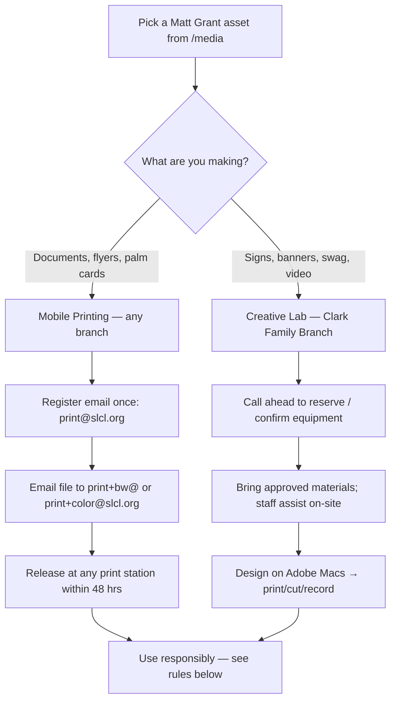

# Print & Produce at the St. Louis County Library

A supporter-facing guide for turning Matt Grant campaign graphics into physical materials — flyers,
palm cards, yard-window signs, banners, swag, and video content — using the St. Louis County
Library's mobile printing service and creative lab, for little more than the cost of materials. It
covers **what to print, how to print it, and how to use it responsibly and legally.**

> **Compliance note (educational, not legal advice):** Printed and broadcast campaign materials are
> "public communications" and must carry the **"Paid for by Matt Grant for Congress."**
> disclaimer — our official assets already include it, so print them as-is and don't crop it off.
> Because the **supporter pays the library directly** for materials at pickup, this is the
> supporter's own volunteer activity, not a campaign expenditure. If the *committee* ever pays for
> prints or production, that's an expenditure/in-kind question for the treasurer and counsel —
> confirm before enabling committee-funded production.

> **⚠️ Not every branch has every machine.** Mobile printing works at **all** branch locations, but
> the high-tech **creative lab** (3-D printers, laser cutter, large-format printer, recording studio,
> etc.) is only at select branches. The **Clark Family Branch has the full creative lab.** Before
> heading to any other branch for a specific machine, **call (314) 994-3300 to confirm it's there.**

## Why print at the library

You don't need a campaign budget to make a difference — you need a library card. A yard-window sign
in your front window, a stack of palm cards at your church coffee hour, a banner at the farmers
market: these reach neighbors that no online ad ever will, and people trust a flyer handed to them by
someone they know.

- **It's nearly free.** Every cardholder gets **$5 in printing each month** (≈ 50 free black-and-white
  pages), and the big creative-lab machines charge only for materials.
- **It's professional.** The same 36"-wide banners, glossy posters, and custom T-shirts a print shop
  charges hundreds for — you make for the cost of paper or vinyl.
- **It makes you the campaign.** Every supporter who prints becomes a one-person field office. The
  rest of this guide shows you exactly what to make and how to use it the right way.

## How it flows

---

## Part 1 — What to print (from the campaign Media library)

Every asset below is a ready-to-print download on the campaign **Media page (`/media`)** — already
branded and already carrying the required disclaimer. Match the asset to the library output that fits:

| Campaign asset | Best library output | Use it for |
|---|---|---|
| **Palm cards / flyers** (the 16 marketing flyers) | Mobile print, color or B&W | Door-to-door, events, leave-behinds, community boards |
| **Yard / window sign** (print kit) | Large-format on **adhesive vinyl** or cardstock | Your home window, car window, supporter yards (with permission) |
| **"A New Standard of Service" banner** | Large-format on **Tyvek banner** | Booths, rallies, farmers markets, parades |
| **"Four Priorities" infographic** | Glossy or photo paper poster | Community boards, coffee-hour tables, group meetings |
| **Mailer** (print kit) | Color mobile print | Hand-delivery to neighbors, packets |
| **Social squares / stories** (1080×1080 / 1080×1920) | Color photo paper | Printed handbills, bulletin-board minis |
| **Logo / icons** | Cricut vinyl or T-shirt press | Stickers, T-shirts, totes, magnets |

> 💡 **Tip:** Save a set as a single PDF before sending to mobile print — it keeps page counts
> predictable and stays within your free $5 monthly credit.

---

## Part 2 — Mobile Printing (any branch)

Print everything in a packet for pennies a page, with your first **$5 each month free**.

### What it costs

| Item | Cost |
|---|---|
| Black & white | 10¢ per page |
| Color | 25¢ per page |
| Free monthly credit | **$5.00 per cardholder** (≈ 50 free B&W pages) |

You'll need a **St. Louis County Library card** and PIN. No card? Sign up free at any branch or at
[slcl.org](https://www.slcl.org).

### Step 1 — Set up your account (one time only)

1. Email **print@slcl.org** from your own email address.
2. You'll get a reply — click the link that says **"Click to register your email address."**
3. On the MyPrintCenter page that opens, enter your **library card number and PIN**.
4. Done — your email is now linked to your card.

### Step 2 — Send your documents to print

**Easiest way (by email):**
- **Black & white:** attach your file and email it to **print+bw@slcl.org**
- **Color:** email it to **print+color@slcl.org**
- Wait for the "ready for release" reply email.

**Or upload online:**
- Go to **[MobilePrint.slcl.org/MyPrintCenter](https://MobilePrint.slcl.org/MyPrintCenter/)**, log in
  with your card and PIN, and upload your files. You can preview, delete jobs, and check your free
  balance.

### Step 3 — Pick it up

- You have **48 hours** to grab your printout.
- At any branch, go to the **copier or print station**, log in with your **library card number**, and
  release your documents.

### Good to know

- Works from your **phone, laptop, or home computer**.
- Accepted files include **PDF, Word, Excel, PowerPoint, and images (JPG, PNG, GIF, TIFF)** — so every
  asset in the campaign Media library will print fine.
- Questions? Call **(314) 994-3300**.

---

## Part 3 — Make your own media (Creative Lab, Clark Family Branch)

The library's high-tech creative lab (sponsored by Object Computing Inc.) lets you design and produce
professional campaign materials for the cost of materials — and staff are there to help you use any of
it. Confirm equipment by branch before you go; the **Clark Family Branch has it all.**

### Big-impact signage

- **Large-format posters & banners** — The **HP DesignJet Z9+** prints up to 36" wide on glossy paper,
  photo paper, **adhesive vinyl** (window/yard signs), and **durable Tyvek banner material** that holds
  up outdoors. *Priced per foot of length.*
- **Display graphics** — Adhesive matte polypropylene makes repositionable signs for doors, tables, and
  windows.

### Custom swag & handouts

- **T-shirts, totes & apparel** — The **Cricut Autopress™** applies heat-transfer designs to fabric.
  Pair it with the **Cricut Maker 3** to cut vinyl, cardstock, and iron-on lettering. *(2 machines;
  walk-in or reserve by phone for up to 2-hour sessions; bring your own approved materials.)*
- **Laser-cut signs & props** — The **Glowforge laser cutter** engraves and cuts ⅛" wood and acrylic —
  good for booth signage, badges, and display pieces. *(Materials only; bring approved materials.)*
- **3-D printed props & giveaways** — The **Creality K1 Max** prints models and custom objects.
  *($1 per 10g of filament; the library supplies the filament — you can't bring your own.)*

### Video & social content

- **On-camera recording** — A full **recording studio** with a **green screen wall**, **Blackmagic
  cameras**, and **SE Electronics mics** lets you film polished candidate videos, testimonials, and
  social clips, then key in any background.

### Design workstation

- **17 Mac computers (24" iMac 5K)** loaded with the **full Adobe Creative Suite** (Photoshop,
  Illustrator, Premiere, etc.) plus **Wacom and Huion drawing tablets** — design posters, flyers, and
  graphics on-site, then send them to the large-format printer.

### Cost & reservations summary

| Equipment | Cost | Reserve? |
|---|---|---|
| Large-format printer (HP DesignJet Z9+) | Per foot of print length | Confirm by branch |
| Cricut Maker 3 / Autopress | Materials only (bring approved) | Walk-in or call ahead; 2-hr sessions |
| Glowforge laser cutter | Materials only (bring approved) | Confirm by branch |
| Creality K1 Max (3-D) | $1 per 10g filament (library-supplied) | Confirm by branch |
| Recording studio + green screen | Free to use | Reserve recommended |
| Adobe Mac workstations | Free to use | Walk-in |

> 💡 **Plan ahead:** Always **call (314) 994-3300 first** to confirm a specific machine is at the branch
> you're visiting, and to reserve when possible.

---

## Part 4 — Use them responsibly ⭐

Printing is the easy part — using materials the right way protects you, your neighbors, and the
campaign. Follow these rules.

### Always

- **Keep the disclaimer.** Never crop or cover the **"Paid for by Matt Grant for Congress."** line.
  It's legally required on public campaign materials.
- **Get permission before posting.** Put yard and window signs only on **private property with the
  owner's OK** — your own home, or a supporter's, with their consent. Ask first, every time.
- **Be honest.** Share only Matt's published platform (the *Four Priorities* and the proposed CHILD
  Protection Act). Don't alter the art, add claims, invent quotes or numbers, or attack the opponent.
- **Be a good neighbor.** Take signs down promptly after the election, don't litter, and follow each
  library's facility rules when you print or produce on-site.

### Never

- **No public right-of-way.** Under **RSMo 227.220** and MoDOT policy, signs are illegal on state
  right-of-way — roadsides, shoulders, medians, and ditches next to main roads. MoDOT removes them,
  holds them 30 days, and you'd retrieve them from the local maintenance facility
  (1-888-ASK-MoDOT). It's also a safety and litter problem.
- **No public or government property.** No utility poles, traffic signs, street trees, schools, parks,
  or government buildings.
- **No electioneering at the polls.** On election day, keep all signs and literature **at least
  25 feet from the outer door nearest the polling place**, and never inside the building
  (**RSMo 115.637**). Check posted distances at your location — some sites mark a wider line.
- **Don't touch others' signs.** Never remove, cover, or deface anyone else's campaign signs — it's
  illegal and it reflects on us.

### Quick legality check by placement

| Where you want to post | OK? |
|---|---|
| Your own yard / window / car | ✅ Yes |
| A supporter's property, with permission | ✅ Yes |
| Approved community bulletin boards | ✅ Usually — ask the venue |
| Roadside, median, ditch, highway right-of-way | ❌ No (RSMo 227.220 / MoDOT) |
| Utility poles, street signs, public trees | ❌ No |
| Within 25 ft of a polling place door on election day | ❌ No (RSMo 115.637) |
| Anyone else's private property without asking | ❌ No |

> **Compliance staleness:** Missouri specifics above verified **June 18, 2026** against the Missouri
> Revisor of Statutes and MoDOT. A 2023 bill (HB 783) proposed widening the polling-place buffer to
> 100 ft but was **not enacted** — 25 ft remains current. Re-verify before each election and confirm
> any local ordinance with your municipality.
>
> Sources: [RSMo 115.637](https://revisor.mo.gov/main/OneSection.aspx?section=115.637) ·
> [RSMo 227.220 / MoDOT "Know Where They Go"](https://www.modot.org/node/11753) ·
> [RSMo 442.404 (resident political signs)](https://revisor.mo.gov/main/OneSection.aspx?section=442.404)

---

## Part 5 — Tear-off Quick-Start & Responsible-Use Checklist

*Print this page and keep it with your materials.*

**Get set up**
- ☐ I have a St. Louis County Library card and PIN
- ☐ I registered my email once at **print@slcl.org**
- ☐ I picked my assets from the campaign Media page (`/media`)

**Print / produce**
- ☐ Documents & flyers → emailed to **print+bw@** or **print+color@slcl.org**
- ☐ Signs, banners, swag, video → **called (314) 994-3300** to confirm equipment at the branch
- ☐ Picked up within **48 hours** (mobile print) / brought approved materials (creative lab)

**Before I post or hand out anything**
- ☐ The **"Paid for by Matt Grant for Congress."** line is intact
- ☐ I have the property owner's **permission** to post
- ☐ Nothing is on a **roadside / right-of-way / utility pole / public property**
- ☐ On election day, everything stays **25+ feet from the polling place door**
- ☐ I will **take signs down after the election** and never touch another campaign's signs

---

*This is educational information, not legal advice. Confirm any committee-funded printing or production
with the treasurer and a campaign finance attorney, and verify current Missouri election and sign laws
before each election.*
