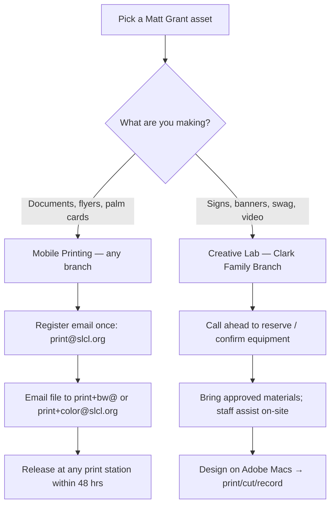

# Print & Produce at the St. Louis County Library

A supporter-facing guide for turning Matt Grant campaign graphics into physical materials — flyers,
yard-window signs, banners, swag, and video content — using the St. Louis County Library's mobile
printing service and creative lab, for little more than the cost of materials.

> **Compliance note (educational, not legal advice):** Printed and broadcast campaign materials are
> "public communications" and must carry the **"Paid for by the Matt Grant for Congress Committee."**
> disclaimer — our official assets already include it, so print them as-is and don't crop it off.
> Because the **supporter pays the library directly** for materials at pickup, this is the
> supporter's own volunteer activity, not a campaign expenditure. If the *committee* ever pays for
> prints or production, that's an expenditure/in-kind question for the treasurer and counsel —
> confirm before enabling committee-funded production.

> **⚠️ Not every branch has every machine.** Mobile printing works at **all** branch locations, but
> the high-tech **creative lab** (3-D printers, laser cutter, large-format printer, recording studio,
> etc.) is only at select branches. The **Clark Family Branch has the full creative lab.** Before
> heading to any other branch for a specific machine, **call (314) 994-3300 to confirm it's there.**

## How it flows

---

## Part 1 — Mobile Printing (any branch)

Print everything in a packet for pennies a page. Your first **$5 each month is free** with a
St. Louis County Library card.

### What it costs

| Item | Cost |
|---|---|
| Black & white | 10¢ per page |
| Color | 25¢ per page |
| Free monthly credit | **$5.00 per cardholder** (≈ 50 free B&W pages) |

You'll need a **St. Louis County Library card** and PIN. No card? Sign up free at any branch or at
[slcl.org](https://www.slcl.org).

### Step 1 — Set up your account (one time only)

1. Email **print@slcl.org** from your own email address.
2. You'll get a reply — click the link that says **"Click to register your email address."**
3. On the MyPrintCenter page that opens, enter your **library card number and PIN**.
4. Done — your email is now linked to your card.

### Step 2 — Send your documents to print

**Easiest way (by email):**
- **Black & white:** attach your file and email it to **print+bw@slcl.org**
- **Color:** email it to **print+color@slcl.org**
- Wait for the "ready for release" reply email.

**Or upload online:**
- Go to **[MobilePrint.slcl.org/MyPrintCenter](https://MobilePrint.slcl.org/MyPrintCenter/)**, log in
  with your card and PIN, and upload your files. You can preview, delete jobs, and check your free
  balance.

### Step 3 — Pick it up

- You have **48 hours** to grab your printout.
- At any branch, go to the **copier or print station**, log in with your **library card number**, and
  release your documents.

### Good to know

- Works from your **phone, laptop, or home computer**.
- Accepted files include **PDF, Word, Excel, PowerPoint, and images (JPG, PNG, GIF, TIFF)** — so every
  asset in the campaign Media library will print fine.
- Questions? Call **(314) 994-3300**.

> 💡 **Tip:** Save a packet as a single PDF before sending — it keeps page counts predictable and stays
> within your free monthly credit.

---

## Part 2 — Make Your Own Campaign Media (Creative Lab, Clark Family Branch)

The library's high-tech creative lab (sponsored by Object Computing Inc.) lets you design and produce
professional campaign materials for the cost of materials — and staff are there to help you use any of
it. Confirm equipment by branch before you go; the **Clark Family Branch has it all.**

### Big-impact signage

- **Large-format posters & banners** — The **HP DesignJet Z9+** prints up to 36" wide on glossy paper,
  photo paper, **adhesive vinyl** (window/yard signs), and **durable Tyvek banner material** that holds
  up outdoors in rain and sun. *Priced per foot of length.*
- **Display graphics** — Adhesive matte polypropylene makes repositionable signs for doors, tables, and
  windows.

### Custom swag & handouts

- **T-shirts, totes & apparel** — The **Cricut Autopress™** applies heat-transfer designs to fabric.
  Pair it with the **Cricut Maker 3** to cut vinyl, cardstock, and iron-on lettering. *(2 machines;
  walk-in or reserve by phone for up to 2-hour sessions; bring your own approved materials.)*
- **Laser-cut signs & props** — The **Glowforge laser cutter** engraves and cuts ⅛" wood and acrylic —
  good for booth signage, badges, and display pieces. *(Materials only; bring approved materials.)*
- **3-D printed props & giveaways** — The **Creality K1 Max** prints models and custom objects.
  *($1 per 10g of filament; the library supplies the filament — you can't bring your own.)*

### Video & social content

- **On-camera recording** — A full **recording studio** with a **green screen wall**, **Blackmagic
  cameras**, and **SE Electronics mics** lets you film polished candidate videos, testimonials, and
  social clips, then key in any background.

### Design workstation

- **17 Mac computers (24" iMac 5K)** loaded with the **full Adobe Creative Suite** (Photoshop,
  Illustrator, Premiere, etc.) plus **Wacom and Huion drawing tablets** — design posters, flyers, and
  graphics on-site, then send them to the large-format printer.

### Cost & reservations summary

| Equipment | Cost | Reserve? |
|---|---|---|
| Large-format printer (HP DesignJet Z9+) | Per foot of print length | Confirm by branch |
| Cricut Maker 3 / Autopress | Materials only (bring approved) | Walk-in or call ahead; 2-hr sessions |
| Glowforge laser cutter | Materials only (bring approved) | Confirm by branch |
| Creality K1 Max (3-D) | $1 per 10g filament (library-supplied) | Confirm by branch |
| Recording studio + green screen | Free to use | Reserve recommended |
| Adobe Mac workstations | Free to use | Walk-in |

> 💡 **Plan ahead:** Cricut machines can be reserved by phone (2-hour sessions). Staff will walk you
> through any tool — just ask. Always **call (314) 994-3300 first** to confirm a specific machine is at
> the branch you're visiting.

---

*This is educational information, not legal advice. Confirm any committee-funded printing or production
with the treasurer and a campaign finance attorney before proceeding.*
