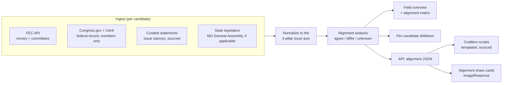

# Plan — Expand "Opposition Research" into a Field & Alignment Engine

Today `/dashboard/research` tracks **one** subject (the incumbent, bioguide `W000812`) by pulling
roll-call votes (House Clerk XML) and legislation (Congress.gov). This plan expands it into a
**multi-candidate field engine** that ingests *every* candidate in the MO-02 August 4, 2026 primary
— Republican and Democratic — and reframes the page from "find the weakness" to **"find the common
ground."** Because Missouri runs an **open primary** (a registered voter takes either party's ballot
without pre-registering by party), persuadable Democrats and unaffiliated voters can pull a
Republican ballot. The strategic goal: surface, on the public record, the issues where opponents and
their supporters *already agree with Matt*, so the campaign can build coalitions and earn support —
including from competitors who exit the race.

> **Guardrails (non-negotiable, inherited from `CLAUDE.md` + `candidate/contrast-positioning.md`).**
> Primary-source only. Every factual claim about any candidate carries a `source_url`. No fabricated
> or paraphrased quotes. No invented positions, endorsements, or numbers. We never editorialize a
> candidate's character — we describe a *sourced public position*. "Alignment" is computed only from
> cited statements/votes; absence of a source = "unknown," never an inference. This is strategy and
> data tooling, not legal advice — election counsel confirms disclaimers before anything is published.

---

## 1. The core reframe: alignment, not attack

The four issue axes are Matt's own pillars (faithful to `platform.md`): **family-court reform**,
**term limits**, **smaller government**, **lower taxes**. For each opponent we record a *sourced*
stance per axis. Agreement on an axis = a **bridge**; disagreement = a **contrast**; no source =
**unknown** (excluded from scoring). The headline metric is each candidate's **bridge count** — how
much common ground exists — which doubles as a coalition-priority ranking.

## 2. Data model

A `Candidate` record (the "field") replaces the single hard-coded bioguide:

| Field | Purpose | Source / notes |
|---|---|---|
| `slug`, `name`, `party`, `primary` (`R`/`D`), `incumbent` | identity | config-driven; campaign curates the roster |
| `bioguideId?` | federal record key | only sitting/former members (e.g., the incumbent) |
| `fecCandidateId?` | FEC linkage | **every** federal candidate has one → universal money coverage |
| `stateLegId?` | MO General Assembly key | only those who held state office |
| `website?` | statement provenance | campaign issue pages, press |

The roster is **config-driven, not fabricated**: `loadField()` reads `RESEARCH_FIELD_JSON` (a JSON
array the campaign populates as candidates file) and seeds only the one already-known real entry, the
incumbent. We do **not** invent opponent names, positions, or numbers — the engine ships empty and
fills as sourced data is curated.

Four data sources, by coverage:

- **FEC API** (`api.open.fec.gov`) — universal. Receipts, disbursements, cash-on-hand, individual
  vs. PAC mix, committees. Works for incumbent and challengers alike.
- **Congress.gov + House Clerk** (existing) — members only. Generalized from one bioguide to N.
- **Curated statements** — the heart of *alignment*. Each `Statement` = `{candidateSlug, issueId,
  stance, summary, quote?, sourceUrl, retrievedAt, sourceType}`, hand-entered from public issue
  pages / press / questionnaires. This is where non-incumbents' positions live.
- **State legislative** — MO General Assembly votes/bills for opponents who held state office
  (uneven coverage; treated as a curated/manual source where no clean API exists).

## 3. Complex analysis → unique insights

The `alignment` library computes, deterministically and from sourced data only:

1. **Per-candidate alignment vector** — stance on each of the 4 axes vs. Matt; `bridges`,
   `contrasts`, `unknowns`; an **alignment score** = agreements ÷ known-stance axes; a **confidence**
   = count of sourced datapoints.
2. **Field alignment matrix** — candidates × 4 axes, color-coded agree/differ/unknown. The
   at-a-glance picture of where the whole field stands relative to Matt.
3. **Coalition priority ranking** — candidates sorted by bridge count × confidence: *whose
   supporters are most persuadable*, and *which exiting competitor is most endorsable*.
4. **Shared-ground brief per candidate** — the specific sourced agreements to lead with when
   courting that candidate or their voters; the contrasts to acknowledge honestly.
5. **Money context** (FEC) — viability and donor base per candidate, to weight where coalition
   effort pays off.

Every insight links to its `source_url`; "unknown" is shown as unknown, never guessed.

## 4. Scripts & media generated from the API

`/api/research/alignment` returns the computed analysis as JSON — the substrate for:

- **`/api/research/script`** — a **templated, sourced** coalition/outreach script for a chosen
  candidate: opens on the shared pillars (with citations), names contrasts honestly, ends with a
  common-ground ask. Deterministic templating from `platform.md` + the candidate's *cited* stances —
  **no generative fabrication of positions or quotes.**
- **`/api/research/graphic`** — an `ImageResponse` "common ground" share card: candidate name, the
  axes where they align with Matt (checkmarks), the alignment score, and a "sourced public
  statements" footer. Reuses the existing `/api/graphics` branding system.

## 5. Page expansion (`/dashboard/research`)

- **Field overview** (index) — candidate cards (party chip, bridge count, alignment score, FEC
  cash-on-hand), the alignment matrix, and the coalition-priority ranking. Keeps the existing
  "primary-source only / cite the source" notice and `last ingest` status.
- **Per-candidate drilldown** (`/dashboard/research/[slug]`) — identity + FEC money, federal record
  (votes/bills, members only), statements grouped by issue (each with `source ↗`), the alignment
  readout, and links to the generated script + share card.

## 6. Build phases

1. **Model + sources** — issue axes, candidate registry, FEC client, statements module, store + PK
   additions.
2. **Analysis + ingest** — alignment library; field-ingest orchestrator; generalize the ingest route.
3. **Surfaces** — alignment/script/graphic API routes; field overview + drilldown pages.
4. **Curate + verify** — populate `RESEARCH_FIELD_JSON` and statements from sourced public material;
   set `FEC_API_KEY`; run ingest; election-counsel review of any public-facing output.

## 7. Operational prerequisites (not code)

- `FEC_API_KEY` (free at api.data.gov; `DEMO_KEY` works for testing at low rate limits).
- `RESEARCH_FIELD_JSON` — the curated candidate roster, updated as candidates file with the FEC/MO SOS.
- Curated `Statement` entries — sourced public positions; this is ongoing research labor, by design.
- Existing `CONGRESS_GOV_API_KEY`, `CRON_SECRET`, `DYNAMODB_TABLE` continue to gate the federal record + ingest.

> **EDUCATIONAL / NONPARTISAN DISCLAIMER:** This document describes campaign data-tooling for
> informational and strategic purposes. It is not legal advice. All candidate data is drawn from
> public primary sources and must be cited; nothing here authorizes fabricating positions, quotes,
> endorsements, or numbers. Consult election counsel before publishing any candidate comparison.
