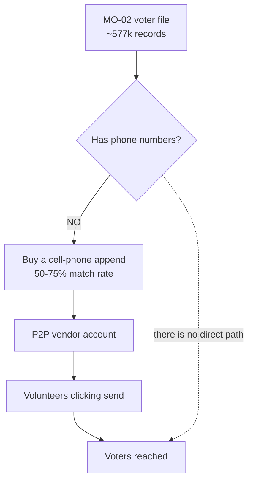

# Peer-to-peer texting — scope, cost, and volunteer load

A scoping brief for reaching MO-02 voters who never opted in to campaign texts, in the eight days before the **August 4, 2026** primary. Peer-to-peer (P2P) texting is the legitimate path to the voter file — a human presses send on every message, so the autodialer consent rule does not attach the same way a broadcast blast does. This prices the full stack, counts the volunteer hours honestly, and names the two prerequisites the campaign does not currently have: **phone numbers, and about a thousand dollars.**

- **Campaign:** Matt Grant for Congress (FEC C00945394) · **Race:** U.S. House, MO-02 · primary Aug 4, 2026
- **Prepared:** July 27, 2026 · **Status:** Draft v0.1 — scoping only, no vendor contacted

> **Educational information, not legal advice.** The claim that P2P platforms are not autodialers is a
> contested legal position, not a settled safe harbor — it has been litigated and turns on whether the
> platform *genuinely* requires human action per message. State law may add requirements beyond the TCPA.
> Verified July 27, 2026. **Have counsel review the specific platform and script before launch.**
> All dollar and hour figures below are **illustrative planning estimates** built from secondary sources —
> not quotes, not predictions. Get live vendor pricing before committing.

---

## 1. The blocker nobody has priced

**The voter file contains no phone numbers.** `voter-file-plan.md` §"NOT in the file" and `twilio-fund-plan.md` §2 both state it plainly. P2P texting needs phone numbers, so the campaign must first **buy a cell-phone append** — matching voter records to cell numbers through a data vendor.

That is a purchase, a delay, and a match-rate haircut, all before the first message. It is the single most-missed line item in P2P planning.

### Do not route appended phones through this app

The Twilio pipeline is deliberately walled off from the voter file — enforced in code by `web/lib/sms/audiences.voterfile-isolation.test.ts`. Appended numbers must live **entirely on the P2P vendor's side**. Any attempt to load them into the consent ledger to "make the broadcast work" defeats the isolation on purpose and puts the toll-free number at risk. P2P is a parallel program, not an extension of this one.

---

## 2. Vendors — and a partisan-fit warning

Several of the best-known P2P platforms are explicitly progressive-aligned and may decline a Republican primary campaign. **Confirm client eligibility before doing any other work.**

| Vendor | Pricing (illustrative) | Fit for this campaign |
|---|---|---|
| **RumbleUp** | Not published — request a quote | **Best fit.** The leading platform in the Republican/conservative space; used by the RNC and major GOP campaigns |
| **CallHub** | Affordable, nonpartisan | Viable; widely used in the political space |
| **SlickText** | Broadcast + P2P | Viable; serves campaigns across parties |
| **Scale to Win** | ~$0.02 / outbound segment, pay-as-you-go | Cheapest listed, but **progressive-aligned** — verify they'll take the account |
| **GetThru (ThruText)** | $0.035 / segment, $0.06 MMS, $100 setup | **Progressive-aligned** — same caveat |
| **Spoke** | Open source; you pay Twilio + hosting | Cheapest in theory, but needs engineering time the campaign does not have in eight days |
| **~~Hustle~~** | — | **Defunct.** Acquired by Civic Shout and shut down. Do not pursue |

**Start with RumbleUp.** It is the only one on this list with deep GOP roots, and partisan fit is a gating question, not a preference.

---

## 3. The cost stack — illustrative, at 12,000 voters reached

Costs compound across three layers. Modeled to reach ~12,000 voters, which needs ~20,000 records submitted for append at a conservative 60% match rate.

| Layer | Basis | Illustrative cost |
|---|---|---|
| Cell-phone append | 20,000 records × ~$0.02 | **$400** |
| Initial messages | 12,000 × ~$0.03/segment | **$360** |
| Reply handling | ~15% reply × 2 segments × ~$0.03 | **$110** |
| Platform setup | One-time | **$100** |
| **Total** | | **~$970** |
| **Effective cost per voter reached** | | **~$0.08** |

That ~$0.08 all-in figure matches the independently reported $0.08–$0.11 range for top vendors once append costs are folded in — a useful cross-check that the model isn't optimistic.

### Scaling

| Voters reached | Records to append | Illustrative total |
|---|---|---|
| 5,000 | ~8,300 | ~$450 |
| **12,000** | ~20,000 | **~$970** |
| 21,000 (Tier 1 + Tier 3) | ~35,000 | ~$1,650 |
| 39,000 (full contact universe) | ~65,000 | ~$3,050 |

Tier counts come from `strategic-plan.md` §2 and are labeled **PLACEHOLDER** there — recompute against the real voter file before committing money.

---

## 4. The volunteer load — the part that sinks schedules

P2P is human-powered by legal design. That is the whole point, and it is the whole cost.

Volunteers send **60–120 initial messages per hour** once reply management is factored in. Batch-send features push the raw send rate higher, but replies arrive over the following **24–48 hours** and are where the real time goes.

At 12,000 initial messages, using 90/hour as the midpoint:

| Task | Basis | Hours |
|---|---|---|
| Initial sends | 12,000 ÷ 90/hr | **~133** |
| Reply handling | ~1,800 conversations ÷ ~30/hr | **~60** |
| **Total volunteer-hours** | | **~190** |

Over eight days that is **~24 volunteer-hours per day**. In 3-hour shifts: **8 shifts a day, ~65 shifts total** — realistically **15–25 volunteers each working 2–3 shifts**, recruited, trained, and scheduled starting now.

**Replies do not respect the shift schedule.** A voter who answers at 9pm expects a response, and unanswered conversations are worse than no contact — they read as a campaign that doesn't listen. Staff the reply queue past the send window or cut the send volume to match the capacity that actually exists.

---

## 5. The eight-day timeline

| Days | Work | Risk |
|---|---|---|
| **Jul 28–29** | Vendor selection, eligibility confirmation, contract, account provisioning | Vendor may decline or take days to provision numbers |
| **Jul 28–30** | Order phone append; receive and QC the file | 1–3 business days; match rate may come in under 60% |
| **Jul 29–31** | Recruit, train, schedule volunteers; counsel reviews script | Volunteer recruitment is the long pole |
| **Jul 31–Aug 3** | Send window — early-vote push, then GOTV | Only **4 days** of actual texting |
| **Aug 4** | Election Day chase; polls close 7pm | Reply staffing must run all day |

Setup consumes roughly half the remaining time. This is doable, but only if the money and the vendor decision happen **today or tomorrow** — every day of delay comes off the send window, not the setup.

---

## 6. Recommendation

**P2P is the right tool and the wrong week — unless money appears immediately.**

The program needs **~$970 minimum** against a Twilio balance of **$46.35**. That makes this a fundraising question before it is an operations question. Nothing else in this brief matters until roughly a thousand dollars exists for it.

If the money does appear:

1. **Call RumbleUp first** — partisan fit is the gating question, and a "no" from the progressive-aligned vendors costs a day.
2. **Order the append the same day.** It is the long pole with a hard dependency on everything downstream.
3. **Recruit volunteers in parallel, not after.** 15–25 people is a real ask; start before the vendor is signed.
4. **Scope to reply capacity, not to budget.** Sending more than the volunteer bench can answer is worse than sending less.

If the money does not appear, the ranked alternatives are in [`sms-reach-final-week.md`](./sms-reach-final-week.md): send the early-vote push to the opted-in list today, and run the eight-day opt-in sprint so August 4's chase reaches a larger list at broadcast rates.

---

## See also

- [`sms-reach-final-week.md`](./sms-reach-final-week.md) — all three reach paths priced against the current balance
- [`twilio-fund-plan.md`](./twilio-fund-plan.md) — the TCPA wall and why the voter file is not textable
- [`voter-file-plan.md`](./voter-file-plan.md) — what the MO-02 file does and does not contain
- [`strategic-plan.md`](./strategic-plan.md) — the tier definitions behind the universe sizes

---

**Sources** (secondary; verify with vendors before budgeting):
[GetThru pricing](https://www.getthru.io/getthru-pricing-campaigns) ·
[Scale to Win vs. Hustle comparison](https://suttonsmart.com/political-consulting/scale-to-win-vs-hustle-which-p2p-texting-tool-is-better-in-2026/) ·
[Best P2P platforms for political campaigns](https://politicalcomms.com/blog/best-p2p-texting-platforms-campaigns/) ·
[Political texting services compared](https://voterping.com/best-political-texting-services) ·
[Political texting spending, 2026 FEC data](https://voterping.com/info/political-texting-spending-2026) ·
[CallHub P2P throughput](https://callhub.io/platform/peer-to-peer-texting/) ·
[Voter data append pricing](https://dmdatasource.com/voter-data-appends.php)
