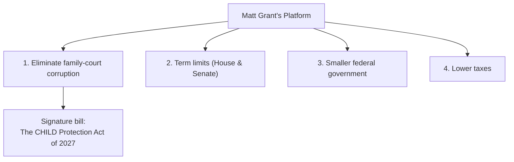

# Matt Grant — Platform

Matt Grant's campaign platform for the **U.S. House of Representatives, Missouri — District 2 (MO-02)**, in the **August 4, 2026 primary**. This file documents his four stated priorities and his signature proposed legislation, the CHILD Protection Act of 2027. These are Matt's own published positions, presented faithfully; do not add, expand, or invent positions, statutes, legal claims, or numbers beyond what appears here.

---

## The Four Priorities

### 1. Eliminate corruption in the family court system

Matt's top priority is to eliminate corruption in the family court system. This is the cause at the center of his candidacy and the focus of his signature proposed legislation (below).

### 2. Term limits for the House and Senate

Matt supports term limits for both the U.S. House and the U.S. Senate, applied with a **grandfather clause**.

### 3. A smaller federal government

Matt calls for a smaller federal government, achieved through measures such as a **hiring freeze** and **early-retirement packages** for federal employees.

### 4. Lower taxes

Matt supports lower taxes, achieved by **reducing fraud, waste, and the number of government employees** rather than by other means.

---

## Signature Legislation: The CHILD Protection Act of 2027

Matt proposes **The CHILD Protection Act of 2027**. The acronym CHILD stands for **C**orruption **H**iding **I**nside **L**egal **D**ockets.

The proposal calls for **federal oversight that ties Title IV-D federal grant money to state family-court compliance** — using the federal grant program as the lever for accountability in state family courts.

### Related public record

Matt has been publicly active on this issue. A published press release (linked here; do not paraphrase or fabricate its body) is titled:

- "Whistleblower Attorney Matthew Grant Challenges Corruption in Family Courts with RICO Filing in Federal Court" — <https://www.prlog.org/13118162-whistleblower-attorney-matthew-grant-challenges-corruption-in-family-courts-with-rico-filing-in-federal-court.html>

---

## How the priorities connect

Matt's identity — *a neighbor, a dad, and a problem-solver* who is *running for Congress to put Missouri's children first* — ties the four priorities together: family-court reform protects children and families; term limits, a smaller government, and lower taxes reflect a belief in accountable, leaner public service. *Matt does not just talk, he takes action.*

For messaging derived from these priorities, see `candidate/strategic-plan.md` (Messaging Pillars) and the messaging modules in `messaging/`.

---

> **EDUCATIONAL / NONPARTISAN DISCLAIMER:** This document describes Matt Grant's own stated campaign positions for informational purposes. It is not legal advice and is not an analysis or endorsement of those positions. The underlying skill is a nonpartisan campaign toolkit; it documents the candidate's platform faithfully and does not editorialize. Descriptions of any proposed legislation reflect the candidate's stated intent, not enacted law. For authoritative legal or compliance guidance, consult a qualified attorney or the relevant agency.
