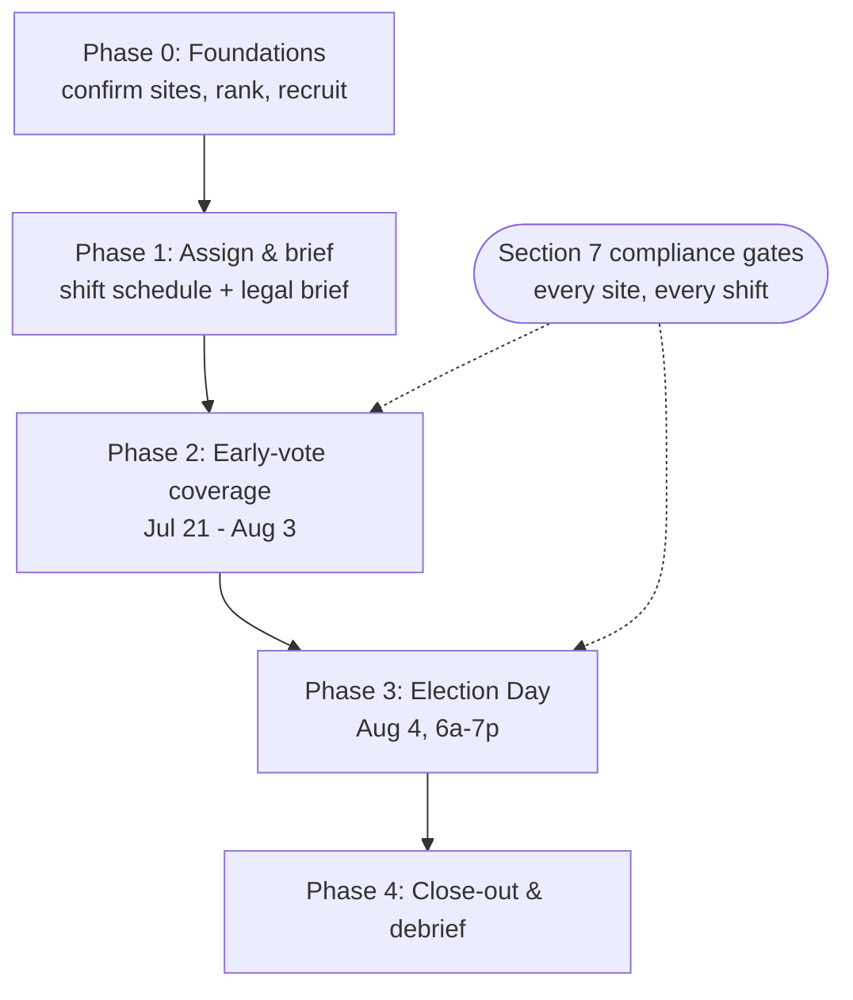

# Poll Coverage — Election-Day & Early-Vote Field Plan

A single source of truth for **staffing the physical voting sites** in MO-02 for the **August 4, 2026
Republican primary** — who greets voters at which early-vote site and precinct poll, how coverage is
prioritized and staffed, and how volunteers stay legal at the line. This is the *field-coverage*
companion to the sign plan: the sign plan decides **where signs go**; this plan decides **where
people go**. It is **not** an election-protection or poll-watching legal guide — for ballot-integrity
roles, credentialed watchers/challengers, and incident law, use `../tactics/election-protection.md`
and confirm credentialing with the election authority.

- **Campaign:** Matt Grant for Congress (FEC C00945394) · **Race:** U.S. House, MO-02 · Republican primary
- **Election Day:** Tuesday, August 4, 2026 (polls 6:00 AM – 7:00 PM)
- **Owner:** _[field director]_ · **Last updated:** _[date]_ · **Status:** Draft v0.1

> **Educational information, not legal advice.** This plan summarizes public election rules for
> operational planning. Rules on electioneering distance, poll watching, and site conduct are enforced
> by the election authority and can change — consult an election-law attorney or your election
> authority for guidance specific to your situation. Compliance specifics are in §7 with a
> verification date and sources.

---

## 1. Purpose & how to use

Coverage at the polls does two jobs: a friendly **greeter presence** (a last, personal reminder to
vote Grant, outside the legal buffer) and **operational eyes** (line length, problems, "are our signs
still standing?"). For a low-turnout August primary the scarce resource is **people-hours**, so this
plan concentrates them where confirmed voters actually are: the **designated early-vote sites** across
~14 days first, then the **highest-propensity precinct polls** on Election Day. Work the phases in
order; §7 (compliance) gates everyone who stands at a site.

---

## 2. Key dates

Verified **July 10, 2026** against `absentee-voting-guide.md` and the Missouri SOS / local authority
calendar. **Re-verify with your election authority before relying on any date** (see §7).

| Date | Milestone | Coverage implication |
|---|---|---|
| ~June 23 → Jul 20, 2026 | **Excuse-based** in-person absentee (open now, at election-authority offices) | Deliberately light-touch: see the scope note below |
| **Mon, July 21, 2026** | No-excuse in-person absentee **opens** | Early-vote-site coverage window begins (Phase 2) |
| **Mon, Aug 3, 2026 (5:00 PM)** | No-excuse in-person absentee **closes** | Last early-vote coverage day |
| **Tue, Aug 4, 2026** | **Election Day**, polls **6:00 AM – 7:00 PM** | Full precinct-poll coverage (Phase 3) |

> **Scope note — the already-open excuse-based window (≈Jun 23–Jul 20).** Voters with a statutory
> excuse are already voting in person at the handful of election-authority offices (BOE St. Ann +
> the four rural County Clerk offices). This plan deliberately does **not** staff standing greeters
> there: the volume is a trickle compared to the no-excuse window, volunteer-hours are the scarce
> resource, and daily presence at a government office lobby earns little. Instead, Phase 0 site
> visits double as light coverage (confirm signage/site rules while you're there), and full
> coverage begins when volume does — July 21.

> The July 8 voter-registration deadline has passed — coverage effort is turnout of already-registered
> voters, not registration. Early-vote / library site **designations and hours** are set by the local
> election authority; confirm the operative list with the **St. Louis County Board of Election
> Commissioners** (`stlouiscountymovotes.gov`) and each rural county clerk.

---

## 3. The district (staff all of it)

MO-02 under the **2025 enacted map** (operative for Aug 4, 2026) is the **St. Louis County portion of
the district plus Jefferson, Washington, Crawford, and Gasconade counties** — **St. Charles, Franklin,
and Warren are not in MO-02**. *(Source: `data-and-map-plan.md`, `captain-field-plan.md`.)* This is a
**multi-county** race: budget greeters and captains for the four rural counties (coverage there is at
each **County Clerk's office** for early voting), not only the STL County suburbs.

---

## 4. Coverage model

Prioritize sites the same way the sign plan scores locations — reuse that ranking so signs and people
land at the same high-value places.

| Priority | Where | Why |
|---|---|---|
| **1. Early-vote sites** (Phase 2) | Designated no-excuse in-person locations + rural county-clerk offices | ~14 days of confirmed voters at the decision point — highest people-hour ROI |
| **2. High-propensity precinct polls** (Phase 3) | Top precinct polls by R-primary propensity (reuse the sign plan's precinct scoring) | Election-Day turnout is concentrated; cover the precincts that decide the race |
| **3. High-traffic precinct polls** | Large / high-turnout precincts | Volume of impressions + presence |

**Staffing math (illustrative — replace with real capacity):** a covered site needs at least one
greeter during peak windows (before-work ~6–9 AM, lunch, after-work ~4–7 PM on Election Day; site
open/close on early-vote days). Estimate `greeter-shifts = covered_sites × peak_windows × redundancy`,
then match against volunteer capacity per captain; a site with **no assignable volunteer is "uncovered"**
and drops in priority — don't promise coverage you can't staff (the same serviceability discipline as
the sign plan).

> **Shipped July 10, 2026 — the shift board.** Dashboard → Field → **Poll shifts**
> (`/dashboard/coverage/shifts`) runs this model live: it generates the site × day × window schedule
> (early-vote windows Jul 21–Aug 3, Election-Day peak windows on Aug 4; window labels are editable —
> real site hours still come from each election authority), assigns greeters per shift from the
> captain/volunteer roster, computes the §8 fill metrics, and prints per-greeter shift packets carrying
> the §7 conduct rules plus an honest unfilled-shifts recruiting page (Phase 1's deliverable). Sites
> pre-fill from the Signs tool's saved `site` locations, so signs and people target the same places.
> An unstaffed shift shows **uncovered** — the board never hides a gap. The board can also **text
> each assigned greeter a shift reminder** (one message per person per day): consent-gated (opted-in
> numbers only, STOP honored), sent only 9am–8pm CT, logged to the campaign inbox, and deduped so a
> re-run only reaches newly added assignees. Captains are texted at the number from their own
> "My text alerts" opt-in (self-service — never entered by an admin); a captain without one is
> reported as skipped rather than guessed. Volunteers can also **take open shifts themselves** on
> the supporter hub (`/community`): signed-in volunteers see upcoming under-staffed windows, claim
> one (or drop one they can't make), and the field board updates instantly — self-service fills
> the schedule between captain assignments.

---

## 5. Phase overview

| Phase | Window | Focus | Owner |
|---|---|---|---|
| **0. Foundations** | Now → Jul 18 | Confirm sites + hours, rank, recruit greeters | _[ ]_ |
| **1. Assign & brief** | Jul 15–20 | Turf + shift schedule per captain; legal briefing | _[ ]_ |
| **2. Early-vote coverage** | Jul 21–Aug 3 | Greeters + sign checks at early-vote sites | _[ ]_ |
| **3. Election Day** | Aug 4 | Precinct-poll coverage 6 AM–7 PM + sweeps | _[ ]_ |
| **4. Close-out** | Aug 4–5 | Pull materials, debrief, archive | _[ ]_ |

---

## 6. Phases in detail

### Phase 0 — Foundations
- **Do:** confirm the operative early-vote sites + hours (STL County BOE + rural clerks); rank
  precinct polls by propensity (reuse the sign plan's scoring); recruit greeters against §4 staffing.
- **Output:** ranked site list; greeter roster.
- **Done when:** each priority-1/2 site has a candidate greeter and a captain owner.

### Phase 1 — Assign & brief
- **Do:** cut turf by captain; build the shift schedule (peak windows, redundancy); run the **legal
  briefing** (§7) so every greeter knows the 25-ft rule and site conduct.
- **Output:** per-captain shift packet (site, shifts, volunteers, the §7 one-pager).
- **Done when:** every covered shift has a named, briefed volunteer.

### Phase 2 — Early-vote coverage (Jul 21 – Aug 3)
- **Do:** greeters at designated early-vote sites during open hours (outside the buffer, §7); each
  shift also does a **sign check** (are our signs standing / legal?) and reports line/problem notes.
- **Output:** daily coverage + sign-standing report per captain; incident log.
- **Done when:** all priority-1 sites covered + reported daily through Aug 3.

### Phase 3 — Election Day (Aug 4)
- **Do:** greeters at target precinct polls 6 AM–7 PM (staff the peak windows hardest); midday + close
  check-ins; escalate any voter-access problem to the election authority / legal line (see
  `../tactics/election-protection.md`).
- **Output:** Election-Day coverage map; incident log.
- **Done when:** target precinct polls covered through 7 PM.

### Phase 4 — Close-out
- **Do:** pull campaign materials, thank + debrief volunteers, archive the incident log.
- **Done when:** materials collected, debrief captured, records filed.

---

## 7. Compliance — read before any shift

> **Educational information, not legal advice.** Consult an election-law attorney or the election
> authority for guidance specific to your situation.

- **Stay ≥ 25 feet from the polling place.** No electioneering — no campaigning, no handing out
  literature, no wearing/holding candidate material — **within 25 feet of the outer door nearest the
  polling place, and never inside the building** (**RSMo 115.637**). Some sites mark a wider line;
  obey the posted distance and the election judge on site.
- **Early-vote window nuance (verified July 10, 2026):** the statutory 25-ft buffer is an
  **Election-Day polling-place** rule; there is currently **no statutory electioneering buffer during
  the no-excuse absentee window** (HB 783's proposal to add one was not enacted). At an early-vote
  site, the **property owner / election authority's premises rules govern** — and this campaign
  **voluntarily applies the same 25-ft discipline there anyway.** Posted site rules always win.
- **Greeting ≠ poll watching.** This plan covers *greeters/volunteers outside the buffer*. Official
  **poll watchers / challengers** are a distinct, credentialed role governed by Missouri law and the
  parties/election authority — do **not** improvise it. Route that to
  `../tactics/election-protection.md` for the general program, but be aware that guide is the
  **nonpartisan generic playbook** — **Missouri-specific credentialing (who appoints, deadlines,
  forms) is not documented in this repo.** Arrange watcher/challenger appointments through the
  county party committee and confirm with the election authority **well before** July 21.
- **Don't obstruct or intimidate.** Never block entrances, follow voters, film voters, or challenge
  anyone's right to vote. Voter intimidation is illegal. A greeter's job is a friendly reminder, then
  space.
- **Signs at the poll** follow the sign rules — see `sign-placement-plan.md` §9 (25-ft buffer,
  no right-of-way, permission). Don't touch or move other campaigns' signs.
- **Materials carry the disclaimer.** Any literature handed out (outside the buffer) must show
  **"Paid for by Matt Grant for Congress."**
- **Report, don't confront.** Log problems (long lines, machine issues, access barriers) and escalate
  to the election authority / campaign legal contact; don't argue at the line.

> **Compliance staleness:** the **25-ft** electioneering buffer (RSMo 115.637) was verified
> **July 10, 2026** against the campaign's existing reference
> (`library-print-and-produce-guide.md`, verified June 18, 2026) and the Missouri Revisor of Statutes
> (a 2023 bill, HB 783, proposed widening it to 100 ft but was **not enacted**). Poll-watching /
> challenger credentialing and any local site rules change — **re-verify with your election authority
> before Election Day.**
>
> Sources: [RSMo 115.637](https://revisor.mo.gov/main/OneSection.aspx?section=115.637) ·
> St. Louis County Board of Election Commissioners — `stlouiscountymovotes.gov`.

---

## 8. Roles & metrics

| Role | Owns |
|---|---|
| **Field director** _[ ]_ | Site ranking, coverage go/no-go, the legal briefing |
| **Captains** | Their zone's shift schedule, assignments, daily coverage + sign-standing report |
| **Greeter volunteers** | Their shift: friendly turnout reminder outside the buffer; report line/issues |
| **Legal / EP contact** _[ ]_ | Poll-watcher credentialing, incident escalation (`../tactics/election-protection.md`) |

**Metrics:** % of priority-1 early-vote sites covered daily (target 100%); % of target precinct polls
covered on Aug 4; peak-window fill rate; incidents logged + escalated; zero buffer/conduct violations.

---

## 9. Risks & mitigations

| Risk | Mitigation |
|---|---|
| Volunteer electioneers inside 25 ft | §7 briefing + posted-line check every shift; captains spot-check |
| Greeting drifts into intimidation/obstruction | Clear "reminder then space" rule; report-don't-confront; EP contact on call |
| Improvised "poll watching" without credentials | Explicitly out of scope here; route to election-protection + authority appointment |
| Rural counties under-covered | Multi-county staffing plan (§3); county-clerk-office coverage, not just STL suburbs |
| Coverage promised but unstaffed | Serviceability discipline (§4) — an unstaffable site is "uncovered," not covered |

---

## 10. See also

- [`sign-placement-plan.md`](./sign-placement-plan.md) — where signs go (the physical-presence companion; shares site scoring + the 25-ft rule).
- [`../tactics/election-protection.md`](../tactics/election-protection.md) — ballot integrity, credentialed poll watchers/challengers, incident law (the legal side this plan defers to).
- [`../tactics/ballot-chase-program.md`](../tactics/ballot-chase-program.md) — tracking + chasing absentee/early ballots.
- [`../workflows/gotv-plan.md`](../workflows/gotv-plan.md) — the broader Get-Out-The-Vote operation this coverage plugs into.
- [`absentee-voting-guide.md`](./absentee-voting-guide.md) — verified 2026 dates + early-vote sites.
- [`captain-field-plan.md`](./captain-field-plan.md) — captain zones + the operative 2025 MO-02 map.
