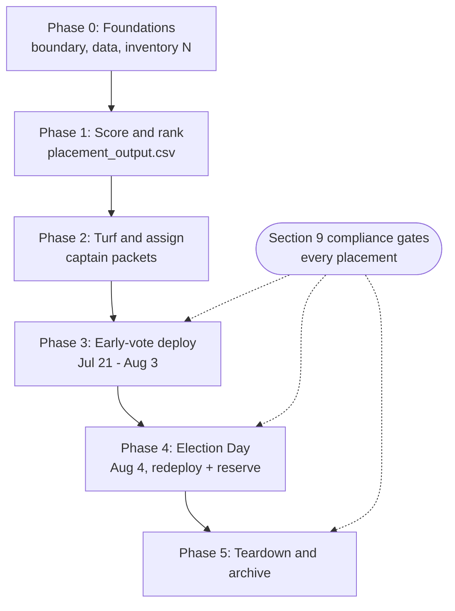

# Sign Placement — Master Plan

A single source of truth for where Matt Grant for Congress places yard, corridor, and polling-place
signs in **MO-02** for the **August 4, 2026 Republican primary** — who places and maintains them, how
inventory is scored and allocated across the early-vote and Election-Day windows, and the compliance
rules that govern every placement. Work the phases top to bottom; each has an owner, inputs, outputs,
and a done-check. Data schemas and the scoring model are §7–§8. **Compliance is §9 — read it before
placing a single sign.**

- **Campaign:** Matt Grant for Congress (FEC C00945394) · **Race:** U.S. House, MO-02 · Republican primary
- **Election Day:** Tuesday, August 4, 2026 (polls 6:00 AM – 7:00 PM)
- **Owner:** _[campaign manager / field director]_ · **Last updated:** _[date]_ · **Status:** Draft v0.2

> **Educational information, not legal advice.** This plan summarizes election and sign rules for
> operational planning. It is not legal advice. Consult a campaign finance / election-law attorney or
> the relevant election authority for guidance specific to your situation. Compliance specifics are in
> §9 with a verification date and sources.

---

## 1. Purpose & how to use

Signs do two jobs: build **name ID** (impressions on high-traffic corridors) and signal **momentum /
social proof** (clusters in high-propensity neighborhoods). This plan optimizes a fixed sign inventory
for **exposure to likely R-primary voters** across two windows — the ~2-week early-vote period and
Election Day — while staying inside the law and never placing a sign no volunteer can maintain.

**How to use:** work Phases 0→5 in order. Confirm the §3 open items first; they gate everything
downstream. When a number in this plan is labeled *illustrative*, it is a placeholder for planning
structure — replace it with real campaign data before you act on it.

---

## 2. Key dates & deadlines

Verified **July 10, 2026** against the repo's `candidate/absentee-voting-guide.md` and the Missouri
Secretary of State / local election-authority calendar. **Re-verify against your local election
authority before relying on any date** — see §9 for sources and staleness.

| Date | Milestone | Notes |
|---|---|---|
| **Wed, July 8, 2026** | Voter registration deadline | **PASSED** — the job now is turnout, not registration |
| **Mon, July 21, 2026** | No-excuse in-person absentee voting **opens** | ~2-week captive-audience window at designated sites begins |
| **Wed, July 22, 2026 (5:00 PM)** | Mail absentee **application** received-by deadline | For voters using a mailed ballot (excuse required by mail) |
| **Mon, Aug 3, 2026 (5:00 PM)** | No-excuse in-person absentee voting **closes** | Last business day before Election Day |
| **Tue, Aug 4, 2026** | **Election Day** | Polls **6:00 AM – 7:00 PM**; voted ballots received-by 7:00 PM (no postmark rule, no drop boxes) |
| **Aug 5 → per-municipality deadline** | Sign teardown window | **Varies by municipality** — e.g., some St. Louis County cities require removal within ~10 days; state right-of-way signs are removed on sight. Confirm each municipality's deadline (see §9). |

> No-excuse in-person absentee voting is offered only at **designated locations** chosen by the local
> election authority — confirm which sites (including library branches) qualify, and their hours, with
> the **St. Louis County Board of Election Commissioners** (`stlouiscountymovotes.gov`) and each rural
> county clerk before deploying.

---

## 3. Assumptions & open items

Clear these before geocoding or deploying. Several are resolved below from verified repo data; still
confirm the operative specifics with the election authority.

- [ ] **District boundary confirmed for the operative Aug 4, 2026 map.** MO-02 was **redrawn in 2025**;
      the new map spans the **St. Louis County portion plus Jefferson, Washington, Crawford, and
      Gasconade counties**. **St. Charles, Franklin, and Warren are *not* in MO-02** under this map.
      *(Source: `candidate/data-and-map-plan.md`; `candidate/captain-field-plan.md`.)* Confirm the
      final **precinct list** before geocoding any location — a sign outside the district is wasted.
- [ ] **This is a multi-county district, not just St. Louis County.** Budget sign inventory and
      captains for the four rural counties, not only the STL County suburbs.
- [ ] **Library / early-vote site designations confirmed** with the St. Louis County Board of Election
      Commissioners and each rural county clerk: which sites are early-vote, Election-Day-only, or
      unused, and their hours.
- [ ] **Voter-propensity source identified:** real R-primary propensity scores vs. a past-turnout
      proxy. **Label any proxy data clearly** in outputs (this plan does not invent propensity values).
- [ ] **Sign inventory count (N)** known and split across phases (§6, Phase 0).
- [ ] **Volunteer & captain rosters** populated (§7 schemas), with maintenance capacity per captain.

---

## 4. Strategy in one paragraph

For a low-turnout August primary, the highest per-sign ROI is usually the **designated early-vote
sites**, because they deliver ~14 days of exposure to *confirmed* voters at the moment of decision.
Fund those first, then **high-AADT corridors** (name ID), then **residential clusters** in
high-propensity precincts (social proof) — and **never place a sign no volunteer can maintain**
(serviceability is a factor in the score, not an afterthought). Because MO-02 now includes four rural
counties, split inventory so the rural vote share isn't ceded; corridor signs carry more of the load
where residential density is low.

---

## 5. Phase overview

Windows are sequential (each phase consumes the previous one's outputs) and account for the
election authorities being closed over the weekend of Jul 11–12 — Phase 0's confirmations need
business days. Everything still lands before early voting opens Jul 21.

| Phase | Window | Focus | Owner |
|---|---|---|---|
| **0. Foundations** | Now → Tue Jul 14 | Confirm boundary, data, inventory (authority calls Mon–Tue) | _[ ]_ |
| **1. Data & scoring** | Wed Jul 15 – Thu Jul 16 | Build ranked location list (needs Phase 0's outputs) | _[ ]_ |
| **2. Field org & turf** | Fri Jul 17 – Mon Jul 20 | Captains, volunteers, turf packets | _[ ]_ |
| **3. Early-vote deploy** | Jul 21–Aug 3 | Signs at early-vote / library sites | _[ ]_ |
| **4. Election Day** | Aug 4 | Redeploy to precinct polls + reserve | _[ ]_ |
| **5. Teardown & close-out** | Aug 4 → deadline | Remove signs, compliance archive | _[ ]_ |



---

## 6. Phases in detail

### Phase 0 — Foundations
- **Inputs:** repo data, Secretary of State / county election-authority contacts.
- **Do:** confirm the operative boundary + precinct list; confirm early-vote / library designations;
  count sign inventory (N); split N across phases. **Illustrative split** (replace with real numbers):
  ~30–40% corridor, ~50–60% residential, ~5–10% Election-Day reserve — with **early-vote sites funded
  first off the top**.
- **Output:** confirmed precinct list; `polling_sites.csv` seeded.
- **Done when:** every §3 checkbox is cleared.

### Phase 1 — Data & scoring
- **Inputs:** MoDOT AADT (traffic counts), precinct propensity/turnout, `polling_sites.csv`.
- **Do:** hard-filter candidates (in-district, permission obtainable, buffer-legal), then score and rank
  every surviving location (§8); allocate by phase/type. **Don't rank by hand — use the scorer tool**
  built for this plan (see §8.6): POST the locations CSV to the campaign dashboard's
  `/api/dashboard/signs/placement` endpoint and it returns the ranked `placement_output.csv`,
  hard filters applied, with dropped locations listed at the bottom with reasons.
- **Output:** `placement_output.csv` (ranked, allocation-ready).
- **Done when:** every ranked location is in-district and typed (corridor / residential / site).

### Phase 2 — Field org & turf
- **Inputs:** `volunteers.csv`, `captains.csv`, `placement_output.csv`.
- **Do:** cut turf by captain zone; assign each location + a servicing volunteer to a captain; flag any
  location with no volunteer coverage as **"needs host"** (and down-weight it — see `serviceability`).
- **Output:** one **turf packet** per captain (locations, volunteers, maintenance list).
- **Done when:** every Phase-3/4 location has a captain and a servicing volunteer.

### Phase 3 — Early-vote deployment (Jul 21 – Aug 3)
- **Do:** place signs at designated early-vote / library sites, **respecting §9 buffers, property
  permission, and right-of-way rules**; daily maintenance sweep by assigned volunteers.
- **Output:** placement log; a daily "signs standing" report per captain.
- **Done when:** all designated sites are covered and maintained through Aug 3.

### Phase 4 — Election Day (Aug 4)
- **Do:** at poll open, redeploy early-vote signs to precinct polling places; deploy the reserve;
  place **outside the 25-ft electioneering buffer** (§9); run midday + close maintenance sweeps.
- **Output:** Election-Day placement map; incident log (removals / thefts).
- **Done when:** target precinct polls are covered 6 AM – 7 PM.

### Phase 5 — Teardown & close-out
- **Do:** remove **all** signs within each municipality's post-election window (§9); reconcile
  inventory; archive compliance records (permissions, placement/incident logs).
- **Output:** teardown confirmation; compliance archive.
- **Done when:** zero signs remain past any deadline; records are filed.

---

## 7. Data schemas

```csv
# volunteers.csv
id,name,home_lat,home_lng,captain_id,capacity,can_host,availability,notes
V001,Jane Doe,38.5842,-90.4066,C01,15,true,"weekends","corner lot; high-visibility yard"
```

```csv
# captains.csv
id,name,zone_name,zone_precincts,contact,sign_inventory
C01,Maria Lopez,"Chesterfield-West","STL-042;STL-043;STL-058",maria@example.com,250
```

> `captains.csv` is a **sign-ops projection** of the campaign's canonical captain roster — keep
> the real slate in [`../tools/captain-roster.md`](../tools/captain-roster.md) (archetypes, roles,
> co-captains, pipeline targets) and derive this file's rows from it; don't maintain two rosters.

```csv
# polling_sites.csv
name,lat,lng,site_type,is_library,days_active,hours,in_district,buffer_verified,property_permission,notes
"Daniel Boone Library",38.6031,-90.5673,early_vote_and_eday,true,14,"M-Sat 9-5",true,false,false,"confirm designation w/ STL Co BOE"
```

```csv
# placement_output.csv  (generated by the Phase 1 scoring pass / the §8.6 tool)
rank,name,lat,lng,type,tier,captain_id,assigned_volunteer,score,precinct,aadt,notes
1,"Daniel Boone Library",38.6031,-90.5673,site,A,C01,V001,0.94,"STL-042",,"14-day captive audience"
```

> `tier` is the A/B/C **priority band** within each scoring family (top 40% by rank → A, next 30%
> → B, rest → C) — fund tier A first. `rank` is the deploy order: all sites first (early-vote
> funded off the top of N), then corridor/residential. Hard-filtered locations appear at the
> bottom with a blank rank and a `DROPPED: <reasons>` note — that's the audit trail.

**Field notes.** `buffer_verified` and `property_permission` are **hard gates** — a `false` on either
means the location is *not* deployable until cleared (see §9). Keep the columns honest: they are the
audit trail. All lat/lng and the illustrative rows above are placeholders.

---

## 8. Scoring model

Two families of candidates are scored on different value bases, then allocated **within their type**
(corridor/residential vs. voter-contact site) so the two scales aren't compared head-to-head. **All
weights and factor ranges below are illustrative planning placeholders** — calibrate them to real
campaign data before use.

### 8.0 Hard filters (run first — a candidate must pass all)
A location is scored **only if** it is: (1) **in-district** (operative precinct list), (2) **legally
placeable** (outside the polling-place buffer for its use, not on right-of-way/public property — §9),
and (3) **permission-obtainable** (private property with an identified owner willing to host). Anything
failing a filter is dropped, not scored.

### 8.1 Corridor / residential (impressions + social proof)
```
location_score = AADT_normalized          # traffic exposure, 0-1 (min-max or percentile over candidates)
               × primary_propensity_index  # R-primary likelihood of the surrounding precinct, 0-1 (label proxy!)
               × visibility_factor         # sightline quality, 0-1 (see rubric)
               × serviceability            # can a volunteer maintain it? 0.5-1.0 (nearby capacity)
```

### 8.2 Polling / early-vote / library (voter contact)
```
site_score = voter_contact_value          # relative worth of reaching deciding voters at the site, 0-1
           × days_active                   # 14 for early-vote sites, 1 for Election-Day-only  (dominant term)
           × visibility_factor
           × serviceability
```

### 8.3 Factor definitions (illustrative rubrics)
- **AADT_normalized** — MoDOT Annual Average Daily Traffic for the road segment, normalized 0–1 across
  the candidate set (percentile is more robust than min-max when a few highways dominate).
- **primary_propensity_index (0–1)** — from a real R-primary propensity model if available; otherwise a
  **clearly-labeled** past-primary turnout proxy for the precinct. Never invent scores.
- **visibility_factor (0–1)** — e.g. `0.4` low (obstructed, high speed, sign clutter) → `1.0` high
  (corner lot, clear sightline, moderate speed, intersection dwell time).
- **serviceability (0.5–1.0)** — driven by volunteer capacity near the location. A site with **no host
  volunteer floors at 0.5** and is flagged "needs host"; strong coverage → `1.0`. This is what stops
  the plan from placing signs no one can stand back up.
- **voter_contact_value / days_active** — early-vote sites earn their top rank from `days_active = 14`:
  ~14 days of exposure to confirmed voters at the decision point. Election-Day-only sites get `1`.

### 8.4 Allocation & tie-breakers
1. Fund **early-vote / library sites first** (Phase 3), off the top of N.
2. Then allocate remaining N by type per the Phase-0 split (corridor vs. residential), **rank-ordered
   within type** by score.
3. **Tie-breakers:** higher `serviceability` wins (maintainable > flashy), then higher
   `primary_propensity_index`, then lower cost/effort to service.
4. Reserve the Election-Day set (Phase 4) before exhausting inventory on early-vote corridors.

### 8.5 Worked example (illustrative)
`Daniel Boone Library` — early-vote+E-Day site: `voter_contact_value 0.9 × days_active(norm) × visibility 0.9 × serviceability 1.0` → top-ranked (tier A), because 14 days of confirmed-voter exposure beats a one-day poll or a corridor impression. Numbers are placeholders.

### 8.6 The scorer tool (don't rank by hand)

This model is implemented in the campaign web app (`web/lib/signs/placement.ts` — unit-tested,
pure). **The easiest way to run it is the dashboard page: Dashboard → Field → Signs
(`/dashboard/signs`)** — paste the locations CSV (starting from
[`early-vote-sites-seed.csv`](./early-vote-sites-seed.csv) if you don't have one yet — see its
companion [`early-vote-site-verification-checklist.md`](./early-vote-site-verification-checklist.md)
before flipping any of its gates) and optionally the captains CSV to get the
ranked deploy list, the dropped-with-reasons audit table, per-captain turf packets with
inventory/span flags, and the `placement_output.csv` download, all in the browser (nothing is
uploaded). For scripts, the same pipeline is exposed as an endpoint:

```bash
# From a machine with a signed-in dashboard session cookie:
curl -X POST https://YOUR_DOMAIN/api/dashboard/signs/placement \
  -H "content-type: text/csv" --data-binary @polling_sites.csv \
  -o placement_output.csv
```

- Hard filters (§8.0) apply automatically; dropped locations appear at the bottom of the download
  with a `DROPPED: <reasons>` note (the audit trail).
- Raw MoDOT `aadt` counts are normalized across the candidate set automatically; you may supply a
  pre-normalized `aadt_norm` column instead. Missing factors default to neutral values.
- Per-captain turf packets (§6 Phase 2) run on the **Signs page** too — paste the captains CSV
  alongside the locations and the page renders each captain's packet with over-inventory /
  over-span flags and a "needs host" list (`allocateToCaptains`).

**Two live sources are wired in, and both are honest about their limits.** The page auto-loads
the real, active captain roster (from the volunteer/staff system) so turf packets work with zero
CSV typing — a pasted captain row with the same `id` still overrides it. A **"Load live
Election-Day polling places"** button pulls the county's real, MO-02-clipped GIS feed of polling
sites straight into the scorer. That feed is Election-Day-only — it carries **no early-vote or
satellite-site designation at all** — and it can't confirm the 25-ft electioneering buffer or
property permission, so every live-loaded row lands in the dropped/audit table until a staffer
verifies it on-site and re-adds it with `buffer_verified`/`property_permission` set true. Early-vote
site selection still requires a manual call to the St. Louis County BOE and the rural county
clerks — no feed automates that step.

---

## 9. Compliance — read before placing a single sign

> **Educational information, not legal advice.** Consult a campaign finance / election-law attorney or
> the relevant election authority for guidance specific to your situation.

Every placement must pass **all** of the rules below. When in doubt, don't place it — get permission or
move it. This section mirrors and does not supersede
[`library-print-and-produce-guide.md`](./library-print-and-produce-guide.md) (Part 4), which the
production team already follows.

### 9.1 At the polls — the electioneering buffer
- **Keep all signs and literature at least 25 feet from the outer door nearest the polling place, and
  never inside the building** (**RSMo 115.637**). Some sites mark a **wider** line — obey the posted
  distance, and confirm the measurement point with the election judge on site.
- **Early-vote window nuance (verified July 10, 2026):** the statutory 25-ft buffer is an
  **Election-Day polling-place** rule. There is currently **no statutory electioneering buffer during
  the no-excuse in-person absentee window** — a 2023 bill (HB 783) proposed adding one but was not
  enacted. What governs at an early-vote site is the **property owner / election authority's own
  rules** for their premises. This campaign **voluntarily applies the 25-ft discipline during early
  voting anyway** (good-neighbor posture + posted site rules always win). Confirm each site's rules
  with the authority before deploying.
- The election authority controls the polling site (often a school, church, or public building);
  **placement there is at their direction**, on top of the 25-ft rule.

### 9.2 Right-of-way & public property — never
- **No public right-of-way.** Under **RSMo 227.220** and MoDOT policy, signs are **illegal on state
  right-of-way** — roadsides, shoulders, medians, and ditches next to main roads. MoDOT removes them,
  holds them ~30 days, and you retrieve them from the local maintenance facility (1-888-ASK-MoDOT).
- **Local right-of-way is also restricted.** In **St. Louis County (unincorporated)**, signs may not be
  in the public right-of-way; the county asks the resident to relocate within ~24 hours, then removes
  and stores the sign. Municipal right-of-way rules vary — assume "no" unless a municipality says
  otherwise in writing.
- **No public / government property:** no utility poles, traffic signs, street trees, schools (except
  as the polling authority directs), parks, or government buildings.

### 9.3 Private property — permission every time
- **Yard, window, and residential signs go only on private property with the owner's explicit
  permission** — your own home or a supporter's, asked first, every time. Log the permission.
- Missouri protects a resident's right to display political signs on their own property (**RSMo
  442.404**), but HOAs and municipalities **may** impose *reasonable* limits on size, number, and how
  many days before/after the election a sign may stand — they generally **cannot** ban them outright.
  Confirm any HOA covenant or municipal ordinance for the specific property.
- **Don't touch others' signs.** Never remove, cover, or deface anyone else's campaign signs — stealing
  or defacing a campaign sign is itself an offense under **RSMo 115.637**. (Use the incident log for
  our own signs that go missing.)

### 9.4 Municipal ordinances vary — check each one
MO-02 spans many municipalities plus four counties. **Size limits, number limits, how early a sign may
go up, and the post-election removal deadline all vary by municipality** (for example, some St. Louis
County cities require removal within ~10 days of the election; others differ). Before deploying in a
municipality, confirm its sign ordinance and record the **removal deadline** in the placement log so
Phase 5 can hit it. Do not rely on a single district-wide number.

### 9.5 The FEC disclaimer
- Public campaign signs must carry the committee's disclaimer, verbatim: **"Paid for by Matt Grant for
  Congress."** Never crop or cover it (11 CFR 110.11).
- A narrow FEC exception exists for **small items** (e.g., buttons, pins, bumper stickers) or where a
  disclaimer is **impracticable**; whether any sign qualifies is a legal judgment — **confirm with
  counsel** before omitting the disclaimer on any item.

### 9.6 Content integrity
- Use only Matt's **published platform** (the Four Priorities and the proposed CHILD Protection Act).
  Do not alter approved art, add claims, invent quotes/numbers, or attack the opponent on a sign.

> **Compliance staleness:** Missouri specifics in §9 verified **July 10, 2026** against the campaign's
> already-verified reference (`library-print-and-produce-guide.md`, verified June 18, 2026) and the
> Missouri Revisor of Statutes / MoDOT. A 2023 bill (HB 783) proposed widening the polling-place buffer
> to 100 ft but was **not enacted** — 25 ft remains current. **Municipal ordinances and site
> designations change; re-verify with each municipality and your election authority before each
> deployment.**
>
> Sources: [RSMo 115.637](https://revisor.mo.gov/main/OneSection.aspx?section=115.637) ·
> [RSMo 227.220 / MoDOT "Know Where They Go"](https://www.modot.org/node/11753) ·
> [RSMo 442.404 (resident political signs)](https://revisor.mo.gov/main/OneSection.aspx?section=442.404) ·
> St. Louis County Board of Election Commissioners — `stlouiscountymovotes.gov`.

---

## 10. Roles & responsibilities

| Role | Owns |
|---|---|
| **Field director** _[ ]_ | The plan end-to-end; boundary/data sign-off; inventory split; go/no-go per phase |
| **Data lead** _[ ]_ | Geocoding, AADT + propensity inputs, the Phase-1 scoring pass, `placement_output.csv` |
| **Captains** (`captains.csv`) | Their zone: turf packets, assigning locations to volunteers, daily "signs standing" report |
| **Host volunteers** (`volunteers.csv`) | Placing + maintaining their assigned signs; reporting thefts/removals |
| **Compliance reviewer** _[ ]_ | §9 sign-off before deploy; per-municipality ordinance + removal-deadline log; disclaimer check |

---

## 11. Metrics & reporting

- **Coverage:** % of designated early-vote sites covered (target 100% by Jul 21); % of target precinct
  polls covered on Aug 4.
- **Maintenance:** daily "signs standing" rate per captain (placed vs. still up).
- **Loss:** signs lost to theft/weather/removal (incident log) — informs the Election-Day reserve size.
- **Compliance:** zero right-of-way / buffer violations; 100% of private placements with logged
  permission; teardown completed within every municipality's deadline.

---

## 12. Risks & mitigations

| Risk | Mitigation |
|---|---|
| Signs placed outside the operative (2025) district | Hard-filter on the confirmed precinct list before scoring (§8.0); don't score anything unconfirmed |
| Right-of-way / buffer violation (removal, bad press) | §9 gates + `buffer_verified`/`property_permission` columns; compliance sign-off before deploy |
| Signs placed but not maintained | `serviceability` factor floors un-hosted sites; "needs host" flag; daily captain sweeps |
| Rural counties under-served | Explicit multi-county inventory split (§4); corridor-weighting where density is low |
| Missed teardown deadline (fines) | Per-municipality removal deadline captured in the placement log; Phase 5 driven off it |
| Proxy propensity mistaken for real data | Label proxy data clearly in every output (§3, §8.3) |

---

## 13. Appendix — checklists

**Before placing (per location):** in-district ✓ · legal placement (buffer / not right-of-way) ✓ ·
private property with logged permission ✓ · disclaimer intact ✓ · assigned to a captain + host ✓.

**Election Day (per poll):** placed ≥25 ft from the nearest polling door ✓ · outside the building ✓ ·
election-judge direction followed ✓ · midday + close sweep scheduled ✓.

**Teardown (per municipality):** removal deadline known ✓ · all signs down by deadline ✓ · inventory
reconciled ✓ · permission/incident logs archived ✓.

---

## 14. See also

- [`library-print-and-produce-guide.md`](./library-print-and-produce-guide.md) — sign production +
  the Part 4 "responsible use" compliance rules this plan mirrors.
- [`captain-field-plan.md`](./captain-field-plan.md) — captain zones + the operative 2025 MO-02 map.
- [`data-and-map-plan.md`](./data-and-map-plan.md) — district composition, geocoding, targeting data.
- [`absentee-voting-guide.md`](./absentee-voting-guide.md) — verified 2026 dates + early-vote sites.
- [`early-vote-sites-seed.csv`](./early-vote-sites-seed.csv) — an 11-site seed for the Signs page's
  locations CSV, sourced from `absentee-voting-guide.md`'s verified site list.
- [`early-vote-site-verification-checklist.md`](./early-vote-site-verification-checklist.md) — the
  call script + tracker for clearing the seed CSV's `buffer_verified`/`property_permission` gates.
