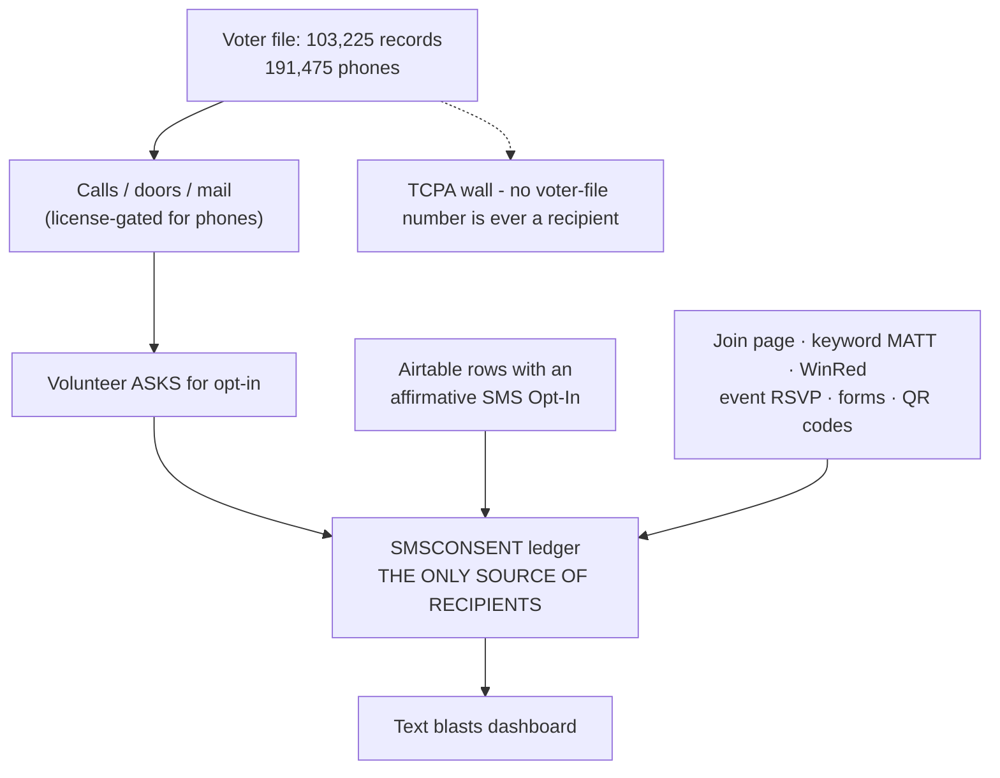

# SMS Blast Readiness — Making the Dashboard a Real Channel

How the **Text blasts** dashboard (`/dashboard/sms`) goes from technically working to actually
worth sending, and what that can and cannot look like before the August 4, 2026 primary. The
dashboard is not broken: credentials are present, templates render, RBAC works, quiet hours and the
FEC disclaimer are enforced automatically. It has one problem, and it is not a software problem —
**the textable list is 8 people**, growing at 0.2/day.

- **Campaign:** Matt Grant for Congress (FEC C00945394) · **Race:** U.S. House, MO-02 · primary Aug 4, 2026
- **Channel:** Twilio Messaging Service (SMS), toll-free +1 844-314-7912 · **Ledger:** `web/lib/sms/consent.ts`
- **Baseline measured:** 2026-07-27 via `npm run sms:preflight` — 8 opted in · 0 opted out · 0 scored · enrichment never run

> **Educational information, not legal advice.** The TCPA (prior express consent for broadcast
> texting), FEC disclaimer rules (52 USC 30120 / 11 CFR 110.11), RSMo §115.157 (voter-list use), and
> carrier policy referenced here were reviewed **2026-07-27** for operational planning. Consult an
> election-law or telecom attorney before changing how the list is built or used.

---

## 1. The one thing that cannot change

Broadcast recipients come exclusively from the `SMSCONSENT` ledger. The 103,225 voter-file records
loaded on 2026-07-27 (191,475 phone numbers) **cannot be added to it**, by any route, including a
CSV import into the dashboard.

This is not a preference or a policy the campaign chose to be cautious:

| Constraint | Where |
|---|---|
| TCPA requires prior express consent before an automated text to a cell phone | `messaging/sms-texting.md:173` |
| Statutory damages run **$500–$1,500 per message** — at 103,225 recipients that is existential for the committee | — |
| "**SMS** \| Consent ledger ONLY \| Never from the voter file. No exceptions" | `candidate/voter-file-plan.md` §2.3 |
| Enforced in code — the build fails if any voter-file surface is referenced under `lib/sms/` | `web/lib/sms/audiences.voterfile-isolation.test.ts` |
| "Never buy or upload numbers. Grow the list only through the opt-in paths." | `web/docs/sms-operator-runbook.md:238` |

The voter file's role in SMS is **aiming and recruiting**, never supplying recipients. Everything
below is about growing the ledger legitimately and fast.



---

## 2. Phase 0 — Confirm the dashboard can send at all (today, ~20 min)

`sms:preflight` reports "Credentials: all present" but explicitly **cannot** check the one gate that
silently kills every send.

| Step | Where | Why |
|---|---|---|
| **Toll-Free Verification reads `Verified`** | Twilio console → the 844-314-7912 number | Hard gate. Unverified sends fail at the carrier with **error 30032**. Nothing in the app can override it (`app/dashboard/sms/go-live/page.tsx`) |
| Inbound webhook wired | `/dashboard/sms/go-live` | STOP/HELP/keyword handling — without it, opt-outs are not honored, which is its own violation |
| Drain schedule running | `/dashboard/sms/go-live` | The queue only sends when the drain cron runs |
| Send a staff test | `/dashboard/sms` → test to your own number | Confirms the whole path end to end before any real send |

**If verification is not `Verified`, stop here.** Everything downstream is wasted until it clears,
and verification is not instant — this is the first thing to check today, not the last.

---

## 3. Phase 1 — Recover consent you already have (today, highest leverage)

**This is the single most valuable action in this plan**, and it is the only one that could produce
a step change rather than a trickle.

Some surfaces captured a mobile number under an explicit opt-in but never wrote the consent ledger —
so people who genuinely said yes have never been reachable. `scripts/backfill-sms-consent.ts` sweeps
them in.

It is safe by construction: **dry run by default**, and it "NEVER manufactures consent — a row is
swept only when its `SMS Opt-In` is literally true AND its phone normalizes to E.164." Idempotent,
so re-running is a no-op. It preserves the original consent date.

```bash
cd web
# Dry run — reports what WOULD be written, writes nothing.
AIRTABLE_API_KEY=... DYNAMODB_TABLE=matt-grant AWS_REGION=us-east-1 \
  GAMES_LEAD_BASE_ID=app... GAMES_LEAD_TABLE_ID=tbl... \
  npm run backfill:sms-consent

# Then, if the counts look right:
... npm run backfill:sms-consent -- --apply
```

Sources swept: Airtable **game leads** and the **Volunteers roster**, each requiring an affirmative
`SMS Opt-In` on the row.

**The dry-run number is the decision point for this entire plan.** It is unknown until it runs — do
not assume it is large, and do not assume it is zero. Run it before committing time to anything else.

---

## 4. Phase 2 — Switch on every legitimate opt-in surface (48 hours)

The ledger stamps a `source` on every opt-in, and `lib/reports/optinGrowth.ts` already has labels for
fourteen of them. Today only two have ever fired. Each dormant row below is a place a supporter
would have said yes and was never asked.

| Source tag | Label | Status today | Action |
|---|---|---|---|
| `join-form` | Join page | **Live** — 7 of 8 | Link it from every page footer, email signature, and social bio |
| `sms-keyword` | Text keyword | **Live** — 1 of 8 | Put "**Text MATT to 844-314-7912**" on signs, literature, slides, and every social post |
| `winred` | WinRed donors | Dormant | Confirm the `sms_opt_in` checkbox is present and visible on the donate page |
| `event-rsvp` | Event RSVP | Dormant | Add the opt-in checkbox to RSVP forms |
| `web-form` / `issue-topic` | Contact / Issue forms | Dormant | Add the checkbox to both |
| `games-lead` | Game opt-in | Dormant in ledger | Covered by the Phase 1 backfill |
| `staff-optin` | Staff | Dormant | Every staffer, captain, and volunteer who wants texts — ask directly |
| `csv-import` | CSV import | Dormant | **Only** for sign-up sheets carrying written consent. Never the voter file |

**Required opt-in language** (`web/docs/sms-operator-runbook.md:192-213`), use verbatim:

> Text me campaign updates. Msg & data rates may apply; reply STOP to opt out.

Consent cannot be a condition of donating (`messaging/sms-texting.md:173`).

---

## 5. Phase 3 — Convert field contact into consent (the whole 8 days)

This is where the voter file legitimately feeds SMS, and it is the **only** bridge between them:
a volunteer contacts a voter by phone or at the door, and **asks**. A yes goes in the ledger.

- **Doors and phones** — add one line to every script: *"Can we text you a reminder about the
  August 4 primary?"* If yes, capture the number with the opt-in language above.
- **QR code to the join page** on every door hanger, yard-sign card, and literature piece.
- **Events** — the keyword on every slide and sign-in sheet.

Volunteer P2P scripts live in `messaging/sms-texting.md` §9, reachable via `/textscript`.

> **Gate G2 still open.** Using the vendor's 191,475 phone numbers for *calls* requires written
> confirmation that the license permits political phone contact for this committee
> (`candidate/voter-registry-refresh-plan.md` §2). Doors, mail, and the QR route need no such gate
> and can start immediately.

---

## 6. Phase 4 — Aim it (only once the list justifies aiming)

The vendor overlay is already ingested: 103,225 rows, 100% carrying primary history, across 651
precincts. It is **not yet joinable** — `VOTERAGG` is empty, so the official Sunshine-law voter file
has never been loaded into this table, and enrichment reads overlay rows by the *spine's* precinct
keys (`lib/reports/smsEnrichmentRun.ts:95`).

**Do not load the spine to fix SMS targeting.** It is a second large ingest whose only SMS payoff is
tagging however many rows the ledger holds. At 8 rows, and plausibly at a few hundred, **send to
`all` and skip targeting entirely** — every preset segment currently reads 0 because nothing is
enriched.

Revisit when the ledger is in the low thousands, or when the spine gets loaded for field reasons
(walk lists, turf, call sheets) — at which point `npm run enrich:sms` turns on the `pp:` chips and
the `primary-regular` / `primary-plan` / `primary-lapsed` templates for free.

---

## 7. What this realistically achieves by August 4

Stated plainly so the campaign can allocate against it rather than hope:

- **Phase 1 (backfill) is the only step that can produce a step change**, and its size is unknown
  until the dry run reports.
- Phases 2–3 compound slowly. At a 0.2/day baseline, surfaces and field asks plausibly move that to
  single- or double-digits per day — meaningful for a general election, modest in eight days.
- **SMS will not reach 103,225 people by August 4.** No compliant path does. Those records are a
  call, door, and mail universe, and that is where the volume lives this cycle.
- What this plan does deliver: a **legitimately working blast channel**, a list that compounds
  instead of sitting at 8, and every send correctly disclaimed, quiet-houred, and opt-out-honored.

Per-send discipline, every time (`npm run sms:preflight`):

- **Completion ETA** — at ~30/min inside the 9am–8pm CT window, a send that starts late finishes the
  *next day*. On Aug 4 that means arriving after polls close.
- **Opt-out rate** — under ~2% healthy · 2–5% review targeting and frequency · over ~5% stop and
  diagnose.

---

## 8. Verification

| # | Check | Pass looks like |
|---|---|---|
| 1 | Twilio console | Toll-Free Verification reads **Verified** |
| 2 | `/dashboard/sms` staff test | Test text arrives with disclaimer + STOP |
| 3 | `npm run backfill:sms-consent` (dry run) | A real count of already-consented rows |
| 4 | `npm run backfill:sms-consent -- --apply` | Ledger grows by that count |
| 5 | `npm run sms:preflight` | "Opted in (textable)" is materially above 8 |
| 6 | Any real send | Opt-out rate under 2%; completion ETA inside the window |
| 7 | `npx vitest run lib/sms/audiences.voterfile-isolation.test.ts` | **Passes.** The wall holds |

Check 7 runs in CI on every commit. If it ever fails, a voter-file surface has reached the SMS
pipeline — stop and revert before sending anything.
