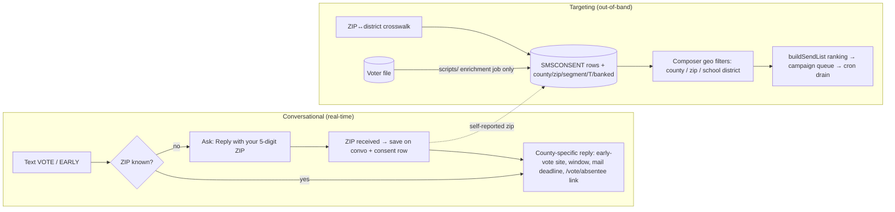

# SMS Conversational Interface Plan — Geo-Aware Early-Vote Agent (County / ZIP / School District)

This plan upgrades the campaign's SMS program from one-way keyword replies to a geo-aware conversational interface on the toll-free number **+1 844-314-7912**, so a supporter who texts us gets early-vote guidance specific to their county, ZIP code, and (later) school district — and so broadcasts can be targeted by those same dimensions without ever touching the voter-file TCPA wall. It is grounded in an audit of the shipped SMS stack (`web/lib/sms/*`, `web/app/api/webhooks/twilio/`), the voter data engine (`web/lib/voters/*`, `web/lib/reports/smsTargeting.ts`), and the governing docs (`candidate/sms-targeting-plan.md`, `candidate/twilio-fund-plan.md`, `candidate/voter-file-plan.md`, `candidate/absentee-voting-guide.md`, `messaging/sms-texting.md`). It also covers the immediate deliverable: the early-vote announcement broadcast for the July 21 – August 3 no-excuse window.

> **Date check (verified via web search July 20, 2026).** No-excuse in-person absentee ("early") voting for the Aug 4, 2026 primary begins **Tuesday, July 21** — *tomorrow*, not today — and runs through **5:00 p.m. Monday, Aug 3**. The **by-mail ballot application must be RECEIVED by 5:00 p.m. Wednesday, July 22**. These match `candidate/absentee-voting-guide.md` (last re-checked 2026-07-10). So today's message is a "starts tomorrow + mail deadline Wednesday" alert — which is the stronger send anyway — followed by an "early voting is OPEN" message tomorrow morning. Confirm exact hours with each county election authority before sending site-specific details.

---

## 1. Where Things Stand Today (Audit Summary)

| Area | Shipped | Gap |
|---|---|---|
| **Broadcasts** | Composer at `/dashboard/sms` → `createSmsCampaign` → cron drain (`web/lib/sms/campaigns.ts`), quiet hours 9am–8pm CT, auto compliance suffix, RBAC (admin full list / captain own team) | No geographic targeting of any kind |
| **Conversational surface** | Keyword router in `web/app/api/webhooks/twilio/route.ts`: STOP/START/HELP, opt-in keyword MATT, CTAs DONATE / VOLUNTEER / EVENTS / VOTE (`web/lib/sms/ctas.ts`); freeform → 1:1 human inbox with keyword-suggested reply links | Single-turn only. No state, no follow-up questions, no geo awareness — VOTE returns the same generic `/vote` link to everyone |
| **Audience dimensions** | subscribers (opt-in ledger), volunteers, Clerk roles, volunteer role/door tags, captain team (`web/lib/sms/audiences.ts`) | No county, no ZIP, no school district |
| **Voter data** | 577,366-voter MO-02 file in DynamoDB, sharded by `county#precinct`; fields include `county`, `zip` (ZIP5), `precinct`, township/ward; T/S scores + segments (`web/lib/voters/score.ts`) | **No school-district column exists in the voter file** — it must be derived (see §6) |
| **Targeting bridge** | Ranking core `buildSendList()` shipped (`web/lib/reports/smsTargeting.ts`, Phase 3 of `candidate/sms-targeting-plan.md`) | Phases 1–2, 4–5 (enrichment job, composer targeting, GOTV chase mode, feedback loop) still unshipped — this plan absorbs and extends them |
| **Early-vote content** | `candidate/absentee-voting-guide.md` + `/vote/absentee` page; GOTV templates; `candidate/early-vote-sites-seed.csv` (12 candidate sites) | `/vote/absentee` page **omits Franklin County** (stale vs. the guide's 2026-07-10 six-county correction); all 12 early-vote sites are unverified/ungeocoded |

**The non-negotiable constraint (unchanged):** the voter file is never broadcast-texted. SMS reaches only the `SMSCONSENT` opt-in ledger; the build-failing guard `web/lib/sms/audiences.voterfile-isolation.test.ts` forbids any `lib/sms/` module from reading voter partitions. Everything below preserves that wall.

---

## 2. Architecture: Geo Without Breaking the Wall

Two geo sources, both landing as **plain denormalized fields on the consent/conversation rows** so the send path never reads a voter partition:

1. **Self-reported ZIP (primary, immediate).** The SMS agent asks for it. A ZIP volunteered by the subscriber in-conversation has no voter-file lineage at all — cleanest possible provenance, and it powers the conversational replies the same day.
2. **Enrichment job (batch, out-of-band).** The already-planned `scripts/` job (sms-targeting-plan §2) that tags opted-in rows with `voterSegment`/`voterT`/`banked` is extended to also write `county`, `zip`, and derived `schoolDistrict`. Scripts may read both sides; `lib/sms/` still reads only consent rows.

---

## 3. Phase 0 — Send Today (July 20): Early-Vote Alert Broadcast

Uses only shipped machinery — no code required. Send during the 9am–8pm CT window via `/dashboard/sms`.

**Today (July 20) — "starts tomorrow" alert.** Template: Custom, `{first}` personalization on. Body (compliance suffix ` - Paid for by Matt Grant for Congress. Reply STOP to opt out.` is auto-appended; keep body GSM-7):

> {first}, early voting in the MO-02 primary starts TOMORROW. Vote in person at your county election office July 21-Aug 3, no excuse needed. Mail-ballot applications are due Wed July 22 by 5pm. Reply VOTE for where to go.

**Tomorrow (July 21, ~9:05am CT) — "polls are open."** Schedule tonight via the composer's `scheduledAt`:

> {first}, early voting is OPEN. Skip the Aug 4 lines - vote today through Aug 3 at your county election office. Reply VOTE for your location and hours.

**Ops checklist (from `web/docs/sms-operator-runbook.md` / `sms-go-live.md`):**
1. Confirm `smsReadiness()` shows `live` and Toll-Free Verification is approved (error 30032 otherwise).
2. Audience: **subscribers** (all opted-in). If the list has grown past budget, rank with `buildSendList()` (MOBILIZE → BANK → PERSUADE → PROSPECT; MONITOR excluded) per `candidate/sms-targeting-plan.md` §4 — but an early-vote *information* message should default to the full opted-in list; it is our cheapest banked-vote generator.
3. Mandatory self-test send; check segment counter (each body above + suffix ≈ 2 segments).
4. Watch the inbox: every "Reply VOTE" response today lands as a 1:1 conversation — staff the inbox through the evening and use the reply-link chips (`/vote/absentee`) until the Phase-1 agent ships. Watch opt-out rate (<2% healthy, >5% stop — `messaging/sms-texting.md` §8).

---

## 4. Phase 1 — The VOTE Agent: ZIP-Aware Multi-Turn Replies (ship this week)

The core "phone number can communicate with the SMS agent" upgrade. Deterministic, compliant by construction, no AI required.

**Flow:**
- `VOTE` (aliases `VOTING`, add `EARLY`, `EARLYVOTE`) → if the conversation already has a stored ZIP, reply immediately with county-specific info; else reply: *"Which county are you in? Reply with your 5-digit ZIP and we'll text your early-voting location. Early voting runs July 21-Aug 3."*
- Inbound 5-digit number while the conversation is awaiting a ZIP → store it → reply with that county's election authority name + phone, the early-vote window/hours note, the July 22 mail deadline (through July 22), and the UTM-tagged `/vote/absentee` link. Unknown/out-of-district ZIP → polite fallback with the generic guide link.
- STOP/START/HELP keep absolute priority (matched first in the route, unchanged).

**Code changes:**
1. `web/lib/sms/votebot.ts` (new) — pure functions: `voteReplyForZip(zip5)`, `askZipReply()`, `isZipCandidate(body)`. Every reply built like `ctaReply()` so disclaimer + STOP are appended by construction.
2. `web/lib/sms/geo.ts` (new, static data) — MO-02 ZIP5 → county map and the six-county info table (authority name, phone, from `candidate/absentee-voting-guide.md`: St. Louis County, Franklin, Jefferson, Washington, Crawford, Gasconade). Static data compiled from the absentee guide — **not** a voter-file read, so the isolation test stays green; add a comment saying so.
3. `web/lib/sms/conversations.ts` — add optional `pending?: "zip"` + `zip?: string` to the `SMSCONVO` row; expire `pending` after ~24h so a stray 5-digit text later isn't misread.
4. `web/app/api/webhooks/twilio/route.ts` — after reserved words and CTAs: if body is a ZIP candidate and convo `pending === "zip"`, run the votebot; VOTE CTA routes to the votebot instead of the static link. Also mirror the ZIP onto the consent row (`zipSource: "self-reported"`), which pre-seeds Phase 2 targeting.
5. Tests mirroring `ctas.test.ts`: keyword precedence (STOP beats ZIP), ZIP parsing, county mapping, disclaimer presence on every reply, pending expiry, isolation test still passing.

**Data prerequisite:** verify each county's early-vote sites/hours by phone before texting specifics (all 12 rows of `candidate/early-vote-sites-seed.csv` are marked unverified and ungeocoded; `candidate/early-vote-site-verification-checklist.md` is the checklist). Until verified, replies name the county election authority + phone number rather than a specific site address.

---

## 5. Phase 2 — Geo Targeting in the Broadcast Composer

Extends sms-targeting-plan Phases 1–2 with geography, one job + one filter surface:

1. **`web/scripts/enrich-sms-audience.ts` (the planned Phase-1 job, now geo-aware).** Out-of-band; allowed to read both sides. Match each opted-in number to a voter record (voterId when known, else name+ZIP5 per `voter-file-plan.md` §3) and denormalize onto the consent row: `voterSegment`, `voterT`, `banked`, **`county`, `zip`**, and `schoolDistrict` via the §6 crosswalk. Self-reported ZIP (Phase 1) wins over matched ZIP on conflict — the subscriber's own answer is fresher. Re-run nightly during GOTV to refresh `banked` from ballot-return data.
2. **`web/lib/sms/audiences.ts` — namespaced geo tokens**, same pattern as `role:`/`door:`: `county:Franklin`, `zip:63011`, `district:<crosswalk-name>`, plus sms-targeting-plan's `segment:MOBILIZE` / `t>=4` / `outstanding`. Filters only *narrow* the opted-in audience; reads only consent-row fields, so the voterfile-isolation guard still passes. Composer shows live counts per token (existing `smsAudienceCounts` pattern).
3. **GOTV chase mode (Phase 4 of the targeting plan):** `excludeBanked` in the composer so late-window sends skip people who already voted early — pairs with `tactics/ballot-chase-program.md` daily banked updates ("remove from lists by 10 AM").

---

## 6. Phase 3 — School-District Layer (Derived Geography)

The voter file's 36 columns include congressional/legislative/senate districts, county, precinct, and ZIP — **no school district**. School district must be a derived attribute:

1. **Build a crosswalk data file** (`web/lib/sms/school-districts.ts` or a JSON asset): ZIP5 → school district(s) for the six MO-02 counties. Source it from Missouri DESE district boundary data / U.S. Census SDUSD shapefiles — do not guess district names or boundaries; this is a data-acquisition task with the source and verification date recorded in the file header and `references/update-log.md`.
2. **Handle the honest limitation:** ZIPs cross school-district lines. Mark multi-district ZIPs as ambiguous; a precinct→district mapping (voter file has precinct) is the accurate upgrade when a precinct crosswalk is obtainable from county GIS. Never present an ambiguous match as certain in targeting counts.
3. **Use it for geographic relevance only** — e.g., routing a subscriber to the early-vote site or event nearest their community, or captain turf organized by district. Per `CLAUDE.md`, school-district targeting must **not** be used to imply local education policy positions beyond `candidate/platform.md`'s documented four priorities.

---

## 7. Phase 4 (Optional, Post-Primary Candidate) — AI Conversational Layer

Today freeform texts go to the human inbox — correct for a campaign. If conversational AI is added, do it in this order: (a) **draft-assist**: Claude drafts a suggested reply inside the staff inbox, grounded *only* in `candidate/absentee-voting-guide.md`, `candidate/platform.md`, and `messaging/sms-texting.md` §7 canned replies — human taps send; (b) only after that proves accurate, auto-answer a small allowlist of intents (early-vote logistics, polling place, HELP-adjacent) with everything else still escalating to a human. Hard rules regardless: never auto-reply to opted-out/blocked numbers, disclaimer on every outbound, full logging to the thread, no fundraising asks generated by the model, and the moderation flags (`flagProfanity`) always route to a human. Given the Aug 4 timeline, phases 0–2 matter more; do not block them on this.

---

## 8. Send Calendar — July 20 → August 4 (4-3-2-1 Aligned)

Cadence per `workflows/gotv-plan.md` and `candidate/twilio-fund-plan.md` §4 (MOBILIZE 4 / BANK 3 / PERSUADE 2 / PROSPECT 1 touches). Daily GOTV messaging in the final week is within `messaging/sms-texting.md` §8 guidance.

| Date | Message | Audience |
|---|---|---|
| **Mon Jul 20 (today)** | Early voting starts tomorrow + Jul 22 mail-application deadline + "Reply VOTE" | All subscribers |
| **Tue Jul 21** | "Early voting is OPEN" (scheduled ~9:05am CT) | All subscribers |
| **Wed Jul 22 (morning)** | Last-day mail-application reminder (received by 5pm) | All subscribers |
| Jul 23–27 | One early-vote nudge with county-aware reply hook; volunteer shift asks | Segment-ranked (MOBILIZE/BANK first); volunteers |
| Jul 28–Aug 1 | Early-vote closing-window push ("ends Mon Aug 3, 5pm") | Not-yet-banked (chase mode, Phase 2.3) |
| **Mon Aug 3** | Final early-vote day alert (morning) | Not-yet-banked |
| **Tue Aug 4** | "TODAY is Election Day, polls 6am–7pm" + polling-place hook | Not-yet-banked |

---

## 9. Small Fixes to Land Alongside (each is an easy PR)

1. **Add Franklin County to `web/app/(site)/vote/absentee/page.tsx`** (county list + `AUTHORITIES`) — the live page the VOTE keyword links to still shows five counties; the guide corrected MO-02 to six on 2026-07-10. Do this **before** today's broadcast if at all possible.
2. Add `EARLY` / `EARLYVOTE` aliases to the VOTE CTA in `web/lib/sms/ctas.ts` (one-line, safe today).
3. Add an `early-vote` template to `web/lib/sms/templates.ts` with a `daysUntil` countdown to Aug 3 (mirrors the existing `gotv` template's Aug 4 countdown).
4. Verify + geocode the 12 rows in `candidate/early-vote-sites-seed.csv` per the verification checklist.
5. Optionally add the Aug 4 primary voting calendar to `states/missouri/` reference files (currently the dates live only in `candidate/` and the web pages).

---

## 10. Compliance Guardrails (Unchanged and Restated)

- **Opt-in is the only gate.** Geo/segment targeting only narrows the opted-in audience; opt-in and block status are re-checked per recipient at send time (`drainSmsOnce`).
- **The TCPA wall stands.** `lib/sms/` never reads voter partitions (build-enforced); voter-file/appended phones remain manual-dial call sheets only (RSMo §115.157 political-use custody per `candidate/voter-file-plan.md`).
- **Quiet hours** 9am–8pm CT for broadcasts; conversational replies to a person's own inbound message send immediately (confirmations of their own action).
- **Disclaimer on everything:** "Paid for by Matt Grant for Congress." + STOP auto-appended (52 USC 30120 / 11 CFR 110.11 per `federal/digital-advertising.md`).
- **Counts, not lists**, in all reports; no PII in git; self-reported ZIPs stored only on consent/convo rows.
- **No invented facts:** every date/site/hours texted must trace to `candidate/absentee-voting-guide.md` or a county election authority verification; school-district names only from the sourced crosswalk.

## 11. Verification Plan

- Unit: votebot ZIP parsing/county mapping/disclaimer-on-every-reply; keyword precedence (STOP > ZIP capture); pending-state expiry; geo token parsing and count helpers; enrichment precedence (self-reported ZIP wins).
- The existing `audiences.voterfile-isolation.test.ts` must stay green with `geo.ts`/`votebot.ts` added — the static county table must not import any voter surface.
- End-to-end (per `web/docs/sms-go-live.md`): opt own number in → text VOTE → answer ZIP → receive county reply; STOP then VOTE → no reply; composer send filtered to `county:Franklin` matches the count preview.

---

*This is educational information, not legal advice. Consult a campaign finance attorney or your filing agency for guidance specific to your situation. Election dates verified against public sources July 20, 2026, and `candidate/absentee-voting-guide.md` (re-checked 2026-07-10); confirm hours and sites with each county election authority before publishing them in texts.*
