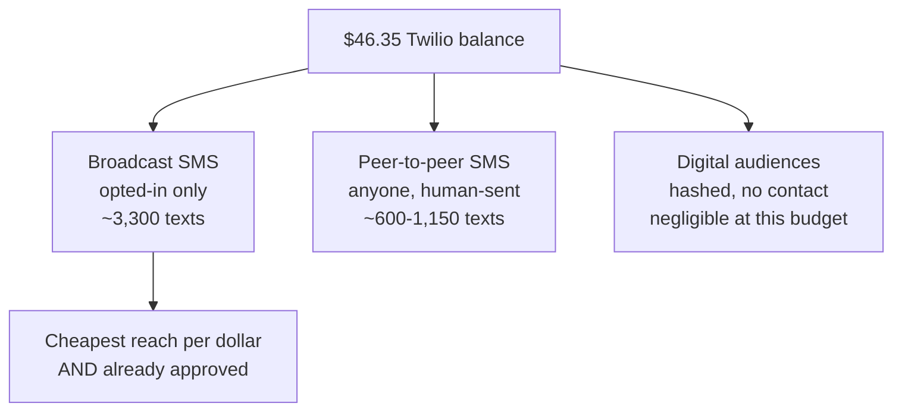

# Reaching more voters in the final week — what the money actually buys

A decision brief for the last eight days before the **August 4, 2026** primary. It started from the question "can we broadcast past the opt-in list?" and lands somewhere more useful: **the binding constraint is the budget, not the consent gate.** At the current Twilio balance every channel is small, and the cheapest reach per dollar is the one the campaign is already legally cleared to use. This lays out the three compliant paths beyond the opted-in list, prices each, and says which to fund first.

- **Campaign:** Matt Grant for Congress (FEC C00945394) · **Race:** U.S. House, MO-02 · primary Aug 4, 2026
- **Sender:** toll-free +1 844-314-7912, Toll-Free Verification **TWILIO_APPROVED**, Campaign Verify vetted to Jan 31, 2027
- **Last updated:** July 27, 2026 · **Status:** Draft v0.1

> **Educational information, not legal advice.** TCPA and carrier-policy treatment — the peer-to-peer
> autodialer question especially — is contested and shifts with litigation. Verified July 27, 2026.
> Consult a telecom/election-law attorney before contacting anyone outside the consent ledger.
> All dollar figures are **illustrative planning estimates**, not quotes or predictions.

---

## 1. The reframe

The consent gate looked like the wall. It isn't — the money is.



Removing the consent gate would not have solved the reach problem. It would have bought the **same ~3,300 texts** — just aimed at people who never asked for them, at $500–$1,500 of statutory exposure each. The gate was never what capped reach.

---

## 2. The three compliant paths, priced

| Path | Who it reaches | Illustrative cost | What $46.35 buys | Needs |
|---|---|---|---|---|
| **Broadcast SMS** (current) | Opted-in only | ~$0.014/text | **~3,300** | Nothing — ready now |
| **Peer-to-peer SMS** | Any voter with a phone | ~$0.04–$0.08/msg | ~600–1,150 | Vendor contract + volunteers clicking send |
| **Hashed digital audiences** | Up to the full ~577k file | Ad spend, not per-message | Negligible | Ad budget; script already written |

**Peer-to-peer costs 3–6× more per message than broadcast** and needs a human to press send on each one. It is the right tool for reaching the voter file — but it is not a cheaper tool, and at this balance it reaches roughly a third as many people as the blast already queued.

Industry per-message figures cluster at **$0.04–$0.08**, with subscription tiers in the low hundreds of dollars for the first ~14k messages. Campaigns and PACs spent over **$150M** on political texting this cycle, so vendor capacity is real — but so is the price floor. **Get live quotes before budgeting; these are secondary-source ranges, not offers.**

---

## 3. The highest-return move: an eight-day opt-in sprint

Every number that opts in before Aug 4 is textable on Aug 4 at broadcast rates — the cheapest contact the campaign has. Unlike the other two paths, this one costs almost nothing and compounds daily.

The tooling already exists: `web/lib/reports/optinGrowth.ts` powers the **Opt-in growth** panel at the bottom of Dashboard → Text blasts, breaking new opt-ins down by source over a 30-day trend. Use it to see which asks convert and drop the ones that don't.

### The ask, everywhere

> **Text MATT to 844-314-7912**

| Channel | The move | Owner |
|---|---|---|
| **Stump close** | Last line of every speech. Ask for phones out *in the room*, wait for it | Matt |
| **Doors** | Door hangers and walk pieces carry the ask; canvassers say it out loud | Field |
| **Events** | Printed QR to the join form on every table; ask from the mic | Events |
| **Signs** | Add to any remaining print run — not worth reprinting existing stock | Print |
| **Donate flow** | Confirm the WinRed SMS-consent box is on and checked by default where permitted | Digital |
| **Website** | Confirm the SMS checkbox is present and visible on join, contact, and RSVP forms | Digital |

The stump close is the highest-converting and the only free one. A room of 60 with a 30-second ask beats a week of passive web capture.

### Track it

Re-run the pre-flight daily and watch the opt-in growth line move:

```bash
cd web && DYNAMODB_TABLE=matt-grant AWS_REGION=us-east-1 \
  npm run sms:preflight -- --segments 1 --balance <current>
```

---

## 4. Hashed digital audiences

`web/scripts/export-digital-audience.ts` exports the voter file as hashed identifiers for Meta/Google custom audiences. No consent question arises — the campaign never contacts anyone directly; the platform matches hashes and serves ads.

This is the only path that touches the full ~577k universe. It is gated by **ad budget**, not by consent or by Twilio, so it belongs in a media conversation rather than this one. Worth activating the moment there is real money; pointless at $46.

---

## 5. Recommendation

1. **Today — send the early-vote push** to the opted-in list. Approved, verified, ~$46, ~3,300 people, one segment. See [`../web/docs/sms-first-send-for-matt.md`](../web/docs/sms-first-send-for-matt.md).
2. **Today — start the opt-in sprint.** Stump close first; it costs nothing and starts compounding immediately.
3. **Before Aug 3 — top up Twilio** if there is to be an Election Day chase. The current balance funds roughly one send, and inbound replies draw on it too.
4. **Only if new money arrives — scope P2P.** Get live quotes, and count the volunteer hours honestly: a human clicks send on every message, so 5,000 contacts is a real shift schedule, not a button.

**What not to do:** broadcast to non-consented numbers. It reaches no more people than the compliant send, risks the toll-free number the campaign spent June getting approved, and carries per-message statutory damages that dwarf the entire SMS budget.

---

## See also

- [`twilio-fund-plan.md`](./twilio-fund-plan.md) — where SMS dollars do the most good, and the TCPA wall in full
- [`sms-conversational-interface-plan.md`](./sms-conversational-interface-plan.md) — the final-week send calendar
- [`../web/docs/sms-operator-runbook.md`](../web/docs/sms-operator-runbook.md) — day-to-day sending
- [`../messaging/sms-texting.md`](../messaging/sms-texting.md) — consent language, cadence, metrics

---

**Sources for the pricing ranges in §2** (secondary; verify with vendors before budgeting):
[Best P2P texting platforms for political campaigns](https://goodparty.org/blog/article/best-p2p-texting-platforms) ·
[P2P platform comparison 2026](https://politicalcomms.com/blog/best-p2p-texting-platforms-campaigns/) ·
[Political texting spending, 2026 FEC data](https://voterping.com/info/political-texting-spending-2026)
