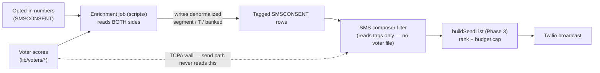

# SMS Voter-Targeting Plan — Text the Highest-Value People First

How the campaign's SMS broadcasts go from "everyone who opted in" to "the opted-in people whose **voting
data** says a text will matter most" — the GOTV core first, then reliable supporters, then persuadable
habitual voters, with opposition/inactive and already-voted numbers suppressed. This is the send-side
companion to [`twilio-fund-plan.md`](./twilio-fund-plan.md) (which decides the *budget* split): that report
proves who's high-value; this plan makes the **composer actually target them** — without ever breaching the
TCPA wall.

- **Campaign:** Matt Grant for Congress (FEC C00945394) · **Race:** U.S. House, MO-02 · primary Aug 4, 2026
- **Channel:** Twilio Messaging Service (SMS) · **Consent ledger:** `web/lib/sms/consent.ts` · **Scores:** `web/lib/voters/score.ts`
- **Owner:** _[campaign manager + data lead]_ · **Last updated:** July 16, 2026 · **Status:** Phase 3 (ranking core) shipped; Phases 1–2, 4–5 planned

> **Educational information, not legal advice.** The TCPA (broadcast-texting consent) and RSMo §115.157
> (voter-list use) rules were reviewed for operational planning; they are not election-law advice. Consult a
> telecom/election-law attorney before any new texting program, and re-verify before changing how the list
> is built or targeted.

---

## 1. The problem: the two halves don't connect

- The **fund report** (`web/lib/reports/twilioFund.ts`) already joins opted-in numbers to voter
  segment/turnout score — but it's analysis-only.
- The **send composer** (`web/lib/sms/audiences.ts` → `resolveSmsRecipients`) can target `subscribers` /
  `volunteers` / role tags — but **not** voter score. So today a broadcast can't say "text the opted-in
  MOBILIZE voters first."

And it can't simply be wired together: the Phase-2 isolation guard
(`web/lib/sms/audiences.voterfile-isolation.test.ts`) **fails the build if anything under `lib/sms/` reads
voter data** (the TCPA wall). The plan's whole trick is to target by voter data *without* the send path ever
touching the voter file.

## 2. The design move — enrich out-of-band, target on a plain tag

An **out-of-band job** (a `scripts/` job, allowed to read both) tags each opted-in number with denormalized
`voterSegment` / `voterT` / `banked` fields. The composer then filters and ranks on those **plain fields on
the consent row** — never a voter partition. The wall stays green, and targeting is a fast attribute read.

## 3. Phased build

| Phase | What | Where | Status |
|---|---|---|---|
| **3 — Ranking core** | Pure `buildSendList()` ranks an opted-in, voter-scored audience highest-value first and caps to the budget (reuses `SMS_PRIORITY`); GOTV `excludeBanked`, per-segment restriction, `touches`/cost math. | `web/lib/reports/smsTargeting.ts` (+ test) | ✅ **shipped** |
| **1 — Enrichment job** | For each opted-in phone, match its named contact (volunteer/donor name+ZIP) → voter row (`matchPhones`, `score.ts`) and ballot-returns (`returnsStore.ts`); write `voterSegment`/`voterT`/`banked` onto the `SMSCONSENT` row. Idempotent; re-run after each refresh. | new `web/scripts/enrich-sms-audience.ts` | planned |
| **2 — Composer targeting** | New audience dimension (`segment:MOBILIZE`, `t>=4`, `outstanding`) resolved from the **denormalized consent fields only** — composer chips + live counts (mirror `smsVolRoleCounts`). Extend the isolation test to cover it. | `web/lib/sms/audiences.ts` | planned |
| **4 — GOTV chase mode** | During the chase window, target only **outstanding** (not-yet-`banked`) high-propensity opted-ins — don't spend texts on people who already voted. Driven by the Phase-1 `banked` tag. | composer preset | planned |
| **5 — Feedback loop** | Track sends, opt-out rate, and (via `sc`/UTM) donation/RSVP conversion **per segment**; feed real response rates back into the `SMS_PRIORITY` weights (today's are documented illustrative). | analytics + `twilioFund.ts` weights | planned |

## 4. How the ranking works (Phase 3, shipped)

`buildSendList(recipients, opts)` takes recipients already opted-in and already tagged, and returns a
ranked, budget-capped list:
- **Priority** = segment weight (`SMS_PRIORITY`: MOBILIZE 1.0 > BANK 0.8 > PERSUADE 0.5 > PROSPECT 0.15 >
  MONITOR 0), with turnout **T** as a within-segment tie-break (never crossing a segment boundary).
- **Filters:** MONITOR and unscored are dropped by default; `segments` restricts the set; `excludeBanked`
  is GOTV suppression; `includeUnscored` appends no-match opted-ins last.
- **Budget cap:** `floor(budgetCents / (cost × touches))` recipients, taking the highest-value first, so a
  limited spend always lands on the GOTV core before the rest. Pure and unit-tested; reusable by both the
  composer (Phase 2) and the fund report.

## 5. Guardrails (non-negotiable)

- **TCPA wall stays enforced.** The composer reads denormalized tags, never voter partitions;
  `smsTargeting.ts` lives in `lib/reports/` (not `lib/sms/`) precisely so the guard stays valid. Phase 2
  extends the isolation test.
- **Opt-in is still the only gate.** Voter targeting only *narrows* an already-opted-in audience; the drain
  re-checks opt-in + STOP at send.
- **Counts, not lists, in any report.** Recipient resolution to E.164 happens server-side only; no PII in
  reports or logs.
- **Unscored ≠ unreachable.** Opted-ins with no name+ZIP match can't be scored — they're texted last (or in
  untargeted sends), never dropped from the program.

## 6. Verification

- Phase 3: pure unit tests (`smsTargeting.test.ts`) — ranking order, MONITOR/unscored exclusion, GOTV
  `excludeBanked`, segment restriction, budget cap with `touches`, deterministic tie-break. ✅
- Phase 1: dry-run the enrichment against the synthetic seed offline; confirm tags land on `SMSCONSENT`.
- Phase 2: composer filter tested with mocked tagged rows; `audiences.voterfile-isolation.test.ts` still
  passes.
- End-to-end needs the real opt-in + voter data — the same AWS dependency as the voter ingest and the fund
  report (`web/scripts/twilio-fund-report.ts`).

## 7. See also

- [`twilio-fund-plan.md`](./twilio-fund-plan.md) — the budget-allocation companion (who's high-value, and the spend split)
- [`voter-file-plan.md`](./voter-file-plan.md) — §4 scores/segments, §7 usage & lineage, the TCPA wall (§2.3)
- [`../workflows/gotv-plan.md`](../workflows/gotv-plan.md) — the 4-3-2-1 chase cadence the touch counts follow
- [`../messaging/sms-texting.md`](../messaging/sms-texting.md) — compliant templates + opt-in language
- `web/lib/reports/smsTargeting.ts` — the Phase-3 ranking core (`buildSendList`), unit-tested
