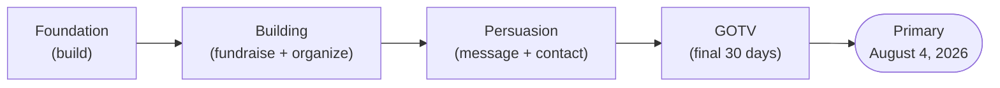
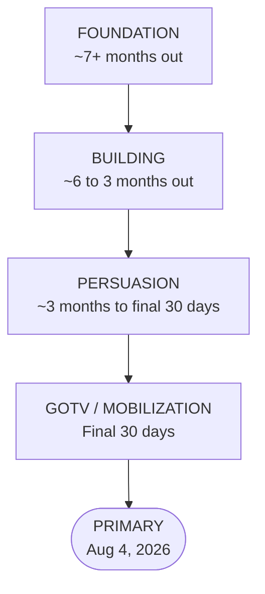

# Strategic Plan to Win MO-02 on August 4, 2026

A concrete strategic plan for **Matt Grant's campaign for the U.S. House of Representatives, Missouri — District 2 (MO-02)**, targeting the **primary on August 4, 2026**, operated by the **Matt Grant for Congress Committee**. It is built directly on this skill's own frameworks: the structure follows `workflows/campaign-plan-builder.md`, the GOTV phase follows `workflows/gotv-plan.md`, the money plan follows `workflows/fundraising-plan.md`, the small-budget tactics follow `tactics/low-cost-high-impact.md`, and all Missouri-specific compliance routes to `states/missouri/*` and `federal/*`.

> **PLANNING-FRAMEWORK NOTICE — read first.** Every number in this plan (turnout, win number, vote targets, dollar amounts, door counts, volunteer counts) is an **illustrative planning placeholder**, not a prediction, a poll, or real data. They demonstrate *how* to run the math from `workflows/campaign-plan-builder.md`; they must be replaced with verified figures from the Missouri Secretary of State, county election authorities, the voter file, and the campaign's own books before any decision is made. Do not represent any figure here as actual or forecasted.



---

## 1. Theory of Victory

*(Framework: `workflows/campaign-plan-builder.md` §3.)*

A primary is a **base-mobilization and persuasion** contest decided by a small, high-information electorate. Matt's theory of victory:

> Matt Grant wins the August 4, 2026 MO-02 primary by consolidating the voters who care most about his signature cause — **eliminating corruption in the family court system** — and the broader primary electorate motivated by **term limits, a smaller federal government, and lower taxes**, then turning those identified supporters out in a low-turnout summer primary through disciplined direct voter contact and a relentless ballot-chase operation.

Conditions that must hold by election day:

- Matt is the clearest champion of family-court reform in the field (his differentiator).
- His supporters are identified, committed, and have a concrete plan to vote.
- The campaign has the money and volunteers to contact every persuadable and base voter at least once, and target voters multiple times.
- Turnout among identified Grant supporters exceeds the district's baseline primary turnout.

His standing as a 23-year litigator and an Eagle Scout who "does not just talk, he takes action" supports a credibility-and-results contrast. Frame all contrast around values and priorities, never personal attacks (`workflows/campaign-plan-builder.md` §9; `tactics/issue-response-engine.md`).

---

## 2. Target Vote Math (Illustrative Planning Framework)

*(Framework: `workflows/campaign-plan-builder.md` §4. **All numbers below are illustrative placeholders — replace with real data.**)*

### Win-number formula (from the repo)

```
Expected Turnout = average primary turnout from last 3 comparable cycles (verify with MO SOS / county boards)
Win Number = (Expected Turnout / number of viable candidates) + 1 + Safety Margin
Safety Margin = Expected Turnout x 0.03 to 0.05
```

In a multi-candidate primary the win number is a plurality, not a majority — adjust the divisor to the number of viable candidates (`workflows/campaign-plan-builder.md` §4, multi-candidate note).

### Worked example — ILLUSTRATIVE ONLY

| Quantity | Illustrative placeholder | How to replace it |
|---|---|---|
| Expected primary turnout | 60,000 (PLACEHOLDER) | Average of last 3 comparable MO-02 primaries — MO SOS results |
| Viable candidates | 3 (PLACEHOLDER) | Confirmed candidate filings |
| Raw win number (÷3, +1) | ~20,001 | Recompute from real turnout/field |
| Safety margin (4%) | ~2,400 | Apply 3–5% of real turnout |
| **Illustrative win number** | **~22,400 votes (PLACEHOLDER)** | Final = raw + margin on real data |

### Universe breakdown — ILLUSTRATIVE ONLY

Following the repo's targeting tiers (`workflows/campaign-plan-builder.md` §5; `workflows/voter-targeting.md`):

| Tier | Who | Illustrative count | Role |
|---|---|---|---|
| Tier 1 — Base to mobilize | Reliable supporters, low-propensity | 12,000 (PLACEHOLDER) | Must turn out |
| Tier 2 — Persuadable | Primary voters open to Matt | 18,000 (PLACEHOLDER) | Win a majority of these |
| Tier 3 — GOTV push | Soft supporters | 9,000 (PLACEHOLDER) | Chase to the polls |
| **Contact universe** | base + persuadable + mobilization | **~39,000 (PLACEHOLDER)** | Drives field goals |

Required contact rate to hit the win number is typically 2–3x the persuasion target (`workflows/campaign-plan-builder.md` §4) — recompute once the real win number and universe are set from the voter file.

---

## 3. Phased Timeline — Working Backward from August 4, 2026

*(Framework: `workflows/campaign-plan-builder.md` §7. Phase labels mapped to the fixed primary date. Verify all filing/ballot dates against `states/missouri/ballot-access.md` and the MO SOS before relying on them.)*



### Phase 1 — Foundation (build)

*(See `workflows/first-30-days.md`, `workflows/filing-checklist.md`, `workflows/treasurer-setup.md`.)*

- Confirm committee registration and treasurer systems for the Matt Grant for Congress Committee (FEC; `workflows/treasurer-setup.md`).
- Verify MO-02 ballot-access requirements and the filing deadline (`states/missouri/ballot-access.md`; MO SOS).
- Lock the candidate profile and platform (`candidate/profile.md`, `candidate/platform.md`).
- Stand up WinRed donation flow and the "Paid for by" disclaimer (`tools/disclaimer-generator.md`).
- Recruit the core team and write this plan (`workflows/campaign-plan-builder.md`).

### Phase 2 — Building (fundraise + organize)

- Front-load fundraising: target ~50% of the total goal in the first 60% of the campaign (`workflows/fundraising-plan.md`).
- Build the volunteer base and turf plan (`workflows/volunteer-management.md`).
- Begin earned media and the family-court-reform narrative; map influencers and potential endorsers (`tactics/influence-network-targeting.md`, `outreach/endorsement-playbook.md`).
- Launch voter ID contact to begin populating Tier 1–3 universes.

### Phase 3 — Persuasion (message + contact)

- Intensify door and phone contact against the persuadable universe (`workflows/voter-targeting.md`).
- Deploy paid/low-cost media weighted to cost-per-vote (`tactics/low-cost-high-impact.md`, `messaging/paid-media-planning.md`).
- Forums, candidate Q&A, and contrast messaging on the four priorities (`messaging/debate-prep.md`).
- Begin absentee/early-vote education for identified supporters.

### Phase 4 — GOTV / Mobilization (final 30 days)

*(Framework: `workflows/gotv-plan.md`; `tactics/ballot-chase-program.md`.)*

- Day -30 to -14: absentee/early-vote chase; identify who hasn't voted.
- Day -14 to -2: text/phone/door blitz to all identified supporters; intensify chase.
- Day -1: final materials, volunteer deployment, boiler-room prep (`tactics/election-protection.md`).
- **August 4, 2026 — primary day:** poll monitoring, ride-to-polls, last-call to un-voted supporters.

---

## 4. Fundraising Targets Framework

*(Framework: `workflows/fundraising-plan.md`. **Dollar figures are illustrative placeholders.**)*

- Set the total goal from the budget in `workflows/campaign-plan-builder.md` §6, plus ~10% contingency.
- Break it into **monthly targets**, front-loaded (≥50% of goal raised in the first 60% of the timeline).
- Diversify sources (`workflows/fundraising-plan.md` source-allocation table): personal network, individual major donors ($200+), small-dollar/grassroots, events, and PACs/organizations — all within FEC limits (`federal/contribution-limits.md`).
- Route every contribution through `workflows/donation-intake.md`; run limit checks with `tools/donor-limit-checker.md`; track with `tools/contribution-tracker.md`.

### Illustrative monthly target shape — PLACEHOLDER ONLY

| Period | Illustrative monthly target | Cumulative |
|---|---|---|
| Foundation months | $X (PLACEHOLDER) | front-loaded |
| Building months | $X (PLACEHOLDER) | ~50% of goal by mid-campaign |
| Persuasion months | $X (PLACEHOLDER) | ramping |
| Final month (GOTV) | $X (PLACEHOLDER) | = total goal |

Online donations flow through WinRed: <https://secure.winred.com/matt-grant-for-congress/donate-today>. Email fundraising sequences: `messaging/email-fundraising.md`.

---

## 5. Volunteer & Field Plan

*(Framework: `workflows/campaign-plan-builder.md` §11; `workflows/volunteer-management.md`; small-budget execution per `tactics/low-cost-high-impact.md`. **Counts are illustrative.**)*

- **Door goal:** typically 3–5x the persuasion target (`workflows/campaign-plan-builder.md` §11). On the illustrative ~18,000 persuadable universe that is roughly **54,000–90,000 door attempts (PLACEHOLDER)** — recompute on real data.
- **Shifts and volunteers:** doors-per-shift × shifts needed → volunteer recruitment target (`workflows/volunteer-management.md`).
- **Turf:** cut turf by precinct, prioritized by vote potential (`workflows/voter-targeting.md`).
- **Scripts:** door and phone scripts built around the four priorities and the family-court message; data collected and entered every shift.
- **Low-cost leverage:** rank every field tactic by cost-per-vote; lean on volunteer canvassing, relational outreach, and a surrogate program (`tactics/low-cost-high-impact.md`, `tactics/surrogate-program.md`).

---

## 6. Messaging Pillars

*(Derived faithfully from `candidate/platform.md`. Develop with `messaging/positioning-framework.md`; respond to issues with `tactics/issue-response-engine.md`.)*

| Pillar | Rooted in priority | Core line (candidate's own framing) |
|---|---|---|
| Put Missouri's children first | Family-court corruption + CHILD Protection Act | "A neighbor, a dad, and a problem-solver running to put Missouri's children first." |
| Clean up family courts | Eliminate family-court corruption | "Corruption Hiding Inside Legal Dockets — Matt is taking action with the CHILD Protection Act." |
| Limit power, end careerism | Term limits (House & Senate, grandfather clause) | "Term limits so Washington serves you, not itself." |
| Leaner, accountable government | Smaller federal government | "A smaller federal government: a hiring freeze and early-retirement packages." |
| Lower taxes by cutting waste | Lower taxes | "Lower taxes by cutting fraud, waste, and the number of government employees." |

Umbrella identity: *Matt does not just talk, he takes action.* Keep all messaging within documented positions — do not invent new policy specifics, statutes, or claims.

---

## 7. Weekly Cadence

*(Framework: `tactics/scheduling-advance.md`; fundraising-time guidance from `workflows/fundraising-plan.md`; GOTV weekly rhythm from `workflows/gotv-plan.md`.)*

A repeatable weekly operating rhythm (intensity increases each phase):

| Cadence item | When | Source |
|---|---|---|
| Candidate call time | Daily (largest single block of candidate time during fundraising) | `workflows/fundraising-plan.md` |
| Voter contact shifts (door/phone) | Multiple weeknights + weekends | `workflows/voter-targeting.md` |
| Weekly all-hands / metrics review (money, contacts, volunteers vs. goal) | Once weekly | `workflows/campaign-plan-builder.md` §8 |
| Earned-media / content push | 1–2x weekly | `messaging/social-media-strategy.md` |
| Volunteer recruitment + thank-yous | Ongoing weekly | `workflows/volunteer-management.md` |
| Compliance check-in (contributions logged, disclaimers correct) | Weekly | `workflows/compliance-report-prep.md` |
| GOTV chase blocks | Daily in the final 30 days | `workflows/gotv-plan.md` |

Review metrics weekly, but do not change strategy on a single data point — consistent execution of a good plan beats constant pivots (`workflows/campaign-plan-builder.md`).

---

## Compliance & Guardrails

- **Federal race:** governed by FEC rules — see `federal/contribution-limits.md`, `federal/disclosure-requirements.md`, `federal/prohibited-contributions.md`, `federal/compliance-calendar.md`. Missouri ballot access via `states/missouri/ballot-access.md`.
- **Search-first** for any current limit or deadline; add a verification date.
- **No illegal coordination** with Super PACs or outside groups (`workflows/coordination-rules.md`).
- **Nonpartisan tooling, faithful representation:** the plan executes Matt's stated platform; it does not editorialize or invent positions, endorsements, or data.

---

> **EDUCATIONAL DISCLAIMER:** This is educational information, not legal advice. Consult a campaign finance attorney or your filing agency (the FEC for this federal race; the Missouri Secretary of State for ballot access) for guidance specific to your situation. All quantitative figures in this plan are illustrative planning placeholders, not predictions or real data.
