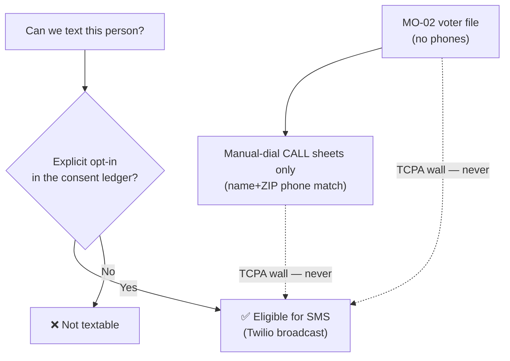

# Twilio Fund Plan — The Best Use of Text-Messaging Dollars for MO-02

A decision brief for Matt on where the campaign's **Twilio/SMS budget** does the most good. Twilio is
the campaign's text-messaging channel (toll-free sender +1 844-314-7912), and by law it can reach only
people who have **opted in** to campaign texts. This plan starts from that hard legal line, measures the
audience we can actually text today by joining it to the MO-02 voter scores, recommends how to split the
budget across supporter segments, and — most importantly — shows the real lever: growing the opted-in list
so more of our scored voters become reachable. The live numbers regenerate from the database at any time
(`web/scripts/twilio-fund-report.ts`); the figures shown here are **illustrative placeholders**, not
predictions or real counts.

- **Campaign:** Matt Grant for Congress (FEC C00945394) · **Race:** U.S. House, MO-02 · primary Aug 4, 2026
- **Channel:** Twilio Messaging Service (SMS), toll-free +1 844-314-7912 · **Consent ledger:** `web/lib/sms/consent.ts`
- **Owner:** _[campaign manager + data lead]_ · **Last updated:** July 15, 2026 · **Status:** Draft v0.1 (framework + live generator)

> **Educational information, not legal advice.** The TCPA (broadcast-texting consent) and RSMo §115.157
> (voter-list use) rules below were reviewed **July 15, 2026** for operational planning. They are not
> election-law advice — consult a telecom/election-law attorney before any new texting program, and
> re-verify before changing how the list is built or used.

---

## 1. The bottom line (for Matt)

1. **We can only text people who opted in.** Twilio sends SMS, and federal law (TCPA) lets us text only
   numbers with a recorded opt-in. The 577k-voter file has **no phone numbers** and can **never** be
   broadcast-texted — full stop. So "spend Twilio money on the voter file" isn't an option; the money is
   spent on the **opted-in list**, aimed using the voter scores.
2. **Aim the budget at supporters who need a nudge, not everyone.** Among opted-in numbers we can match to
   a voter record, the dollars should flow first to the **GOTV core** (identified supporters who don't
   always vote), then to reliable supporters (a light chase reminder), then to persuadable habitual voters.
   Opposition and inactive voters get **no** text budget.
3. **The real growth move is a bigger opt-in list.** Every dollar of Twilio spend is capped by how many
   people opted in. The highest-leverage investment isn't more texts to the same list — it's **compliant
   opt-in capture** at doors, events, and on the website, converting scored voters into textable supporters.

---

## 2. The hard constraint — read this first



| Fact | Consequence for the budget |
|---|---|
| Twilio = **SMS** (not voice) | "Twilio funds" = the **text-messaging** budget |
| SMS is legal **only to opted-in numbers** (TCPA) | Reach is capped by the opt-in list, not the voter file |
| The voter file has **no phones**, and matched/appended phones are **call-only** | Voter-file numbers **never** enter the SMS pipeline — enforced in code (`web/lib/sms/audiences.voterfile-isolation.test.ts`) |
| Voter **scores** (turnout T, segment) live per record | We can *aim* SMS by joining opted-in numbers to their voter score — not by texting the file |

This isn't a limitation to work around; it's the compliant design. The plan below spends the SMS budget on
the opt-in list and uses the voter file only to **decide who on that list to prioritize**.

---

## 3. Who we can actually reach today (illustrative)

The generator joins the opted-in consent ledger to voter scores: for each opted-in number that also belongs
to a known campaign contact (a volunteer or donor with a name + ZIP on file), it attaches that person's
voter **segment** and **turnout propensity**. Numbers we can't tie to a voter record are still textable —
we just can't score them yet.

> **Illustrative placeholders — not real counts.** Regenerate real figures with
> `DYNAMODB_TABLE=… npx tsx web/scripts/twilio-fund-report.ts`.

| Cohort | Illustrative count | What it means |
|---|--:|---|
| Opted-in (textable) numbers | 4,200 | The entire SMS-reachable audience |
| — matched to a voter score | 2,600 | Scored: we can prioritize these by segment |
| — opted-in but unmatched | 1,600 | Textable, not yet scored (no name+ZIP match) |
| Opted-out (STOP) | 180 | Suppressed — never texted |
| Scored voter universe | 577,366 | The growth ceiling if they opt in over time |

**Matched opted-in audience by segment (illustrative):**

| Segment | Illustrative opted-in & matched | Priority for SMS |
|---|--:|---|
| **MOBILIZE** — supporters who need a turnout push | 620 | **Highest** (GOTV core) |
| **BANK** — reliable supporters | 900 | High (light chase reminder) |
| **PERSUADE** — habitual voters, unknown lean | 780 | Medium (persuasion) |
| **PROSPECT** — unknown + unlikely | 240 | Low (trickle) |
| **MONITOR** — opposition/inactive | 60 | **None** (no budget) |

Segment definitions are the campaign's single source in `web/lib/voters/score.ts` (see
[`voter-file-plan.md`](./voter-file-plan.md) §4).

---

## 4. Recommended allocation of the SMS budget

The generator funds segments in priority order (GOTV core first) up to a planned per-person cadence, until
the budget is exhausted — so scarce dollars always land on the highest-value texts first. The priority
weights and cadence live in `web/lib/reports/twilioFund.ts` and are tunable as real response data arrives.

> **Illustrative** — assumes a **$2,000** SMS budget at **$0.02/message** and a 4-3-2-1 GOTV cadence.
> These are planning placeholders; the live report computes the real split.

| Segment | Touches/person | Illustrative sends | Illustrative spend | Rationale |
|---|--:|--:|--:|---|
| MOBILIZE | 4 | 2,480 | $49.60 | Turnout push to supporters who skip primaries |
| BANK | 3 | 2,700 | $54.00 | Light "your ballot's ready" chase nudge |
| PERSUADE | 2 | 1,560 | $31.20 | Persuasion to habitual, unknown-lean voters |
| PROSPECT | 1 | 240 | $4.80 | A single low-cost touch |
| MONITOR | 0 | 0 | $0.00 | No text budget |

**Cadence matters more than blast size.** A few well-timed messages to the GOTV core (ballot-drop, early
vote, Election-Day-eve) out-performs one big blast to everyone. Pair each send with the opt-in-compliant
templates already in the SMS composer, and always honor STOP immediately (the consent ledger does this
automatically).

---

## 5. The real lever — grow the opted-in list (compliantly)

Because reach is capped by opt-ins, the highest-ROI Twilio investment is **converting scored voters into
opted-in supporters**. None of this texts the voter file; it invites people to opt in themselves.

- **Doors & events:** a keyword-to-opt-in card ("Text GRANT to +1 844-314-7912") captains hand out — the
  inbound keyword records consent in the ledger automatically.
- **Website:** an SMS-consent checkbox on `/join` and the WinRed donation flow (a checked box records
  consent, source `winred`), so donors and volunteers become first-class opted-in subscribers.
- **Ask captains to log volunteer phone + ZIP:** the more opted-in numbers carry a name + ZIP, the larger
  the **matched-and-scored** cohort in §3 — so the budget can be aimed, not sprayed.

Track the opt-in list's growth week over week; that curve, not the send count, is the metric that raises
the ceiling on everything above.

---

## 6. Do not — the compliance guardrails

- **Do not** text any number sourced from, matched to, or appended onto the voter file. Those are
  manual-dial **call** lists only (TCPA / RSMo §115.157). The code blocks it; keep it that way.
- **Do not** buy a phone-append list to text. Appended numbers are call-only; texting them is a TCPA
  violation regardless of the voter's score.
- **Do not** text opted-out (STOP) numbers or ignore quiet hours; the platform enforces this, don't override it.
- **Do not** put any donor/voter PII in this report or its exports — it carries **counts only**, never names
  or numbers.

---

## 7. Regenerating the live numbers

```
# Read-only; prints an aggregate cohort + allocation table (no PII).
DYNAMODB_TABLE=matt-grant AWS_REGION=us-east-1 \
  npx tsx web/scripts/twilio-fund-report.ts --budget 2000 --cost-cents 2
# Write the generated appendix to a file to paste under §3–§4:
#   ... --out candidate/_twilio-fund-appendix.md
```

The allocation math is pure and unit-tested (`web/lib/reports/twilioFund.test.ts`); the segment scores come
from the same `web/lib/voters/score.ts` the dashboard uses, so this report can never drift from the app.

## 8. See also

- [`voter-file-plan.md`](./voter-file-plan.md) — the voter scores/segments this plan aims by, and the TCPA wall (§2, §7)
- [`../messaging/sms-texting.md`](../messaging/sms-texting.md) — the peer-to-peer texting scripts and opt-in language
- [`donor-value-ladder.md`](./donor-value-ladder.md) — the fundraising-side counterpart (WinRed levels)
- [`../workflows/gotv-plan.md`](../workflows/gotv-plan.md) — the 4-3-2-1 GOTV cadence the touch plan follows

---

*This is educational information, not legal advice. Consult a campaign finance or telecom (TCPA) attorney
or your filing agency for guidance specific to your situation.*
