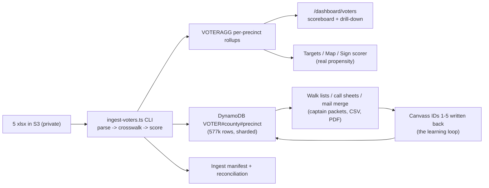

# Voter File Plan — Custody, Compliance, and the MO-02 Voter Engine

The single source of truth for how Matt Grant for Congress stores, protects, scores, and
acts on the **official MO-02 registered-voter file** (obtained via the campaign's RSMo
§115.157 Sunshine Law request): what the data actually contains, the legal lines that govern
every use, the ingest/scoring architecture, and the phased rollout that feeds doors, mail,
signs, phones, and GOTV from one scored database operated from the admin dashboard.

- **Campaign:** Matt Grant for Congress (FEC C00945394) · **Race:** U.S. House, MO-02 · primary Aug 4, 2026
- **Owner:** _[campaign manager + data lead]_ · **Last updated:** July 10, 2026 · **Status:** Phase 0-1 shipping

> **Educational information, not legal advice.** Voter-list use restrictions (RSMo 115.157)
> and telephone-solicitation rules (TCPA) below were reviewed **July 10, 2026** for
> operational planning. Consult an election-law attorney for guidance specific to your
> situation, and re-verify before any new use of the data.

---

## 1. What the file actually is (inspected 2026-07-10)

| Fact | Value |
|---|---|
| Rows | **577,366** — one row per registered voter (verified: no duplicate Voter IDs; full-file parse had 0 failures) |
| Scope | 2025-map CD-2 (**all 577,366 rows** coded `25 CN 2`; the 2020-map column shows the old CN 1/2/3 mix) |
| Counties present | Six — St. Louis 70.2%, **Franklin 13.6%**, Jefferson 8.8%, Crawford 2.9%, Washington 2.7%, Gasconade 1.9% — see §5 census |
| Identity | Voter ID, first/middle/last/suffix |
| Address | Fully parsed residential (house/street/unit/city/zip) + mailing when different |
| Age | **Birth YEAR only** |
| Party | Blank for ~90% (Missouri has no party registration); sparse Republican/Democratic/Unaffiliated/Libertarian values |
| Geography | County, Precinct, Precinct Name, Split, Township, Ward, both district-plan columns |
| Participation | **Voter History = single most recent election only** (e.g. "11/05/2024 General", "04/07/2026 Municipal General") — NOT a full history |
| Status | Active / Inactive · plus Registration Date |
| **NOT in the file** | **No phone numbers. No emails.** No full vote history. |

Two consequences that shape everything below: (a) phone/SMS outreach cannot come from this
file directly, and (b) turnout scoring keys on **recency** (a voter whose latest vote is a
2025-26 municipal election is a habitual super-voter; a full-history append is a future
Sunshine follow-up).

## 2. Custody and access — the non-negotiables

1. **Out of git.** Canonical storage is the private S3 bucket (`voters/raw/` prefix, SSE,
   never the public CDN path) — see `docs/VOTER-FILE.md` for the upload command. The xlsx
   files were removed from the repo working tree 2026-07-10; they remain in git *history*
   until an owner runs a coordinated history purge (**open decision**).
2. **RSMo 115.157 use restriction.** The list may be used **only for political/election
   purposes** — never commercial use, never publication, never resale. Every export the
   dashboard produces is stamped with this notice.
3. **TCPA — the texting line.** No number derived from, appended to, or matched against
   this file may be broadcast-texted. The campaign's SMS pipeline texts **only** numbers
   with an explicit opt-in in the consent ledger — that gate is unchanged and absolute.
   Matched or appended phones are **call lists** (manual dial by volunteers) only.
4. **Access.** Voter pages/exports are admin-gated in the dashboard; captains receive only
   their turf's rows via generated packets. Donor-list-style hygiene applies: no forwarding
   raw exports, no personal devices for bulk copies, delete stale exports.
5. **Retention.** Refresh from the election authority rather than accumulating stale
   copies; the ingest manifest records the source file hashes and dates.

## 3. Architecture (the voter engine)

- **Rows** are sharded `VOTER#<county>#<precinctKey>` (never one giant partition), SK =
  Voter ID. **Aggregates** (`VOTERAGG`) power every dashboard/map read — voter rows are
  only queried per precinct (lists, packets, drill-downs).
- **Crosswalk**: voter-file precinct names ↔ ArcGIS map precincts ↔ Geo Hierarchy, with
  fuzzy normalization; misses are reported in the manifest, never silently dropped.
- The full phase-by-phase build plan lives with the engineering record (update log) —
  Phase 0 custody (this doc), Phase 1 ingest, Phase 2 dashboard, Phase 3 feed
  Targets/map/signs, Phase 4 walk/mail/call generators, Phase 5 canvass-ID learning loop
  and ballot chase.
- **Phase 2 shipped 2026-07-10:** `/dashboard/voters` (admin-only `viewVoterFile`
  capability) — district scoreboard + county mix from the rollups, sortable precinct
  table (persuade/mobilize/bank universes), per-precinct drill-down with segment/T/age/
  street filters, and RSMo-stamped walk/mail/call CSV exports (formula-injection-guarded;
  call lists carried an empty phone column until Phase 4's matching). Shows the ingest
  runbook until the live load runs.
- **Phase 3 shipped 2026-07-11:** the voter file now feeds the existing tactics. The 3D
  map (`/dashboard/map`) gains a "Voter file" mode — shade = heuristic primary propensity
  (§4 weights over the T histogram), height = the PERSUADE universe — enabled only once
  ingested aggregates join onto precinct features (crosswalk by name; unmatched precincts
  render unchanged). The Targets page adds Persuade and primary-propensity columns (and
  CSV fields) from the same join. The Signs tool auto-fills a blank `propensity` from the
  voter file when a row's precinct matches — an explicitly typed value always wins. All
  three surfaces label the score heuristic; nothing renders pre-ingest.
- **Phase 4 shipped 2026-07-11:** the outreach generators. From a precinct drill-down the
  explorer now prints **walk packets** — the filtered list cut into street-sorted turfs of
  ~40-60 doors (the targeting doc's shift size), round-robined across the active captain
  roster, each page carrying the 1-5 canvass-ID column (**scale, defined once in
  `web/lib/voters/walk.ts`:** 1 Strong Grant · 2 Lean Grant · 3 Undecided · 4 Lean other ·
  5 Strong other — Phase 5's write-back uses the same numbers), not-home boxes, and the
  RSMo notice. **Matched phones:** volunteers/donors who gave the campaign their number
  are matched to voters by full name + ZIP5 (ambiguous keys dropped); matches fill the
  call CSV's phone column and a printable **manual-dial call sheet** — texting stays
  consent-ledger-gated, never voter-file-sourced. **Mail merge:**
  `tools/pdf-letterhead/voters_mailing.py` turns a mail-list export into one letterhead
  PDF per segment (PERSUADE persuasion piece / MOBILIZE turnout plan / BANK
  early-vote-and-bring-a-neighbor / PROSPECT introduction; MONITOR skipped), every page
  carrying the verbatim disclaimer.
- **Phase 4 gaps closed 2026-07-11:** the drill-down's "Sync counts to Airtable" button
  now upserts the cut turfs into the base's **Canvass Turf** table (deterministic names,
  doors/voters counts, captain, Pass Type "Voter ID") and the matched-phone count into
  **Contact Lists** — SUMMARIES only, never voter names/addresses (the walk list itself
  stays in the app per §2). Writes obey the base's Front-End Access control table
  (fail-closed; admins can switch them off in Airtable with no deploy), and a re-sync
  updates rows instead of duplicating — Walk Status/Priority/Area stay Airtable-curated
  after creation. The **phone-append import** (§6 brief below) closes the other gap's
  plumbing; the vendor purchase itself remains the campaign's decision.

## 4. Scoring — a transparent scorecard, honestly labeled

- **Turnout propensity T (0-5):** 5 = latest vote is a 2025-26 municipal/special (the
  habitual-voter proxy — the strongest signal this file carries) · 4 = 2024 General ·
  3 = 2020/2022 General · 2 = older participation · 1 = registered, none recorded ·
  0 = Inactive. Plus a `newRegistrant` flag (registered after Nov 2024).
- **Support proxy S (0-3):** explicit party where present; otherwise a precinct-level
  prior. **This is a proxy and is labeled as such everywhere it appears.** It becomes real
  data only through the learning loop: walk lists carry a 1-5 canvass-ID column, IDs are
  entered on the dashboard and written back to voter rows. A statistical model is fitted
  only after canvass labels number in the thousands — never invented before.
- **Segments** (the `workflows/voter-targeting.md` matrix, computed in one tested module):
  **MOBILIZE** (supporters who need a turnout push), **PERSUADE** (habitual voters with
  unknown lean), **BANK** (reliable supporters → light touch + ballot chase),
  **MONITOR** (opposition — no contact budget). Ballot-chase tiers activate when the
  early-vote feed arrives (`tactics/ballot-chase-program.md`).

## 5. District reconciliation — RESOLVED by the Phase 1 census (2026-07-10)

The full-file dry run (all 577,366 rows, 0 unparseable) settles it — the official voter
registration system codes **six counties into 2025-map CD-2, including Franklin as the
second-largest**:

| County | Registered voters | Share |
|---|---|---|
| St. Louis (portion) | 405,222 | 70.2% |
| **Franklin** | **78,635** | **13.6%** |
| Jefferson | 50,653 | 8.8% |
| Crawford | 16,506 | 2.9% |
| Washington | 15,666 | 2.7% |
| Gasconade | 10,684 | 1.9% |

District-wide: 91.3% Active · party field filled 11.7% (proxy confirmed necessary) ·
new registrants since Nov 2024: 21,514 (3.7%) · T histogram (0→5):
50,208 / 55,944 / 25,375 / 33,953 / 283,776 / 128,110 · Segments: PERSUADE 393,044 (68.1%),
PROSPECT 111,086, MONITOR 60,656, BANK 10,029, MOBILIZE 2,551 (BANK/MOBILIZE are small
because the party field is sparse — they grow as canvass IDs replace the proxy).

**Action required across the field program:** the earlier district descriptions
("Franklin is NOT in MO-02") are contradicted by the official coding — captain zones, sign
turf, poll coverage, and the map's boundary layers all need a **Franklin County extension**
(and Franklin's county clerk joins the early-vote/authority contact lists). **Applied
2026-07-10:** the district docs (data-and-map-plan, captain-field-plan, sign-placement-plan,
poll-coverage-plan, absentee-voting-guide incl. the Franklin County Clerk contact, and the
map's county registry + VTD boundary layer) now carry the six-county district; this table
is the authoritative census until refreshed.

## 6. Channel rules at a glance

| Channel | Source | Rule |
|---|---|---|
| **Doors** (walk lists) | Voter rows per turf | Cut at 40-60 doors; canvass-ID column feeds the learning loop |
| **Mail** | Segment CSV → letterhead mail merge | Disclaimer on every piece; segment personas per `tactics/voter-personas.md` |
| **Signs** | Per-precinct propensity → sign scorer | Real voter density × traffic replaces placeholder propensity |
| **Phone** | ONLY matched (donor/volunteer records) or vendor-appended numbers | Manual-dial call sheets; append import ships (below) — the vendor purchase is the open decision |
| **SMS** | Consent ledger ONLY | **Never from the voter file.** No exceptions |
| **Email** | Not in file | Existing opt-in lists only |

### Phone-append vendor brief (decision still the campaign's; plumbing ships 2026-07-11)

The import path is live: Dashboard → Voter database → **Phone append import** takes the
purchased CSV (each row: a phone plus either the **voter ID** — best, exact match — or a
name + 5-digit ZIP) and the numbers immediately appear on call lists, call sheets, and
the matched-phone Contact Lists count. What to evaluate when buying (no vendor or price
named here — verify quotes yourself):

- **Key by voter ID.** Ask the vendor to append onto the official voter IDs from this
  file — ID-keyed rows match exactly; name+ZIP rows fall back to the conservative
  matcher (ambiguous matches are dropped by design).
- **Match rate + wireless flags.** Compare quoted match rates; ask for a
  wireless/landline flag column so callers know what they're dialing.
- **Contract use-limits.** Confirm the license allows political phone contact for this
  committee and note any resale/retention restrictions alongside the RSMo rules in §2.
- **Hard rule, no exceptions:** appended numbers are **manual-dial only**. They never
  enter the SMS pipeline — broadcast texting stays gated on the person's own opt-in in
  the consent ledger (TCPA). The import UI, the call sheets, and the CSV column all
  restate this.

## 7. See also

- [`../workflows/voter-targeting.md`](../workflows/voter-targeting.md) — the universes/matrix this engine computes
- [`../tactics/voter-personas.md`](../tactics/voter-personas.md) — mail/creative variants per segment
- [`../tactics/ballot-chase-program.md`](../tactics/ballot-chase-program.md) — chase tiers for Phase 5
- [`../workflows/gotv-plan.md`](../workflows/gotv-plan.md) — the 4-3-2-1 contact schedule the segments feed
- [`data-and-map-plan.md`](./data-and-map-plan.md) — precinct/map spine the crosswalk joins
- [`../docs/VOTER-FILE.md`](../docs/VOTER-FILE.md) — where the raw files live + upload commands
