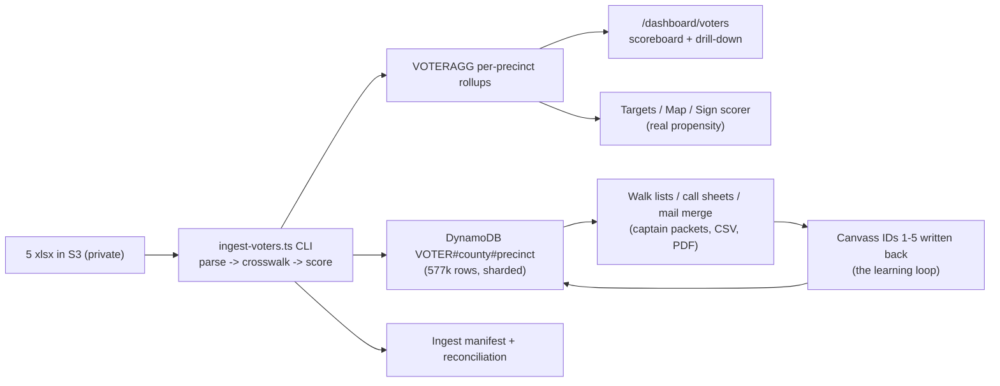

# Voter File Plan — Custody, Compliance, and the MO-02 Voter Engine

The single source of truth for how Matt Grant for Congress stores, protects, scores, and
acts on the **official MO-02 registered-voter file** (obtained via the campaign's RSMo
§115.157 Sunshine Law request): what the data actually contains, the legal lines that govern
every use, the ingest/scoring architecture, and the phased rollout that feeds doors, mail,
signs, phones, and GOTV from one scored database operated from the admin dashboard.

- **Campaign:** Matt Grant for Congress (FEC C00945394) · **Race:** U.S. House, MO-02 · primary Aug 4, 2026
- **Owner:** _[campaign manager + data lead]_ · **Last updated:** July 10, 2026 · **Status:** Phase 0-1 shipping

> **Educational information, not legal advice.** Voter-list use restrictions (RSMo 115.157)
> and telephone-solicitation rules (TCPA) below were reviewed **July 10, 2026** for
> operational planning. Consult an election-law attorney for guidance specific to your
> situation, and re-verify before any new use of the data.

---

## 1. What the file actually is (inspected 2026-07-10)

| Fact | Value |
|---|---|
| Rows | **577,366** — one row per registered voter (verified: no duplicate Voter IDs) |
| Scope | 2025-map CD-2 (every sampled row coded `25 CN 2`; the 2020-map column shows the old CN 1/2/3 mix) |
| Counties present | St. Louis (dominant), Jefferson, Washington, Crawford, Gasconade, **and Franklin** (~5-6% of rows) — see §5 reconciliation |
| Identity | Voter ID, first/middle/last/suffix |
| Address | Fully parsed residential (house/street/unit/city/zip) + mailing when different |
| Age | **Birth YEAR only** |
| Party | Blank for ~90% (Missouri has no party registration); sparse Republican/Democratic/Unaffiliated/Libertarian values |
| Geography | County, Precinct, Precinct Name, Split, Township, Ward, both district-plan columns |
| Participation | **Voter History = single most recent election only** (e.g. "11/05/2024 General", "04/07/2026 Municipal General") — NOT a full history |
| Status | Active / Inactive · plus Registration Date |
| **NOT in the file** | **No phone numbers. No emails.** No full vote history. |

Two consequences that shape everything below: (a) phone/SMS outreach cannot come from this
file directly, and (b) turnout scoring keys on **recency** (a voter whose latest vote is a
2025-26 municipal election is a habitual super-voter; a full-history append is a future
Sunshine follow-up).

## 2. Custody and access — the non-negotiables

1. **Out of git.** Canonical storage is the private S3 bucket (`voters/raw/` prefix, SSE,
   never the public CDN path) — see `docs/VOTER-FILE.md` for the upload command. The xlsx
   files were removed from the repo working tree 2026-07-10; they remain in git *history*
   until an owner runs a coordinated history purge (**open decision**).
2. **RSMo 115.157 use restriction.** The list may be used **only for political/election
   purposes** — never commercial use, never publication, never resale. Every export the
   dashboard produces is stamped with this notice.
3. **TCPA — the texting line.** No number derived from, appended to, or matched against
   this file may be broadcast-texted. The campaign's SMS pipeline texts **only** numbers
   with an explicit opt-in in the consent ledger — that gate is unchanged and absolute.
   Matched or appended phones are **call lists** (manual dial by volunteers) only.
4. **Access.** Voter pages/exports are admin-gated in the dashboard; captains receive only
   their turf's rows via generated packets. Donor-list-style hygiene applies: no forwarding
   raw exports, no personal devices for bulk copies, delete stale exports.
5. **Retention.** Refresh from the election authority rather than accumulating stale
   copies; the ingest manifest records the source file hashes and dates.

## 3. Architecture (the voter engine)

- **Rows** are sharded `VOTER#<county>#<precinctKey>` (never one giant partition), SK =
  Voter ID. **Aggregates** (`VOTERAGG`) power every dashboard/map read — voter rows are
  only queried per precinct (lists, packets, drill-downs).
- **Crosswalk**: voter-file precinct names ↔ ArcGIS map precincts ↔ Geo Hierarchy, with
  fuzzy normalization; misses are reported in the manifest, never silently dropped.
- The full phase-by-phase build plan lives with the engineering record (update log) —
  Phase 0 custody (this doc), Phase 1 ingest, Phase 2 dashboard, Phase 3 feed
  Targets/map/signs, Phase 4 walk/mail/call generators, Phase 5 canvass-ID learning loop
  and ballot chase.

## 4. Scoring — a transparent scorecard, honestly labeled

- **Turnout propensity T (0-5):** 5 = latest vote is a 2025-26 municipal/special (the
  habitual-voter proxy — the strongest signal this file carries) · 4 = 2024 General ·
  3 = 2020/2022 General · 2 = older participation · 1 = registered, none recorded ·
  0 = Inactive. Plus a `newRegistrant` flag (registered after Nov 2024).
- **Support proxy S (0-3):** explicit party where present; otherwise a precinct-level
  prior. **This is a proxy and is labeled as such everywhere it appears.** It becomes real
  data only through the learning loop: walk lists carry a 1-5 canvass-ID column, IDs are
  entered on the dashboard and written back to voter rows. A statistical model is fitted
  only after canvass labels number in the thousands — never invented before.
- **Segments** (the `workflows/voter-targeting.md` matrix, computed in one tested module):
  **MOBILIZE** (supporters who need a turnout push), **PERSUADE** (habitual voters with
  unknown lean), **BANK** (reliable supporters → light touch + ballot chase),
  **MONITOR** (opposition — no contact budget). Ballot-chase tiers activate when the
  early-vote feed arrives (`tactics/ballot-chase-program.md`).

## 5. District reconciliation (open finding)

The file's official coding places **Franklin County voters in 2025-map CD-2** (~5-6% of
rows), while this repo's earlier district descriptions said Franklin was out. The ingest
produces a per-county census from the file itself; the campaign's district docs will be
reconciled to the official coding once the count is confirmed — field plans (captain zones,
sign turf, poll coverage) may need a Franklin extension. _Resolution pending the Phase 1
report._

## 6. Channel rules at a glance

| Channel | Source | Rule |
|---|---|---|
| **Doors** (walk lists) | Voter rows per turf | Cut at 40-60 doors; canvass-ID column feeds the learning loop |
| **Mail** | Segment CSV → letterhead mail merge | Disclaimer on every piece; segment personas per `tactics/voter-personas.md` |
| **Signs** | Per-precinct propensity → sign scorer | Real voter density × traffic replaces placeholder propensity |
| **Phone** | ONLY matched (donor/volunteer records) or vendor-appended numbers | Manual-dial call sheets; append vendor = open decision |
| **SMS** | Consent ledger ONLY | **Never from the voter file.** No exceptions |
| **Email** | Not in file | Existing opt-in lists only |

## 7. See also

- [`../workflows/voter-targeting.md`](../workflows/voter-targeting.md) — the universes/matrix this engine computes
- [`../tactics/voter-personas.md`](../tactics/voter-personas.md) — mail/creative variants per segment
- [`../tactics/ballot-chase-program.md`](../tactics/ballot-chase-program.md) — chase tiers for Phase 5
- [`../workflows/gotv-plan.md`](../workflows/gotv-plan.md) — the 4-3-2-1 contact schedule the segments feed
- [`data-and-map-plan.md`](./data-and-map-plan.md) — precinct/map spine the crosswalk joins
- [`../docs/VOTER-FILE.md`](../docs/VOTER-FILE.md) — where the raw files live + upload commands
