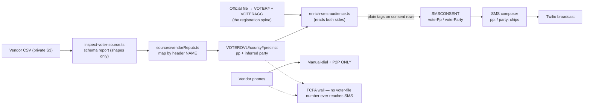

# Voter Registry Refresh — Loading a Second Source and Aiming the SMS Blast

How the campaign adds a **second voter-file source** — a commercial or party-committee export — on top of the
official RSMo §115.157 Sunshine-law spine, what that source is allowed to do, and how it sharpens the
Twilio SMS blast for the August 4 primary. The new file's value is **primary vote history**: the official
file records only a voter's single most recent election, so today's turnout score is a recency proxy, while
actual August-primary participation is the sharpest predictor of an August-primary vote. The new file does
**not** widen who can be texted — broadcast SMS stays gated on the consent ledger, without exception.

- **Campaign:** Matt Grant for Congress (FEC C00945394) · **Race:** U.S. House, MO-02 · primary Aug 4, 2026
- **Channel:** Twilio Messaging Service (SMS), toll-free +1 844-314-7912 · **Consent ledger:** `web/lib/sms/consent.ts`
- **Owner:** _[campaign manager + data lead]_ · **Last updated:** July 26, 2026 · **Status:** tooling shipped; awaiting the source file + license confirmation

> **Educational information, not legal advice.** The TCPA (broadcast-texting consent), RSMo §115.157
> (voter-list use), and vendor licensing considerations below were reviewed **July 26, 2026** for
> operational planning. Consult an election-law or telecom attorney before any new texting or phone
> program, and re-verify before changing how the list is built or used.

---

## 1. What this file is — and two things to check before trusting it

The export in hand is `broad_repub_individual_voter_2026-07-09_09_15.csv.xlsx` (~138 MiB).

**It is not the Sunshine-law file.** Missouri has **no party registration**, so the Secretary of State
cannot produce a "Republican voter" extract. A file named for a Republican audience is a commercial or
party-committee product in which "Republican" is **derived** — from primary-ballot-pull history or a
modeled partisanship score. Two consequences:

1. **Any party value here is inferred, never registered.** It is a proxy in exactly the sense the existing
   support proxy `S` is a proxy, and it is labeled as such on every surface (`web/lib/voters/party.ts`,
   and the composer chips read "(inferred)").
2. **Vendor contract terms apply on top of RSMo §115.157.** The Sunshine request did not authorize
   whatever appended contact data a vendor file may carry, so the license is its own gate (§2).

**The `.csv.xlsx` double extension means a vendor CSV was re-saved through Excel**, which caps a worksheet
at **1,048,576 rows**. A larger original would have been silently truncated. Ingest the **original CSV** —
it streams, counts exactly, and sidesteps the cap. Both the inspector and the overlay ingest print a
truncation warning when the row count lands at or near it.

## 2. Gates — resolve these before the steps they block

| Gate | Blocks | Resolution |
|---|---|---|
| **G1 — the original CSV** | §4, §5 | Locate or re-export the pre-Excel CSV; upload to `s3://$S3_ASSETS_BUCKET/voters/raw/vendor/` with `--sse AES256`. Never git, never the `public/` CDN prefix (`../docs/VOTER-FILE.md`). |
| **G2 — vendor license terms, in writing** | Phone loading only | Confirm the license permits political phone contact for this committee, and note retention/resale limits. Everything else proceeds without it. |
| **G3 — toll-free number Verified in Twilio** | The send (§7) | Unverified sends fail with carrier error 30032 (`web/docs/sms-go-live.md`). |

## 3. Architecture — an overlay, never a replacement

The overlay is a **separate DynamoDB partition** (`VOTEROVL#<county>#<precinct>`, SK = Voter ID), not a
mutation of the spine. Three reasons:

- **`VOTERAGG` is recomputed wholesale** from all official files in one pass
  ([`voter-file-plan.md`](./voter-file-plan.md) §3). Folding a filtered, Republican-only universe into that
  pass would corrupt the district denominators, the six-county census, and the chase board's
  outstanding-ballot math.
- **It is reversible.** Drop the partition and the spine is untouched.
- **Provenance stays explicit.** Every overlay row records the source file that wrote it.

The join is by **official voter ID** (exact). Rows carrying only a name + ZIP are **counted and reported,
never written** — resolving them needs the conservative matcher that drops ambiguous keys, because a wrong
match is worse than no match.

## 4. The tooling (shipped)

| Step | Command | What it does |
|---|---|---|
| **Inspect** | `npm run inspect:voter-source -- --file <csv>` | Streams the file and prints a schema report: ordered columns, inferred types, distinct values for categorical columns, phone/consent/voter-ID/vote-history/party signals, exact row count, truncation warning. **Prints shapes, never row values** — no name, address, phone, or email reaches stdout. |
| **Ingest** | `npm run ingest:voter-overlay -- --file <csv> --dry-run` | Detects the source, resolves the column mapping, maps rows, and reports match/skip counts. Then re-run without `--dry-run` to write the overlay. Idempotent by Voter ID. |
| **Enrich** | `npm run enrich:sms -- --dry-run` | Joins overlay + spine + consent ledger and writes the denormalized `voterPp` / `voterParty` tags onto opted-in consent rows. Counts only, no PII. |

**Run the inspector first and confirm the field mapping.** `web/lib/voters/sources/vendorRepub.ts` maps by
header **name** (vendor column order is not stable, unlike the official file's frozen 36-column order) using
a `FIELD_ALIASES` table of *candidate* aliases. Those aliases are a starting point, not a claim about this
export. `resolveColumns` names every field it cannot resolve, so an unconfirmed mapping **fails loudly**
rather than silently mis-reading every row.

The source detector deliberately checks for a **drifted official export before** trying the vendor adapter:
the two share field names ("County", "Voter ID", "Last Name", "Precinct"), so a drifted spine file would
otherwise satisfy the vendor adapter and be quietly loaded as an overlay.

## 5. Primary propensity — the score this file unlocks

`pp` (0–5) counts how many of the most recent August primaries a voter actually voted in, capped to read on
the same scale as the spine's turnout score `T`. It handles the encodings vendors use — `Y/N`, `X`/blank, or
a method code (`A` absentee / `E` early / `P` polls, all meaning voted) — and it never counts a general or
municipal election, which says little about primary behavior.

**Absent is not zero.** A voter with no overlay row has an *unknown* propensity and is excluded from a `pp:`
filter; a voter with `pp: 0` had the chance and didn't vote. Collapsing the two would both mislabel people
and let a filter sweep up the entire unmatched mass.

Segment definitions (**MOBILIZE / BANK / PERSUADE / PROSPECT / MONITOR**) are unchanged — this sharpens an
input, it does not move the goalposts.

## 6. Targeting parameters for the blast

The composer's target grammar gains two dimensions, joining the existing `county:` / `zip:` / `segment:` /
`district:` / `outstanding` tokens. All follow the established contract: **tokens only NARROW an already
opted-in audience, and invalid tokens are ignored**, so a tampered form can only shrink a send.

| Token | Meaning | Notes |
|---|---|---|
| `pp:<0-5>` | At least N recent August primaries | A **minimum**, not an exact match — the useful question is "who reliably votes in primaries" |
| `party:<REP\|DEM\|UNA\|OTH>` | Inferred party code | Labeled "(inferred)" everywhere it renders |
| `outstanding` | Not yet voted | Already shipped; drops only **confirmed**-banked rows |
| `county:` / `zip:` | Geography | Already shipped |

A new preset joins the "Who to reach — by likelihood to vote" dropdown: **"August-primary regulars, not yet
voted"** (`pp:2` + `outstanding`). Like every preset it expands only to tokens the resolver already
validates.

**These filters shrink the audience to *enriched* opted-ins.** A row with no value for a filtered dimension
is dropped — the same behavior the geo chips already have. The composer's live counts show the tradeoff
before a send, and the chips stay hidden entirely until enrichment has tagged someone.

## 7. What does NOT change — the TCPA wall

**No number from this file may be broadcast-texted.** Not the appended phones, not a number matched against
it. Broadcast SMS recipients come exclusively from `optedInSet()` — an explicit opt-in in the consent
ledger. This is enforced in code, not merely documented:
`web/lib/sms/audiences.voterfile-isolation.test.ts` scans every module under `web/lib/sms/` and **fails the
build** if any voter-file surface is referenced. That is why the enrichment job lives in `lib/reports/` and
writes plain scalar tags onto consent rows, and why the composer's party-code list is a hand-copied mirror
of `lib/voters/party.ts` rather than an import (a test asserts the mirror can't drift).

Vendor phones are **manual-dial and P2P only**, and only after G2 clears. The overlay ingest reports how
many numbers it saw and loads none of them.

**The real lever remains the opt-in list.** Broadcast reach is capped by the consent ledger, not by the
voter file — a bigger registry does not add a single textable number. What this file expands is the *call*
universe, so every call, door, and event in the final week should carry the keyword ask
(*Text GRANT to +1 844-314-7912*), which records consent automatically through the inbound webhook. Track
the curve with `web/lib/reports/optinGrowth.ts`.

## 8. Operational limits that shape a blast

| Limit | Value | Consequence |
|---|---|---|
| Send window | **9am–8pm Central** (`withinSendWindow()`) | Tighter than the 8am–9pm general rule; the drain no-ops outside it and resumes. Don't override it. |
| Throughput | `SMS_DRAIN_BATCH` (10) × `SMS_DRAIN_BATCHES_PER_RUN` (3) = **30/min** default | ~20k/day at default. Tunable, but Twilio toll-free throughput (~3 msg/s) is the real ceiling. |
| Campaign size | `recipients[]` lives in **one DynamoDB item (400 KB)** | Roughly **10–13k recipients per campaign**. A larger blast must be split. |
| ETA | `estimateDrainCompletion()` | Shown in the composer — check it so a GOTV text doesn't land after polls close. |
| Encoding | GSM-7 vs UCS-2 | One smart quote, em dash, or emoji halves the per-segment budget (160 → 70) and roughly doubles cost. The composer flags offenders. |

Cost inputs are real, not placeholders: base 0.79¢/segment + carrier 0.45¢/segment, 5% reply rate
(`SMS_PRICING_DEFAULTS`). Cadence follows [`../workflows/gotv-plan.md`](../workflows/gotv-plan.md) (4-3-2-1)
and [`../messaging/sms-texting.md`](../messaging/sms-texting.md) §8 — daily GOTV is acceptable in the final
week. Use the send calendar already in
[`sms-conversational-interface-plan.md`](./sms-conversational-interface-plan.md) §8 rather than authoring a
competing schedule, and watch the opt-out guardrails between sends (under ~2% healthy, 2–5% caution, over
~5% stop and diagnose).

**Known measurement gap:** the Twilio status webhook persists terminal states only for SIDs it recognizes
(the 1:1 threads), so **broadcast delivery receipts are discarded**. Read delivery rate from Twilio
Messaging Insights, not the dashboard.

## 9. Verification

Automated, from `web/`: `npm run lint` · `npx tsc --noEmit` · `npm run test` (the isolation guard must
pass) · `npm run compliance` · `npm run build`.

End-to-end, in order:

1. `npm run inspect:voter-source -- --file <csv>` → confirm **no truncation warning**, then confirm the
   field mapping against the report's column list.
2. `npm run ingest:voter-overlay -- --file <csv> --dry-run` → match/skip counts look right, no header
   problem. Watch the "no voter ID" count: a large number means the vendor didn't key on the state ID and
   the join will underperform.
3. Live ingest → confirm the overlay row and precinct-partition counts, and the precinct-match warning.
4. `npm run enrich:sms -- --dry-run`, then live → primary-propensity and party tag counts become non-zero.
5. `npx tsx scripts/twilio-fund-report.ts --budget <real> --cost-cents <real>` → the opted-in total must
   reconcile against the composer's "All opted-in" count.
6. Composer → apply each new chip and confirm the live count falls as tokens narrow.
7. **Send to a staff test number first** via `/api/sms/test` before any real broadcast.

Only an `admin` can send a full-list blast (`sendSms`); captains hold `draftSms` + `sendTeamSms`. Confirm
whoever presses send on Aug 3–4 has that role beforehand.

## 10. See also

- [`voter-file-plan.md`](./voter-file-plan.md) — the governing custody, scoring, and lineage doc; §2.3 is the TCPA wall
- [`sms-targeting-plan.md`](./sms-targeting-plan.md) — the send-side targeting architecture this extends
- [`twilio-fund-plan.md`](./twilio-fund-plan.md) — the budget-allocation companion
- [`sms-conversational-interface-plan.md`](./sms-conversational-interface-plan.md) — §8 send calendar to Aug 4
- [`../messaging/sms-texting.md`](../messaging/sms-texting.md) — compliant templates, opt-in language, P2P scripts
- [`../docs/VOTER-FILE.md`](../docs/VOTER-FILE.md) — where source files live and how to upload them
- [`../docs/RUNBOOK-voter-ingest-and-twilio-fund.md`](../docs/RUNBOOK-voter-ingest-and-twilio-fund.md) — the spine ingest walkthrough

---

*This is educational information, not legal advice. TCPA rules, carrier requirements, vendor license terms,
and FEC guidance change and vary by situation. Consult a campaign finance or telecommunications attorney
before launching a new texting or phone program.*
