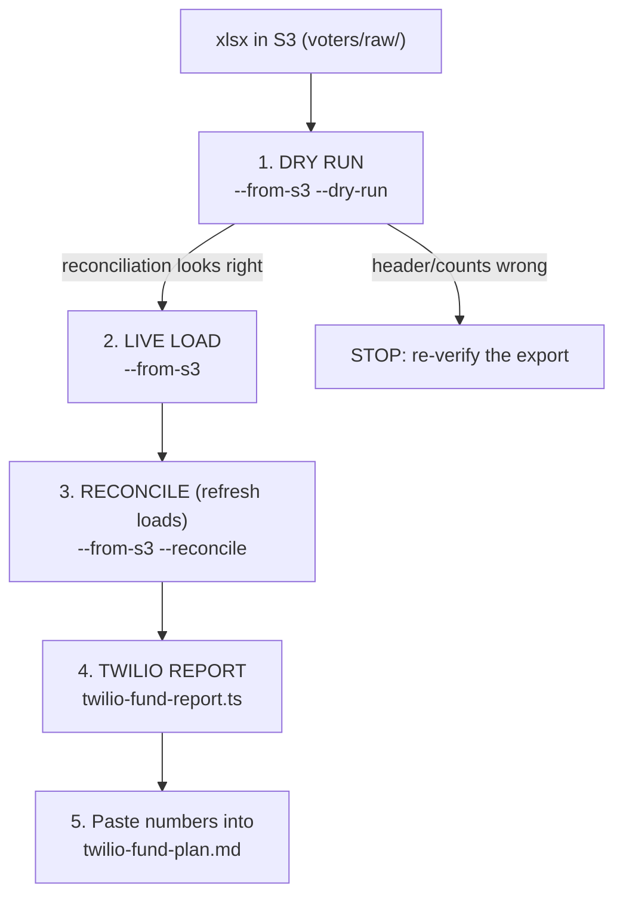

# Runbook — First real voter ingest & the Twilio-fund report

A step-by-step operational guide for two production tasks that need real AWS access: (1) loading the
official MO-02 voter file into DynamoDB for the first time, and (2) generating the **real** numbers for
the Twilio-fund report to Matt. Both are read/compute-heavy but low-blast-radius; the ingest is
idempotent and the report is read-only. Reference docs: [`VOTER-FILE.md`](./VOTER-FILE.md) (storage +
custody), [`../candidate/voter-file-plan.md`](../candidate/voter-file-plan.md) (the governing rules),
and [`../candidate/twilio-fund-plan.md`](../candidate/twilio-fund-plan.md) (the report).

> **Custody reminder (RSMo §115.157 / TCPA).** The voter file is political-use-only, never texted, and
> its PII never leaves the store or enters git. Any local copy you download is short-lived — delete it
> when done. See `voter-file-plan.md` §2.

---

## 0. Prerequisites

- AWS credentials with access to the campaign's DynamoDB table and the private S3 assets bucket.
- Env: `export DYNAMODB_TABLE=matt-grant AWS_REGION=us-east-1` (and `S3_ASSETS_BUCKET=<bucket>` for `--from-s3`).
- Node + the repo checked out; from `web/` run `npm ci` once (the stock ingest and the report use `tsx`).
- Confirm the five xlsx are in S3: `aws s3 ls "s3://$S3_ASSETS_BUCKET/voters/raw/"` → `MO02_VotersList_Part{1..5}_of_5.xlsx`.



---

## 1. Dry run first (no writes)

Always dry-run before a live load. It fetches from S3, **validates each file's header/column order**
(refuses on drift), parses + scores every voter, and prints the reconciliation report — writing nothing.

```bash
cd web
DYNAMODB_TABLE=$DYNAMODB_TABLE AWS_REGION=$AWS_REGION S3_ASSETS_BUCKET=$S3_ASSETS_BUCKET \
  npx tsx scripts/ingest-voters.ts --from-s3 --dry-run
```

Check the output before proceeding:
- `voters: ~577,366` with `skipped unparseable: 0` (or a tiny number).
- County census matches `voter-file-plan.md` §5 (St. Louis ~70%, Franklin ~14%, …).
- **No `HEADER MISMATCH`.** If you see one, STOP — the export's columns drifted; re-verify the file
  against the expected 36 columns. Only use `--skip-header-check` if you have manually confirmed the
  order is actually correct.

## 2. Live load

Same command without `--dry-run`. Idempotent: if the exact files were already ingested (by SHA-256) it
is a no-op — add `--force` only to deliberately reload.

```bash
DYNAMODB_TABLE=$DYNAMODB_TABLE AWS_REGION=$AWS_REGION S3_ASSETS_BUCKET=$S3_ASSETS_BUCKET \
  npx tsx scripts/ingest-voters.ts --from-s3
```

Confirm the tail: `WROTE <N> voter rows (+ <N> id-index rows), <P> precinct aggregates, 1 manifest.`
Then spot-check `/dashboard/voters` — the scoreboard, county mix, and precinct table should populate.

**Constrained shell (AWS CloudShell, ~1 GB)?** Use the pre-bundled loader instead (one file per process,
throttle-backoff) — see [`VOTER-FILE.md`](./VOTER-FILE.md) "Low-memory path". It now validates headers too.

## 3. Reconcile on refresh loads (optional, later)

On a **later** refresh (a new export from the election authority), add `--reconcile` to report voters who
were in the prior load but are absent now (moved/deregistered). It snapshots the prior voter-ID set before
writing, then prints the departed count + a sample. **Reported only — never auto-deleted** (retiring a row
is a deliberate decision, `voter-file-plan.md` §2.5). Skip this on the very first load (nothing to compare).

```bash
DYNAMODB_TABLE=$DYNAMODB_TABLE AWS_REGION=$AWS_REGION S3_ASSETS_BUCKET=$S3_ASSETS_BUCKET \
  npx tsx scripts/ingest-voters.ts --from-s3 --reconcile
```

The manifest also records a cheap count delta (`+N net registrants`) vs the last load, with no extra reads.

---

## 4. Generate the real Twilio-fund numbers

Read-only. It joins the opted-in SMS audience to voter scores and prints an aggregate cohort + budget
allocation table (**counts only — no PII, no recipient list**). Runs against the same table.

```bash
cd web
DYNAMODB_TABLE=$DYNAMODB_TABLE AWS_REGION=$AWS_REGION \
  npx tsx scripts/twilio-fund-report.ts --budget 2000 --cost-cents 2
# tune --budget (dollars) and --cost-cents to your real SMS budget + per-message cost.
# add `--out ../candidate/_twilio-fund-appendix.md` to write the table to a file.
```

Reconcile a couple of numbers before trusting it: the "opted-in" total should match the SMS composer's
"All opted-in" count, and every figure is aggregate. The voter file is never texted — matched-but-not-
opted-in voters feed the manual-dial call program, not SMS.

## 5. Put the numbers into Matt's report

Replace the **illustrative placeholders** in
[`../candidate/twilio-fund-plan.md`](../candidate/twilio-fund-plan.md) §3–§4 with the generated cohort and
allocation tables. Keep the framing (TCPA constraint, GOTV-core-first priority, list-growth section) and
the educational disclaimer. Re-run and refresh the numbers whenever the opt-in list or the voter file
changes materially.

---

## Troubleshooting

| Symptom | Fix |
|---|---|
| `Set DYNAMODB_TABLE` / `Set S3_ASSETS_BUCKET` | Export the env var (§0). |
| `HEADER MISMATCH` | Column order drifted — re-verify the export; `--skip-header-check` only after manual confirmation. |
| `Already ingested … Nothing to do` | Same files already loaded (idempotent). Use `--force` to reload deliberately. |
| Writes throttle persistently | Switch the table to on-demand (PAY_PER_REQUEST) billing and re-run — ingest is idempotent. |
| OOM on a small shell | Use `loadvoters.cjs` (one file per process) — see `VOTER-FILE.md`. |
| Report shows 0 opted-in | The consent ledger is empty (no opt-ins yet) — expected pre-launch; see the report's list-growth section. |
