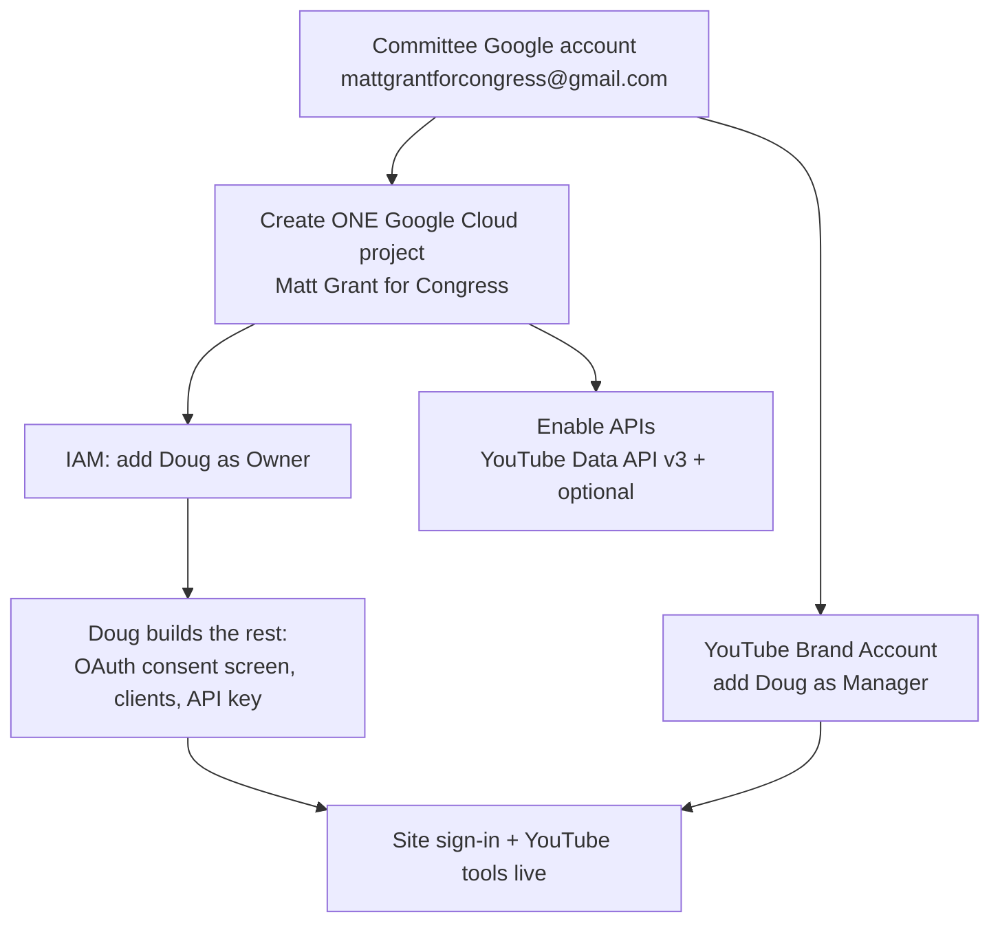

# Google & YouTube setup — for Matt to create

So the **committee owns its own Google services** (cleaner for FEC + continuity), please set
these up using the **committee Google account** (`mattgrantforcongress@gmail.com`) and the
committee card. Everything below lives in **one Google Cloud project** — and the handoff is
simple: **add me (Doug) as a member of that project** and I build all the credentials
myself. You never have to paste a key anywhere. The only thing project membership doesn't
cover is the YouTube **channel** itself, so there's one extra step for that at the end.

This guide covers four things:

1. **YouTube Data API** — read/manage channel data
2. **YouTube upload/publish (OAuth)** — post to the channel from our tools
3. **Google sign-in (OAuth)** — "Sign in with Google" on the campaign site
4. **Other Google APIs** — Analytics, Search Console, Gmail, Calendar (optional, later)

---

## Step 1 — Confirm the committee Google account

- Use the committee Gmail, **`mattgrantforcongress@gmail.com`** — not a personal account.
  This keeps ownership with the committee if staff changes.
- Make sure the campaign's **YouTube channel is a Brand Account** (a shareable channel owned
  by the account, not a personal channel). A Brand Account is what lets you add managers
  without sharing the password. If the channel isn't a Brand Account yet, that's fine — note
  it and I'll advise on moving it.

---

## Step 2 — Create the Google Cloud project + add me as Owner

This is the main step. Once I'm a member, I create the login app, the YouTube credentials,
and the API key myself.

1. Go to **<https://console.cloud.google.com>** and sign in with the committee account.
2. Top bar → project dropdown → **New Project**. Name it **"Matt Grant for Congress"** →
   **Create**. (Jot down the **Project ID** it generates and send it to me.)
3. Left menu → **IAM & Admin → IAM** → **Grant access**.
4. In **New principals**, enter **my Google email** (I'll give it to you), set **Role** to
   **Owner**, and click **Save**.

> **That's the whole handoff.** With Owner access I can do everything else in the project —
> you don't need to touch credentials, scopes, or redirect URLs.

**Billing:** the services here (YouTube Data API, Google sign-in) run on **free quotas** —
you do **not** need to add a card to get started. If we later add something that needs
billing, I'll flag it first.

---

## Step 3 — Enable the APIs

Left menu → **APIs & Services → Library** → search each one → **Enable**. You can do this, or
leave it to me once I'm a member — either works.

| API | What it's for | Needed? |
|---|---|---|
| **YouTube Data API v3** | Read channel/video stats, manage and upload videos | **Required** |
| Google Analytics Data API | Website traffic reporting | Optional (later) |
| Search Console API | Search ranking / indexing data | Optional (later) |
| Gmail API | Send campaign email via the committee inbox | Optional (later) |
| Google Calendar API | Sync events to a campaign calendar | Optional (later) |
| People API | Contact/profile info tied to Google sign-in | Optional (later) |

Only **YouTube Data API v3** is needed now. The rest use the **exact same** "Library →
Enable" process whenever we want them.

---

## Step 4 — What I set up once I'm a member *(FYI — no action needed from you)*

So you know what the access is for, here's what I configure in the project after Step 2:

- **OAuth consent screen** — the "Matt Grant for Congress wants access" screen users see.
  Includes the app name, support email, logo, and the campaign domain.
- **OAuth client ID + secret** — the actual "Sign in with Google" / YouTube app credentials.
  The redirect URLs these need are **mine** (the login system's), which is exactly why it's
  easier for me to create them than to mail keys back and forth.
- **API key** — for reading public YouTube data (view counts, etc.).
- **Test users + scopes** — see the next two steps for why these matter.

---

## Step 5 — YouTube channel access (the one extra step)

Project membership does **not** give access to the actual YouTube **channel** — that's
managed on YouTube, not in Google Cloud. To let our tools upload and manage videos, add me
as a manager of the channel:

1. Go to **<https://youtube.com>** signed in as the committee account.
2. **Settings** (gear) → **Add or remove managers** → it opens the **Brand Account** details.
3. **Manage permissions** → invite **my Google email** as a **Manager** (or **Owner**).

> Why: uploading/managing via the API acts on whatever account authorizes it, and that
> account must have access to the campaign channel. This is how it gets that access. (This
> only works if the channel is a **Brand Account** — see Step 1.)

---

## Step 6 — Heads-up on Google's review (start early)

Some of this is instant; one part needs Google's review, so it's worth knowing up front:

- **Google sign-in** (scopes `openid`, `email`, `profile`) is **non-sensitive** — no special
  verification. Public sign-in works as soon as the consent screen is published.
- **YouTube upload/manage** (scopes `youtube`, `youtube.upload`) are **sensitive/restricted**.
  While the app is in **Testing**, only people I add as **test users** (up to 100) can
  authorize it — which is enough for us to build and run the channel tools. Using those
  scopes for the **general public** later requires **Google's OAuth app verification**, which
  can take a while, so I'll start that process early if we need it.

### Scopes reference

| Feature | OAuth scope(s) | Sensitivity |
|---|---|---|
| Site "Sign in with Google" | `openid`, `email`, `profile` | Non-sensitive (no review) |
| YouTube read-only data | `youtube.readonly` | Sensitive |
| YouTube manage + upload | `youtube`, `youtube.upload` | Restricted (verification for public use) |

---

## Send-back summary

When you're done, just tell me:

1. **Added Doug as Owner** on the Google Cloud project (and the **Project ID**).
2. **Added Doug as a Manager** on the YouTube Brand Account.
3. **YouTube Data API v3 enabled** (or "left it for you").

That's it — I build the OAuth apps, the API key, and wire it all into the site from there.
