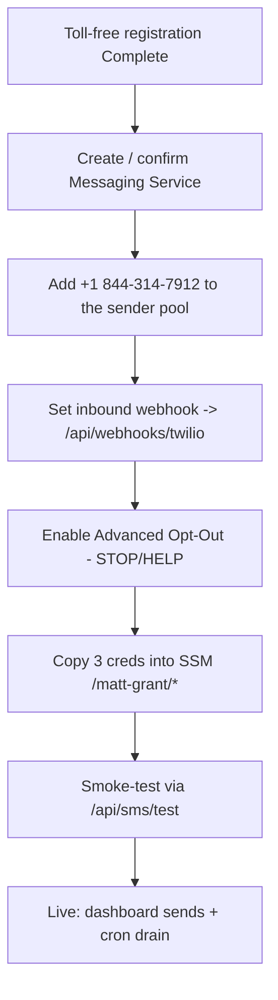

# Twilio Toll-Free Setup — Finish the Phone Number (matt-grant stack)

> Status: **App implemented; number pending final wiring** · Sender: **toll-free +1 844-314-7912**
> · Send path: **Twilio Messaging Service** (never a raw number) · Secrets: **SSM `/matt-grant/*`**

## Where we are

Twilio's console shows the toll-free number **(844) 314-7912** with **Compliance profile:
Complete** and **Toll-free registration: Complete** — so the multi-day carrier review is done
and the number can send political SMS. Twilio now prompts *"Finish setting up your phone number
… configure it in Numbers and Senders."* This doc is that finish step: attach the verified number
to a Messaging Service, point its inbound webhook at the app, and load the three credentials the
app reads. Nothing here re-does registration; it wires an approved number to the running site.

Why toll-free (not A2P 10DLC): the campaign texts from a **toll-free** sender, so the carrier
review is **Toll-Free Verification** — 10DLC applies only to local 10-digit long codes. See
[`docs/CAMPAIGN-ACCOUNTS.md`](../CAMPAIGN-ACCOUNTS.md) §3.



## What the app expects

The app never sends from a bare number — it POSTs to a **Messaging Service** (`MG…` SID), mirroring
`web/lib/sms/send.ts`. Three secrets gate the whole SMS surface; with any missing, `smsEnabled()`
is false and every send is a graceful no-op (like SES):

| Secret (SSM `/matt-grant/…`) | Format | Where in Twilio |
|---|---|---|
| `TWILIO_ACCOUNT_SID` | `AC…` | Console → Account Info |
| `TWILIO_AUTH_TOKEN` | opaque | Console → Account Info (keep secret) |
| `TWILIO_MESSAGING_SERVICE_SID` | `MG…` | Messaging → Services → your service |

`getSecret()` reads env first, then SSM `/matt-grant/<NAME>`, and caches ~5 min — so a rotated
token self-heals without a redeploy (`web/lib/ssm.ts`). Keep the raw creds out of the build:
store them in SSM, not in `.env.production`.

## Steps

1. **Create / confirm the Messaging Service.** Twilio Console → **Messaging → Services**. If one
   already exists for the campaign, open it; otherwise **Create Messaging Service** → use case
   *Notifications / Marketing* (political) → name it e.g. `Matt Grant for Congress`.

2. **Add the number to the sender pool.** In the service → **Sender Pool → Add Senders → Phone
   Number** → select **+1 844-314-7912**. A toll-free number must be **Verified** before it will
   send; an unverified sender fails with **error 30032**.

3. **Point inbound messages at the app.** In the service → **Integration**, set
   *Incoming Messages* to **Send a webhook**:
   - **Request URL:** `https://mattgrantforcongress.org/api/webhooks/twilio` · **HTTP POST**
   - Leave the fallback URL blank (or the same URL).

   The route validates the `X-Twilio-Signature` HMAC against `TWILIO_AUTH_TOKEN` and rejects
   anything unsigned (403), so this URL is safe to expose (`web/app/api/webhooks/twilio/route.ts`).

4. **Enable Advanced Opt-Out.** In the service → **Opt-Out Management → Advanced Opt-Out** so the
   carrier auto-replies to **STOP/HELP**. The app records the opt-out/opt-in on its side but does
   **not** double-reply to STOP/HELP (Twilio already does) — it replies only to START and to the
   opt-in keyword. Keep the default keyword sets (STOP/UNSUBSCRIBE/CANCEL/END/QUIT; START/YES/UNSTOP).

5. **Text-to-join keyword.** The app treats **MATT** (env `SMS_OPTIN_KEYWORD`) as the opt-in
   keyword and sends the double-opt-in welcome. No Twilio-side keyword auto-response is needed —
   the webhook handles it. Only change `SMS_OPTIN_KEYWORD` if the campaign picks a different word.

6. **Load the credentials into SSM.** Fill the three Twilio values in
   [`scripts/load-ssm-params.sh`](../../scripts/load-ssm-params.sh) and run it (writes
   `SecureString` params under `/matt-grant/*`). Redeploy — or just wait for the ~5-min secret
   TTL — and the SSR Lambda picks them up.

## Verify

```bash
# 1. Opt your own mobile in: text  MATT  to +1 844-314-7912 → expect the welcome reply.
#    (Confirms inbound webhook + signature + consent write.)

# 2. Send yourself one real text (consent-gated; only works after step 1):
curl -X POST https://mattgrantforcongress.org/api/sms/test \
  -H "Authorization: Bearer $CRON_SECRET" \
  -H 'content-type: application/json' \
  -d '{"to":"+1YOURCELL","body":"Test from Matt Grant for Congress. Reply STOP to opt out."}'
# → {"ok":true,"sent":true,"sid":"SM…"}

# 3. Reply STOP → Twilio auto-confirms; the app records the opt-out (a later /api/sms/test 409s).
```

If `/api/sms/test` returns `503 Twilio not configured`, a secret is missing or hasn't propagated;
`409 not opted in` means step 1 didn't land for that number.

## Checklist

```
[ ] Toll-free +1 844-314-7912 shows Verified (not Pending/In Review)
[ ] Number is in a Messaging Service sender pool (MG… SID)
[ ] Incoming-message webhook = https://mattgrantforcongress.org/api/webhooks/twilio (POST)
[ ] Advanced Opt-Out enabled (STOP/HELP auto-handled)
[ ] TWILIO_ACCOUNT_SID / TWILIO_AUTH_TOKEN / TWILIO_MESSAGING_SERVICE_SID in SSM /matt-grant/*
[ ] "MATT" opt-in round-trips (welcome reply received)
[ ] /api/sms/test sends to an opted-in number; STOP then suppresses it
```

## How it runs once live

- **Outbound blasts** queue from the dashboard (`/dashboard/sms`) and drain via the per-minute
  cron `POST /api/cron/sms-drain` — quiet-hours aware, bounded batches (`web/lib/sms/campaigns.ts`).
- **Inbound** (STOP/START/HELP/keyword + every reply) flows through the webhook into consent and
  conversation logs (`web/lib/sms/{consent,conversations}.ts`).
- **Compliance content** (verification copy, consent language, templates, TCPA/FEC checklist)
  lives in [`messaging/sms-texting.md`](../../messaging/sms-texting.md) — every send needs the
  sender ID, the *Paid for by Matt Grant for Congress.* disclaimer, and STOP language.

## Notes

- **Not exercised here** — final wiring needs the live Twilio account + real creds; no live send
  was performed in this environment. Steps above are the operator runbook.
- **Cost** — pay-as-you-go per message + a small monthly number fee; log it as a campaign
  disbursement (see `messaging/sms-texting.md` §expenditures).

---

*This is educational information, not legal advice. Carrier requirements, TCPA rules, and FEC
guidance change — verify current requirements with Twilio, the FCC, the FEC, and a campaign
finance or telecommunications attorney before sending. Last reviewed: 2026-07-08.*
</content>
</invoke>
