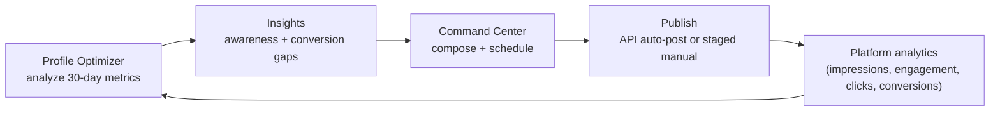

# Digital Footprint Strategy — Command Center + Profile Optimizer

How the campaign's two digital-operations tools work **together** to dominate the online conversation in MO-02: the **Social Command Center** (publish + schedule once to every channel) is the *output engine*, and the **Profile Optimizer** (analyze + recommend) is the *feedback loop* that tells you where to push next. This guide is the operating doctrine that connects them. The tools live in the web app at `/dashboard/social` (admin only); see `web/docs/social-command-center.md` for the build details.

> **Educational information, not legal advice.** FEC disclaimer rules cited here are verified as of 2026-06-22; confirm with a campaign-finance attorney before relying on them.

---

## The closed loop

"Dominating a digital footprint" is not posting more — it's a measurable loop where every post is informed by the last. The two tools form that loop:

1. **Measure** — enter each platform's last-30-day numbers into the Profile Optimizer.
2. **Diagnose** — it returns a per-channel health score, a single *footprint index*, and the highest-leverage move per channel (awareness vs. conversion).
3. **Act** — pull a post from the 50-post content calendar (or write one) in the Command Center; the live per-channel preview enforces the schema before it ships.
4. **Publish** — auto-post via API where credentials are wired, or stage for one-tap manual posting where they're not.
5. **Re-measure** — next cycle, the index moves. Track it over time; that trend line *is* footprint domination.

---

## The two dimensions: awareness and conversion

Every recommendation the optimizer makes maps to one of two goals. Confusing them is the most common campaign-digital mistake.

| Dimension | Question it answers | Signals the optimizer reads | Levers |
|---|---|---|---|
| **Awareness** | Are we reaching *beyond* our own followers? | Amplification (impressions ÷ followers per post), engagement rate, reach | Trending/issue hashtags, tagging coalitions, resharing top posts to Stories, short video, posting at peak windows |
| **Conversion** | Does attention turn into *action*? | Click-through (link clicks ÷ profile visits), conversion rate (conversions ÷ clicks) | One clear CTA per post, landing-page match (donate→WinRed, volunteer→/act), reduced form friction, link-in-bio hygiene |

Awareness without conversion is vanity; conversion without awareness is a ceiling. The footprint index weights both, plus **coverage** (how many channels you're actually active on) — an unclaimed channel is a gap a rival fills.

---

## The footprint index

A single 0–100 number so progress is legible at a glance:

- **60%** average channel *health* (engagement, amplification, cadence, click-through, conversion vs. industry rules of thumb).
- **40%** *coverage* — breadth across the major channels.

Because coverage is weighted, the fastest early wins are usually **claiming and activating a missing channel**, not squeezing a few more points out of one you already run. The optimizer lists your presence gaps explicitly.

> The optimizer's thresholds are **industry rules of thumb, not Matt-specific targets or predictions.** Tune them in `lib/social/optimize.ts` as you learn what actually converts in MO-02.

---

## How the Command Center enforces quality at the source

Domination is as much about *not* shipping weak posts as shipping strong ones. The composer scores every draft against each selected channel **before** it goes out:

- **Fit** — characters vs. the channel limit (hard error if over) and the feed-truncation point (front-load the hook).
- **Hashtags** — within the recommended range and under the platform cap.
- **CTA** — one clear ask is present.
- **Media** — an image is attached (posts with media reach further).
- **Compliance** — the FEC **"Paid for by Matt Grant for Congress"** line is present. An on-brand graphic carries it automatically; on character-limited formats the FEC's *Adapted Disclaimer* (shortened sponsor ID + link to the full disclaimer) applies. *(Verified 2026-06-22 against fec.gov.)*

---

## Operating cadence

| Frequency | Action |
|---|---|
| **Daily** | Work the calendar — the 50-post countdown has a slot per day to Election Day. Clear the "Ready to post" queue for manual channels. Reply in the first hour after posting. |
| **Weekly** | Run the Profile Optimizer. Read the top moves. Shift next week's mix toward the lever that's lagging (awareness vs. conversion). |
| **Monthly** | Re-check the footprint index trend and the channel schema (`CHANNELS`) against current platform limits — they drift. Decide whether to activate a missing channel. |

---

## Guardrails (non-negotiable)

This toolkit is for **authentic, compliant** reach. It does **not** support — and the campaign will not use — fake engagement, bought followers, astroturfed comments, undisclosed paid promotion, or impersonation. Domination here means *organic relevance done consistently and within the law*, not manipulation.

> Educational information, not legal advice. Consult a campaign-finance attorney or the FEC for guidance specific to your situation.
