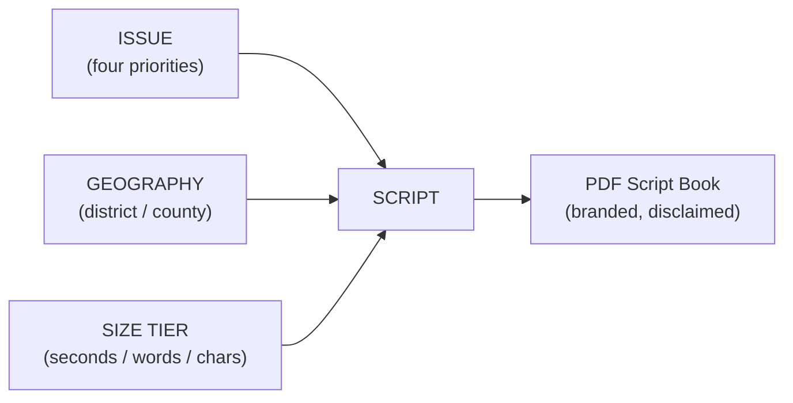

# Script Library — Sized, Geo-Targeted Campaign Scripts

A system for producing Matt Grant's campaign **scripts** at the right size for
every channel and the right local frame for every audience. It pairs each of
Matt's four priorities with the communities of Missouri's 2nd District and
renders them at a defined size — by run-time (seconds/minutes), word count, or
character count — then assembles them into a print-ready PDF **Script Book**.
The runnable generator lives in `tools/script-generator/`; this file is the
reference that explains the sizing standard and the issue × geography matrix.

The core idea: a script is the intersection of three choices.



---

## 1. The three axes

### Issues (from `candidate/platform.md`)

| Key | Issue | Core message |
|---|---|---|
| `family-court` | Family-Court Corruption & the CHILD Protection Act | Eliminate corruption in the family court system — Matt's signature cause and bill |
| `term-limits` | Term Limits for the House & Senate | Term limits for both chambers, applied with a grandfather clause |
| `smaller-government` | A Smaller Federal Government | A hiring freeze and early-retirement packages |
| `lower-taxes` | Lower Taxes | Lower taxes by cutting fraud, waste, and the number of government employees |

Scripts use only these documented positions — no new policy, statistics,
endorsements, or party labels.

### Geographies (from `candidate/data-and-map-plan.md`)

| Key | Geography | Level |
|---|---|---|
| `mo02` | Missouri's 2nd District | district |
| `stlouis` | St. Louis County (western/central) | county |
| `jefferson` | Jefferson County | county |
| `washington` | Washington County | county |
| `crawford` | Crawford County | county |
| `gasconade` | Gasconade County | county |

Localization uses **safe, real anchors only** (county name and character).
Anything finer than a county — a specific school district, zip code, or
courthouse — is left as a clearly labeled `[…]` merge token for the team to fill
in, never an invented fact.

### Size tiers (the sizing standard, from `sizing.py`)

Conversion baseline: broadcast reads ~150 wpm, stump delivery ~105 wpm
(with pauses), conversational contact ~130 wpm. Broadcast spots reserve ~6
seconds for the spoken "stand by your ad" + "Paid for by" disclaimer, so the
*copy* budget is the spot length minus that reserve.

| Family | Tier | Budget | Disclaimer in this tier |
|---|---|---|---|
| Broadcast | `video_15` | :15 spot | On-screen "Paid for by…" final frame + approval |
| Broadcast | `video_30` / `radio_30` | :30 spot | Spoken approval + "Paid for by…" |
| Broadcast | `radio_60` / `video_60` | :60 spot | Spoken approval + "Paid for by…" |
| Speech | `speech_1` / `speech_3` / `speech_5` | 1 / 3 / 5 min | Live — none required |
| Social | `social_x` | ≤ 280 characters | In copy |
| Social | `social_sms` | ≤ 160 characters | Abbreviated, in copy |
| Social | `social_reel` | ~65-word caption | In copy |
| Voter contact | `door` | ~80 words (~45–60s) | Verbal ID — none required |
| Voter contact | `phone` | ~95 words | Verbal ID — none required |
| Voter contact | `text_p2p` | ≤ 320 characters | Abbreviated, in copy |

Each script is checked against its budget at build time and stamped on the page
(e.g. *"≈ 68 words / ~27s of copy — :30 Radio Spot (copy budget ~24s) — on
size"*).

---

## 2. Generating the Script Book

The full book is `4 issues × 6 geographies × 14 size tiers`. Generate it, or any
scoped subset, with the Python generator:

```bash
cd tools/script-generator
pip install reportlab            # same dependency as tools/pdf-letterhead/

python3 script_book.py --out scriptbook.pdf                 # full book
python3 script_book.py --issue family-court --format broadcast
python3 script_book.py --geo stlouis,jefferson --tier radio_30
python3 script_book.py --list                               # all valid keys
```

The PDF reuses the campaign's branded letterhead engine
(`tools/pdf-letterhead/brand_letter.py`): the masthead, the issue/size/geo
header, the script body, the on-air or in-copy disclaimer, and the committee
"Paid for by…" footer on every page. A length-QA report prints after each run.

Slash commands: `/script [issue] [size] [geo]` for a single script and
`/scriptbook` for the full PDF (see `commands/commands.md`).

---

## 3. Compliance

- Every page carries **"Paid for by the Matt Grant for Congress Committee."**
- Broadcast scripts include the candidate-approval line ("I'm Matt Grant…and I
  approve this message") and the on-air/on-screen "Paid for by…" treatment;
  social and text tiers carry the disclaimer in the copy, counted toward the
  character limit. Disclaimer language follows `tools/disclaimer-generator.md`.
- Scripts represent Matt's documented positions faithfully and add nothing
  beyond `candidate/platform.md`.

---

> **EDUCATIONAL / NONPARTISAN DISCLAIMER:** This is educational information, not
> legal advice. Disclaimer requirements and any Missouri-specific rules should be
> confirmed with a campaign-finance attorney or your filing agency before any
> script is aired, mailed, or published. The underlying skill is a nonpartisan
> campaign toolkit; it documents the candidate's platform faithfully and does not
> editorialize.
