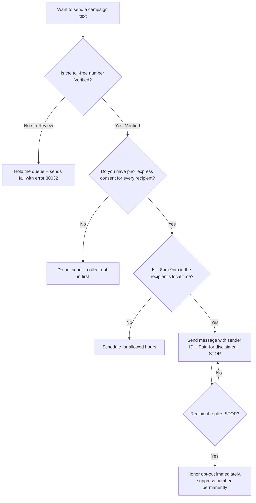
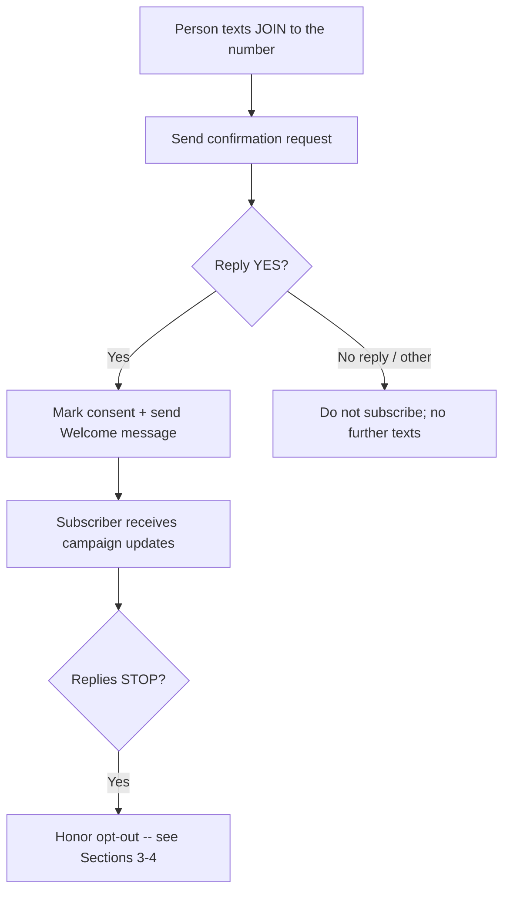
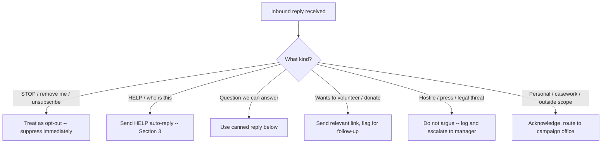

# SMS / Text Messaging Compliance & Templates

Everything the campaign needs to run compliant text messaging for Matt Grant for Congress: carrier verification content, opt-in/consent language, ready-to-send message templates, and a TCPA + FEC compliance checklist. Built for the campaign's Twilio toll-free sender (+1 844-314-7912) operating under the "Matt Grant for Congress" Messaging Service. Every template carries the required FEC disclaimer (*Paid for by Matt Grant for Congress.*) and STOP opt-out language.



---

## 1. Toll-Free Verification — Submission Content

Use this content if Twilio asks for more detail during Toll-Free Verification review, or if the request bounces and needs resubmission. All values come from documented campaign facts only.

### Business / entity information

| Field | Value |
|---|---|
| Legal entity / business name | Matt Grant for Congress |
| Entity type | Federal political committee (candidate committee) |
| FEC committee ID | C00945394 |
| Use case category | Political / advocacy messaging |
| Business address | 1625 Mason Knoll Rd, St. Louis, MO 63131 |
| Contact email | mattgrantforcongress@gmail.com |
| Contact phone | (314) 255-7760 |
| Toll-free number | +1 844-314-7912 |

### Use-case description (paste into the form)

> Matt Grant for Congress is the authorized federal campaign committee (FEC ID C00945394) for Matt Grant, a candidate for the U.S. House of Representatives in Missouri's 2nd Congressional District (MO-02). We send campaign updates, event invitations, volunteer coordination, and fundraising messages to supporters who have opted in to receive text messages from the campaign. All messages identify the sender and include "Reply STOP to opt out." Message volume is low-to-moderate and tied to the 2026 election cycle.

### Opt-out / help language

> Recipients can opt out at any time by replying STOP; we honor opt-outs immediately and permanently suppress the number. Replying HELP returns campaign contact information.

---

## 2. Opt-In / Consent Description

Carriers and the TCPA both require that you can show *how* and *where* each recipient consented before you text them. Paste the relevant description into the verification form, and keep records of every opt-in source.

### Consent description (for the verification form)

> Supporters opt in to receive text messages from Matt Grant for Congress through one or more of the following: (1) submitting their mobile number on the campaign website with a checkbox/notice indicating they agree to receive campaign text messages; (2) texting a keyword to our number to subscribe; (3) providing their number on a paper or digital volunteer/supporter sign-up that includes SMS consent language; or (4) entering their number at a campaign event with posted consent notice. Consent is not a condition of any purchase or donation. Standard message and data rates may apply. Recipients can reply STOP to cancel and HELP for help.

### Web / paper opt-in notice (place next to any phone-number field)

> By providing your mobile number, you agree to receive recurring campaign text messages from Matt Grant for Congress. Msg & data rates may apply. Reply STOP to cancel, HELP for help. Consent is not a condition of donating.

**Recordkeeping:** For every opt-in, retain the date, the source (form URL, event, keyword), and the exact consent language shown. Keep donor and supporter contact lists secure — do not store SSNs, bank, or password data.

---

## 3. Compliant Message Templates

Each template includes the three required elements: **sender identification**, the **FEC disclaimer** (*Paid for by Matt Grant for Congress.*), and **STOP opt-out**. Replace bracketed placeholders before sending. Use a campaign-approved short link for the donate URL (full link: `https://secure.winred.com/matt-grant-for-congress/donate-today`). Do not add policy claims, poll numbers, or endorsements beyond documented facts.

> **First-message rule:** The initial message in any conversation must carry the full disclaimer and opt-out. In an active reply thread, repeating them every message is best practice but not always required.

### Fundraising

```
Matt Grant for Congress: Matt is running to represent MO-02. Grassroots
donations power this campaign -- can you chip in today? [donate link]
Paid for by Matt Grant for Congress. Reply STOP to opt out.
```

```
It's [FIRST NAME] from Team Matt Grant. We're closing in on our end-of-
month goal. A donation of any size makes a difference: [donate link]
Paid for by Matt Grant for Congress. Reply STOP to quit.
```

#### Per-tier `[donate link]` values (copy/paste)

Drop one of these in for `[donate link]` to preselect a level on WinRed. Each is the same base link with `amount` (dollars) and `sc=sms-tier` (so WinRed reports attribute the gift to texting) — the exact output of `donateHref(base, amount, "sms-tier")` (`web/lib/donorLadder.ts`). These are the six entry supporter levels; see [`../candidate/donor-value-ladder.md`](../candidate/donor-value-ladder.md) for what each level unlocks.

| Level | Amount | Link to paste |
|---|--:|---|
| Front Porch Friend | $25 | `https://secure.winred.com/matt-grant-for-congress/donate-today?sc=sms-tier&money_bomb=false&recurring=false&amount=25` |
| Yard Sign Crew | $50 | `https://secure.winred.com/matt-grant-for-congress/donate-today?sc=sms-tier&money_bomb=false&recurring=false&amount=50` |
| Grant Team Tee | $100 | `https://secure.winred.com/matt-grant-for-congress/donate-today?sc=sms-tier&money_bomb=false&recurring=false&amount=100` |
| Precinct Partner | $250 | `https://secure.winred.com/matt-grant-for-congress/donate-today?sc=sms-tier&money_bomb=false&recurring=false&amount=250` |
| Captain's Circle | $500 | `https://secure.winred.com/matt-grant-for-congress/donate-today?sc=sms-tier&money_bomb=false&recurring=false&amount=500` |
| MO-02 Founders Club | $1,000 | `https://secure.winred.com/matt-grant-for-congress/donate-today?sc=sms-tier&money_bomb=false&recurring=false&amount=1000` |

Run any link through your campaign-approved short-link service before texting. Never pre-select recurring — these are one-time by default (compliance).

### Get Out The Vote (GOTV)

```
Matt Grant for Congress: The MO-02 primary is Aug 4, 2026. Make a plan to
vote! Find your polling place + hours: [link]. Paid for by Matt Grant for
Congress. Reply STOP to opt out.
```

```
Reminder from Matt Grant for Congress: TODAY is primary Election Day,
Aug 4. Polls close at [TIME]. Bring a friend! Paid for by Matt Grant for
Congress. Reply STOP to opt out.
```

### Event invitation

```
Matt Grant for Congress: Join Matt at [EVENT NAME] on [DATE] at [TIME],
[LOCATION]. RSVP here: [link]. Paid for by Matt Grant for Congress.
Reply STOP to opt out.
```

```
You're invited! Meet Matt Grant at [EVENT] this [DAY]. Details + RSVP:
[link]. Questions? Reply or call (314) 255-7760. Paid for by Matt Grant
for Congress. Reply STOP to quit.
```

### Volunteer ask

```
Matt Grant for Congress: We need volunteers for [ACTIVITY] on [DATE].
Can you join us? Sign up: [link]. Paid for by Matt Grant for Congress.
Reply STOP to opt out.
```

```
It's [FIRST NAME] with Team Matt Grant. Can you give 2 hours this weekend
to help us reach voters in MO-02? Reply YES or sign up: [link]. Paid for
by Matt Grant for Congress. Reply STOP to quit.
```

### HELP auto-reply

```
Matt Grant for Congress. For help, email mattgrantforcongress@gmail.com
or call (314) 255-7760. Reply STOP to unsubscribe. Msg & data rates may
apply.
```

---

## 4. Texting Compliance Checklist

Run through this before every campaign send. This combines federal telemarketing law (TCPA) with FEC disclaimer requirements.

```
[ ] Toll-free number shows Verified in Twilio (not Pending/In Review)
[ ] Every recipient has prior express consent on file (date + source)
[ ] Message includes sender identification (Matt Grant for Congress)
[ ] Message includes the FEC disclaimer: "Paid for by Matt Grant for Congress."
[ ] Message includes opt-out language ("Reply STOP to opt out")
[ ] Sending only between 8am and 9pm in the recipient's local time zone
[ ] STOP/UNSUBSCRIBE replies are honored immediately and suppressed permanently
[ ] HELP replies return campaign contact info
[ ] No prohibited content (no policy/poll/endorsement claims beyond documented facts)
[ ] Links go to campaign-controlled pages; donate link is the official WinRed URL
[ ] Opt-in records and contact lists stored securely (no SSN/bank/password data)
```

### Key rules at a glance

| Rule | Requirement |
|---|---|
| **Consent (TCPA)** | Obtain prior express consent before texting; political/autodialed texts to cell phones require it. Consent cannot be a condition of donating. |
| **Quiet hours (TCPA)** | Do not send before 8:00 a.m. or after 9:00 p.m. in the **recipient's** local time. |
| **Opt-out** | Honor STOP immediately and permanently. Provide a working HELP response. |
| **FEC disclaimer (52 USC 30120 / 11 CFR 110.11)** | "Paid for by Matt Grant for Congress." on the initial/standalone message. An abbreviated disclaimer that links to the full version is acceptable for very short texts. |
| **Carrier rules** | Toll-free number must be Verified; unverified sends fail with error 30032. Avoid prohibited/SHAFT content and link shorteners flagged by carriers. |

---

## 5. Website Opt-In Form Copy

Drop-in copy for an SMS sign-up form on the campaign website. The consent checkbox reuses the one-line opt-in notice from Section 2 — do not write a second version; keep the two identical so your displayed consent language matches what you record.

### Form layout

```
[ HEADING ]      Get text updates from Matt Grant for Congress

[ SUBHEAD ]      Be the first to hear about events, volunteer days, and
                 ways to help win MO-02.

[ FIELD ]        First name        [____________]
[ FIELD ]        Mobile number     [____________]

[ CHECKBOX ]     [ ] (use the Section 2 opt-in notice, verbatim)

[ BUTTON ]       Sign me up
```

### Microcopy

| Element | Copy |
|---|---|
| Checkbox helper (under the box) | Required to receive texts. You can reply STOP anytime. |
| Submit button | Sign me up |
| Success / confirmation state | Thanks! Watch for a text from Matt Grant for Congress to confirm. Reply YES to start receiving updates. |
| Error (no consent checked) | Please check the box to agree to receive campaign texts. |
| Error (invalid number) | Please enter a valid U.S. mobile number. |

**Implementation notes:** Keep the consent checkbox **unchecked by default** (no pre-ticked boxes). Capture and store the consent timestamp, the exact notice text shown, and the form URL with each submission (see Section 2 recordkeeping). Consent must not be a condition of donating, so do not place this checkbox inside the donation flow as a requirement.

---

## 6. Keyword Auto-Responder Sequence

A double opt-in keyword flow for the toll-free number. New subscribers text a keyword to join, confirm once, then receive a welcome. STOP and HELP behavior is defined in Sections 3-4 — wire those existing replies in rather than authoring new ones.



### Keyword definitions

| Keyword | Action | Auto-reply |
|---|---|---|
| `JOIN` (or `MATT`) | Start double opt-in | Confirmation request (below) |
| `YES` | Confirm subscription | Welcome message (below) |
| `HELP` | Return contact info | Use the HELP auto-reply in Section 3 |
| `STOP` | Unsubscribe | Honor immediately + permanent suppression (Section 4) |

### Confirmation request (sent after JOIN)

```
Matt Grant for Congress: Reply YES to confirm you want recurring campaign
texts. Msg & data rates may apply. Reply HELP for help, STOP to cancel.
Paid for by Matt Grant for Congress.
```

### Welcome message (sent after YES)

```
Welcome to Team Matt Grant! You'll get updates on events, volunteering,
and our campaign for MO-02. Get involved: [link]. Paid for by Matt Grant
for Congress. Reply STOP to opt out.
```

**Notes:** Only mark a number as consented after the explicit YES confirmation — texting JOIN alone is the request, not the consent of record. Log the keyword, the inbound timestamp, and the confirmation reply for your opt-in records.

---

## 7. Inbound Reply Handling

Broadcast texts generate replies. Staff and volunteers need consistent, on-message answers — and must route anything that isn't a simple FAQ. `STOP`, `HELP`, and `YES` are handled automatically (Sections 3, 4, 6); this covers everything else.



**Opt-out catch-all:** Honor any clear withdrawal of consent, not just the literal word STOP — "remove me," "stop texting me," "unsubscribe," "quit." Suppress the number even if the carrier keyword didn't trigger.

### Canned replies

| Reply type | Response |
|---|---|
| "Who is this?" | This is the Matt Grant for Congress campaign (MO-02). You opted in for updates. Reply STOP to opt out, HELP for help. |
| "How do I donate?" | Thanks for supporting Matt! Donate here: [donate link]. Paid for by Matt Grant for Congress. |
| "How do I volunteer?" | We'd love your help! Sign up here: [link]. Someone will follow up. Paid for by Matt Grant for Congress. |
| "Where/when do I vote?" | The MO-02 primary is Aug 4, 2026. Find your polling place: [link]. |
| Hostile / argumentative | (Do not engage or argue.) Thanks for your feedback. Reply STOP to opt out. |

**Escalate, don't improvise:** Press inquiries, legal threats, or anything that could become a story go to the campaign manager — never answer on behalf of the campaign. Do not make policy statements beyond documented facts (`candidate/platform.md`).

---

## 8. Cadence, Frequency & Opt-Out Guardrails

Carriers monitor opt-out (STOP) rates and spam reports on your number. Texting too often is the fastest way to spike opt-outs and get the number filtered or de-verified. Treat the texting list as a finite resource.

### Frequency guidance

| List segment | Suggested max cadence |
|---|---|
| General supporter list | ~2-4 messages per month (more in the final GOTV week) |
| Active donors | Tie to asks/receipts, not a fixed drumbeat |
| Volunteers (opted in) | As needed for shifts/logistics |
| Final week before Aug 4, 2026 | Daily GOTV is acceptable — that's the payoff window |

### Opt-out-rate guardrails

| Opt-out rate on a send | Action |
|---|---|
| Under ~2% | Healthy — continue |
| ~2-5% | Caution — review message relevance, targeting, and frequency |
| Over ~5% | Stop — something is wrong (too frequent, wrong audience, or off-message). Diagnose before the next send. |

**Rules of thumb:** Lead with value, not just asks. Segment so people only get relevant messages. Never send the same blast twice. Watch the trend, not one number — a rising opt-out rate across sends is the early warning. (Thresholds are general best-practice guidance, not carrier-published limits — confirm current carrier policies with Twilio.)

---

## 9. Peer-to-Peer (P2P) Texting

Peer-to-peer texting — a volunteer manually sending and reviewing each message one recipient at a time — is the workhorse for volunteer-driven voter contact. Because messages are sent manually rather than by an autodialer, P2P operates under a different posture than automated broadcasts, but you should still respect opt-outs, send only during allowed hours, and include identification. Confirm your platform and consent approach with counsel before launching a P2P drive.

### Volunteer opener

```
Hi [VOTER FIRST NAME], this is [VOLUNTEER NAME], a volunteer with Matt
Grant for Congress in MO-02. Do you have a minute? Paid for by Matt Grant
for Congress. Reply STOP to opt out.
```

### Conversation guide

| Situation | Volunteer move |
|---|---|
| Friendly / engaged | Share why you support Matt (MO-02), point to [link], invite to an event or to volunteer. |
| "Tell me his positions" | Stick to documented priorities; link to the site. Do not invent positions or stats. |
| Undecided | Listen, offer to send info, don't pressure. |
| Wants out | Honor it immediately — log the opt-out and suppress the number. |
| Hostile | Thank them, disengage, suppress. Do not argue. Flag anything threatening to staff. |

**Volunteer rules:** Always identify yourself and the campaign. Only contact numbers from the approved, consented list. Send only 8am-9pm in the recipient's local time. Never promise anything beyond documented facts. Log opt-outs the moment they happen.

---

## 10. Cost Tracking (FEC Expenditure)

Money spent on texting — the Twilio/messaging-service vendor, any P2P platform, short-code/keyword fees — is a campaign **disbursement** and must be recorded and reported like any other expenditure.

- **Log every payment** to a texting vendor in the expenditure records (date, payee, amount, purpose), per `tools/expenditure-tracker.md` and `workflows/expenditure-tracking.md`.
- **Purpose codes:** classify as the operational category your tracker uses (e.g., digital/communications/voter contact) — keep it consistent.
- **Keep invoices/receipts** from Twilio and any P2P platform with your expenditure backup.
- This is separate from the "Paid for by" disclaimer requirement — the disclaimer goes *on the messages*; the cost goes *in the reports*.

---

## 11. List Segmentation

One list blasted with one message is the fastest path to a high opt-out rate (see Section 8). Segment so each person gets messages relevant to them. Tag every contact as it enters the list (from the opt-in source) and maintain the segments as people act.

| Segment | Who's in it | What they should get | What to avoid |
|---|---|---|---|
| Donors | Anyone who has given | Thank-yous, impact updates, targeted re-asks, matching moments | Generic cold-list asks; over-asking |
| Volunteers | Opted-in via volunteer sign-up or replied YES to a shift | Shift logistics, event calls, P2P recruitment | Fundraising-only blasts |
| General supporters | Opted in, no donation or volunteer action yet | Lower-frequency updates, soft asks, events, an early small-dollar ask | High-frequency or large-dollar asks |
| GOTV universe | Supporters in MO-02 likely to vote in the Aug 4, 2026 primary | Vote plan, polling place/hours, day-of reminders | Fundraising during the final GOTV push |
| Suppressed / opted-out | Anyone who replied STOP or withdrew consent | Nothing — permanently excluded from every send | Any message at all |

**Tagging discipline:** Capture the opt-in source as the initial segment tag, then update tags as people donate, volunteer, or opt out. A contact can belong to more than one segment (a donor who also volunteers) — send the more specific, relevant message and don't double-message the same person across overlapping blasts. Keep all segment data secure; no SSNs, bank, or password data.

---

## 12. Metrics

Track a small set of numbers per send so you can tell what's working and catch problems early. Pull these from the Twilio Messaging Insights console (the same place error 30032 surfaced) and your link/donation tools.

| Metric | What it tells you | Watch for |
|---|---|---|
| Delivery rate | Sent vs. delivered — carrier/number health | A drop signals a number or verification problem (e.g., the 30032 block) |
| Opt-out (STOP) rate | How well the message + frequency match the audience | Use the Section 8 thresholds: under ~2% healthy, over ~5% stop |
| Click-through rate | How compelling the message + link are | Low CTR = weak message or wrong audience |
| Conversion rate | Of those who clicked, how many did the thing (donate, RSVP, sign up) | Tie to the goal of the send, not vanity clicks |
| Reply rate | Engagement, especially for P2P | High reply volume needs staffing for Section 7 handling |
| Cost per action | Texting spend (Section 10) ÷ donations/RSVPs/signups | Compare against other channels to allocate budget |

**How to use them:** Compare like-to-like sends, change one variable at a time, and let the trend across sends — not a single number — drive decisions. Opt-out rate is the health metric (it gates whether you keep sending); conversion and cost-per-action are the effectiveness metrics (they decide where the budget goes). Record texting costs per Section 10 so cost-per-action is real.

---

## Cross-References

- `web/docs/sms-go-live.md` — Operational go-live & testing runbook for the toll-free sender (load Twilio creds, wire the inbound webhook, smoke-test a send, verify STOP/START/HELP).
- `tools/disclaimer-generator.md` — Full "Paid for by" disclaimer rules across every medium, including SMS/MMS.
- `tools/expenditure-tracker.md` / `workflows/expenditure-tracking.md` — Record and report texting-vendor costs as FEC disbursements.
- `federal/digital-advertising.md` — FEC rules for digital and online political communications.
- `messaging/email-fundraising.md` — Companion channel; consent and disclaimer practices align.
- `messaging/social-media-strategy.md` — Platform messaging and compliance.

---

*This is educational information, not legal advice. TCPA rules, carrier requirements, and FEC guidance change and vary by situation. Verify current requirements with the FEC, the FCC, your carrier/Twilio, and a campaign finance or telecommunications attorney before sending. Last reviewed: 2026-06-28.*
