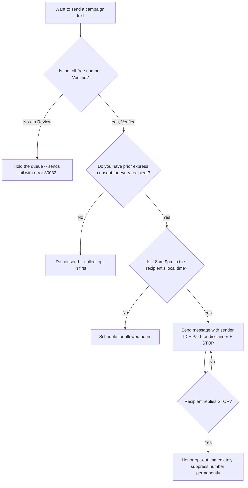

# SMS / Text Messaging Compliance & Templates

Everything the campaign needs to run compliant text messaging for Matt Grant for Congress: carrier verification content, opt-in/consent language, ready-to-send message templates, and a TCPA + FEC compliance checklist. Built for the campaign's Twilio toll-free sender (+1 844-314-7912) operating under the "Matt Grant for Congress" Messaging Service. Every template carries the required FEC disclaimer (*Paid for by Matt Grant for Congress.*) and STOP opt-out language.



---

## 1. Toll-Free Verification — Submission Content

Use this content if Twilio asks for more detail during Toll-Free Verification review, or if the request bounces and needs resubmission. All values come from documented campaign facts only.

### Business / entity information

| Field | Value |
|---|---|
| Legal entity / business name | Matt Grant for Congress |
| Entity type | Federal political committee (candidate committee) |
| FEC committee ID | C00945394 |
| Use case category | Political / advocacy messaging |
| Business address | 1625 Mason Knoll Rd, St. Louis, MO 63131 |
| Contact email | mattgrantforcongress@gmail.com |
| Contact phone | (314) 255-7760 |
| Toll-free number | +1 844-314-7912 |

### Use-case description (paste into the form)

> Matt Grant for Congress is the authorized federal campaign committee (FEC ID C00945394) for Matt Grant, a candidate for the U.S. House of Representatives in Missouri's 2nd Congressional District (MO-02). We send campaign updates, event invitations, volunteer coordination, and fundraising messages to supporters who have opted in to receive text messages from the campaign. All messages identify the sender and include "Reply STOP to opt out." Message volume is low-to-moderate and tied to the 2026 election cycle.

### Opt-out / help language

> Recipients can opt out at any time by replying STOP; we honor opt-outs immediately and permanently suppress the number. Replying HELP returns campaign contact information.

---

## 2. Opt-In / Consent Description

Carriers and the TCPA both require that you can show *how* and *where* each recipient consented before you text them. Paste the relevant description into the verification form, and keep records of every opt-in source.

### Consent description (for the verification form)

> Supporters opt in to receive text messages from Matt Grant for Congress through one or more of the following: (1) submitting their mobile number on the campaign website with a checkbox/notice indicating they agree to receive campaign text messages; (2) texting a keyword to our number to subscribe; (3) providing their number on a paper or digital volunteer/supporter sign-up that includes SMS consent language; or (4) entering their number at a campaign event with posted consent notice. Consent is not a condition of any purchase or donation. Standard message and data rates may apply. Recipients can reply STOP to cancel and HELP for help.

### Web / paper opt-in notice (place next to any phone-number field)

> By providing your mobile number, you agree to receive recurring campaign text messages from Matt Grant for Congress. Msg & data rates may apply. Reply STOP to cancel, HELP for help. Consent is not a condition of donating.

**Recordkeeping:** For every opt-in, retain the date, the source (form URL, event, keyword), and the exact consent language shown. Keep donor and supporter contact lists secure — do not store SSNs, bank, or password data.

---

## 3. Compliant Message Templates

Each template includes the three required elements: **sender identification**, the **FEC disclaimer** (*Paid for by Matt Grant for Congress.*), and **STOP opt-out**. Replace bracketed placeholders before sending. Use a campaign-approved short link for the donate URL (full link: `https://secure.winred.com/matt-grant-for-congress/donate-today`). Do not add policy claims, poll numbers, or endorsements beyond documented facts.

> **First-message rule:** The initial message in any conversation must carry the full disclaimer and opt-out. In an active reply thread, repeating them every message is best practice but not always required.

### Fundraising

```
Matt Grant for Congress: Matt is running to represent MO-02. Grassroots
donations power this campaign -- can you chip in today? [donate link]
Paid for by Matt Grant for Congress. Reply STOP to opt out.
```

```
It's [FIRST NAME] from Team Matt Grant. We're closing in on our end-of-
month goal. A donation of any size makes a difference: [donate link]
Paid for by Matt Grant for Congress. Reply STOP to quit.
```

### Get Out The Vote (GOTV)

```
Matt Grant for Congress: The MO-02 primary is Aug 4, 2026. Make a plan to
vote! Find your polling place + hours: [link]. Paid for by Matt Grant for
Congress. Reply STOP to opt out.
```

```
Reminder from Matt Grant for Congress: TODAY is primary Election Day,
Aug 4. Polls close at [TIME]. Bring a friend! Paid for by Matt Grant for
Congress. Reply STOP to opt out.
```

### Event invitation

```
Matt Grant for Congress: Join Matt at [EVENT NAME] on [DATE] at [TIME],
[LOCATION]. RSVP here: [link]. Paid for by Matt Grant for Congress.
Reply STOP to opt out.
```

```
You're invited! Meet Matt Grant at [EVENT] this [DAY]. Details + RSVP:
[link]. Questions? Reply or call (314) 255-7760. Paid for by Matt Grant
for Congress. Reply STOP to quit.
```

### Volunteer ask

```
Matt Grant for Congress: We need volunteers for [ACTIVITY] on [DATE].
Can you join us? Sign up: [link]. Paid for by Matt Grant for Congress.
Reply STOP to opt out.
```

```
It's [FIRST NAME] with Team Matt Grant. Can you give 2 hours this weekend
to help us reach voters in MO-02? Reply YES or sign up: [link]. Paid for
by Matt Grant for Congress. Reply STOP to quit.
```

### HELP auto-reply

```
Matt Grant for Congress. For help, email mattgrantforcongress@gmail.com
or call (314) 255-7760. Reply STOP to unsubscribe. Msg & data rates may
apply.
```

---

## 4. Texting Compliance Checklist

Run through this before every campaign send. This combines federal telemarketing law (TCPA) with FEC disclaimer requirements.

```
[ ] Toll-free number shows Verified in Twilio (not Pending/In Review)
[ ] Every recipient has prior express consent on file (date + source)
[ ] Message includes sender identification (Matt Grant for Congress)
[ ] Message includes the FEC disclaimer: "Paid for by Matt Grant for Congress."
[ ] Message includes opt-out language ("Reply STOP to opt out")
[ ] Sending only between 8am and 9pm in the recipient's local time zone
[ ] STOP/UNSUBSCRIBE replies are honored immediately and suppressed permanently
[ ] HELP replies return campaign contact info
[ ] No prohibited content (no policy/poll/endorsement claims beyond documented facts)
[ ] Links go to campaign-controlled pages; donate link is the official WinRed URL
[ ] Opt-in records and contact lists stored securely (no SSN/bank/password data)
```

### Key rules at a glance

| Rule | Requirement |
|---|---|
| **Consent (TCPA)** | Obtain prior express consent before texting; political/autodialed texts to cell phones require it. Consent cannot be a condition of donating. |
| **Quiet hours (TCPA)** | Do not send before 8:00 a.m. or after 9:00 p.m. in the **recipient's** local time. |
| **Opt-out** | Honor STOP immediately and permanently. Provide a working HELP response. |
| **FEC disclaimer (52 USC 30120 / 11 CFR 110.11)** | "Paid for by Matt Grant for Congress." on the initial/standalone message. An abbreviated disclaimer that links to the full version is acceptable for very short texts. |
| **Carrier rules** | Toll-free number must be Verified; unverified sends fail with error 30032. Avoid prohibited/SHAFT content and link shorteners flagged by carriers. |

---

## Cross-References

- `tools/disclaimer-generator.md` — Full "Paid for by" disclaimer rules across every medium, including SMS/MMS.
- `federal/digital-advertising.md` — FEC rules for digital and online political communications.
- `messaging/email-fundraising.md` — Companion channel; consent and disclaimer practices align.
- `messaging/social-media-strategy.md` — Platform messaging and compliance.

---

*This is educational information, not legal advice. TCPA rules, carrier requirements, and FEC guidance change and vary by situation. Verify current requirements with the FEC, the FCC, your carrier/Twilio, and a campaign finance or telecommunications attorney before sending. Last reviewed: 2026-06-28.*
