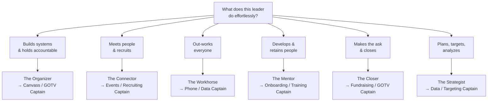

# Team Captain Archetypes: Types of Volunteer Leaders by Strength and Weakness

Behind every winning field program is a layer of **team captains** -- the volunteers who recruit, train, and lead 5-10 other volunteers so the campaign manager does not have to touch every door, dial, and shift personally. But "captain" is not one job and not one kind of person. The best organizers know that a captain who is brilliant at recruiting may be terrible at tracking data, and a captain who runs a flawless phone bank may freeze when asked to make a fundraising ask. This file defines the **captain roles** you actually need to fill and six **captain archetypes** -- recognizable leader types with distinct strengths and weaknesses -- so you can put the right person in the right seat and staff around their blind spots. Pair this with [captain↔volunteer↔supporter pairing](../workflows/team-pairing.md) to turn these profiles into assignments.

> This is a leadership-development framework, not a personality test. Use it to coach and deploy real people -- it does not replace genuine relationships or good judgment about the volunteers in front of you.

---

## Captain Roles vs. Captain Archetypes

Two different things are easy to confuse:

- A **captain role** is a *post* -- a function on the org chart (canvass captain, phone-bank captain, etc.). The role defines *what work the team does*.
- A **captain archetype** is a *person type* -- a leader's natural style, strengths, and weaknesses. The archetype defines *how that person leads*.

Winning teams match the two deliberately: the archetype whose strengths fit the role, supported by a complementary co-lead who covers the gaps. The roles below all sit one layer under the campaign manager or field director; each links to the playbook that governs the work itself.

| Captain role | What the team does | Governing playbook |
|---|---|---|
| **Canvass / Field Captain** | Door-to-door turf, walk lists, daily knock goals | [voter-targeting.md](../workflows/voter-targeting.md), [volunteer-management.md](../workflows/volunteer-management.md) |
| **Phone & Text Bank Captain** | Calls and peer-to-peer texts, ID and persuasion | [volunteer-management.md](../workflows/volunteer-management.md) |
| **Events / Host Captain** | House parties, meet-and-greets, rally logistics | [scheduling-advance.md](scheduling-advance.md), [fundraising-plan.md](../workflows/fundraising-plan.md) |
| **Data / Office Captain** | Data entry, list cutting, materials, reporting | [campaign-tech-stack.md](../tools/campaign-tech-stack.md) |
| **Digital / Social Captain** | Content sharing, relational online outreach, rapid response | [social-media-strategy.md](../messaging/social-media-strategy.md) |
| **Fundraising / Finance Captain** | Grassroots asks, host recruitment, donor stewardship | [fundraising-plan.md](../workflows/fundraising-plan.md) |
| **GOTV / Ballot-Chase Captain** | Early-vote and Election Day turnout, chase universe | [gotv-plan.md](../workflows/gotv-plan.md), [ballot-chase-program.md](ballot-chase-program.md) |

---

## The Captain Archetype Framework

For each archetype below, the same elements are defined -- the leadership equivalent of the [voter persona](voter-personas.md) framework:

| Element | What it captures |
|---|---|
| **Archetype** | A memorable one-line label for the leadership style |
| **Leadership style** | How they naturally run a team and motivate people |
| **Strengths** | What they do better than anyone else on the team |
| **Weaknesses / watch-outs** | The predictable blind spots and failure modes |
| **Best-fit captain role(s)** | Where their strengths pay off most |
| **Pairs well with** | The complementary archetype that covers their gaps |
| **Development needs** | What support, coaching, or guardrails to give them |

---

## Archetype Selection at a Glance

---

## Archetype 1: The Organizer (Field General)

**Archetype:** The systems-builder who turns chaos into a turf map and a daily number.

**Leadership style:** Leads through structure. Sets clear goals, breaks them into shifts and quotas, and holds the team accountable to the plan. Runs tight, predictable operations where everyone knows their assignment.

**Strengths:** Scales the program. Cuts turf, builds schedules, and tracks metrics so nothing falls through the cracks. Calm under volume -- the more doors and dials, the more an Organizer shines. Reliable execution week after week.

**Weaknesses / watch-outs:** Can feel impersonal or rigid; treats people like slots on a spreadsheet and risks burning out the volunteers who just want to feel valued. May over-plan and under-inspire. Sometimes resists improvisation when the situation calls for it.

**Best-fit captain role(s):** Canvass / Field Captain, GOTV / Ballot-Chase Captain, Data / Office Captain.

**Pairs well with:** The Connector (brings warmth and recruitment to the Organizer's structure) or the Mentor (handles retention so the Organizer can focus on output).

**Development needs:** Coach on recognition and relationship-building. Pair them with a people-first co-lead. Remind them that a perfect plan with no volunteers knocks zero doors.

---

## Archetype 2: The Connector (Recruiter)

**Archetype:** The relationship hub who seems to know everyone and can recruit a stranger in five minutes.

**Leadership style:** Leads through relationships. Builds the team by personal invitation, makes people feel welcome, and grows the volunteer base faster than anyone. Energy and enthusiasm are contagious.

**Strengths:** Unmatched at recruitment and coalition-building. Opens doors to new networks -- faith communities, business groups, neighbors. Turns one-time volunteers into regulars because people like being around them. Great first face of the team.

**Weaknesses / watch-outs:** Weak on follow-through and data. Recruits 30 people but may not track who showed up or log the results. Over-commits and double-books. Can avoid hard conversations (no-shows, underperformance) because they want to be liked.

**Best-fit captain role(s):** Events / Host Captain, Fundraising / Finance Captain (host recruitment), recruiting lead for any team.

**Pairs well with:** The Organizer (turns the Connector's recruits into a tracked, scheduled program) or the Strategist (decides who is worth recruiting).

**Development needs:** Give them a simple, low-friction tracking tool and a data partner. Coach on accountability conversations. Protect them from over-scheduling.

---

## Archetype 3: The Workhorse (Doer)

**Archetype:** The lead-by-example powerhouse who out-knocks and out-dials the whole team.

**Leadership style:** Leads from the front. Does not ask anyone to do what they will not do themselves -- usually the first to arrive and last to leave. Inspires through sheer effort and reliability.

**Strengths:** Extraordinary personal output and dependability. Sets the standard for the team and shames no-shows simply by working harder. Perfect for grinding, high-volume tasks. Never has to be chased.

**Weaknesses / watch-outs:** Will not delegate -- believes it is faster to do it themselves, which makes them a bottleneck and caps the team at their personal capacity. Can burn out. May grow quietly resentful of less-committed volunteers instead of coaching them up.

**Best-fit captain role(s):** Phone & Text Bank Captain, Data / Office Captain, any small high-output team.

**Pairs well with:** The Mentor (teaches the Workhorse to grow others) or the Organizer (builds the structure that lets the Workhorse's effort scale beyond themselves).

**Development needs:** Coach explicitly on delegation -- their growth edge is multiplying themselves, not maxing themselves out. Watch for burnout; force them to take breaks and hand off tasks.

---

## Archetype 4: The Mentor (Coach)

**Archetype:** The people-grower who turns nervous first-timers into confident, returning volunteers.

**Leadership style:** Leads through development. Patient, encouraging, and attentive to each volunteer's experience. Invests in onboarding and training and makes the team feel like a community.

**Strengths:** Best-in-class retention. Volunteers a Mentor onboards come back, because they felt supported on day one. Excellent trainer -- breaks down canvass and phone scripts so anyone can succeed. The cultural glue of the program.

**Weaknesses / watch-outs:** Slower pace; may prioritize comfort over urgency and miss hard numbers. Conflict-averse -- reluctant to push, correct, or cut an unproductive volunteer. Can over-invest in a few people at the expense of the whole team's goals.

**Best-fit captain role(s):** Onboarding / Training lead, Volunteer-care role across any team, early-stage Canvass or Phone Captain.

**Pairs well with:** The Organizer or the Closer (supplies the urgency and the numbers the Mentor underweights).

**Development needs:** Pair with a goal-driven co-lead. Coach on giving direct feedback and holding the line on commitments. Tie their people-development wins to hard metrics so the warmth produces results.

---

## Archetype 5: The Closer (Asker)

**Archetype:** The persuader who is completely comfortable making the hard ask -- for a vote, a shift, or a check.

**Leadership style:** Leads through persuasion and momentum. Sets a bold target and drives the team toward it, thriving in high-stakes pushes where someone has to ask directly and not flinch.

**Strengths:** Makes the asks others avoid -- "Can you donate today?", "Can you commit to four shifts?", "Will you vote early this weekend?" Indispensable during fundraising drives and the GOTV final push. Persuasive, confident, and closes.

**Weaknesses / watch-outs:** Impatient with logistics, data, and process -- wants the ask, not the spreadsheet. Can overpromise to land the close. May steamroll quieter volunteers or push so hard they alienate prospects. Sprints, then loses interest in maintenance.

**Best-fit captain role(s):** Fundraising / Finance Captain, GOTV / Ballot-Chase Captain, persuasion-phase Phone Captain.

**Pairs well with:** The Organizer (handles the follow-through and tracking the Closer ignores) or the Mentor (repairs relationships if the Closer pushes too hard).

**Development needs:** Pair with a detail-oriented operations partner. Coach on honest asks (never overpromise) and on reading when to ease off. Deploy them in bursts -- drives and deadlines -- not steady-state maintenance.

---

## Archetype 6: The Strategist (Analyst)

**Archetype:** The planner who decides which doors, which voters, and which hours actually matter.

**Leadership style:** Leads through analysis and prioritization. Studies the voter file, the turnout math, and the data before committing resources, and is usually right about where the team should focus.

**Strengths:** Targeting and planning. Keeps the team from wasting effort on low-value turf or untargeted lists. Spots problems in the numbers early. Invaluable for building the field plan and the chase universe.

**Weaknesses / watch-outs:** Analysis paralysis -- can keep refining the plan when the team needs to be out the door. Lower people-warmth; may struggle to motivate or connect with volunteers emotionally. Can over-complicate simple tasks.

**Best-fit captain role(s):** Data / Office Captain, targeting lead, planning partner to a Canvass or GOTV Captain.

**Pairs well with:** The Workhorse or the Closer (turns the Strategist's plan into action now) or the Connector (puts a human face on the data-driven plan).

**Development needs:** Set decision deadlines -- "good enough, ship it." Pair with an action-oriented captain who runs the people while the Strategist runs the numbers. Coach on translating data into simple, motivating language.

---

## Spotting and Supporting Each Type

You rarely get to choose captains from a catalog -- you develop them from the volunteers you have. Use these cues:

- **Watch what they reach for.** The volunteer who reorganizes the sign-in sheet is an Organizer; the one who brought three friends is a Connector; the one who stayed two hours late is a Workhorse; the one coaching a nervous newcomer is a Mentor; the one who closed a donation at the door is a Closer; the one questioning the walk list is a Strategist.
- **Promote on demonstrated behavior, not just enthusiasm** (see [volunteer-management.md](../workflows/volunteer-management.md) → Recognition and Retention).
- **Give each type the support it lacks, not more of what it already has.** An Organizer does not need another checklist; they need a recognition habit. A Connector does not need more contacts; they need a tracking tool.
- **Never run a captain solo against their weakness.** The point of archetypes is to staff complements, not clones.

---

## Key Principles

1. **Role fit beats raw talent.** A great Closer in a Data Captain seat will quit or fail. Match the archetype to the work.
2. **Every captain gets a complement.** Pair each leader with a co-lead whose strengths cover their blind spots -- never two of the same type on the same gap.
3. **Coach the weakness, deploy the strength.** Put people where they shine; build guardrails around where they don't.
4. **Captains are made, not found.** Most of your captains are sitting in your volunteer pool right now. Spot the behavior, give the title, provide the support.
5. **The goal is multiplication.** A captain who only does the work is a great volunteer. A captain who *grows other volunteers* is what wins races.

---

*Next step: turn these profiles into assignments with [workflows/team-pairing.md](../workflows/team-pairing.md) -- matching archetypes to roles, captains to volunteers, and volunteers to donors, sponsors, and supporters.*
