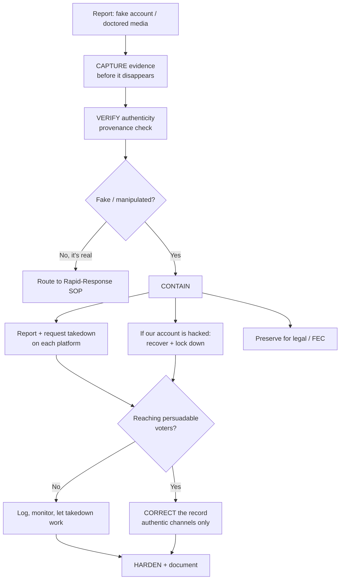

# Impersonation & Deepfake Response

What to do when someone impersonates the candidate or campaign, or spreads doctored or AI-generated ("deepfake") audio, video, or images. This is a **defensive, inbound** runbook: detect fast, prove it's fake, get it taken down, and correct the record without amplifying it. It sits beside [crisis-management.md](crisis-management.md) and runs on the same clock as the [Rapid-Response SOP](../workflows/rapid-response-sop.md); use this file when the attack is a fake identity or manipulated media specifically.

> The campaign never impersonates anyone or fabricates media in return -- that is prohibited ([ethics-and-guardrails.md](../references/ethics-and-guardrails.md)). This file is entirely about defending against being impersonated. The **legal** angle (FEC rules and state deepfake statutes) lives in [federal/digital-advertising.md](../federal/digital-advertising.md).

---

## The flow

---

## 1. Capture evidence first

Fakes get deleted the moment they're reported. Before anything else, preserve it:

- [ ] Screenshot/screen-record the post, account handle, profile, URL, timestamp, and follower/engagement counts.
- [ ] Save the original file (image/audio/video) and the direct link.
- [ ] Note where you found it and who flagged it.
- [ ] Keep everything in the access-controlled crisis folder -- it's the proof for platform reports, counsel, and debunking.

Do this even for an obvious fake; you cannot make the case later without the artifact.

---

## 2. Verify authenticity (provenance)

Confirm it's actually fake before you call it fake publicly -- and to arm the takedown/correction.

- **Impersonation account:** compare handle, creation date, and history against the campaign's verified official accounts (see the account inventory in [team-raci-access-matrix.md](../tools/team-raci-access-matrix.md)). A brand-new account mimicking the name/logo is impersonation.
- **Doctored image:** reverse-image search to find the original; look for cloning/warping and mismatched lighting.
- **Selectively edited clip:** find and post the **full, unedited source** -- the fastest debunk is the real thing in context.
- **AI-generated audio/video (deepfake):** check for tells (unnatural mouth/eye movement, audio artifacts, missing blinks, inconsistent lighting); confirm the candidate was verifiably elsewhere/said otherwise; keep the authentic original recording to compare.

If it turns out to be **genuine**, this isn't an impersonation problem -- run the [Rapid-Response SOP](../workflows/rapid-response-sop.md) instead.

---

## 3. Contain: takedown, recovery, preservation

### Platform takedown (report on each surface it appears)

Report under impersonation / manipulated-media / synthetic-media policies. Use the campaign's **verified official account** to report where possible, and file as the affected party.

| Platform | Report path |
|---|---|
| **Meta (Facebook/Instagram)** | Report profile/post -> Impersonation; use the brand/impersonation report form as the represented party |
| **Google / YouTube** | Report video/channel -> impersonation or manipulated media; use the legal/impersonation removal forms |
| **X** | Report -> impersonation and synthetic-and-manipulated-media policies |
| **TikTok** | Report account/video -> impersonation / harmful synthetic media |

Keep every report's confirmation/reference number in the evidence folder. Expect platform response to take time -- containment and correction can't wait on it.

### If a campaign account is hacked or taken over

- [ ] Trigger account recovery immediately; if locked out, use the platform's compromised-account/appeal path.
- [ ] Once back in: rotate the password, force sign-out of all sessions, re-check MFA and connected apps, remove unknown admins.
- [ ] Post a brief authentic notice if false content went out under your name.
- [ ] Treat as a security incident -- revoke/rotate anything the attacker could have touched (see off-boarding/revocation in [team-raci-access-matrix.md](../tools/team-raci-access-matrix.md)).

### Preserve for legal / FEC

Fraudulent misrepresentation and several state deepfake laws may apply. Hand the preserved evidence to counsel; don't make legal claims publicly without their review. See [federal/digital-advertising.md](../federal/digital-advertising.md).

---

## 4. Correct the record (only if it warrants it)

Apply the [Rapid-Response SOP](../workflows/rapid-response-sop.md) triage. A fake with no traction that platforms are removing may not need a public response -- correcting it can hand it the audience it never had.

When you do respond:
- State plainly that the account/media is **fake**, from your **verified** channels only.
- Show the authentic original (the real clip, the real account) so people can see the difference.
- Don't link or repost the fake at full resolution; describe it.
- Get back to your message.

---

## 5. Harden (prevention -- do this before an incident)

- [ ] **MFA on every** social, ad, email, and admin account; a password manager; least-privilege access ([tools/campaign-tech-stack.md](../tools/campaign-tech-stack.md), Security Essentials).
- [ ] **Claim and verify** official handles on every platform; publish the list of official accounts so voters can tell real from fake.
- [ ] **Monitor** for impersonation/fake accounts and manipulated media on the daily cadence in the [Rapid-Response SOP](../workflows/rapid-response-sop.md) -- assign one owner.
- [ ] **Pre-brief** the team and surrogates that deepfakes are possible, so a fake clip doesn't trigger a panicked, self-damaging reaction.
- [ ] Keep **original source files** of the candidate's real speeches/appearances -- they're the fastest way to debunk a selective edit.

---

## Document

Log every incident in the rapid-response decision log ([Rapid-Response SOP](../workflows/rapid-response-sop.md) §6): what it was, where, evidence captured, reports filed + reference numbers, whether you responded, and the outcome.

---

## Key principles

1. **Capture before you report** -- the fake disappears when flagged.
2. **Prove it's fake before you say it's fake** -- provenance first.
3. **Takedown and correction run in parallel; neither waits on the other.**
4. **Don't amplify** -- describe the fake, show the authentic original, don't repost it.
5. **Hardening is the real defense** -- verified accounts, MFA, monitoring, and saved originals prevent most of the damage.

---

> **EDUCATIONAL DISCLAIMER:** This is educational information, not legal advice. Impersonation, fraudulent misrepresentation, and synthetic-media laws vary by state and change quickly -- consult campaign counsel or your filing agency before making legal claims or takedown demands specific to your situation.

*Built on [tactics/crisis-management.md](crisis-management.md), [workflows/rapid-response-sop.md](../workflows/rapid-response-sop.md), [federal/digital-advertising.md](../federal/digital-advertising.md), and [tools/campaign-tech-stack.md](../tools/campaign-tech-stack.md).*
