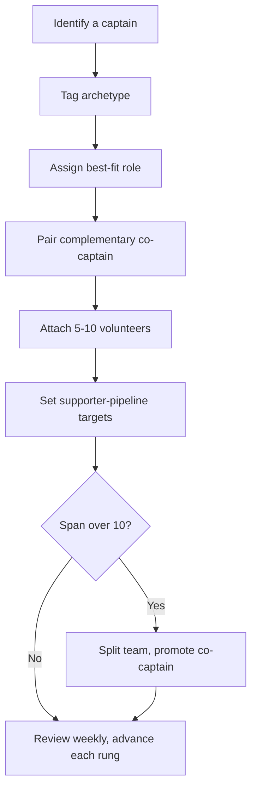

# Captain Roster

A data schema for the campaign's **field-leadership roster** -- the single source of truth that records every team captain, their archetype, the role they fill, their complementary co-captain, the volunteers on their team, and each team's supporter-pipeline targets. It is the storable, trackable form of the [pairing worksheet](../workflows/team-pairing.md#the-pairing-worksheet): the worksheet decides the matches; this schema stores and maintains them.

> **PLANNING-FRAMEWORK NOTICE — read first.** Every captain assignment, archetype label, volunteer count, and supporter target stored in this schema is an **operational planning record**, not a finalized roster or a prediction. Sample rows below are **illustrative placeholders** -- replace them with real people, verified by the campaign manager or field director, before relying on the roster for deployment. Do not represent any assignment here as actual or final.



---

## CSV Schema

Use this schema as the standard format for the field-leadership roster -- one row per captain.

```csv
captain_name,captain_archetype,captain_role,co_captain,region_or_county,volunteer_team_size,supporter_targets,last_reviewed,contact_phone,contact_email,notes
```

### Field Definitions

| Field | Type | Required | Description |
|---|---|---|---|
| `captain_name` | Text | Yes | Full name: "Last, First" |
| `captain_archetype` | Enum | Yes | One of: `Organizer`, `Connector`, `Workhorse`, `Mentor`, `Closer`, `Strategist` (see [captain-archetypes.md](../tactics/captain-archetypes.md)) |
| `captain_role` | Enum | Yes | One of: `Canvass/Field`, `Phone & Text`, `Events/Host`, `Data/Office`, `Digital/Social`, `Fundraising/Finance`, `GOTV/Ballot-Chase` (see [captain roles](../tactics/captain-archetypes.md#captain-roles-vs-captain-archetypes)) |
| `co_captain` | Text | Conditional | Name (or archetype) of the complementary co-captain; required once a team exceeds ~6 volunteers. Aim for a [Strong pairing](../workflows/team-pairing.md#complementary-co-captain-pairing). |
| `region_or_county` | Enum | Yes | Geographic assignment. For MO-02: `St. Louis County (western/central)`, `Jefferson`, `Washington`, `Crawford`, `Gasconade`, or `District-wide` |
| `volunteer_team_size` | Integer | Yes | Current count of volunteers on the team. Flag any value over 10 (span-of-control limit) |
| `supporter_targets` | Text | No | Shorthand pipeline goals, e.g. "2 → yard signs; 1 → house-party host". Rungs from [Part C](../workflows/team-pairing.md#part-c-move-volunteers--supporters-sponsors-and-donors) |
| `last_reviewed` | YYYY-MM-DD | Yes | Date the row was last reviewed (review weekly) |
| `contact_phone` | Text | No | Captain's preferred phone |
| `contact_email` | Text | No | Captain's preferred email |
| `notes` | Text | No | Free text: development needs, backup/successor, blackout dates, coaching focus |

### Example CSV Data

Illustrative placeholders -- replace with the campaign's real captains.

```csv
captain_name,captain_archetype,captain_role,co_captain,region_or_county,volunteer_team_size,supporter_targets,last_reviewed,contact_phone,contact_email,notes
"Rivera, A.",Organizer,Canvass/Field,"Connector — Brooks, D.","St. Louis County (western/central)",8,"2 → yard signs; 1 → house-party host",2026-06-22,314-555-0148,a.rivera@example.org,"Coach on recognition; strong on turf"
"Nguyen, T.",Connector,Events/Host,"Organizer — Patel, R.",Jefferson,6,"1 → sponsor (venue); 2 → small donor",2026-06-22,636-555-0193,t.nguyen@example.org,"Watch over-scheduling; pair with a tracker"
"Boone, J.",Closer,Fundraising/Finance,"Organizer — Rivera, A.","St. Louis County (western/central)",5,"3 → small donor; 1 → ambassador/bundler",2026-06-22,314-555-0177,j.boone@example.org,"Deploy in fundraising bursts; honest asks only"
"Decker, M.",Strategist,Data/Office,"Workhorse — Hale, S.",District-wide,4,"n/a (support team)",2026-06-22,573-555-0120,m.decker@example.org,"Set decision deadlines; runs the chase universe"
```

---

## JSON Schema

For CRMs, spreadsheets-as-data, or app integrations, use this nested structure -- one object per captain, with the team's volunteers and supporter pipeline embedded.

```json
{
  "captain": {
    "id": "CAPT-2026-001",
    "name_last": "Rivera",
    "name_first": "A.",
    "archetype": "Organizer",
    "role": "Canvass/Field",
    "co_captain": { "name": "Brooks, D.", "archetype": "Connector" },
    "region_or_county": "St. Louis County (western/central)",
    "contact": { "phone": "314-555-0148", "email": "a.rivera@example.org" },
    "volunteers": [
      { "name": "Volunteer, One", "volunteer_role": "Canvasser", "pipeline_rung": 1 },
      { "name": "Volunteer, Two", "volunteer_role": "Driver", "pipeline_rung": 2 }
    ],
    "volunteer_team_size": 8,
    "supporter_pipeline": [
      { "volunteer": "Volunteer, Two", "current_rung": 2, "next_ask": "Yard sign + social share", "owner_archetype": "Connector" }
    ],
    "last_reviewed": "2026-06-22",
    "notes": "Coach on recognition; strong on turf"
  }
}
```

### Enumerations

```json
{
  "captain_archetypes": ["Organizer", "Connector", "Workhorse", "Mentor", "Closer", "Strategist"],
  "captain_roles": ["Canvass/Field", "Phone & Text", "Events/Host", "Data/Office", "Digital/Social", "Fundraising/Finance", "GOTV/Ballot-Chase"],
  "pipeline_rungs": [
    { "rung": 1, "label": "Engaged volunteer" },
    { "rung": 2, "label": "Supporter" },
    { "rung": 3, "label": "Sponsor (in-kind)" },
    { "rung": 4, "label": "Small donor" },
    { "rung": 5, "label": "Mid / major donor" },
    { "rung": 6, "label": "Donor ambassador / bundler" }
  ]
}
```

The `pipeline_rung` values map exactly to the [volunteer → support ladder](../workflows/team-pairing.md#the-volunteer--support-ladder). Rungs 3-6 involve money or in-kind value -- see Compliance below.

---

## Roster Health Rules

Quick validation checks to run on the roster every week:

| Rule | Check | Action if it fails |
|---|---|---|
| **Span of control** | `volunteer_team_size` ≤ 10 | Split the team; promote a co-captain |
| **Role fit** | `captain_archetype` is a **Best**/**OK** match for `captain_role` in the [Part A matrix](../workflows/team-pairing.md#part-a-match-archetype--captain-role) | Reassign, or add a co-captain who covers the gap |
| **Complement** | `co_captain` archetype forms a **Strong** pair, not a clone | Re-pair from the Strong-combinations table |
| **Freshness** | `last_reviewed` within 7 days | Re-review the row |
| **Pipeline motion** | every team has at least one volunteer with a planned next ask | Set a supporter target |

---

## Best Practices

1. **Match archetype to role first.** Seat each captain in a **Best** (or supported **OK**) role using the [Part A matrix](../workflows/team-pairing.md#part-a-match-archetype--captain-role) -- never an **Avoid** pairing without a strong co-captain.
2. **Pair a complementary co-captain.** Use the [Strong combinations](../workflows/team-pairing.md#complementary-co-captain-pairing); never two of the same archetype on the same weakness.
3. **Keep span at 5-10.** Split and promote when a team grows past ten volunteers.
4. **Advance the pipeline.** Move each engaged volunteer at least one rung; assign the right archetype to make each ask.
5. **Review weekly.** Update `last_reviewed`, team size, and each volunteer's rung every week.
6. **Handle the roster securely.** Do **not** store SSNs, bank numbers, or passwords. Keep the file access-controlled; it contains contact details for real people.

---

## Compliance

> **EDUCATIONAL DISCLAIMER:** This roster touches campaign-finance rules once volunteers move up the pipeline (in-kind sponsorships and bundling). The guidance here is general and may be out of date. Consult a campaign finance attorney or your filing agency for guidance specific to your situation. This is educational information, not legal advice.

- **Volunteer time is not a contribution**, but a **sponsor's in-kind gift is** (at fair-market value) -- log it through [donation-intake.md](../workflows/donation-intake.md) and check capacity with [donor-limit-checker.md](donor-limit-checker.md).
- **Bundling is legal; reimbursing is not** -- a [donor ambassador](../workflows/team-pairing.md#part-c-move-volunteers--supporters-sponsors-and-donors) may gather contributions, but no straw-donor schemes (see [ethics-and-guardrails.md](../references/ethics-and-guardrails.md)).
- **No coerced giving** -- volunteering or leading a team is never conditioned on a contribution.

---

*Built for [workflows/team-pairing.md](../workflows/team-pairing.md) and [tactics/captain-archetypes.md](../tactics/captain-archetypes.md). For the MO-02 application, see [candidate/captain-field-plan.md](../candidate/captain-field-plan.md). Field targets follow [candidate/strategic-plan.md](../candidate/strategic-plan.md) §5 and [candidate/data-and-map-plan.md](../candidate/data-and-map-plan.md).*
