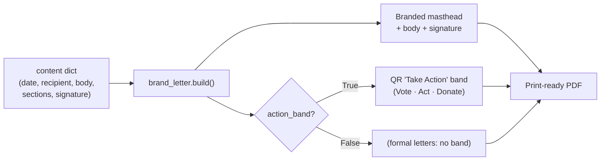

# PDF Letterhead Generator

A small, dependency-light Python generator that produces print-ready PDF letters on the official **Matt Grant for Congress** letterhead, styled to the campaign's "Ledger & Banner" design system. Pass the letter content as a Python dictionary and the engine renders a branded masthead, body, signature block, an optional scannable QR "Take Action" band, and the compliant *"Paid for by…"* footer. Use it for records requests, endorsement asks, agency correspondence, and supporter/volunteer outreach.



## Files

| File | Purpose |
|---|---|
| `brand_letter.py` | The engine — brand tokens, masthead/footer, QR band, `build()`. Run directly to render the Sunshine Law voter-list request sample. |
| `outreach_volunteer.py` | A ready-to-send volunteer/supporter recruitment letter with the QR band switched on. A worked example of supplying custom content + a custom QR set. |

## Requirements

- Python 3.9+
- `reportlab` (vector PDF + native QR): `pip install reportlab`

No image files are needed — QR codes are generated as crisp vector art from URLs.

## Usage

```bash
cd tools/pdf-letterhead
python3 brand_letter.py Sunshine-Request.pdf      # formal request, QR band OFF
python3 outreach_volunteer.py                      # outreach letter, QR band ON
```

To author a new letter, copy `outreach_volunteer.py`, edit the `CONTENT` dictionary, and run it. Supported keys:

| Key | Meaning |
|---|---|
| `title` | PDF metadata title. |
| `date`, `recipient`, `eyebrow`, `re` | Dateline, address block, red eyebrow, and accent-barred RE line. |
| `intro`, `closing` | Lists of body paragraphs (HTML-ish markup allowed: `<b>`, `&mdash;`, `§`). |
| `sections` | List of `{ "label": ..., "blocks": [...] }`. Each block is `("p", text)`, `("ol", [items])`, or `("ul", [items])`. |
| `signoff`, `sign_name`, `sign_meta` | Sign-off line, faux-signature name, and printed name/title lines. |
| `action_band` | `True` to show the QR band (default off — keep off for formal/legal letters). |
| `qr_actions` | Optional list of `(label, url, caption)` tuples. Defaults to Vote / Take Action / Donate. |
| `qr_eyebrow`, `qr_intro` | Optional band heading and intro line. |

## The QR "Take Action" band

The band is reusable and toggleable. It renders any number of codes — up to three per row, so **four codes lay out as a tidy 2×2 grid**. Each QR is generated as vector art in brand navy on a paper card with a clean quiet zone, and is **auto-sized to fill its column** up to `QR_MAX` (~1.0 in code area — verified scannable with margin to spare).

Default destinations (campaign pages, short URLs for easy scanning):

| Code | URL |
|---|---|
| Vote | `https://mattgrantforcongress.org/vote` |
| Take Action | `https://mattgrantforcongress.org/act` |
| Donate | `https://mattgrantforcongress.org/donate` |

A direct **WinRed** give code is provided as `WINRED_DONATE` for donor-facing letters — use it in place of, or alongside, the `/donate` page code (see `outreach_volunteer.py`).

## Brand tokens

The palette mirrors `web/lib/theme.ts` (single source of truth). If the site palette changes, update the constants at the top of `brand_letter.py` to match.

| Token | Hex | Use |
|---|---|---|
| ink | `#0F2540` | authority navy — nameplate, body, QR modules |
| field | `#16365C` | deep field blue — accents |
| accent | `#2563EB` | campaign accent blue — links |
| brick | `#B5343B` | red — eyebrows, accent bar, top rule |
| paper | `#FBFAF6` | warm white — QR cards |
| slate | `#5A6472` | muted captions / contact block |
| line | `#E4E2DA` | hairline rules |

## Notes

- Letterhead facts (committee name, address, phone, email, tagline, promise) are constants at the top of `brand_letter.py`. The compliant *"Paid for by the Matt Grant for Congress Committee."* footer prints on every page.
- Output PDFs are build artifacts and are not committed.
- Content is values- and action-based and should stay faithful to `candidate/profile.md` and `candidate/platform.md` — do not add positions, claims, numbers, or endorsements beyond the documented facts.
