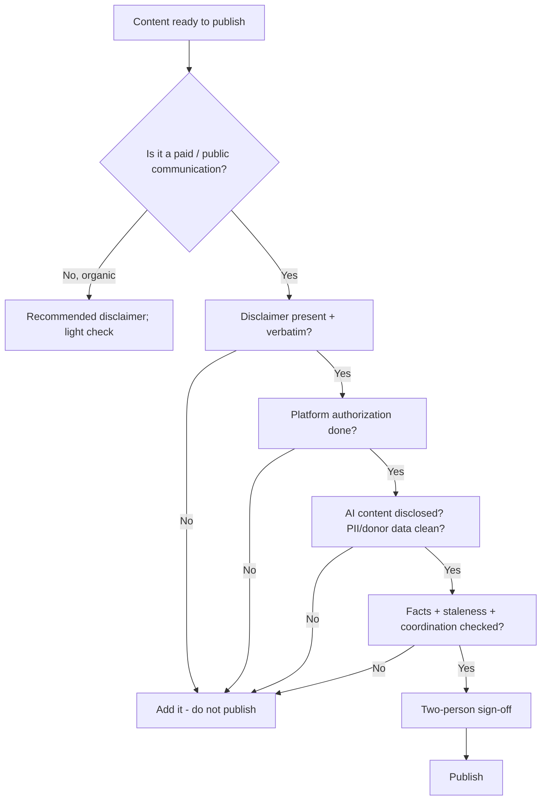

# Compliance Pre-Publish Checklist

One gate every public communication clears **before** it goes out. The compliance rules a campaign has to satisfy are scattered across the disclaimer generator, the digital-ad rules, the disclosure rules, and the coordination rules; this checklist pulls them into a single sign-off so nothing ships without a disclaimer, a required authorization, or a data-handling check. Make it a non-bypassable step in the content pipeline: no publish without a clear.



---

## Step 1 -- Does it even need a disclaimer? (paid vs. organic)

Not everything needs the "Paid for by" line, but when in doubt, include it. The public-communication test is in [federal/digital-advertising.md](../federal/digital-advertising.md).

| Communication | Disclaimer required? |
|---|---|
| Paid ads, boosted posts, paid SMS, mail, TV, radio | **Yes** |
| Organic social posts, the campaign's own website, campaign email, volunteer peer-to-peer texts | **Recommended** (not strictly required) |

## Step 2 -- Disclaimer present and verbatim

- [ ] The required FEC disclaimer appears, **word for word**: **Paid for by Matt Grant for Congress.**
- [ ] It's **clear and conspicuous** for the medium (readable size/contrast; broadcast stand-by-your-ad; in-ad on digital). Per-medium formats and the full disclaimer checklist are in [tools/disclaimer-generator.md](disclaimer-generator.md).
- [ ] Authorization status is correct (authorized candidate committee vs. independent). See [federal/prohibited-contributions.md](../federal/prohibited-contributions.md) / [federal/disclosure-requirements.md](../federal/disclosure-requirements.md) as applicable.
- [ ] Small-item / impracticability exception checked only if it genuinely applies (11 CFR 110.11(f)).

## Step 3 -- Platform authorization (paid digital)

- [ ] The ad account is **verified/authorized** on the platform (Meta, Google, X, TikTok) -- these take days; don't schedule a launch you can't clear. Details in [federal/digital-advertising.md](../federal/digital-advertising.md).

## Step 4 -- AI-generated content disclosed

- [ ] Any AI-generated or materially altered image/audio/video is disclosed per platform policy and applicable state law. (The campaign never publishes deceptive synthetic media -- see [ethics-and-guardrails.md](../references/ethics-and-guardrails.md); defending against being deepfaked is [impersonation-deepfake-response.md](../tactics/impersonation-deepfake-response.md).)

## Step 5 -- Data & privacy

- [ ] No SSNs, bank/account numbers, or passwords anywhere in the content.
- [ ] Donor and voter data handled per [web/docs/donor-data-handling.md](../web/docs/donor-data-handling.md) (least-privilege, no PII leakage); SMS follows TCPA + FEC consent rules in [messaging/sms-texting.md](../messaging/sms-texting.md).

## Step 6 -- Facts, staleness, coordination

- [ ] Every factual claim (dates, numbers, quotes, records) is sourced and current -- compliance figures and deadlines change; don't publish stale numbers.
- [ ] Policy content stays within the candidate's **documented** positions (the four priorities + the CHILD Protection Act in [candidate/platform.md](../candidate/platform.md)); invent no new positions, endorsements, or poll numbers.
- [ ] If outside groups touched this, it does **not** cross into illegal coordination ([workflows/coordination-rules.md](../workflows/coordination-rules.md)).

## Step 7 -- Sign-off

- [ ] **Two-person review** before publish (drafter + one approver). Anything with legal exposure clears counsel first.
- [ ] Log the publish (what, where, when, who approved) -- ties to the print/asset trackers ([tools/print-tracker.md](print-tracker.md)) and the rapid-response record when it's a response.

---

## Quick gate (paste into the pipeline)

```
PRE-PUBLISH CLEAR
[ ] Disclaimer present + verbatim "Paid for by Matt Grant for Congress" (if paid/public)
[ ] Clear & conspicuous for the medium; authorization status correct
[ ] Platform ad account authorized (paid digital)
[ ] AI-generated content disclosed
[ ] No SSN/bank/password; donor & voter data handled correctly
[ ] Facts sourced & current; positions within documented platform
[ ] No illegal coordination
[ ] Two-person sign-off (+ legal if exposure)
-> Cleared by: ______  Date: ______
```

---

## Best practices

1. **Make it non-bypassable.** Build the clear into the workflow so "publish" is impossible without it.
2. **Verbatim, every time.** The disclaimer string is exact -- **Paid for by Matt Grant for Congress.**
3. **When unsure, disclaim.** Including a disclaimer is never the mistake.
4. **Two eyes, always.** No single person publishes a paid communication alone.
5. **Escalate the gray areas.** Coordination, defamation, and AI-disclosure edge cases go to counsel, not to a guess.

---

> **EDUCATIONAL DISCLAIMER:** This is educational information, not legal advice. Disclaimer, authorization, coordination, AI-disclosure, and data rules vary by jurisdiction and change -- consult a campaign finance attorney or your filing agency for guidance specific to your situation.

*Consolidates [tools/disclaimer-generator.md](disclaimer-generator.md), [federal/digital-advertising.md](../federal/digital-advertising.md), [federal/disclosure-requirements.md](../federal/disclosure-requirements.md), [workflows/coordination-rules.md](../workflows/coordination-rules.md), [messaging/sms-texting.md](../messaging/sms-texting.md), and [web/docs/donor-data-handling.md](../web/docs/donor-data-handling.md).*
