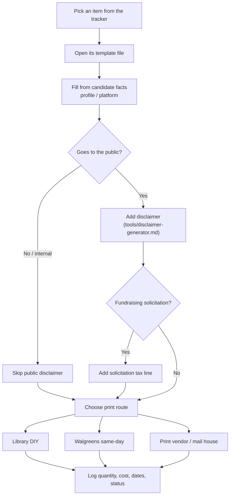

# Print Production Tracker

A single index that ties every letter-sized (8.5 × 11) printable the campaign produces to the **template that generates it**, the **compliance flags** that govern it, and its **production status**. Use it to answer "what do we print, where does the copy come from, does it need a disclaimer, and where is it in the print queue?" The data lives in `candidate/letters/print-tracker.csv`; this page documents the schema, maps each item to its template, and lists the compliance rules. The same CSV feeds the staff dashboard view at `/dashboard/print` in the web app.



---

## CSV Schema

The standard format for the print queue lives in `candidate/letters/print-tracker.csv`. One row per printable item.

```csv
item,category,template,sheet_size,disclaimer_required,solicitation_tax_line,internal_only,quantity,vendor,unit_cost,order_by_date,in_hand_date,status
```

### Field Definitions

| Field | Type | Required | Description |
|---|---|---|---|
| `item` | Text | Yes | Name of the printable piece (e.g., "Donor thank-you letter") |
| `category` | Text | Yes | One of: `Correspondence`, `Flyers & handouts`, `Field & event`, `Candidate & press`, `Administrative` |
| `template` | Path | Yes | Repo path to the template/source that produces this item. This is the link between the print queue and the copy. |
| `sheet_size` | Text | Yes | Paper size. All current items are `8.5 x 11` (letter). |
| `disclaimer_required` | `Y`/`N` | Yes | `Y` if the piece is a public political communication needing a "Paid for by" disclaimer (52 USC 30120 / 11 CFR 110.11). See `tools/disclaimer-generator.md`. |
| `solicitation_tax_line` | `Y`/`N` | Yes | `Y` if the piece solicits contributions and must carry the federal not-tax-deductible solicitation notice. See `federal/disclosure-requirements.md`. |
| `internal_only` | `Y`/`N` | Yes | `Y` if the piece is staff/volunteer-facing only (not distributed to the public); internal pieces skip the public disclaimer. |
| `quantity` | Integer | No | How many to print this order. Blank until queued. |
| `vendor` | Text | No | Print vendor / mail house / DIY route (e.g., "Library", "Walgreens"). Blank until assigned. |
| `unit_cost` | Decimal | No | Cost per piece. Blank until quoted. |
| `order_by_date` | YYYY-MM-DD | No | Deadline to place the order to hit the in-hand date. |
| `in_hand_date` | YYYY-MM-DD | No | When the printed piece is needed in hand. |
| `status` | Text | Yes | Production state: `Not started`, `Draft ready` (template/PDF exists), `Ordered`, `In hand`. |

---

## Master Template Map

Every tracked item and the template that produces it. Open the linked file to draft the copy, then apply the compliance flags before printing.

### Correspondence

| Item | Template | Disclaimer? | Tax line? | Internal-only? |
|---|---|---|---|---|
| Campaign letterhead | [`tools/pdf-letterhead/README.md`](pdf-letterhead/README.md) | N | N | Y |
| Donor thank-you letter | [`outreach/stakeholder-correspondence.md`](../outreach/stakeholder-correspondence.md) | N | N | Y |
| Major donor / max-out acknowledgment letter | [`outreach/stakeholder-correspondence.md`](../outreach/stakeholder-correspondence.md) | N | N | Y |
| Volunteer thank-you / welcome letter | [`outreach/stakeholder-correspondence.md`](../outreach/stakeholder-correspondence.md) | N | N | Y |
| Endorsement request letter | [`outreach/endorsement-playbook.md`](../outreach/endorsement-playbook.md) | N | N | Y |
| Endorsement confirmation / thank-you letter | [`outreach/stakeholder-correspondence.md`](../outreach/stakeholder-correspondence.md) | N | N | Y |
| Event invitation letter | [`outreach/stakeholder-correspondence.md`](../outreach/stakeholder-correspondence.md) | Y | N | N |
| Sponsor / host committee solicitation letter | [`messaging/email-fundraising.md`](../messaging/email-fundraising.md) | Y | Y | N |
| Vendor correspondence cover letter | [`artifacts/campaign-documents.md`](../artifacts/campaign-documents.md) | N | N | Y |
| Constituent / supporter response letter | [`outreach/stakeholder-correspondence.md`](../outreach/stakeholder-correspondence.md) | Y | N | N |

### Flyers & handouts

| Item | Template | Disclaimer? | Tax line? | Internal-only? |
|---|---|---|---|---|
| General campaign flyer | [`artifacts/campaign-documents.md`](../artifacts/campaign-documents.md) | Y | N | N |
| Issue / policy one-sheet flyer | [`messaging/positioning-framework.md`](../messaging/positioning-framework.md) | Y | N | N |
| Event flyer | [`artifacts/campaign-documents.md`](../artifacts/campaign-documents.md) | Y | N | N |
| Candidate one-sheet / bio card | [`candidate/profile.md`](../candidate/profile.md) | Y | N | N |
| Endorsement flyer | [`outreach/endorsement-playbook.md`](../outreach/endorsement-playbook.md) | Y | N | N |

### Field & event

| Item | Template | Disclaimer? | Tax line? | Internal-only? |
|---|---|---|---|---|
| Walk lists / turf packets | [`workflows/voter-targeting.md`](../workflows/voter-targeting.md) | N | N | Y |
| Phone bank scripts | [`artifacts/campaign-documents.md`](../artifacts/campaign-documents.md) | N | N | Y |
| Volunteer sign-in sheets | [`workflows/volunteer-management.md`](../workflows/volunteer-management.md) | N | N | Y |
| Volunteer training packets | [`workflows/volunteer-management.md`](../workflows/volunteer-management.md) | N | N | Y |
| Event programs / agendas | [`tactics/scheduling-advance.md`](../tactics/scheduling-advance.md) | Y | N | N |

### Candidate & press

| Item | Template | Disclaimer? | Tax line? | Internal-only? |
|---|---|---|---|---|
| Press release template | [`messaging/press-release-templates.md`](../messaging/press-release-templates.md) | N | N | Y |
| Media advisory template | [`messaging/press-release-templates.md`](../messaging/press-release-templates.md) | N | N | Y |
| Candidate bio / background sheet | [`candidate/profile.md`](../candidate/profile.md) | Y | N | N |
| Policy position sheets | [`candidate/platform.md`](../candidate/platform.md) | Y | N | N |
| Q&A / talking points sheet | [`messaging/debate-prep.md`](../messaging/debate-prep.md) | N | N | Y |
| Fact sheet / Matt at a glance | [`candidate/profile.md`](../candidate/profile.md) | Y | N | N |

### Administrative

| Item | Template | Disclaimer? | Tax line? | Internal-only? |
|---|---|---|---|---|
| Compliance / FEC recordkeeping forms | [`federal/disclosure-requirements.md`](../federal/disclosure-requirements.md) | N | N | Y |

### Recent mailings (built generators)

These are the personalized mailings produced recently. Each row's template is the documented system; the print-ready PDFs are generated by the scripts in `tools/pdf-letterhead/` and carry a "Paid for by…" footer and a single "Learn More → /issues" QR. Recipient lists are the CSVs noted below.

| Item | Template | Recipient list | Disclaimer? | Tax line? | Internal-only? |
|---|---|---|---|---|---|
| Legislator (Senate) mailing | [`candidate/letters/legislator-mailing.md`](../candidate/letters/legislator-mailing.md) | `candidate/letters/senate-targets.csv` | Y | N | N |
| Community leader mailing (Faith/Business/Education/Civic) | [`candidate/letters/community-mailing.md`](../candidate/letters/community-mailing.md) | `candidate/letters/community-targets.sample.csv` | Y | N | N |
| Local & Civic mailing | [`candidate/letters/community-mailing.md`](../candidate/letters/community-mailing.md) | `candidate/letters/civic-targets.csv` | Y | N | N |
| Tier-1 senator cover letters | [`candidate/letters/tier1-senator-cover-letters.md`](../candidate/letters/tier1-senator-cover-letters.md) | `candidate/letters/tier1-mailing.csv` | Y | N | N |
| Family-court endorsement letter | [`candidate/letters/family-court-endorsement-letter.md`](../candidate/letters/family-court-endorsement-letter.md) | mail-merge variables | Y | N | N |
| CHILD Protection Act brief (enclosure) | [`candidate/letters/child-protection-act-brief.md`](../candidate/letters/child-protection-act-brief.md) | enclosure (pairs with letters) | N | N | N |

---

## Compliance Notes

Apply these before any piece leaves the building. This is the campaign's quick reference; the authoritative rules live in the federal files.

- **`disclaimer_required = Y`** — the piece is a public political communication and needs a "Paid for by Matt Grant for Congress" disclaimer. Generate the exact text and per-medium placement (print font ≥ the readable minimum) with `tools/disclaimer-generator.md`. The mailing generators in `tools/pdf-letterhead/` already render this footer on every page.
- **`solicitation_tax_line = Y`** — the piece asks for contributions, so federal law adds a solicitation notice (contributions are not tax-deductible; the federal source/exact wording is in `federal/disclosure-requirements.md`). Do **not** paraphrase statutory text — pull it from that file or your compliance counsel.
- **`internal_only = Y`** — staff/volunteer-facing material (walk lists, scripts, sign-in sheets, training packets, recordkeeping forms). These are not public communications and skip the public disclaimer, but still handle any donor/voter data securely.
- **Print routes** — for low-cost DIY see `candidate/library-print-and-produce-guide.md` (St. Louis County Library); for same-day photo-size prints see `candidate/walgreens-print-plan.md`; for bulk correspondence use the branded generators in `tools/pdf-letterhead/`.

---

## Best Practices

1. **Template first, then print.** Always draft from the linked template so copy stays faithful to `candidate/profile.md` and `candidate/platform.md` — never invent positions, numbers, or endorsements.
2. **Resolve the three flags before ordering.** Confirm `disclaimer_required`, `solicitation_tax_line`, and `internal_only` for every piece; a public piece missing its disclaimer is a compliance problem.
3. **Keep status honest.** `Draft ready` means the template/PDF exists; only move to `Ordered`/`In hand` when the print order is actually placed/received.
4. **Backfill the queue fields.** Fill `quantity`, `vendor`, `unit_cost`, `order_by_date`, and `in_hand_date` as soon as a piece is scheduled so the dashboard reflects real lead times.
5. **One source of truth.** Edit `candidate/letters/print-tracker.csv`, then regenerate the web view (`cd web && npm run print-tracker`) so `/dashboard/print` matches.
6. **Proof against the disclaimer rules** in `tools/disclaimer-generator.md` on the final proof, not the draft — last-minute layout changes can shrink or clip the disclaimer.
7. **Handle data securely.** Walk lists, donor letters, and any list with personal data are sensitive; print, store, and dispose of them responsibly.

---

*This is educational information, not legal advice. Consult a campaign finance attorney or your filing agency for guidance specific to your situation.*
