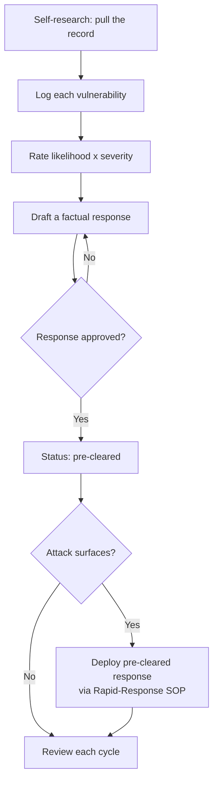

# Self-Oppo Vulnerability Tracker

The storable, trackable form of "research yourself first." [opposition-research.md](../workflows/opposition-research.md) says to list every vulnerability and prepare a response; the "Self-Research Book" in [campaign-documents.md](../artifacts/campaign-documents.md) says to keep them -- this schema is where they live: one row per vulnerability, each with a likelihood, a severity, a **pre-cleared response**, and an **owner**. Good campaigns know every line of attack before the opposition uses it, and have the answer ready.

> **PLANNING-FRAMEWORK NOTICE -- read first.** The example rows below are **illustrative placeholders** showing the format only. They are **not** claims about Matt Grant. Fill this with the campaign's own honest self-assessment, verified by the candidate and campaign manager. Invent nothing; base every entry on real public records or the candidate's own disclosure.

> **HANDLE AS CONFIDENTIAL.** This is among the most sensitive documents a campaign holds. Keep it access-controlled (see [team-raci-access-matrix.md](team-raci-access-matrix.md)); share only with the candidate, campaign manager, and comms lead. It is defensive preparation, never material to attack anyone else with.



---

## CSV Schema

```csv
issue,category,source,likelihood,severity,pre_cleared_response,response_status,owner,last_reviewed,notes
```

### Field Definitions

| Field | Type | Required | Description |
|---|---|---|---|
| `issue` | Text | Yes | Short, honest description of the vulnerability (one line) |
| `category` | Enum | Yes | One of: `Personal`, `Financial`, `Business`, `Legal`, `Voting/Record`, `Statement`, `Association`, `Other` |
| `source` | Text | Yes | Where it's documented / where an attacker would find it (public record, old post, filing, article). Public sources only |
| `likelihood` | Enum | Yes | Odds it gets used: `Low` / `Medium` / `High` |
| `severity` | Enum | Yes | Damage if it lands: `Minor` / `Moderate` / `Serious` / `Disqualifying` |
| `pre_cleared_response` | Text | Yes | The approved, factual answer -- what the candidate/campaign says when asked |
| `response_status` | Enum | Yes | `Draft` / `In review` / `Pre-cleared` / `Needs update` |
| `owner` | Text | Yes | The one person accountable for keeping this entry and its response current |
| `last_reviewed` | YYYY-MM-DD | Yes | Date the entry + response were last verified (review each cycle) |
| `notes` | Text | No | Context, legal-review flag, related entries, deploy history |

### Example CSV Data

Illustrative placeholders -- format only, **not** about any real person. Replace entirely.

```csv
issue,category,source,likelihood,severity,pre_cleared_response,response_status,owner,last_reviewed,notes
"Old post could be read out of context",Statement,"Public social account, 2019",Medium,Moderate,"Explain the full context in one sentence; pivot to the four priorities",Pre-cleared,"Comms lead",2026-06-20,"Legal reviewed; bridge phrase ready"
"Business dispute in public filings",Business,"County court records",Low,Moderate,"State the facts plainly; note it was resolved",In review,"Campaign manager",2026-06-20,"Pull full docket before finalizing"
"Missed a local vote",Voting/Record,"Public voting history",Low,Minor,"Acknowledge, give the reason, note overall record",Draft,"Candidate",2026-06-20,"Low priority"
```

### JSON Schema

```json
{
  "vulnerability": {
    "id": "SO-2026-001",
    "issue": "Old post could be read out of context",
    "category": "Statement",
    "source": "Public social account, 2019",
    "likelihood": "Medium",
    "severity": "Moderate",
    "pre_cleared_response": "Explain the full context in one sentence; pivot to the four priorities",
    "response_status": "Pre-cleared",
    "owner": "Comms lead",
    "last_reviewed": "2026-06-20",
    "notes": "Legal reviewed; bridge phrase ready"
  }
}
```

### Enumerations

```json
{
  "category": ["Personal", "Financial", "Business", "Legal", "Voting/Record", "Statement", "Association", "Other"],
  "likelihood": ["Low", "Medium", "High"],
  "severity": ["Minor", "Moderate", "Serious", "Disqualifying"],
  "response_status": ["Draft", "In review", "Pre-cleared", "Needs update"]
}
```

---

## Priority: which vulnerabilities to work first

Rank by likelihood x severity. Anything **High likelihood** or **Serious/Disqualifying severity** must reach `Pre-cleared` first.

| | Minor | Moderate | Serious | Disqualifying |
|---|---|---|---|---|
| **High** | Monitor | Pre-clear | Pre-clear now | Pre-clear now + brief candidate |
| **Medium** | Log | Pre-clear | Pre-clear | Pre-clear now |
| **Low** | Log | Log | Pre-clear | Pre-clear |

A **Disqualifying** entry is a strategic conversation, not just a talking point -- surface it to the candidate and campaign manager early ([should-i-run.md](../workflows/should-i-run.md) covers the honest self-assessment).

---

## Validation rules

| Rule | Check | Action if it fails |
|---|---|---|
| Every high-priority row is answered | High-likelihood or Serious+ rows are `Pre-cleared` | Draft and approve a response now |
| Responses are factual | `pre_cleared_response` is truthful and defensible | Rewrite; never respond with spin that a fact check breaks |
| Public sources only | `source` is a public record, not private/hacked material | Remove; this tool is defensive and lawful only |
| Freshness | `last_reviewed` within the current reporting cycle | Re-verify the entry and its response |
| Owned | Every row has one `owner` | Assign an accountable owner |

---

## Best practices

1. **Be honest with yourself.** A vulnerability you won't write down is one you can't prepare for.
2. **Every entry gets a response before it's needed.** The point is a ready answer, not a list of fears.
3. **Rank and work the top of the list.** High x Serious first.
4. **Keep responses factual.** Pre-cleared answers must survive a fact check; pair with the inoculation formats in [issue-response-engine.md](../tactics/issue-response-engine.md).
5. **Wire it to rapid response.** When an attack hits, the answer already exists -- deploy it via the [Rapid-Response SOP](../workflows/rapid-response-sop.md).
6. **Guard it.** Confidential; access-controlled; defensive use only.

---

> **EDUCATIONAL DISCLAIMER:** This is educational information, not legal advice. How you characterize or respond to a specific issue -- especially anything touching litigation, finances, or defamation -- is fact-specific; consult campaign counsel before finalizing a response. Base entries only on lawful, public information.

*Built on [workflows/opposition-research.md](../workflows/opposition-research.md) (Self-Research), [artifacts/campaign-documents.md](../artifacts/campaign-documents.md) (Self-Research Book), and [workflows/rapid-response-sop.md](../workflows/rapid-response-sop.md).*
