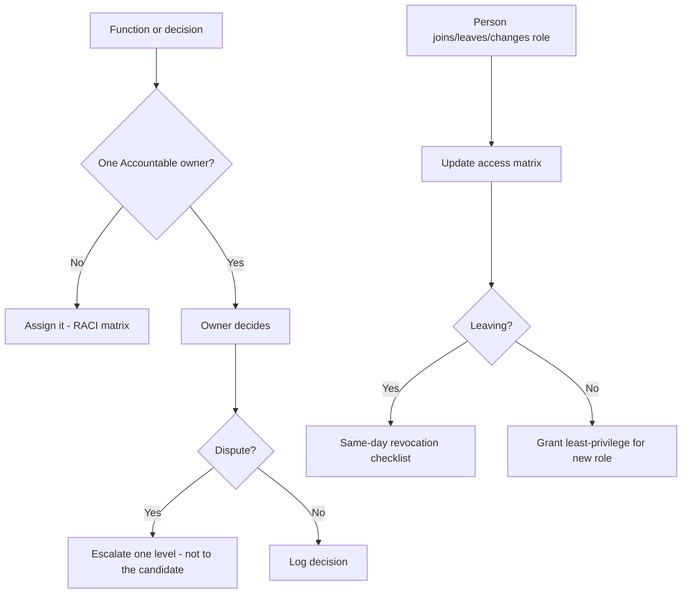

# Team RACI & Access Matrix

Two linked control documents that prevent the two most common internal failure modes: **nobody owns the decision** (so it stalls or fragments) and **nobody revokes access** (so a departure becomes a leak or a security hole). The RACI matrix assigns one accountable owner per campaign function; the access matrix maps who can touch which tool, and how access is pulled the day someone leaves.

> **PLANNING-FRAMEWORK NOTICE -- read first.** Every name, owner, and permission below is an **illustrative placeholder** to show the format. Replace them with the campaign's real people and real accounts, verified by the campaign manager, before relying on this for deployment. Do not treat any assignment here as actual or final.



---

## Part A -- RACI by function

One **Accountable** owner per function (the single person answerable for it). **Responsible** = does the work; **Consulted** = weighs in before; **Informed** = told after. If two people are Accountable for the same thing, that's the bug this matrix exists to fix.

| Function | Accountable (one) | Responsible | Consulted | Informed |
|---|---|---|---|---|
| **Message / narrative** | Campaign manager | Comms lead | Candidate, pollster | Full team |
| **Budget / spend** | Campaign manager | Finance director | Treasurer | Candidate |
| **Compliance / finance filings** | Treasurer | Finance director | Counsel | Campaign manager |
| **Field / GOTV** | Field director | Captains | Data lead | Campaign manager |
| **Digital / social** | Digital lead | Social captain | Comms lead | Campaign manager |
| **Data / voter file** | Data lead | Field director | Compliance | Campaign manager |
| **Fundraising** | Finance director | Call-time manager | Candidate | Campaign manager |
| **Rapid response** | Campaign manager | Comms lead | Counsel | Candidate |
| **Candidate schedule** | Scheduler | Advance | Campaign manager | Candidate |

**Escalation:** a dispute goes **up exactly one level** and gets resolved there; it does not land on the candidate, whose time and focus are the scarcest resource. Only truly strategic or values-level splits reach the candidate.

**Decision log:** record consequential decisions (what, who decided, date, why) in a shared log so they aren't re-litigated and finger-pointed later. The rapid-response decision log ([rapid-response-sop.md](../workflows/rapid-response-sop.md) §6) is the same idea for crises.

---

## Part B -- Access matrix (tools & accounts)

One row per person, one column per system; the value is their permission level. Pair every account with **MFA on** and a named owner. This is the external-account complement to the web dashboard's built-in RBAC ([web/docs/roles-and-permissions.md](../web/docs/roles-and-permissions.md)), whose access is already role-gated and revoked in code -- **this matrix covers everything the dashboard doesn't**: email, social, ad accounts, the donation platform, banking, the CRM/voter file, and the password manager.

### CSV Schema

```csv
person,role,email_google,social_admin,ad_accounts,winred,bank,crm_voterfile,password_manager,dashboard_role,mfa_enabled,access_notes
```

### Field Definitions

| Field | Type | Required | Description |
|---|---|---|---|
| `person` | Text | Yes | Full name: "Last, First" |
| `role` | Text | Yes | Campaign function (ties to Part A) |
| `email_google` | Enum | Yes | `owner` / `admin` / `user` / `none` |
| `social_admin` | Enum | Yes | Platform admin level: `admin` / `editor` / `none` |
| `ad_accounts` | Enum | Yes | Meta/Google Ads: `admin` / `advertiser` / `none` |
| `winred` | Enum | Yes | Donation platform: `admin` / `viewer` / `none` |
| `bank` | Enum | Yes | Committee bank: `signer` / `view` / `none` (treasurer-controlled) |
| `crm_voterfile` | Enum | Yes | `admin` / `user` / `none` |
| `password_manager` | Enum | Yes | Vault access: `admin` / `member` / `none` |
| `dashboard_role` | Enum | Yes | The web app RBAC role: `admin` / `captain` / `volunteer` / `none` (see roles-and-permissions.md) |
| `mfa_enabled` | Boolean | Yes | MFA on for every account this person holds. Non-negotiable -- `false` is a finding to fix. |
| `access_notes` | Text | No | Least-privilege rationale, review date, backup owner |

### Example CSV Data

Illustrative placeholders -- replace with the campaign's real roster.

```csv
person,role,email_google,social_admin,ad_accounts,winred,bank,crm_voterfile,password_manager,dashboard_role,mfa_enabled,access_notes
"Manager, A.",Campaign manager,admin,admin,admin,viewer,view,user,admin,admin,true,"Full ops; not a bank signer"
"Treasurer, B.",Treasurer,user,none,none,admin,signer,none,member,admin,true,"Owns finance + filings"
"Digital, C.",Digital lead,user,admin,advertiser,none,none,user,member,captain,true,"Runs ads; least-privilege on finance"
"Volunteer, D.",Field volunteer,none,none,none,none,none,user,none,volunteer,true,"Voter file only; no money/social"
```

### JSON Schema

```json
{
  "person": {
    "name_last": "Manager",
    "name_first": "A.",
    "role": "Campaign manager",
    "access": {
      "email_google": "admin",
      "social_admin": "admin",
      "ad_accounts": "admin",
      "winred": "viewer",
      "bank": "view",
      "crm_voterfile": "user",
      "password_manager": "admin",
      "dashboard_role": "admin"
    },
    "mfa_enabled": true,
    "access_notes": "Full ops; not a bank signer",
    "backup_owner": "Treasurer, B."
  }
}
```

---

## Off-boarding: same-day revocation checklist

When anyone leaves or changes role, run this **the same day** -- it is both a conflict control (a disgruntled ex-staffer can leak) and a security control (an unrevoked account is an open door).

- [ ] **Dashboard:** revoke on the team page -- this demotes in Clerk and ends live sessions immediately (`revokeStaff`, already automated).
- [ ] **Google/email:** remove from the workspace/group; transfer file ownership first.
- [ ] **Social & ad accounts:** remove as admin/editor on every platform; check business-manager membership.
- [ ] **Donation platform & bank:** remove access; if they were a signer, update the bank and notify the treasurer.
- [ ] **CRM / voter file:** deactivate; confirm no exported data walks out (voter data is access-controlled by law).
- [ ] **Password manager:** remove from the vault and **rotate any shared credentials** they knew.
- [ ] **Connected apps / API keys / tokens** they created or could access: rotate.
- [ ] Update this matrix and log the change.

Rotate first, argue later: if a departure is contentious, revoke access before the conversation, not after.

---

## Validation rules

| Rule | Check | Action if it fails |
|---|---|---|
| One Accountable per function | Each Part-A row has exactly one Accountable | Assign a single owner; remove duplicates |
| MFA everywhere | Every `mfa_enabled` is `true` | Turn on MFA before granting anything else |
| Least privilege | No `none`-role function has money/data access | Downgrade to the minimum the role needs |
| Bank separation | Only the treasurer/designated signers have `bank: signer` | Remove extra signers |
| Off-boarding closed | No departed person retains any non-`none` access | Run the revocation checklist |

---

## Best practices

1. **One org chart, one owner per function.** Put it in writing before the campaign gets busy.
2. **Least privilege by default.** People get the minimum access their role needs, nothing more.
3. **MFA is non-negotiable** on every account.
4. **Revoke same-day.** A leaving teammate's access is closed the day they leave.
5. **Log decisions, not drama.** A shared decision log ends re-litigation.
6. **Keep it current.** Review after every hire, departure, or role change.

---

> **EDUCATIONAL DISCLAIMER:** This is educational information, not legal advice. Committee banking authority, voter-file access rules, and record-retention obligations vary by jurisdiction -- consult your treasurer, counsel, or filing agency for guidance specific to your situation.

*Complements [references/roles.md](../references/roles.md), [web/docs/roles-and-permissions.md](../web/docs/roles-and-permissions.md), [tools/campaign-tech-stack.md](campaign-tech-stack.md), and [workflows/rapid-response-sop.md](../workflows/rapid-response-sop.md).*
