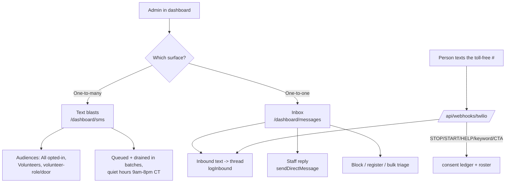

# Admin ↔ team texting — status & plan

Where the campaign stands on **admins sending text messages to team members from the dashboard and holding a two-way conversation**, and the plan to close the remaining gap. This is a status report for the `claude/admin-text-messaging-status` work, written against the code on that branch.

> **Not legal advice.** Every texting path here is subject to TCPA consent/quiet-hour rules and the FEC *Paid for by Matt Grant for Congress.* disclaimer. The message-level rules live in [`../../messaging/sms-texting.md`](../../messaging/sms-texting.md); the go-live/verification steps in [`sms-go-live.md`](./sms-go-live.md).

---

## TL;DR

- **Two-way texting is built and works** — but it is aimed at *supporters/volunteers who text in*, not at *internal team members*.
- **Broadcast texting is built and works** — admins send, captains draft, all gated on opt-in.
- **The one real gap:** there is no *team roster with phone numbers + consent*, and the console doesn't expose a "text my team" audience or quick-pick. Staff are invited by **email only** (Clerk), so the campaign has no reliable way to reach staff by text today.
- **Nothing ships to carriers until Twilio go-live** (Toll-Free Verification + three SSM secrets) is done — see the checklist in [`sms-go-live.md`](./sms-go-live.md).

---

## What exists today

Two distinct surfaces, both live in code and gated behind RBAC + the TCPA consent ledger.

### 1. Text blasts — one-to-many broadcast

| Aspect | Status |
|---|---|
| Location | `app/dashboard/sms/page.tsx` + `components/dashboard/SmsComposer.tsx` |
| Who can send | **Admins** (`sendSms`); **captains** can draft + test (`draftSms`) — `lib/rbac.ts` |
| Audiences surfaced | "All opted-in" (subscribers), "Volunteers", and volunteer **role/door** segments |
| Consent | Every recipient intersected with the opt-in ledger *by construction*; re-checked at drain (`lib/sms/audiences.ts`) |
| Compliance | Sender ID + "Reply STOP to opt out" appended; quiet hours 9am–8pm CT; STOP honored automatically |
| Delivery | Queued, drained ≤30/invocation by the `sms-drain` cron (`lib/sms/campaigns.ts`) |

### 2. Inbox — genuine two-way 1:1 dialogue

| Aspect | Status |
|---|---|
| Location | `app/dashboard/messages/` (list, `[phone]` thread) + `lib/sms/conversations.ts` |
| Who can use | `messageIndividuals` (admin + captain) |
| Inbound | Every reply to the toll-free number is logged into that person's thread (`logInbound`) via `app/api/webhooks/twilio/route.ts` |
| Outbound | Staff reply or cold-start with `sendDirectMessage`, behind `decideCanSend`: opted-in numbers may be cold-initiated; anyone who texted first may be replied to; opted-out/blocked refused |
| Moderation | Profanity flag (⚠, non-blocking), block/unblock, bulk archive/markRead/block |
| Quick-pick | New-message contact list is drawn from **opted-in volunteers** |

**So two-way dialogue is fully implemented** — the machinery (threads, unread counts, consent gate, moderation) is all there.

---

## The gap: "team members" specifically

The request is about texting **team members**. Today that audience is a second-class citizen:

1. **No staff phone roster.** Team members are invited by **email only** (`app/dashboard/team/actions.ts`, `lib/staff.ts` capture no phone). Clerk *can* hold a phone if a user added one (`lib/clerkAudiences.ts` reads `primaryPhoneNumber`), but nothing prompts for or requires it — so coverage is thin and unreliable. **This is the real blocker** and is addressed in Phase 2.
2. **Consent still applies to staff.** Even with phones on file, a staffer must be opted in (texted the keyword or checked a consent box) before the campaign may text them. There's no internal opt-in capture in the invite/onboarding flow (Phase 2).

Already-present (so *not* gaps):

- **Broadcast to the team works.** The blast composer already renders **account-role chips** (`components/dashboard/SmsComposer.tsx`, `ROLES`), wired to `roleGroups` and resolved by `resolveSmsRecipients()` — so an admin can pick "Admin"/"Captain" as a blast audience today (opted-in numbers only, counted at send).
- **1:1 to a teammate works.** The inbox **New message** picker now lists opted-in team members (staff Clerk accounts with a phone) alongside volunteers — see Phase 1 below.

Net: an admin can two-way text a teammate today **provided that teammate has a phone on file in Clerk and is opted in.** The remaining friction is coverage — most staff have neither, which Phase 2 fixes.

---

## Plan

Four phases, smallest-useful-first. Phases 0–1 make team texting real from the console; 2–3 make it pleasant and durable.

### Phase 0 — Go-live prerequisite (no code)
- Complete Twilio Toll-Free Verification and load the three SSM secrets so `smsEnabled()` flips true. Tracked in [`sms-go-live.md`](./sms-go-live.md). **Blocks any real send.**

### Phase 1 — Expose the team as an audience ✅ done
- Broadcast: account-role chips already ship in the composer (nothing to add) — an admin picks "Admin"/"Captain" as a blast audience, opted-in only.
- Inbox: **done in this change.** `app/dashboard/messages/page.tsx` now unions opted-in team members (staff Clerk accounts with a phone) into the New-message quick-pick, labeled by role, deduped by phone against the volunteer list.
- *Outcome:* an admin can broadcast to the team and 1:1 a teammate from the console — for any staffer who already has a phone on file and is opted in. (Coverage of that "already has a phone + opt-in" set is what Phase 2 grows.)

### Phase 2 — Capture staff phone + consent ✅ done
Chosen model: **self-serve** (a staffer opts in on their own — the only TCPA-valid path; an admin can't consent for a teammate).
- **My text alerts** panel on Dashboard → **My notifications** (`components/dashboard/TextAlertsPrefs.tsx`): a signed-in staffer enters their own mobile and checks "text me team alerts." The action (`app/dashboard/notifications/actions.ts` → `saveTextAlerts`) stores the number on their Clerk account (`publicMetadata.phone`, via `setClerkPhoneByEmail`) and writes the consent ledger with source **`staff-optin`**; unchecking opts out (mirrors a STOP). Roster opt-out mirrored both directions, matching the inbound webhook.
- Messaging surfaces read that number: `listStaffContacts()` (one Clerk pass, falls back to `publicMetadata.phone`) feeds the inbox quick-pick, and `listClerkContactsByRole` picks it up for blasts — so a self-opted-in staffer is immediately textable and pickable.
- **Team & access** page shows a per-teammate **Texts on / No text opt-in** badge (join of `listStaffContacts` ↔ consent ledger) so admins can see who's reachable — read-only, as designed.
- Works before Twilio go-live: the opt-in is recorded now and takes effect the moment texting flips on.

### Phase 3 — Team-oriented polish (optional)
- A dedicated **"Team broadcast"** template category (logistics/alerts) distinct from voter-facing copy.
- Show the teammate's **name + role** (not just phone) on inbox threads for internal conversations.
- Consider whether internal team alerts warrant a lighter-touch consent model than voter outreach (confirm against TCPA before relying on it — internal staff who provided a number for work coordination may fall under a different basis, but **do not assume; verify with counsel**).

### Explicitly out of scope / guardrails
- No cold-texting anyone (staff or supporter) who hasn't opted in — the consent gate stays.
- No new policy positions, endorsements, or fabricated data.
- Quiet hours and the FEC disclaimer continue to apply to every outbound message.

---

## Decision needed from the campaign

1. **Is "team members" = staff (admin/captain Clerk accounts), volunteers, or both?** The plan above treats it as staff; if it means the volunteer roster, most of Phase 1 already exists and the gap is much smaller.
2. **Collect staff phones at invite time?** (Phase 2) — needed for reliable team texting; adds a field to the invite flow.
3. **Priority vs. Twilio go-live** — none of this sends until Phase 0 is done.

---

## See also
- [`sms-go-live.md`](./sms-go-live.md) — Twilio verification + secrets, the send prerequisite.
- [`messaging-rbac.md`](./messaging-rbac.md) — who can draft vs. send vs. message individuals.
- [`../../messaging/sms-texting.md`](../../messaging/sms-texting.md) — consent language, templates, cadence, metrics.
</content>
</invoke>
