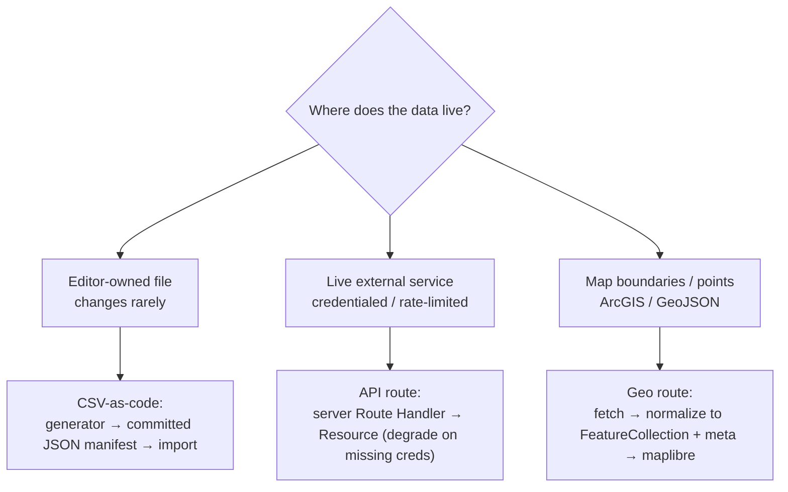

# Data Architecture — APIs, CSV, and Geo

How the campaign web app retrieves data, and the one contract that makes all three
source types feel the same to use and to view. The goal is a **seamless user
experience**: consistent loading, empty, error, and *degraded* states everywhere,
whether the data came from a CSV, a live API, or a geo service.

## The decision: which retrieval kind?



| Kind | Use when | Pattern | Reference |
|---|---|---|---|
| **CSV / static** | Data is editor-owned, changes rarely, and should ship in the build (trackers, design lists, rosters) | A generator (`web/scripts/*`) reads the source, writes a committed `web/lib/*.json` manifest; the app imports it. **No CSV parsing at runtime.** | `lib/data/csv.ts`, `printTracker.json` |
| **Live API** | Data is owned by an external service, is credentialed or rate-limited, and must be fresh | A server Route Handler fetches via `lib/integrations/http.ts`, validates, and returns a `Resource`. Missing creds → **degraded**, not an error. | `lib/data/api.ts`, `lib/walgreens.ts` |
| **Geo** | Map boundaries/points, typically from ArcGIS FeatureServers | A Route Handler fetches, normalizes to a `FeatureCollection` + `meta`, falls back to sample data, and caches with ISR. | `lib/data/geo.ts`, `app/api/geo/*` |

## The unifying seam: `Resource<T>`

Every loader returns one envelope (`lib/data/resource.ts`), generalizing the three
shapes the app used to return separately (`{configured}`, `{…FeatureCollection, meta}`,
`{ok, count, results}`):

```ts
type Resource<T> =
  | { ok: true;  data: T;    meta: Provenance }
  | { ok: false; data: null; meta: Provenance; error: string };
```

`Provenance` carries `source`, `kind`, `live`, `count`, and an optional
`degraded: { reason }`. Helpers: `ok()`, `fail()`, `degraded()`, `isEmpty()`,
`isDegraded()`.

**Why it matters:** a missing credential or a flaky upstream becomes a `degraded`
resource (render the fallback + a gold notice) instead of a thrown 500. The UI
chooses a state from the envelope, not from per-source ad-hoc flags.

## The loaders

- **`csv.ts`** — `parseCsvRows` / `parseCsv` (correct RFC-4180: quoted fields,
  embedded commas/quotes/newlines, CRLF) used by generators; `loadCsvManifest(json,
  schema)` validates a committed manifest row-by-row into a typed `Resource<T[]>`.
- **`api.ts`** — `loadApi(fetcher, { source, enabled, schema, fallback })` wraps the
  existing `fetchJsonWithRetry` (timeout + backoff + Retry-After). `enabled:false`
  and thrown errors become `degraded` (if a fallback is given) or `fail`.
- **`geo.ts`** — `geoRoute({ source, fetcher, fallback })` returns a Next `GET`
  handler that emits `{ type, features, meta }` and serves `fallback` with
  `live:false` on empty/error. Pair with `export const revalidate` for ISR.

## Client + UX states

- **`useResource<T>(url, init?)`** (`lib/data/useResource.ts`) — native fetch +
  `AbortController`, no SWR dependency. Returns
  `{ state: "idle"|"loading"|"ready"|"empty"|"error"|"degraded", data, meta, error, lastFetchedAt, reload }`.
  Accepts a `Resource` envelope **or** a bare payload (back-compat with existing routes).
  Pass `{ manual: true }` to skip the on-mount fetch and load only on `reload()` — used by
  the hub so it doesn't ping every upstream on page load.
- **`ResourceState.tsx`** (`components/data/`) — shared `<Loading/>`, `<Empty/>`,
  `<ErrorState onRetry/>`, `<DegradedNotice/>`, and a `<ProvenanceChip/>` (source · count ·
  live/sample · as-of date), styled to match the dashboard skeleton and `DbNotice`.

## The registry & Data hub

`lib/data/registry.ts` enumerates every source (`id`, `label`, `kind`, `owner`,
`endpoint`/`manifest`, `enabledEnv`, `cache`, `checkable`, `regen`, `remedy`). It powers the
**Data hub** at [`/dashboard/data`](../app/dashboard/data/page.tsx), the live index where staff see
every source grouped by kind. The hub (`components/data/DataHub.tsx` + `SourceCard.tsx`) adds:
- a **health bar** + **"Check all"** that live-pings the `checkable` sources at once (status rolled
  up via `summarize()` in `lib/data/hubStatus.ts`);
- **actionable degraded states** — each unconfigured/degraded source shows its fix via `remedyFor()`
  (the `enabledEnv` to set, or the `regen` command, or the `remedy` string);
- an **inline preview** (`previewOf()`) — a few real values per source (CSV sample server-side; feature
  names / rows for a checked geo/api source).

Update the registry whenever you add a source (and set `checkable`/`regen`/`remedy` where they apply).

The `airtable` kind covers the campaign's second datastore: each governed base in
[`lib/airtable/registry.ts`](../lib/airtable/registry.ts) surfaces as an `airtable-<base>` source whose
"Check now" pings [`/api/airtable/health/[base]`](../app/api/airtable/health/%5Bbase%5D/route.ts) — a
1-record read against that base's Front-End Access control table with the workspace PAT. The full CRUD
governance lives in `lib/airtable/governance-manifest.ts` (its own drift script, `npm run airtable:drift`);
the hub only reflects reachability. A completeness guard,
[`lib/data/registry.test.ts`](../lib/data/registry.test.ts), asserts every Airtable base and every live
integration client appears here — so the inventories can't silently diverge.

The `demographics-*` CSV sources are the St. Louis Census 2025 Vintage datasets (Sándoval/SLU) — raw CSVs
in [`candidate/data/`](../../candidate/data/) (see its `SOURCES.md`), built by `npm run demographics`
([`scripts/generate-demographics.ts`](../scripts/generate-demographics.ts)) into validated JSON under
[`lib/demographics/`](../lib/demographics/), loaded via `loadCsvManifest` with per-dataset zod schemas.
A provenance guard ([`lib/demographics/demographics.test.ts`](../lib/demographics/demographics.test.ts))
cross-checks the committed numbers against the published analysis so a bad re-ingest fails CI.

### Excluded sources

**Donor and finance records are deliberately not on the hub.** They live in DynamoDB only (single-table),
carry supporter/donor PII, and are gated by `viewDonorDetail` / `viewFinanceTotals`; they are managed in
the Donors and Finance dashboards, never mirrored to Airtable, and never health-pinged from this staff-wide
page. Adding a hub row for them is a policy change, not a bug fix — see the note above `SOURCES` in
`lib/data/registry.ts`.

## Conventions to keep

- **Generators stay deterministic** — no `Date.now()` baked into a manifest, so the
  committed JSON is byte-stable and diffs are meaningful.
- **Secrets are env-first** (`lib/ssm.ts`): read `process.env`, fall back to SSM with
  a TTL cache. An unset secret degrades the feature; it never throws on boot.
- **Validate at the boundary** with zod, so CSV/JSON/API drift is caught where the
  data enters, not three layers deep.
- **Degrade, don't crash** — always provide a fallback for geo and for any API that
  has sample/empty data to show.

## Reference slice

The print/CSV path is the canonical worked example: `candidate/letters/print-tracker.csv` →
`web/scripts/generate-print-tracker.ts` (shared parser) → `web/lib/printTracker.json`
→ `lib/data/printTracker.ts` (`loadCsvManifest`) → `app/dashboard/print/page.tsx`
(renders from the `Resource`). Copy it when wiring a new source.

## Live adopters

All three kinds are now on the pattern — copy the closest one:

- **CSV** — print tracker (above).
- **Geo** — all four `app/api/geo/*` routes are `export const GET = geoRoute({…})`; the
  fetcher returns `{ fc, meta }` (route-specific meta merges onto the base provenance), and
  `components/MapExplorer.tsx` reads all four through `useResource` (live/sample/count from `meta`).
- **API** — `app/api/print/products/route.ts` uses `loadApi` (degrades to an empty catalog when
  `WALGREENS_*` is unset); `components/PrintStudio.tsx` loads it via `useResource`. The imperative
  store-finder/order-submit stay as raw fetch — they're user actions, not declarative loads.
  `app/api/research/census/route.ts` also returns a `Resource` (ready for a future demographics panel).
- **Server-side reads** — `lib/data/research.ts` (`loadFieldResearch`, `loadCandidateResearch`) wraps the
  research dashboard's DynamoDB reads in a `Resource`; the pages render `<DegradedNotice>`/`<ProvenanceChip>`
  for the store-not-connected / not-ingested / stale states. The research read routes (`member/[id]`,
  `/bills`, `/votes`, `timeline`, `child-act`, `alignment`) return `Resource` envelopes too (no UI consumer
  — readiness); `health` (503 contract), `graphic` (PNG), `script` (text), and the ingest/cron writes stay as-is.
