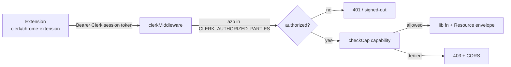

# Extension API — `/api/ext/*`

The stable, CORS-enabled surface the **matt-grant Chrome extension** uses to read and
write campaign data. It is not a second app: every endpoint rides the **same Clerk
identity** and the **same capability gate** (`staffGate()` → `can(capability)`) as the
dashboard, returns the app's standard `Resource<T>` envelope, and — for writes — logs
to the `AUDIT#ext` trail. This doc is the contract for whoever builds the extension client.

Educational/operational reference for the campaign; not legal advice.

## How auth works



- The extension uses Clerk's **`@clerk/chrome-extension`** SDK with the **same**
  `NEXT_PUBLIC_CLERK_PUBLISHABLE_KEY` as the web app (same Clerk instance), and
  `createClerkClient({ syncHost: "<app origin>" })` so it shares the site's session.
- It sends the Clerk **session token** as `Authorization: Bearer <token>`. `clerkMiddleware`
  accepts that header exactly like the site cookie, so `checkCap()` resolves the user's
  `publicMetadata.role` → `can(capability)` with **no separate auth path**.
- Authorization is per-endpoint by **capability** (see the tables). The role model lives in
  [`web/lib/rbac.ts`](../lib/rbac.ts); see [roles-and-permissions.md](./roles-and-permissions.md).

## Turning it on (deployment)

The whole surface is **fail-closed** until two env vars are set on the server (App Runner
service config, or SSM `/matt-grant/*`). With them blank, cross-origin reads are blocked and
the app is unaffected.

```
EXTENSION_ORIGIN="chrome-extension://abalnefilpmcfbabfaljnophamaegfgj"
CLERK_AUTHORIZED_PARTIES="https://mattgrantforcongress.org,https://ezvnqn5e5i.us-east-1.awsapprunner.com,chrome-extension://abalnefilpmcfbabfaljnophamaegfgj"
```

- **`EXTENSION_ORIGIN`** — comma-separated allowlist of `chrome-extension://<id>` origins
  permitted to read responses (the CORS gate, [`lib/http/cors.ts`](../lib/http/cors.ts)).
- **`CLERK_AUTHORIZED_PARTIES`** — the token `azp` allowlist ([`middleware.ts`](../middleware.ts)).
  Must include **every origin staff load the dashboard from** (custom domain *and* the App
  Runner URL) plus the extension origin — omitting an app origin logs staff out. Do **not**
  put the Clerk Frontend-API host (`clerk.<domain>`) here; it is not an `azp`.
- **One-time Clerk Dashboard step:** add `chrome-extension://abalnefilpmcfbabfaljnophamaegfgj`
  to the instance's **allowed origins**, or Clerk rejects the extension's token even with
  `authorizedParties` set.

## Request/response contract

- **CORS:** only allowlisted origins get `Access-Control-Allow-Origin` (credentialed). Every
  response — including `400/403/404/409/502` — carries the CORS headers so the extension can
  read the status. Each route (or the shared `extRoute` factory) answers the `OPTIONS`
  preflight; advertised methods are `GET, POST, PATCH, DELETE, OPTIONS`.
- **Envelope:** JSON [`Resource<T>`](../lib/data/resource.ts) — success `{ ok: true, data, meta }`,
  failure `{ ok: false, data: null, meta, error }`.
- **Identity is server-derived.** `submittedBy` / `createdBy` / audit `actor` always come from
  the Clerk session (`gate.email`), never the request body.
- **Content type:** send `Content-Type: application/json` on writes.

## Reads (GET)

| Path | Capability | Returns |
|---|---|---|
| `/api/ext/overview` | `viewOverview` | Campaign totals, counts, milestones (`getOverview`) |
| `/api/ext/finance` | `viewFinanceTotals` | Raised/spent + expenditures (`getFinance`) |
| `/api/ext/tasks` | `manageTasks` | Task board (`getTasks`) |
| `/api/ext/events` | `manageEvents` | All events incl. drafts (`listEvents`) |
| `/api/ext/budget/expenses` | `viewFinanceTotals` | Expense requests (`listExpenses`) |
| `/api/ext/issues` | `moderateIssues` | Issue-moderation queue (`listSubmissionsForModeration`) |
| `/api/ext/research/member/{bioguideId}` | `viewResearch` | Legislative research for a member |

## Writes

Body is JSON, zod-validated; unknown/invalid → `400`. Missing capability → `403`.

| Method · Path | Capability | Body | Notes |
|---|---|---|---|
| `POST /api/ext/tasks` | `manageTasks` | `{ title, detail?, category?, priority?, dueDate?, volunteerId?, volunteerName? }` | Creates in `TODO`; returns `{ id }` |
| `PATCH /api/ext/tasks` | `manageTasks` | `{ id, status }` — status ∈ `TODO`\|`DOING`\|`DONE` | id in **body**, not the path |
| `POST /api/ext/budget/expenses` | `viewFinanceTotals` + Airtable *create* toggle | `{ title? , vendor?, category?, quoteLink?, quantity?, unitPrice?, amount?, purpose?, neededBy? }` (title **or** vendor required) | Always created `Proposed`; amount recomputed from qty×unit |
| `PATCH /api/ext/budget/expenses/{id}` | `editFinance` + Airtable *update* toggle | `{ status, paymentMethod?, paymentReference?, paymentDate?, notes? }` — status ∈ `EXPENSE_STATUSES` | Illegal jump → `409`; unknown id → `404` |
| `POST /api/ext/events` | `manageEvents` | `{ title, type, start, end?, allDay?, location?, description?, capacity?, status? }` | `type` ∈ event types; returns `{ id }` |
| `PATCH /api/ext/events/{id}` | `manageEvents` | any subset of the create fields + `status` | Setting `status:"PUBLISHED"` here **does not** send email/SMS; unknown id → `404` |
| `PATCH /api/ext/issues/{id}` | `moderateIssues` + Airtable *update* toggle | `{ status }` (`Approved`\|`Rejected`\|`Pending`) **or** `{ topic?, details? }` | Status takes precedence over text |
| `DELETE /api/ext/issues/{id}` | `moderateIssues` + Airtable *delete* toggle | — | Spam removal |

## Notes & guarantees

- **Two-gate for Airtable-backed writes.** Budget and issues require both the Clerk capability
  *and* the Airtable **Front-End Access** control-table toggle (see
  [airtable-crud/PLAN.md](./airtable-crud/PLAN.md)). A disabled toggle → `403`.
- **Events never notify from the extension.** Publish-with-email/SMS stays a dashboard action;
  the ext `PATCH` only flips stored status + mirrors to Airtable.
- **Auditability.** Every write appends to the `AUDIT#ext` DynamoDB partition
  (`recordExtAction`, [`lib/audit.ts`](../lib/audit.ts)) with `actor = gate.email` and a dotted
  verb (`task.create`, `expense.transition`, `event.update`, `issue.delete`, …).
- **Adding an endpoint:** use the `extRoute` factory ([`lib/http/ext-route.ts`](../lib/http/ext-route.ts))
  for GET + OPTIONS, hand-write POST/PATCH/DELETE mirroring
  [`app/api/ext/tasks/route.ts`](../app/api/ext/tasks/route.ts), and keep the capability from
  `rbac.ts`. The `app/api/auth-coverage.test.ts` guard fails CI if a route ships without a gate.

_Paid for by Matt Grant for Congress._
