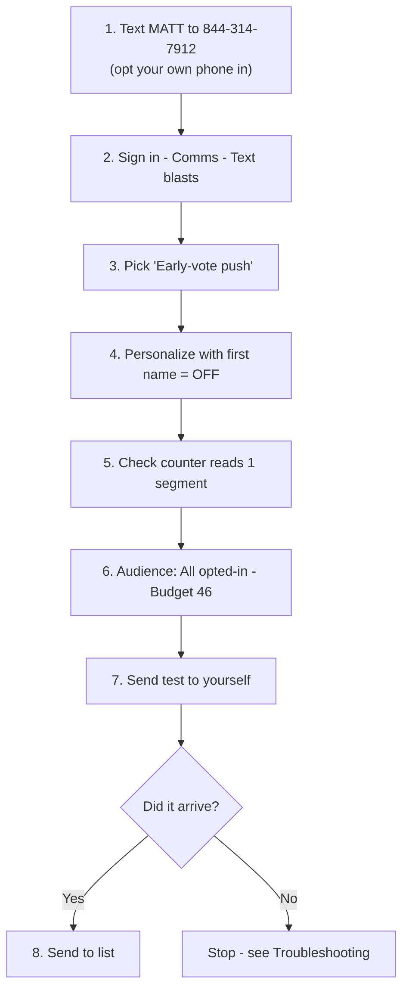

# Your first text blast — a one-page guide

**For Matt.** Everything is set up and approved; this is the click-by-click for sending the campaign's first text blast from the dashboard. It takes about ten minutes, and the two steps people skip are **step 1** (you can't text yourself until you've opted in) and **step 7** (always test before you send to the list). The day-to-day guide is [`sms-operator-runbook.md`](./sms-operator-runbook.md); the technical setup is [`sms-go-live.md`](./sms-go-live.md) and is already done.

> **Operational guidance, not legal advice.** The system enforces the consent, quiet-hour, and disclaimer rules for you — but if anything about a message feels off, ask before sending, not after.

---

## Before you start

Send between **9am and 8pm Central**, and start **before about 6pm** — texts go out around 30 per minute, so a full send takes roughly two hours. Anything unfinished at 8pm pauses until 9am the next morning.

---

## Step 1 — Opt your own phone in

**From your own phone, text the word `MATT` to `844-314-7912`.**

Do this first. The system only texts people who have explicitly opted in, and that includes you. You'll get a welcome reply back within a few seconds. Without this, step 7 fails with "not opted in."

While you're there, **save 844-314-7912 as a contact** so replies aren't flagged as coming from an unknown number.

## Step 2 — Open the composer

Sign in to the dashboard, then in the left nav under **Comms** click **Text blasts**.

If you see a yellow banner saying *"Texting isn't configured yet"* — **stop and tell Doug.** You should not see it; everything was verified on July 27.

## Step 3 — Pick the message

In the template dropdown choose **Early-vote push**.

It fills in the text for you and has no fields to complete. The wording tracks the calendar on its own, so it always states the correct deadline. What recipients get:

> Vote early through 5pm Mon Aug 3. Photo ID, no excuse needed. Reply VOTE for where to go. - Paid for by Matt Grant for Congress. Reply STOP to opt out.

The *"Paid for by…"* line is added automatically. Don't type it yourself, and don't edit it out.

## Step 4 — Leave "Personalize with first name" UNCHECKED

This matters more than it looks. Adding *"Hi Sarah,"* pushes the message over the 160-character limit, so every text bills as **two** messages instead of one — cutting your reach from about **3,300 people to about 1,750** for the same money.

Leave the box unchecked for this send.

## Step 5 — Check the counter

Under the message box is a small line reading something like `151 chars · 1 segment · GSM-7`.

| It says | Meaning |
|---|---|
| **1 segment** | Correct — send it |
| **2 segments** | Something got added. Undo your edit or re-pick the template |
| **UCS-2** | A curly quote, em dash, or emoji snuck in — it names the character. Replace it |

Two segments costs twice as much and halves how many people you reach.

## Step 6 — Set the audience and budget

- **Send to (opted-in only):** choose **All opted-in**.
- **Who to reach — by likelihood to vote:** leave on **All opted-in (ranked)**. The system automatically texts the most likely voters first, so if the money runs out, it runs out on the least valuable names.
- **Budget $ (optional):** type **46**.

The budget fills in **Max texts** for you and shows a line like *"$46 funds ~3,300 texts…"*. Nobody is removed from the list — they just don't get this particular message.

## Step 7 — Test it on yourself

Enter your own mobile number and click **Send test**.

**Wait for it to actually arrive.** Read it on your phone. Check the deadline is right, the link works, and it looks like something you'd want a voter to see. This is the last point where a mistake is free.

## Step 8 — Send

Click **Send to list** and confirm the audience in the prompt.

You'll get a completion estimate like *"Sending ~30/min — done ~3:40 PM CT."* The **Recent sends** panel below shows live progress. You don't need to keep the page open.

---

## What happens after

- **People will reply.** Anyone who texts back appears in **Comms → Inbox**, where staff can answer one-to-one. Someone should check it within the hour.
- **Some will text STOP.** That's normal and handled automatically — they're removed instantly. Under 2% is healthy.
- **Replies cost money too.** They come out of the same balance.

---

## Troubleshooting

| What you see | What to do |
|---|---|
| *"Texting isn't configured yet"* banner | Stop. Tell Doug — don't try to work around it |
| Test text never arrives | You skipped step 1, or texted STOP at some point. Text `START` to 844-314-7912, then retry |
| *"…isn't opted in"* | Same — step 1 first |
| Blast says "queued" and nothing sends | It's outside 9am–8pm CT. It resumes on its own next morning |
| Counter shows 2 segments | Re-pick the template rather than editing the text back |
| Not sure whether to send | Ask first. A text can't be unsent |

---

## The one hard rule

**Never add phone numbers by hand, and never upload a purchased or voter-file list.** It's illegal under the TCPA and would put the campaign's texting at risk. The list grows only when people opt in themselves — by texting `MATT`, checking the box on the website, or checking it on the donation form.

The biggest lever on reach is promoting **"Text MATT to 844-314-7912"** at doors, on signs, and from the stump. Every new opt-in is one more person you can reach on August 4.

---

## See also

- [`sms-operator-runbook.md`](./sms-operator-runbook.md) — the fuller day-to-day guide for staff
- [`sms-go-live.md`](./sms-go-live.md) — the technical setup (already complete)
- [`../../messaging/sms-texting.md`](../../messaging/sms-texting.md) — message rules, cadence, and compliance
