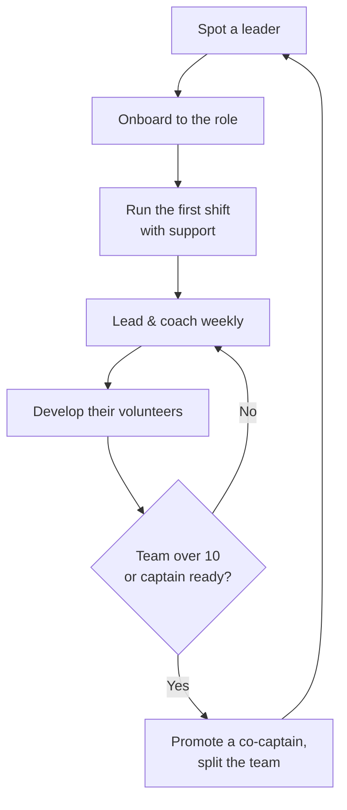

# Captain Onboarding & Training

How to take a promising volunteer and turn them into a **team captain** who runs their own 5-10 person team -- onboard them, teach them to run a shift, coach them week to week against their archetype's blind spots, and help them develop the next captain. This is the captain's operating manual: where [captain-archetypes.md](../tactics/captain-archetypes.md) says *who* a captain is and [team-pairing.md](team-pairing.md) says *who they lead*, this file says *what they do and how they get good at it*. It adapts the volunteer onboarding and shift-management patterns in [volunteer-management.md](volunteer-management.md) to the leader's seat.

> This is leadership development, not a checklist to recite. Coach the real person in front of you; the structures below are scaffolding, not a script.

---

## The Captain Development Lifecycle

---

## 1. What a Captain Owns

A volunteer does the work; a **captain multiplies it**. Beyond their own doors and dials, a captain owns:

- [ ] **A team** of 5-10 volunteers (the span from [team-pairing.md](team-pairing.md#part-b-pair-captain--volunteers-and-a-complementary-co-captain)) and one clear point of contact for each.
- [ ] **Their team's numbers** -- shift turnout, contacts, new recruits, and pipeline motion ([captain-roster.md](../tools/captain-roster.md#roster-health-rules)).
- [ ] **Their volunteers' growth** -- onboarding, training, recognition, and moving each up the [support ladder](team-pairing.md#the-volunteer--support-ladder).
- [ ] **The message** -- making sure every team member can speak to the four priorities (see §6).

*How* they do this depends on their [archetype](../tactics/captain-archetypes.md); *who* they lead and pair with comes from [team-pairing.md](team-pairing.md). This file is the *how-to-get-good-at-it*.

---

## 2. Onboarding a New Captain

Promote on demonstrated behavior, not just enthusiasm ([volunteer-management.md](volunteer-management.md#volunteer-recognition-and-retention)). Once you give someone the title, onboard them deliberately.

### First-week checklist
- [ ] Name the role explicitly ("You're our Phone Bank Captain") and the team they'll lead.
- [ ] Identify their [archetype](../tactics/captain-archetypes.md) together and name one strength to lean on and one watch-out.
- [ ] Pair them with a complementary co-captain ([Strong combinations](team-pairing.md#complementary-co-captain-pairing)).
- [ ] Walk them through their role's governing playbook (e.g., Canvass → [voter-targeting.md](voter-targeting.md); GOTV → [gotv-plan.md](gotv-plan.md)).
- [ ] Add them to the [roster](../tools/captain-roster.md) and show them their team's row and targets.
- [ ] Have them shadow one shift, then **co-lead** one before running their own.

### Captain orientation agenda (45-60 minutes)
1. Welcome; why you saw a leader in them (5 min).
2. The campaign's theory of victory and the four priorities (10 min; [strategic-plan.md](../candidate/strategic-plan.md)).
3. Their team, role, and governing playbook (10 min).
4. How to run a shift -- walk through §3 (10 min).
5. The weekly cadence and how they'll be supported (10 min; §4).
6. Their archetype's growth edge and first development goal (5-10 min; §5).

### Timeline by phase
Map onboarding to the campaign's [phased timeline](../candidate/strategic-plan.md#3-phased-timeline--working-backward-from-august-4-2026), not fixed calendar dates:

| Phase | Captain focus |
|---|---|
| **Foundation / Building** | Recruit and onboard captains; each runs their first shifts; establish the weekly cadence |
| **Persuasion** | Captains run steady voter-contact shifts; develop volunteers and start the support ladder |
| **GOTV (final 30 days)** | Captains execute the chase; promote co-captains so no team exceeds span under peak load |

---

## 3. Running the Team

A captain's core skill is running a great shift and training the people on it. Adapt the [shift-management rhythm](volunteer-management.md#shift-management) from the captain's seat.

### Run a shift
- [ ] **Before:** confirm attendance, prep all materials (lists, scripts, literature, water), over-recruit 20-30% for no-shows.
- [ ] **Open:** start on time with a 5-minute energy check-in and the day's goal and message.
- [ ] **During:** work alongside the team, check in mid-shift, solve problems, keep the energy up.
- [ ] **Debrief:** what worked, what voters said, what to fix; thank everyone before they leave.
- [ ] **After:** collect data and enter it within 24 hours; note who excelled or struggled; invite each to the next shift.

### Captain as micro-trainer
The captain trains their own volunteers using the role-specific drills in [volunteer-management.md](volunteer-management.md#volunteer-training) -- script walkthrough, role-play, buddy-up the first shift. The growth move is **delegation**: assign a strong volunteer to onboard the next newcomer. (This is the explicit coaching edge for the [Workhorse](../tactics/captain-archetypes.md#archetype-3-the-workhorse-doer), who must learn to multiply, not just out-work.)

---

## 4. Weekly Captain Cadence

"Review weekly" ([team-pairing.md](team-pairing.md#the-pairing-worksheet)) means a real, repeatable conversation. Run a short weekly captain meeting (or 1:1) with three parts:

### Agenda
1. **Numbers (5 min)** -- review the [roster health rules](../tools/captain-roster.md#roster-health-rules): shift turnout, contacts, new volunteers, span (flag >10), and pipeline motion. Feed these into the weekly all-hands ([captain-field-plan.md](../candidate/captain-field-plan.md#5-cadence--gotv-tie-in)).
2. **Coaching (10 min)** -- one win, one obstacle, one development goal (§5). Ask, don't tell: "What got in the way? What will you try?"
3. **Peer learning (5-10 min)** -- captains swap one tactic that worked. The Connector's recruiting trick, the Organizer's turf system -- spread by sharing.

### Cadence checklist
- [ ] Same time each week; protect it even in crunch.
- [ ] Every captain has one current, written development goal (store in the roster `notes` field).
- [ ] Escalate blockers a captain can't solve to the field director.
- [ ] Celebrate publicly; correct privately.

---

## 5. Archetype-Aware Coaching

Coach the weakness, deploy the strength ([captain-archetypes.md](../tactics/captain-archetypes.md#key-principles)). One focus and one guardrail per archetype -- summarized from each archetype's "Development needs"; follow the link for the full profile:

| Archetype | Coaching focus | Guardrail |
|---|---|---|
| [Organizer](../tactics/captain-archetypes.md#archetype-1-the-organizer-field-general) | Build a recognition habit | Don't treat volunteers as spreadsheet slots |
| [Connector](../tactics/captain-archetypes.md#archetype-2-the-connector-recruiter) | Use a simple tracking tool; pair a data partner | Don't over-schedule or skip accountability talks |
| [Workhorse](../tactics/captain-archetypes.md#archetype-3-the-workhorse-doer) | Delegate; teach instead of doing | Watch for burnout; force handoffs |
| [Mentor](../tactics/captain-archetypes.md#archetype-4-the-mentor-coach) | Tie warmth to hard numbers | Don't avoid direct feedback or miss targets |
| [Closer](../tactics/captain-archetypes.md#archetype-5-the-closer-asker) | Honest asks; read when to ease off | Pair an ops partner; deploy in bursts, not maintenance |
| [Strategist](../tactics/captain-archetypes.md#archetype-6-the-strategist-analyst) | Set decision deadlines ("good enough, ship it") | Don't let planning replace action |

---

## 6. Captain Talking Points

Every captain should be able to recruit a volunteer and brief their team on the message. Anchor both to the documented [four priorities](../candidate/platform.md) and the family-court signature cause -- stay within stated positions; **invent no new policy**. For voter-facing door/phone/text scripts, use [campaign-documents.md](../artifacts/campaign-documents.md) and [stump-speech-builder.md](../messaging/stump-speech-builder.md).

### Recruit-a-volunteer pitch (captain → prospect)
> "I'm leading a team for Matt Grant -- a neighbor, a dad, and a problem-solver running to put Missouri's children first by cleaning up corruption in the family courts. We need people for [specific role] this week. Could you give one shift? I'll train you and you won't be alone."

### Weekly team brief (captain → team)
- **Why we're here:** the signature cause -- ending family-court corruption (the CHILD Protection Act) -- plus term limits, smaller government, and lower taxes ([strategic-plan.md messaging pillars](../candidate/strategic-plan.md#6-messaging-pillars)).
- **This week's goal:** [shift count / contact target].
- **The ask we're making:** [vote ID / commitment / yard sign / event].
- **One reminder:** contrast on values and priorities, never personal attacks.

---

## 7. Self-Coaching Tools

Give every captain a way to check themselves between meetings.

### Weekly captain pulse (self-check)
- [ ] Did every shift start on time with a brief and end with a debrief?
- [ ] Is my team within span (5-10)? Do I need a co-captain?
- [ ] Did I move at least one volunteer one rung up the [ladder](team-pairing.md#the-volunteer--support-ladder)?
- [ ] Did I work on my development goal this week?
- [ ] Did I thank everyone who showed up?

### Development tracker
Keep one written goal tied to your archetype's growth edge (§5); review it in the weekly cadence and log progress in the roster `notes`. A captain who only does the work is a great volunteer; a captain who grows other leaders is what wins races.

---

## Compliance

> **EDUCATIONAL DISCLAIMER:** Captain duties touch volunteer-labor and contribution rules once teams move volunteers toward financial or in-kind support. The guidance here is general and may be out of date. Consult a campaign finance attorney or your filing agency for guidance specific to your situation. This is educational information, not legal advice.

- **Volunteer time is not a contribution** ([volunteer-management.md](volunteer-management.md#legal-considerations)); in-kind and donor asks follow [team-pairing.md → Compliance](team-pairing.md#compliance-and-ethics).
- **No coerced giving** -- leading or joining a team is never conditioned on a contribution.
- **Secure handling** -- captains keep team contact info access-controlled; never collect SSNs, bank numbers, or passwords.

---

## Key Principles

1. **Captains are made, not found.** Spot the behavior, give the title, then onboard deliberately.
2. **Run the rhythm.** A great captain runs a tight shift and a real weekly cadence -- structure beats heroics.
3. **Coach the weakness, deploy the strength.** Every captain works one development goal tied to their archetype.
4. **Train your replacement.** The job is to grow the next captain, not to be irreplaceable.
5. **Multiplication wins.** One leader who develops others beats ten who only do the work.

---

*Built on [tactics/captain-archetypes.md](../tactics/captain-archetypes.md), [workflows/team-pairing.md](team-pairing.md), [workflows/volunteer-management.md](volunteer-management.md), and [tools/captain-roster.md](../tools/captain-roster.md). MO-02 application: [candidate/captain-field-plan.md](../candidate/captain-field-plan.md).*
