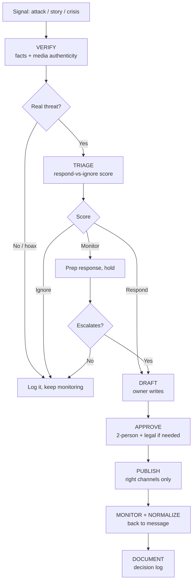

# Rapid-Response SOP

The single, repeatable procedure for reacting to an attack, bad-faith story, or breaking crisis on a same-day clock. It consolidates the pieces that otherwise live in three places -- the RESPOND framework ([crisis-management.md](../tactics/crisis-management.md)), the social crisis protocol ([social-media-strategy.md](../messaging/social-media-strategy.md)), and the rapid-response press release ([press-release-templates.md](../messaging/press-release-templates.md), Template 6) -- and adds the missing operational pieces: standing roles, a respond-vs-ignore decision, a verify gate, and a written record. Use [crisis-management.md](../tactics/crisis-management.md) for the strategic framing; use this file to actually run the play.

> This is an operating procedure, not legal advice. Anything touching defamation, coordination, or a specific attack's legal exposure runs through campaign counsel. Rapid response to opponent attacks is legitimate; fabricating media, impersonating anyone, or spreading unverified claims is not (see [ethics-and-guardrails.md](../references/ethics-and-guardrails.md)). For a doctored-media or impersonation attack specifically, use [impersonation-deepfake-response.md](../tactics/impersonation-deepfake-response.md).

---

## The clock



**Speed standard:** know within 30 minutes, decide within the hour, respond (if responding) within 2-4 hours. Speed is a function of preparation -- the roles, triage rule, and templates below exist so nobody is inventing process during the crisis.

---

## 1. Standing roles (all severity levels)

Most SOPs only define a Level-3 "war room." Attacks arrive at 11pm on a Saturday, so name owners now -- for every level.

| Role | Owns | Who (fill in) |
|---|---|---|
| **First alert / triage** | Sees it first, runs VERIFY + TRIAGE, wakes the right people | On-call rotation |
| **Decision-maker** | Final respond/ignore call and sign-off | Campaign manager (candidate for Level 3) |
| **Drafter** | Writes the response in the approved voice | Comms lead |
| **Approver (2nd eye)** | Second-person review before anything publishes | Campaign manager or comms director |
| **Legal** | Reviews anything with litigation/defamation/coordination exposure | Campaign counsel |
| **Publisher** | Posts to the agreed channels, nothing else | Digital lead |
| **Monitor** | Watches spread/sentiment before and after | Digital/social captain |

Rules: **one spokesperson**; **two-person review before release**; **no staff posts without approval**; the on-call owner has authority to convene at any hour. Map these to the accountable owners in [team-raci-access-matrix.md](../tools/team-raci-access-matrix.md).

---

## 2. VERIFY (the gate before any response)

Never respond to -- or amplify -- something you haven't verified. Responding to a hoax legitimizes it.

- [ ] **Source:** who is making the claim, and is it a real outlet/person or an anonymous/newly-created account?
- [ ] **Substance:** is the underlying claim true, false, or true-but-out-of-context? Pull the primary record (the full vote, the full quote, the full clip).
- [ ] **Media authenticity:** is any image/audio/video genuine? Check for selective editing; reverse-image search; look for AI-generation tells. If it may be doctored or a deepfake, switch to [impersonation-deepfake-response.md](../tactics/impersonation-deepfake-response.md) and **capture evidence before it's deleted**.
- [ ] **Reach right now:** where is it, how fast is it moving, who's carrying it?

Output: one or two sentences of ground truth the decision-maker can act on. If you can't verify in the hour, say so explicitly and default to holding, not guessing.

---

## 3. TRIAGE: respond vs. ignore

A clumsy response amplifies a story that would have died on its own (the Streisand effect). Score each factor 1-3; use the total as a guide, not a rule.

| Factor | 1 (low) | 2 | 3 (high) |
|---|---|---|---|
| **Reach** | Fringe/no pickup | Local/niche | Mainstream or viral |
| **Credibility** | Anonymous/discredited | Partisan source | Credible outlet |
| **Trajectory** | Fading | Steady | Accelerating |
| **Persuadable exposure** | Base-only echo | Mixed | Hits persuadable/swing voters |
| **Truth-value against us** | False/easily debunked | Misleading | Accurate and damaging |

| Total | Call |
|---|---|
| **5-7** | **Ignore** -- log it, do not amplify. Responding does more harm than the attack. |
| **8-11** | **Monitor** -- draft a response and hold it; publish only if it crosses into the range below. |
| **12-15** | **Respond** -- move to Draft now. |

Two overrides regardless of score: (1) a **factual error about voting logistics** (when/where/how to vote) gets corrected immediately; (2) anything with **legal exposure** goes to counsel before any public move.

---

## 4. DRAFT -> APPROVE -> PUBLISH

- **Draft:** the drafter writes tight. Correct the record, don't relitigate it; pivot back to the contrast and the four priorities. Reuse the formats in [issue-response-engine.md](../tactics/issue-response-engine.md) (inoculation language, bridge phrases) and the rapid-response press template ([press-release-templates.md](../messaging/press-release-templates.md), Template 6). For an apology when one is genuinely warranted, use the apology formula in [crisis-management.md](../tactics/crisis-management.md).
- **Approve:** two-person review, always. Legal review only when there's litigation/coordination/defamation exposure -- don't let legal review become a bottleneck on a routine correction.
- **Publish:** only the channels that match where the attack lives and where your persuadable voters are. A fringe attack does not warrant a press release. Paid communications must clear [pre-publish-checklist.md](../tools/pre-publish-checklist.md) and carry the verbatim disclaimer, **Paid for by Matt Grant for Congress.**

Do **not** engage trolls, quote-tweet the attack to a bigger audience, or post from personal staff accounts.

---

## 5. MONITOR + NORMALIZE

- Watch spread and sentiment for the first few hours; be ready to escalate a Monitor into a Respond.
- Once the correction has landed, **return to your own message** -- every extra day spent on the attacker's terms is a day off your contrast.
- **Monitoring cadence (steady-state):** the Monitor owner scans owned mentions, opponent/PAC channels, and impersonation/fake accounts on a set daily rhythm (heavier in the final 30 days), and escalates anything that clears the triage threshold. Ownership sits with one person so nothing falls through.

---

## 6. DOCUMENT: the decision log

Every activation gets one short record. This kills re-litigation ("why didn't we respond?") and builds the pattern library for next time.

```
Rapid-Response Record
- Date/time first seen · who alerted:
- Signal (what/where/source):
- VERIFY result (ground truth, media authentic?):
- TRIAGE score + call (ignore / monitor / respond):
- Decision-maker · approver · legal (Y/N):
- Action taken (channels, links) OR reason not to respond:
- Outcome (spread, pickup, resolved?):
- Lesson for next time:
```

Keep records access-controlled with the rest of the campaign's sensitive material.

---

## Pre-work (do this before you need it)

- [ ] Fill in the roles table and stand up an on-call rotation.
- [ ] Pre-clear responses for your likely attack topics -- pull them from [self-oppo-tracker.md](../tools/self-oppo-tracker.md) so a response already exists for each known vulnerability.
- [ ] Pre-load the templates ([press-release-templates.md](../messaging/press-release-templates.md), [issue-response-engine.md](../tactics/issue-response-engine.md)).
- [ ] Harden accounts and set the impersonation-monitoring cadence ([impersonation-deepfake-response.md](../tactics/impersonation-deepfake-response.md)).

---

## Key principles

1. **Verify before you amplify.** A response to a hoax legitimizes it.
2. **Not every attack earns a response.** The triage score, not adrenaline, decides.
3. **Speed comes from preparation.** Roles, templates, and pre-cleared responses set today.
4. **Correct, then pivot.** Land the fact and get back on your message.
5. **Write it down.** One record per activation, every time.

---

> **EDUCATIONAL DISCLAIMER:** This is educational information, not legal advice. Anything touching defamation, FEC rules, coordination with outside groups, or how you counter a specific attack is fact-specific -- consult a campaign finance attorney or your filing agency for guidance specific to your situation.

*Built on [tactics/crisis-management.md](../tactics/crisis-management.md), [tactics/issue-response-engine.md](../tactics/issue-response-engine.md), [messaging/press-release-templates.md](../messaging/press-release-templates.md), [messaging/social-media-strategy.md](../messaging/social-media-strategy.md), and [tools/self-oppo-tracker.md](../tools/self-oppo-tracker.md).*
