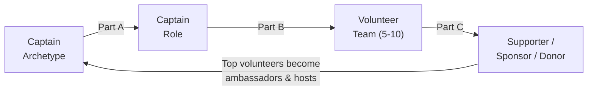

# Team Pairing: Matching Captains, Volunteers, Donors, Sponsors, and Supporters

A campaign is a chain of well-made matches. Put the right captain in the right role, give that captain the right volunteers, and move your most engaged volunteers up a ladder into supporters, sponsors, and donors -- and a flat list of names becomes a self-growing field organization. This workflow turns the six [captain archetypes](../tactics/captain-archetypes.md) and the [volunteer roles](volunteer-management.md) into concrete assignments in three steps, then maps the path from volunteer to financial and in-kind support. It reuses the campaign's existing frameworks rather than inventing new ones: the [volunteer roles table](volunteer-management.md), the [fundraising Ask Ladder](fundraising-plan.md), and the [surrogate tiers](../tactics/surrogate-program.md).

---

## The Pairing Pipeline

Three pairings, each with a matrix and a checklist:

- **Part A** -- match each captain *archetype* to the captain *role* that fits their strengths.
- **Part B** -- staff each captain with the right *volunteers* and a complementary *co-captain*.
- **Part C** -- move engaged *volunteers* up the ladder to *supporters, sponsors, and donors*.

---

## Part A: Match Archetype → Captain Role

Use the [captain archetypes](../tactics/captain-archetypes.md) and the [captain roles](../tactics/captain-archetypes.md#captain-roles-vs-captain-archetypes). The grid below scores each archetype against each role -- modeled on the [surrogate Deployment Scheduling Matrix](../tactics/surrogate-program.md#deployment-scheduling-matrix). **Best** = play to strength; **OK** = workable with support; **Avoid** = fights their nature.

| Archetype ↓ / Role → | Canvass / Field | Phone & Text | Events / Host | Data / Office | Digital / Social | Fundraising | GOTV / Chase |
|---|---|---|---|---|---|---|---|
| **Organizer** | Best | OK | OK | Best | OK | Avoid | Best |
| **Connector** | OK | OK | Best | Avoid | Best | Best (hosts) | OK |
| **Workhorse** | Best | Best | OK | Best | OK | OK | Best |
| **Mentor** | OK | Best | OK | OK | OK | Avoid | OK |
| **Closer** | OK | Best | Best | Avoid | OK | Best | Best |
| **Strategist** | OK | OK | Avoid | Best | OK | OK | Best (targeting) |

### Selection checklist
- [ ] List every captain role you need to fill for the current phase (early build leans recruiting/canvass; final weeks lean GOTV/chase).
- [ ] For each candidate captain, identify their archetype using the [spotting cues](../tactics/captain-archetypes.md#spotting-and-supporting-each-type).
- [ ] Seat each person in a **Best** (or, if necessary, **OK**) role. Never assign an **Avoid** pairing without a strong co-captain who covers the gap.
- [ ] Where two archetypes both fit a role, give the higher-stakes/public role to the better fit and develop the other as co-captain.

---

## Part B: Pair Captain → Volunteers (and a Complementary Co-Captain)

Each captain leads **5-10 volunteers** (the span-of-control figure from [volunteer-management.md](volunteer-management.md#volunteer-roles)). Two sub-pairings matter: which *volunteer roles* sit under each captain, and which *co-captain archetype* balances the lead.

### Which volunteer roles report to which captain

Maps the [volunteer roles table](volunteer-management.md#volunteer-roles) onto captain roles -- cross-reference, don't re-create:

| Captain role | Volunteer roles on the team |
|---|---|
| **Canvass / Field** | Canvassers, Yard sign crew, Drivers |
| **Phone & Text Bank** | Phone bankers, Social media helpers (for follow-up) |
| **Events / Host** | Event volunteers, House party hosts, Drivers |
| **Data / Office** | Data entry, Office volunteers |
| **Digital / Social** | Social media helpers |
| **Fundraising / Finance** | House party hosts, Event volunteers, Office volunteers |
| **GOTV / Ballot-Chase** | Canvassers, Phone bankers, Drivers |

### Complementary co-captain pairing

Pair a captain with a co-lead whose strengths cover their weaknesses. Strong and weak combinations:

| Pairing | Result |
|---|---|
| Organizer + Connector | **Strong** -- structure meets recruitment & warmth |
| Closer + Organizer | **Strong** -- drive meets follow-through |
| Mentor + Closer | **Strong** -- retention meets urgency |
| Strategist + Workhorse | **Strong** -- plan meets execution |
| Workhorse + Workhorse | **Weak** -- huge output, no one builds the team; bottleneck |
| Connector + Connector | **Weak** -- everyone recruited, nothing tracked |
| Mentor + Mentor | **Weak** -- happy team, misses the numbers |

### Pairing checklist
- [ ] Assign each volunteer to a captain by **role fit and interest** (keep a skills inventory per [volunteer-management.md](volunteer-management.md#volunteer-recruitment)).
- [ ] Keep each captain's span at 5-10; split the team and promote a co-captain when it grows past 10.
- [ ] Give every captain a complementary co-captain from the **Strong** combinations above; avoid clone pairings on the same weakness.
- [ ] Confirm each volunteer has one clear point of contact (their captain), per the onboarding step in [volunteer-management.md](volunteer-management.md#volunteer-onboarding).

---

## Part C: Move Volunteers → Supporters, Sponsors, and Donors

Your most engaged volunteers are your warmest prospects for deeper support. Three distinct targets -- don't blur them:

- **Supporters** give *voice and time*: yard signs, social sharing, peer outreach, showing up. No money changes hands. They are also your [Tier 3 peer surrogates](../tactics/surrogate-program.md).
- **Sponsors** give *in-kind*: a host opens their home/venue, a business donates space, food, or printing. **In-kind support is a reportable contribution** -- see compliance below and [donation-intake.md](donation-intake.md).
- **Donors** give *money*: route every contribution through [donation-intake.md](donation-intake.md) and check capacity with [donor-limit-checker.md](../tools/donor-limit-checker.md).

### The volunteer → support ladder

Reuses the rungs of the [fundraising Ask Ladder](fundraising-plan.md#the-ask-ladder) and the [major-donor cultivation steps](fundraising-plan.md#major-donor-cultivation), starting from an engaged volunteer:

| Rung | Who | The ask | Best captain/archetype to make it |
|---|---|---|---|
| 1. Engaged volunteer | Reliable shift-taker | Keep showing up; bring a friend | Mentor / Connector |
| 2. Supporter | Volunteer + advocate | Yard sign, social share, peer surrogate | Connector / Digital Captain |
| 3. Sponsor | Host or in-kind giver | Host a house party; donate space/food/printing | Connector / Events Captain |
| 4. Small donor | Grassroots giver ($25-$100) | First contribution, recurring monthly | Closer / Fundraising Captain |
| 5. Mid / major donor | Higher-capacity giver ($100-max) | Personal cultivation, specific ask | Closer + candidate |
| 6. Donor ambassador / bundler | Networked super-volunteer | Raise from their own network | Connector + Closer |

The **donor ambassador / bundler** is the loop-closer: a trusted volunteer who introduces and gathers contributions from their network (see [Bundling in the glossary](../references/glossary.md)). They feed new prospects back to the top of the pipeline.

### Match the asker to the ask
- **Connectors** are best at recruiting hosts (sponsors) and ambassadors -- they open networks.
- **Closers** are best at the direct money ask (rungs 4-6) -- they don't flinch.
- **Mentors / Digital Captains** are best at keeping supporters engaged (rungs 1-2) so they stay on the ladder.
- Never force a conflict-averse Mentor to make a cold major-donor ask, or a logistics-averse Closer to steward a sponsor's event details -- pair them.

### Pipeline checklist
- [ ] Tag each engaged volunteer with their current rung; plan to move each up at least one rung (mirrors [fundraising-plan.md](fundraising-plan.md#the-ask-ladder)).
- [ ] Assign the *right archetype* to make each ask (table above).
- [ ] Route every **donation** through [donation-intake.md](donation-intake.md) and capacity-check with [donor-limit-checker.md](../tools/donor-limit-checker.md).
- [ ] Log every **sponsor / in-kind** gift as a contribution at fair-market value (see compliance below).
- [ ] Steward everyone who gives -- thank, update, re-engage -- so supporters and donors stay and recruit others.

---

## The Pairing Worksheet

Maintain a single roster (spreadsheet or CRM) so every match is visible and trackable -- the team-organizing equivalent of the [surrogate database](../tactics/surrogate-program.md#surrogate-database):

| Captain | Archetype | Captain role | Co-captain | Volunteers (5-10) | Supporter-pipeline targets |
|---|---|---|---|---|---|
| _e.g._ A. Rivera | Organizer | Canvass / Field | (Connector) | 7 canvassers, 1 driver | 2 → yard signs; 1 → house party host |
| ... | ... | ... | ... | ... | ... |

- [ ] One row per captain; review and update weekly.
- [ ] Track span (flag any captain over 10 volunteers).
- [ ] Track each volunteer's pipeline rung and next planned ask.

---

## Compliance and Ethics

> **EDUCATIONAL DISCLAIMER:** This workflow touches campaign-finance rules (volunteer time, in-kind contributions, and bundling). The guidance below is general and may be out of date. Consult a campaign finance attorney or your filing agency for guidance specific to your situation. This is educational information, not legal advice.

- **Volunteer time is not a contribution** -- it is exempt under federal law and most state laws (see [volunteer-management.md](volunteer-management.md#legal-considerations)). But if a volunteer's employer pays them to work the campaign, that is an employer contribution.
- **Sponsor / in-kind gifts are contributions.** A donated venue, food, printing, or supplies counts at fair-market value, is subject to the donor's contribution limit, and must be recorded -- process it through [donation-intake.md](donation-intake.md) and check [donor-limit-checker.md](../tools/donor-limit-checker.md).
- **Bundling is legal; reimbursing is not.** A donor ambassador may *gather* contributions from their network, but no one may give in someone else's name or be reimbursed for a contribution -- that is an illegal **straw-donor** scheme. See [references/ethics-and-guardrails.md](../references/ethics-and-guardrails.md).
- **No coerced giving.** Volunteers cannot be required to contribute as a condition of volunteering or leading a team.
- **Handle rosters and donor lists securely.** Do not collect SSNs, bank numbers, or passwords; store the worksheet with access controls.

---

## Key Principles

1. **Match in this order:** archetype → role, captain → volunteers, volunteer → support. Skipping a step strands people in the wrong seat.
2. **Always pair complements.** Every captain gets a co-lead who covers their weakness; every ask goes to the archetype built for it.
3. **The ladder only works with stewardship.** People climb because they feel valued -- thank and update relentlessly.
4. **The pipeline is a loop.** Today's well-matched volunteer is tomorrow's host, donor, ambassador, and next-cycle captain.
5. **Compliance is non-negotiable.** Money and in-kind support follow the rules every time -- no exceptions, no shortcuts.

---

*Built on [tactics/captain-archetypes.md](../tactics/captain-archetypes.md), [workflows/volunteer-management.md](volunteer-management.md), [workflows/fundraising-plan.md](fundraising-plan.md), and [tactics/surrogate-program.md](../tactics/surrogate-program.md).*
